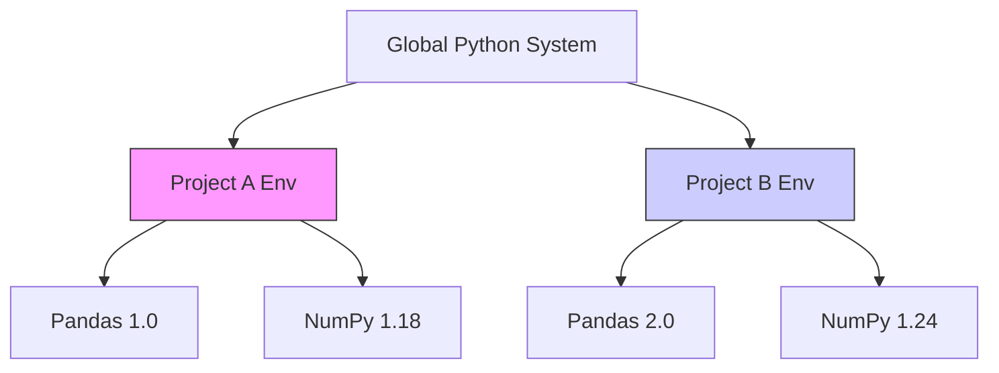

# 4. Virtual Environments and Package Management

One of the most critical skills in Python development is **Environment Isolation**.

## 4.1 The Problem: "Dependency Hell"

Imagine you are working on two projects:
*   **Project A:** An older project built in 2021 using `pandas 1.0`.
*   **Project B:** A brand new project requiring features from `pandas 2.0`.

If you install Python globally on your computer, you can only have **one version** of pandas installed at a time. Updating pandas for Project B will **break** Project A.

## 4.2 The Solution: Virtual Environments

A **Virtual Environment** is a self-contained directory tree that contains a specific Python installation for a specific project.
*   Project A gets its own box with `pandas 1.0`.
*   Project B gets its own box with `pandas 2.0`.
*   The global system remains untouched.

## 4.3 Managing Environments

There are two main tools for this: **venv** (built-in) and **conda** (Anaconda).

### Tool A: venv (Standard Python)
Uses `pip` for packages.

1.  **Create:** `python -m venv myenv`
2.  **Activate (Windows):** `.\myenv\Scripts\activate`
3.  **Activate (Mac/Linux):** `source myenv/bin/activate`
4.  **Install Packages:** `pip install pandas`
5.  **Deactivate:** `deactivate`

### Tool B: Conda (Anaconda)
Uses `conda` for packages and environments.

1.  **Create:** `conda create --name myenv python=3.10`
2.  **Activate:** `conda activate myenv`
3.  **Install Packages:** `conda install pandas`
4.  **List Envs:** `conda env list`

## 4.4 Package Managers: pip vs. conda

| Feature | **pip** | **conda** |
| :--- | :--- | :--- |
| **Scope** | Python packages only. | Any software (Python, R, C libraries). |
| **Source** | PyPI (Python Package Index). | Anaconda Repository. |
| **Relationships** | Installs packages. Does not manage environments itself (needs venv). | Manages **both** packages and environments. |
| **Compiled Binaries** | Sometimes compiles from source (can be slow/error-prone). | Always installs pre-compiled binaries (faster/safer for Science libs). |

> [!TIP] **Best Practice**
> If you installed Anaconda, stick to `conda` commands. Mixing `pip` and `conda` in the same environment can sometimes corrupt dependencies.