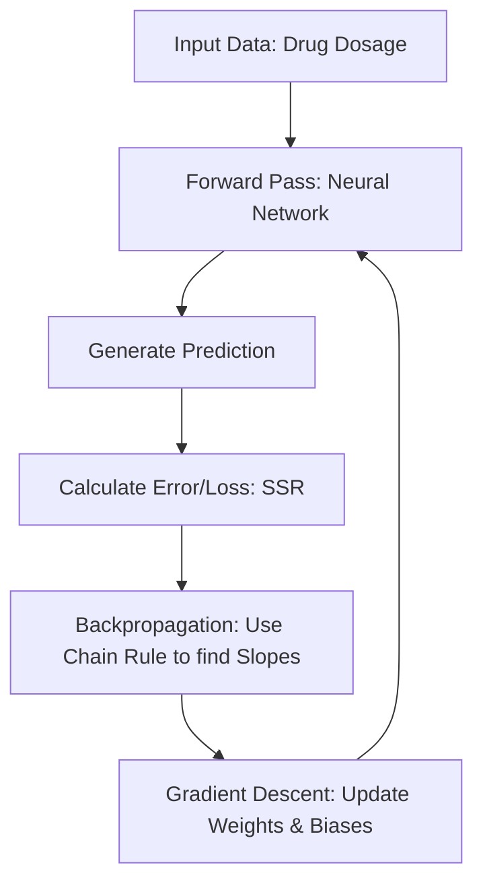
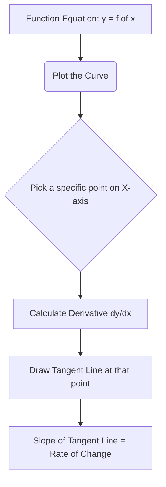
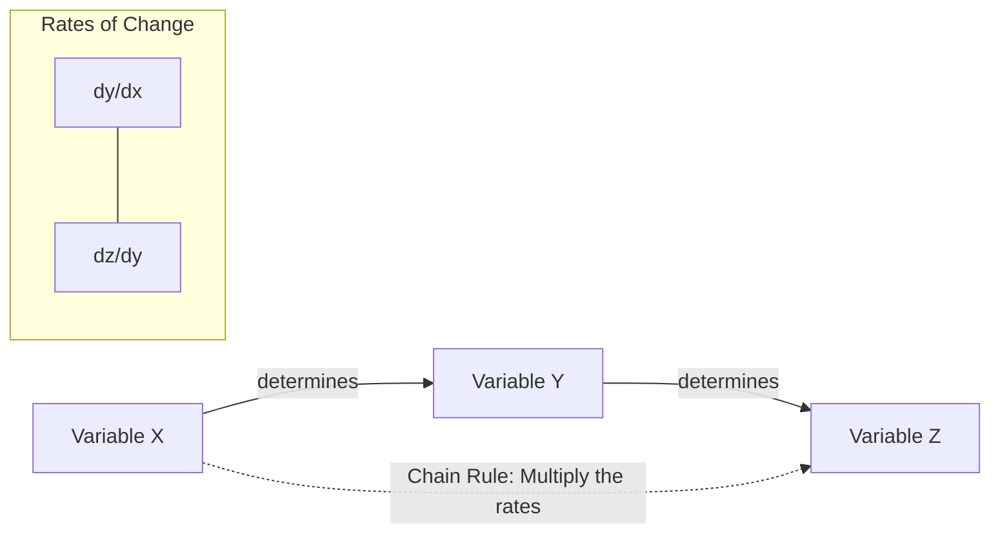
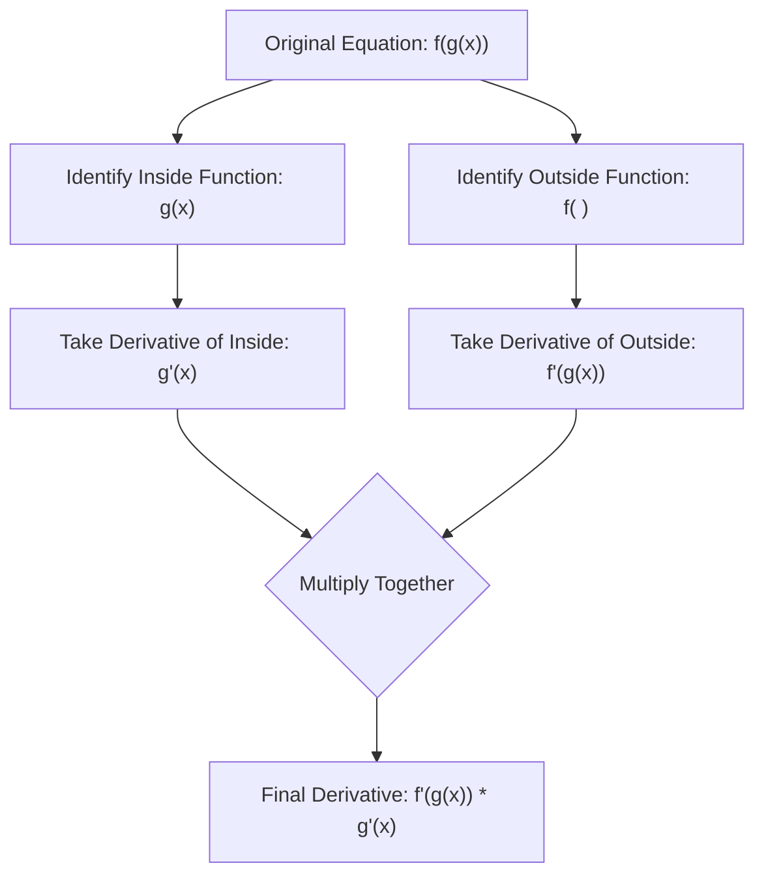
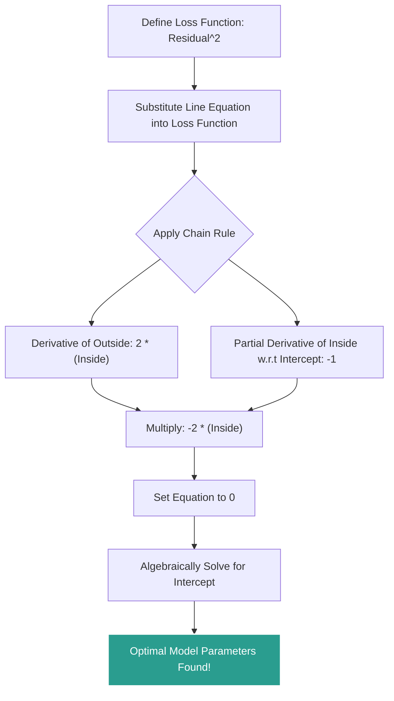
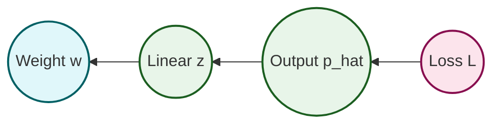

# 1. Derivatives, Power Rule, and the Chain Rule

## Terminology Reference

Before diving into complex calculus rules, it is imperative to establish a concrete understanding of the foundational terms. The table below clarifies the precise meaning of each concept you will encounter throughout these notes.

| Term | Meaning | Type | Visual / Intuition |
| --- | --- | --- | --- |
| **Function (f(x))** | The original curve; gives value of output for each input | Curve | The shape on a graph; e.g., $x^3$ is a cubic curve |
| **Slope** | Rate of change of function; how steep it is | Number at a point | Tangent line steepness at a point |
| **Gradient** | Another word for slope; often used for multivariable functions | Number at a point | How fast the function rises at that exact point |
| **Derivative (f'(x))** | Function that tells the gradient at **every point** | Function | A new curve; e.g., for $x^3$, $f'(x) = 3x^2$ (parabola) |
| **Derivative at a point** | The value of the derivative at one x | Number | Slope of the tangent line at that point |
| **Tangent line** | Straight line that touches the curve at a point, with same slope | Line | Just touches the curve at one point |
| **Second derivative (f''(x))** | Derivative of the derivative; shows change of slope | Function | Curvature; positive = concave up, negative = concave down |
| **Integral / anti-derivative** | Reverses the derivative; recovers original function | Function | Curve reconstructed from slope function |

---

## Essential Prerequisites

To fully understand backpropagation and the Chain Rule's role in it, you must be comfortable with three concepts. These are the "engines" under the hood of neural networks:

1. **Neural Networks (Inside the Black Box):**
   - You must understand how data moves forward through a network (Input → Weights/Biases → Activation Function → Output).
   - *Reminder:* Activation functions (like the Softplus function) allow the network to bend and warp data to fit complex, non-linear shapes.
2. **The Chain Rule (Calculus):**
   - The Chain Rule is used to take the derivative of composite functions (functions inside of functions). Because a neural network is essentially one massive nested mathematical function, the Chain Rule allows us to unpack it layer by layer.
   - *Formula Reminder:* If $y = f(g(x))$, then $\frac{dy}{dx} = f'(g(x)) \times g'(x)$.
3. **Gradient Descent:**
   - Once backpropagation uses the Chain Rule to find the *slope* (derivative) of the error at a given point, Gradient Descent is the algorithm that takes a "step" down that slope to find the minimum error.

> ** What Students Often Miss**
> Backpropagation and Gradient Descent are **not** the same thing.
> - **Backpropagation** only calculates the derivatives (the slopes).
> - **Gradient Descent** uses those derivatives to physically update the weights and biases.
>
> They work together as a two-part team: Backpropagation computes the compass direction; Gradient Descent takes the step.

### High-Level Workflow Diagram

> ** Essential Background Knowledge:**
> **Feedforward** is the process of moving data *forward* (from left to right) through the network to get a guess.
> **Backpropagation** is the process of moving the error *backward* (from right to left) through the network to update the weights. You cannot have backpropagation without first doing a feedforward pass!

---

## 1.1 Introduction to Derivatives

### The Conceptual Definition

In calculus, a derivative represents the **instantaneous rate of change** of a function with respect to one of its variables. Imagine a graph where the x-axis represents how much people like a subject (e.g., "Likes StatQuest") and the y-axis represents the "Awesomeness" of that subject. If we plot data points and draw a curve through them, the relationship might not be a straight line — it might be a parabola, meaning the "Awesomeness" grows at an accelerating rate as "Likes" increase.

The **derivative** of the equation representing this curve tells us the **slope of the tangent line** at any specific point along that curve.

- **Tangent Line:** A straight line that just barely touches the curve at exactly one point without crossing it at that moment.
- **Slope:** How steeply that line is pointing up or down.

### Why Do We Care About the Slope?

The slope of the tangent line tells us exactly how quickly "Awesomeness" is changing *at that exact moment* relative to a change in "Likes." If the slope is steep, a tiny increase in "Likes" results in a massive explosion of "Awesomeness." If the slope is shallow, an increase in "Likes" only yields a minor bump in "Awesomeness."

### Leibniz Notation

You will frequently see derivatives written in **Leibniz notation** as $\frac{dy}{dx}$.
- **$d$** stands for "a tiny change in."
- So, $\frac{dy}{dx}$ literally translates to: "A tiny change in $y$ divided by a tiny change in $x$."
- In the context of our example, this is written as: $\frac{d\text{Awesomeness}}{d\text{Likes}}$.

---

## 1.2 The Power Rule

### Overview

Calculating the derivative of a function from scratch using limits is tedious. Luckily, mathematics provides us with shortcuts. The most fundamental shortcut in calculus is the **Power Rule**.

### The Mathematical Definition

The Power Rule states that for any function $f(x) = x^n$, the derivative is:

$$ \frac{d}{dx} x^n = n \cdot x^{n-1} $$

**Step-by-Step Execution:**
1. Take the exponent ($n$).
2. Bring it down to the front and multiply it by the variable.
3. Subtract $1$ from the original exponent.

### Working Through an Example

Let's look at the equation from our introductory dataset:

$$ \text{Awesomeness} = (\text{Likes StatQuest})^2 $$

We want to find the derivative of Awesomeness with respect to Likes.

$$ \frac{d\text{Awesomeness}}{d\text{Likes}} = \frac{d}{d\text{Likes}} (\text{Likes})^2 $$

**Applying the Power Rule:**
1. The power is $2$. Bring it to the front to multiply: $2 \times \text{Likes}$
2. Subtract $1$ from the power: $2 - 1 = 1$.
3. The new power is $1$.

$$ = 2 \times (\text{Likes})^1 $$

### Common Pitfalls

- **The Hidden "1":** Any variable raised to the power of 1 is just the variable itself. $x^1 = x$. Therefore, $2 \times (\text{Likes})^1$ is simply written as $2 \times \text{Likes}$.
- **The Hidden "0":** If you have a linear term like $f(x) = 5x$, the $x$ has an implicit power of 1. Bringing the 1 down gives $1 \times 5x^{1-1} = 5x^0$. Anything to the power of 0 is 1, so the derivative of $5x$ is simply $5$.
- **Constants:** The derivative of a constant number (e.g., $f(x) = 7$) is always $0$. Constants do not change, so their rate of change is zero.

---

## 1.3 The Chain Rule — Intuition

### Why the Chain Rule?

The Power Rule works perfectly for simple functions like $x^2$. But what happens when functions are nested inside one another? This is where **The Chain Rule** is required. The Chain Rule is used to find the derivative of a **composite function** (a function within a function).

Because a neural network is essentially one massive nested mathematical function — weights feed into sums, sums feed into activation functions, activations feed into more sums — the Chain Rule allows us to unpack it layer by layer. It is the fundamental engine that powers Backpropagation.

### The Domino Effect

Think of the Chain Rule as a domino effect or a gear system.
- If turning Gear A causes Gear B to turn...
- And turning Gear B causes Gear C to turn...
- You can determine how turning Gear A affects Gear C by **multiplying the transfer rates** of the gears together.

In mathematical terms, if variable $Z$ depends on variable $Y$, and variable $Y$ depends on variable $X$, you can find how $Z$ changes with respect to $X$ by tracking the chain of dependencies.

### Formal Notation

$$ \frac{dz}{dx} = \frac{dz}{dy} \times \frac{dy}{dx} $$

Notice how algebraically, the $dy$ in the numerator and denominator appear to "cancel out," leaving you with $\frac{dz}{dx}$. This is exactly how the Chain Rule works!

> **The "Cancel Out" Trick:** To remember if you set up the Chain Rule correctly, imagine the terms are fractions. If you cross-cancel the intermediate variable from the numerator and denominator, you should be left with exactly what you started with.

---

## 1.4 The Chain Rule with Linear Functions

To understand the Chain Rule without getting bogged down in complex algebra, let's observe how it works with straight lines. We will track a chain of physical measurements: **Weight → Height → Shoe Size**.

### Step 1: Weight to Height

Imagine we find a linear relationship between Weight and Height.
- For every $1$ unit increase in Weight, there is a $2$ unit increase in Height.
- Slope = $\frac{2}{1} = 2$.
- Derivative: $\frac{d\text{Height}}{d\text{Weight}} = 2$
- Equation: $\text{Height} = 2 \times \text{Weight}$

### Step 2: Height to Shoe Size

- For every $1$ unit increase in Height, there is a $\frac{1}{4}$ unit increase in Shoe Size.
- Derivative: $\frac{d\text{ShoeSize}}{d\text{Height}} = \frac{1}{4}$
- Equation: $\text{ShoeSize} = \frac{1}{4} \times \text{Height}$

### Step 3: Applying the Chain Rule (Weight → Shoe Size)

We know Weight predicts Height, and Height predicts Shoe Size. By the Chain Rule:

$$ \frac{d\text{ShoeSize}}{d\text{Weight}} = \frac{d\text{ShoeSize}}{d\text{Height}} \times \frac{d\text{Height}}{d\text{Weight}} = \frac{1}{4} \times 2 = \frac{1}{2} $$

**Conclusion:** For every 1 unit increase in Weight, there is a $\frac{1}{2}$ unit increase in Shoe Size.

> ** Student Reminder: Intercepts Through the Origin**
> You might notice the equations look like $y = mx$, without the $+ b$ (y-intercept). This is because, in this specific example, the lines pass directly through the origin $(0,0)$. If someone weighs 0, their height is 0. This simplifies the math to let us focus purely on the rates of change (slopes).

---

## 1.5 The Chain Rule with Non-Linear Composite Functions

In the real world, relationships are rarely perfectly straight lines. Let's look at a non-linear chain involving Time, Hunger, and Craving Ice Cream. This example teaches the **"Outside-Inside" technique** for the Chain Rule.

### Establishing the Relationships

1. **Time → Hunger:** $\text{Hunger} = \text{Time}^2 + \frac{1}{2}$
2. **Hunger → Craves Ice Cream:** $\text{Craving} = \sqrt{\text{Hunger}}$

### Creating the Composite Function

Substituting "Hunger" into the Craving equation:

$$ \text{Craving} = \sqrt{\text{Time}^2 + \frac{1}{2}} $$

Taking the derivative of this all at once is intimidating. The Chain Rule shines here.

### The "Outside-Inside" Method

**Rule:** Derivative of the OUTSIDE function (leaving the inside alone) × Derivative of the INSIDE function.

#### Step 1: Identify "Outside" and "Inside"
- **The Stuff INSIDE:** $\text{Time}^2 + \frac{1}{2}$
- **The OUTSIDE Function:** $\sqrt{\text{Stuff Inside}}$

#### Step 2: Derivative of the "Inside"
Using the Power Rule on $\text{Time}^2 + \frac{1}{2}$:
- $\frac{d}{d\text{Time}} (\text{Time}^2) = 2 \times \text{Time}$
- $\frac{d}{d\text{Time}} (\frac{1}{2}) = 0$
- **Result:** $2 \times \text{Time}$

#### Step 3: Derivative of the "Outside"
We are finding the derivative of $\sqrt{\text{Inside}}$ with respect to "Inside".

> ** Crucial Math Trick #1:** Remember that a square root is identical to the power of $\frac{1}{2}$. So, $\sqrt{\text{Inside}} = (\text{Inside})^{1/2}$.

Apply the Power Rule: Bring $\frac{1}{2}$ to the front, subtract $1$ from the power.
$$ \frac{1}{2} - 1 = -\frac{1}{2} $$

> ** Crucial Math Trick #2:** A negative exponent means the term moves to the denominator. $x^{-1/2} = \frac{1}{x^{1/2}} = \frac{1}{\sqrt{x}}$.

- **Result:** $\frac{1}{2 \times \sqrt{\text{Inside}}}$

#### Step 4: Multiply Them Together (The Chain Rule)

$$ \frac{d\text{Craving}}{d\text{Time}} = \frac{1}{2\sqrt{\text{Time}^2 + \frac{1}{2}}} \times 2 \times \text{Time} = \frac{\text{Time}}{\sqrt{\text{Time}^2 + \frac{1}{2}}} $$

---

## 1.6 Application: Optimizing Loss Functions Using the Chain Rule

### Why We Need the Chain Rule in Machine Learning

Machine learning models measure their own accuracy using a **Loss Function**. A very common loss function is the **Residual Sum of Squares (RSS)** or **Sum of Squared Residuals (SSR)**.

### What Is a Residual?

A residual is the mathematical distance between reality and the prediction:

$$ \text{Residual} = \text{Observed} - \text{Predicted} $$

### Why Square the Residual?

1. **Positive Values:** Squaring ensures all errors are positive, so positive and negative errors don't cancel out when summed.
2. **Punishing Bad Errors:** Squaring penalizes large errors exponentially more than small errors.
3. **Differentiability:** The resulting equation creates a smooth, convex parabola with a distinct minimum, allowing us to use calculus to find it.

### Visualizing the Goal

If we graph the Squared Residuals against the line's Intercept, we get a parabola (a U-shaped curve). The lowest point on this U-curve represents the Intercept value that gives us the smallest possible error.

To find this absolute minimum point, we need to find where the **slope of the tangent line is exactly 0**. And to find the slope, we need... the derivative.

### Constructing the Composite Equation

1. **Predicted Equation:** $\text{Predicted} = \text{Intercept} + (1 \times \text{Weight})$ (slope locked at 1 for simplicity)
2. **Squared Residual Equation:** $\text{Residual}^2 = (\text{Observed} - \text{Predicted})^2$

Combining them:

$$ \text{Residual}^2 = (\text{Observed} - (\text{Intercept} + (1 \times \text{Weight})))^2 $$

### Applying the Chain Rule (Outside-Inside Method)

We want the derivative with respect to the **Intercept**. All other variables are treated as constants (partial derivative).

> ** Important Tip regarding Partial Derivatives:** Because we are taking the derivative with respect to the *Intercept*, we treat all other variables (Observed Height, Weight) as if they are constant numbers. Their rates of change are zero.

**Step 1: Identify Inside and Outside**
- Inside: $\text{Observed} - (\text{Intercept} + (1 \times \text{Weight}))$
- Outside: $(\text{Inside})^2$

**Step 2: Derivative of the Outside**
$$ 2 \times (\text{Inside}) $$

**Step 3: Derivative of the Inside (with respect to Intercept)**
$$ -1 $$

**Step 4: Multiply Them Together**
$$ \frac{d\text{Residual}^2}{d\text{Intercept}} = 2 \times (\text{Observed} - (\text{Intercept} + \text{Weight})) \times (-1) = -2 \times (\text{Observed} - (\text{Intercept} + \text{Weight})) $$

> ** Don't Ignore the "Times 1"**
> Mathematically, multiplying by 1 changes nothing. You might be tempted to erase it. However, in Neural Networks, you should leave it there conceptually. Why? Because if we were optimizing a *different* parameter (like a Weight), that second part would *not* be 1. Leaving it in reminds us that backpropagation is fundamentally built on the Chain Rule and consists of distinct parts chained together.

### Solving for the Minimum

To find the lowest point on the error curve, we set this derivative to equal zero.

$$ -2 \times (\text{Observed} - (\text{Intercept} + (1 \times \text{Weight}))) = 0 $$

Now, assume our data point is: $\text{Observed Height} = 2$, and $\text{Weight} = 1$. Let's plug those numbers in to solve for the best Intercept.

$$ -2 \times (2 - (\text{Intercept} + (1 \times 1))) = 0 $$
$$ -2 \times (2 - \text{Intercept} - 1) = 0 $$
$$ -2 \times (1 - \text{Intercept}) = 0 $$

Divide both sides by $-2$:
$$ 1 - \text{Intercept} = 0 $$
$$ 1 = \text{Intercept} $$

**Conclusion:** By utilizing the Chain Rule to find the derivative of our composite loss function, we have mathematically proven that an Intercept of **1** will minimize our squared residual, granting us the best-fitting line for our Machine Learning model!

---

## 1.7 The Chain Rule in Neural Networks — A Preview

In a neural network, we will apply the Chain Rule on a much grander scale. A weight deep in the network affects the loss through a long chain of intermediate computations:

$$ \frac{\partial L}{\partial w} = \frac{\partial L}{\partial \hat{p}} \cdot \frac{\partial \hat{p}}{\partial z} \cdot \frac{\partial z}{\partial w} $$

We read this visually right-to-left (backwards): To find how a weight affects the loss, we multiply the gradients along the path from the weight to the loss.

> **Key Insight:** Backpropagation is simply the Chain Rule applied systematically to every weight in the network, computed layer-by-layer from output back to input. The beauty is that once you calculate a gradient at one layer, you **reuse** it for the next layer going backward — just like gears passing motion to each other.
