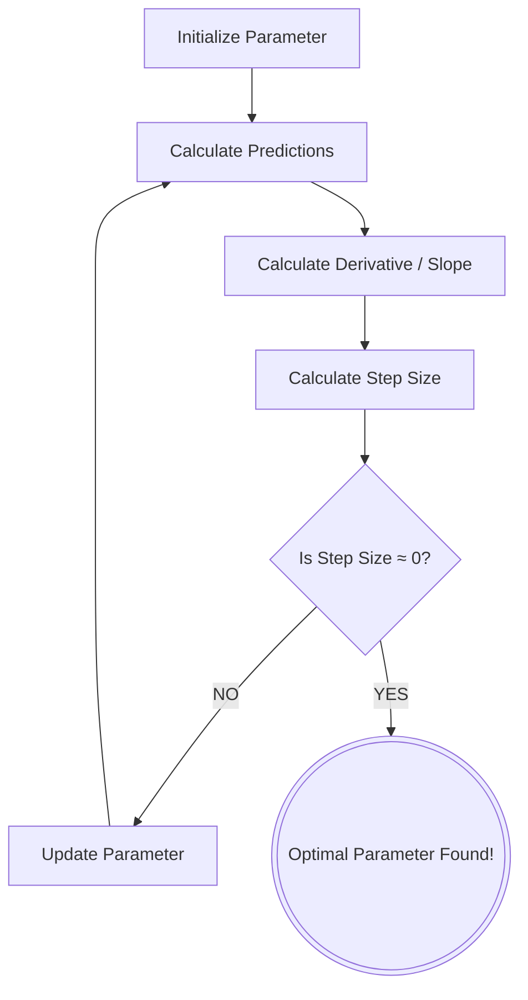

# 2. Gradients and Gradient Descent

## 2.1 What a Gradient Is (Core Definition)

A **gradient** is a vector that contains the partial derivatives of a function with respect to all its variables. It points in the direction of **steepest increase** of that function.

Mathematically:

$$ \nabla f = \left( \frac{\partial f}{\partial x_1}, \frac{\partial f}{\partial x_2}, \dots, \frac{\partial f}{\partial x_n} \right) $$

The gradient is not an algorithm or a training method. It is purely a **mathematical object** describing how a function changes. Each component answers the question: *"If I change this variable slightly, how much will the function value change?"*

---

## 2.2 Gradient in One Dimension

If a function depends on only one variable, $f(x) = x^2$, the gradient reduces to a normal derivative: $f'(x) = 2x$. This tells us how steep the function is and whether it is increasing or decreasing.

| x | Slope |
| --- | --- |
| -2 | -4 |
| 0 | 0 |
| 2 | 4 |

- **Negative slope** → function decreasing
- **Positive slope** → function increasing
- **Zero slope** → minimum or maximum

---

## 2.3 Gradient in Multiple Dimensions

Machine learning models depend on many variables (weights), not just one. For example, $f(x, y) = x^2 + y^2$:

$$ \nabla f(x,y) = \left( \frac{\partial f}{\partial x}, \frac{\partial f}{\partial y} \right) = (2x, 2y) $$

Now we compute derivatives in each direction:

$$ \frac{\partial f}{\partial x} = 2x, \quad \frac{\partial f}{\partial y} = 2y $$

This gradient vector tells us:
- How steep the surface is in the $x$ direction
- How steep the surface is in the $y$ direction

---

## 2.4 Geometric Meaning

The gradient represents:
- **Direction** of steepest ascent
- **Magnitude** of steepness

If you stand on a 3D surface, the gradient tells you: *"If you want to go uphill as fast as possible, walk in this direction."*

| Gradient Magnitude | Meaning |
| --- | --- |
| Large | Steep slope |
| Small | Flat region |
| Zero | Local minimum or maximum |

---

## 2.5 Why Gradients Are Important in Machine Learning

A machine learning model is a function $L(w_1, w_2, \dots, w_n)$, where the $w_i$ are parameters (weights and biases) and $L$ is the loss function. The gradient is:

$$ \nabla L = \left( \frac{\partial L}{\partial w_1}, \frac{\partial L}{\partial w_2}, \dots, \frac{\partial L}{\partial w_n} \right) $$

Each component answers: *"If I change this weight slightly, how much will the loss change?"*

The gradient acts like a **sensitivity vector** — it tells us which parameters matter most and which direction to adjust them.

### Partial Derivatives as Sensitivity Measures

Example: $L(w_1, w_2) = w_1^2 + 0.001w_2^2$

Gradient: $\nabla L = (2w_1, 0.002w_2)$. At $w_1 = 1, w_2 = 1$: $\nabla L = (2, 0.002)$.

This means $w_1$ affects the loss much more than $w_2$, so optimization should focus on adjusting $w_1$. This is how models automatically know which parameters matter more.

---

## 2.6 Local Linear Approximation (Why Gradient Works)

Gradients come from Taylor expansion:

$$ L(w + \Delta w) \approx L(w) + \nabla L \cdot \Delta w $$

This equation means:

> The gradient is the best linear predictor of how the loss will change for small parameter changes.

So it is mathematically optimal for local optimization.

---

## 2.7 What Gradient Descent Is

**Gradient Descent** is an optimization algorithm that uses the gradient to minimize a function. The update rule:

$$ w_{new} = w_{old} - \alpha \frac{\partial L}{\partial w} $$

Where:
- $w_{old}$: current parameter value
- $\alpha$: learning rate (a tiny scalar, e.g., 0.01)
- $\frac{\partial L}{\partial w}$: the gradient (partial derivative of loss w.r.t. the weight)

We subtract because the gradient points toward steepest *ascent* (maximum error), and we want steepest *descent* (minimum error). The minus sign ensures we step in the opposite direction of the gradient.

### Step-by-Step Intuition

1. Compute loss
2. Compute gradient (using the Chain Rule — this is Backpropagation's job)
3. Move parameters slightly in the opposite direction of the gradient
4. Repeat until gradient ≈ 0

This process is equivalent to rolling a ball down a hill until it stops at the lowest point.

---

## 2.8 The Learning Rate

The **Learning Rate** ($\alpha$ or $\eta$) is a tiny scalar number (e.g., $0.1$ or $0.01$). It acts as a speed limit on the step size.

**Why do we need it?** If we change weights by the raw error or raw derivative, the weights will jump wildly across the error landscape and miss the optimal fit entirely. The learning rate ensures we take tiny, calculated steps down the error curve until we reach the bottom (the minimum error).

The step size is calculated as:

$$ \text{Step Size} = \text{Derivative (Slope)} \times \text{Learning Rate} $$

If the slope is steep, the step is larger. If the slope is shallow, the step is smaller. This is self-regulating — exactly what we want.

---

## 2.9 The Direction of the Update

- If $\frac{\partial L}{\partial w}$ is **positive**, increasing the weight *increases* the error. Therefore, we should *decrease* the weight. Subtracting a positive number decreases it.
- If $\frac{\partial L}{\partial w}$ is **negative**, increasing the weight *decreases* the error. Therefore, we should *increase* the weight. Subtracting a negative number increases it.

> **Why do we subtract a negative?** A negative slope means the error curve is sloping downwards to the right. To find the minimum (the bottom of the valley), we *want* to move to the right (increase our weight). Subtracting a negative number results in addition, moving us perfectly in the correct direction!

---

## 2.10 Relationship Between Gradient and Gradient Descent

| Concept | Type | Purpose |
| --- | --- | --- |
| Gradient | Mathematical object | Describes slope |
| Gradient Descent | Algorithm | Uses gradient to minimize |

**Gradient** is information. **Gradient Descent** is the action taken using that information.

> **Critical Distinction:** Backpropagation and Gradient Descent are **not** the same thing.
> - **Backpropagation** only calculates the derivatives (the slopes / gradients).
> - **Gradient Descent** uses those derivatives to physically update the weights and biases.
>
> They work together as a two-part team: Backpropagation computes the compass direction; Gradient Descent takes the step.

### The Critical Shortcut: Reusing $\frac{d(SSR)}{d(\text{Predicted})}$

When applying the Chain Rule to compute gradients for multiple parameters in a neural network, we use:

$$\frac{d(SSR)}{dw} = \frac{d(SSR)}{d(\text{Predicted})} \times \frac{d(\text{Predicted})}{dw}$$

> **🔑 Critical Shortcut**
> Because the output layer node combines all parameters to form the prediction, **this specific derivative ($\frac{d(SSR)}{d(\text{Predicted})}$) is exactly the same for all parameters connected to this output node.** We calculate this *once* and reuse it for every weight and bias feeding into that output.
>
> For example, if we need gradients for $w_3$, $w_4$, and $b_3$:
> $$\frac{d(SSR)}{d(\text{Predicted})} = \sum -2(\text{Observed}_i - \text{Predicted}_i)$$
> This term is identical in all three calculations. Only the second half ($\frac{d(\text{Predicted})}{dw}$) changes depending on which parameter we're differentiating with respect to.
>
> This concept of reusing calculated gradients is the secret to why Backpropagation is computationally efficient!

---

## 2.11 Key Sentences to Memorize

These are the shortest correct definitions:

**Gradient:**
> A vector of partial derivatives that points in the direction of steepest increase of a function.

**Gradient Descent:**
> An iterative optimization algorithm that updates parameters by moving opposite the gradient to minimize a function.

---

## 2.12 Example: Gradient Descent for a Single Bias (StatQuest Drug Dosage)

Let's plug actual data into a derivative formula to see gradient descent in action. We are optimizing the final bias $b_3$ of a neural network predicting drug effectiveness.

### Calculating the Current Slope

With $b_3 = 0$ and observed values (0, 1, 0), the slope of the SSR curve is:

$$ \text{Slope} = \sum_{i=1}^{3} -2 \times (\text{Observed}_i - \text{Predicted}_i) \times 1 = -5.2 - 5.22 - 5.22 = -15.7 $$

### Applying the Learning Rate

$$ \text{Step Size} = -15.7 \times 0.1 = -1.57 $$

### Calculating the New Parameter

$$ \text{New } b_3 = \text{Old } b_3 - \text{Step Size} = 0 - (-1.57) = 1.57 $$

### Iteration 2

With $b_3 = 1.57$, the green squiggle shifts up, residuals shrink, SSR drops, and the new slope is $-6.26$.

$$ \text{Step Size} = -6.26 \times 0.1 = -0.626 $$
$$ \text{New } b_3 = 1.57 - (-0.626) = 2.19 $$

### The Full Training Cycle (An Epoch)

One full loop of the gradient descent process is called an **Epoch**. The steps are:

1. **Forward Pass:** Use the current parameters to calculate the $\text{Predicted}$ values for all data points.
2. **Calculate Error:** Compute the SSR.
3. **Backward Pass (Backpropagation):** Use the Chain Rule formulas to calculate the gradient for each parameter.
4. **Update Parameters:** Use Gradient Descent to subtract the (Step Size $=$ Derivative $\times$ Learning Rate) from the old parameters.

### Convergence

We repeat this cycle. As we reach the bottom of the SSR curve, the slope gets flatter (approaching 0). When the step size becomes microscopic, the parameter stops changing — we have achieved **convergence**. In this example, convergence happens at $b_3 = 2.61$.

> **💡 Summary: The Ultimate Takeaway**
> The main idea behind Backpropagation is simple:
> 1. When a parameter is unknown, we use the **Chain Rule** to find the derivative of the loss function with respect to that specific parameter.
> 2. We initialize the parameter with a guess.
> 3. We use **Gradient Descent** (informed by the Chain Rule slope) to repeatedly update the parameter until the step size reaches zero.

