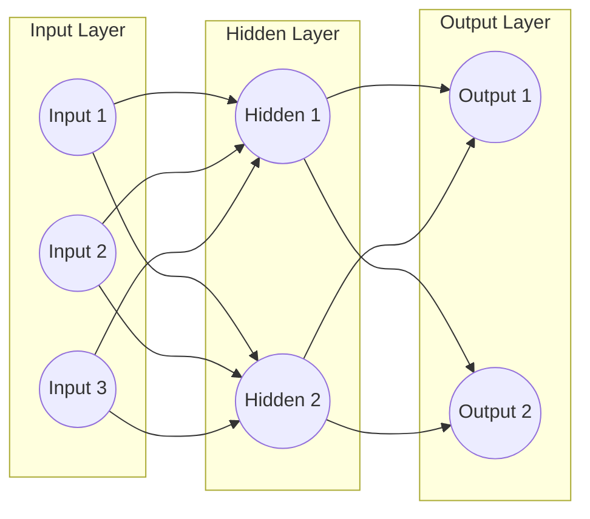
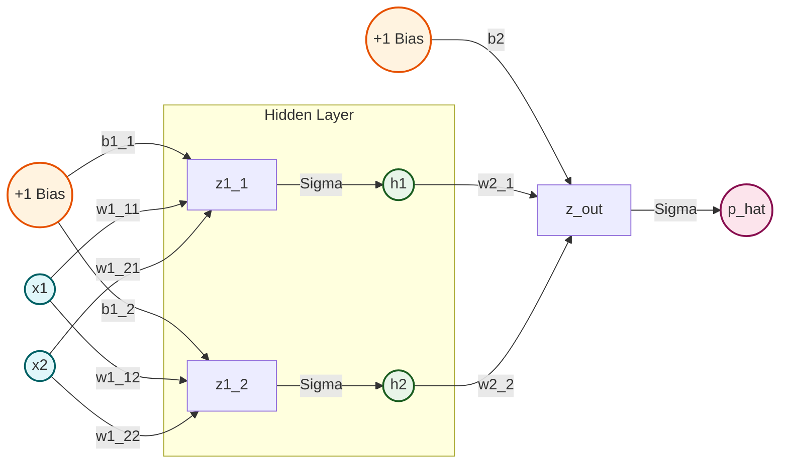
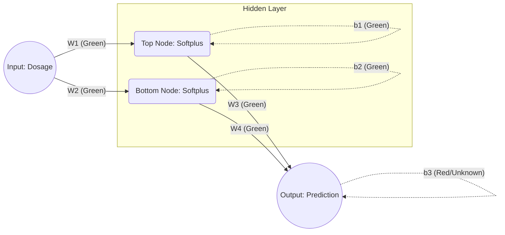
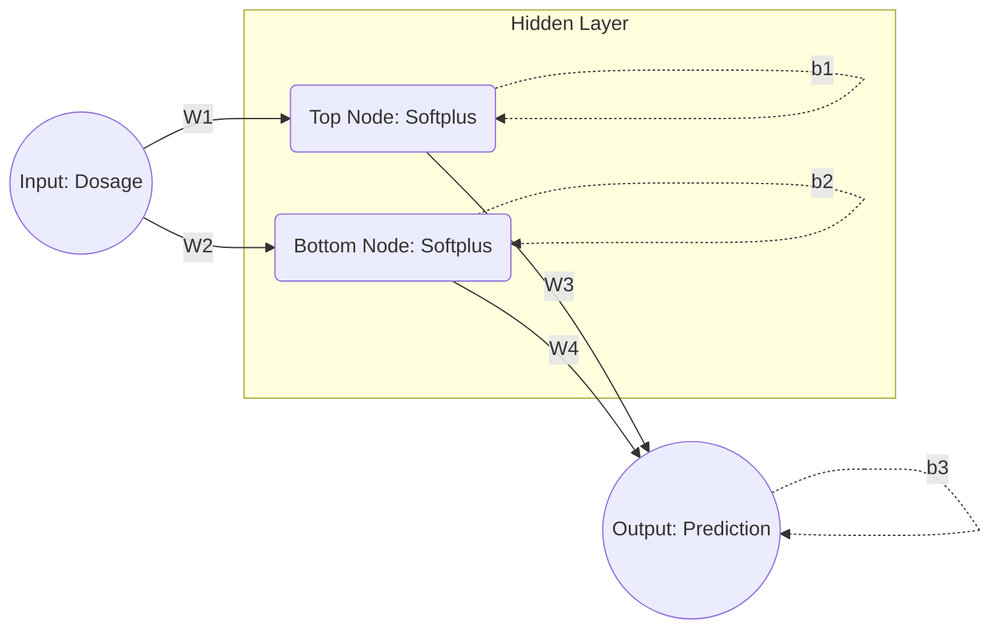
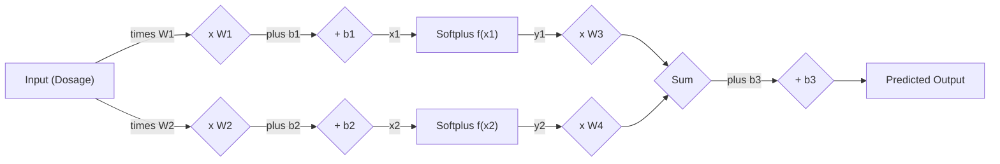
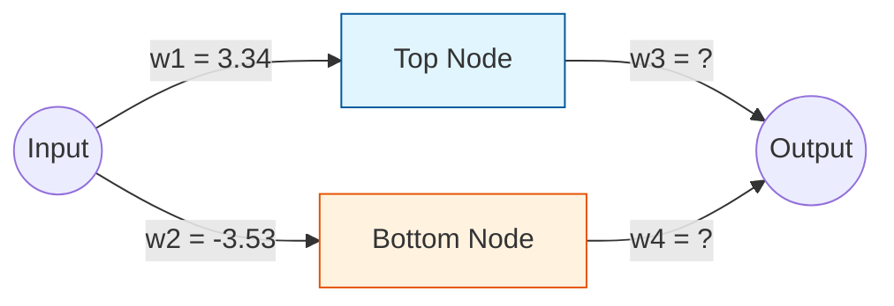
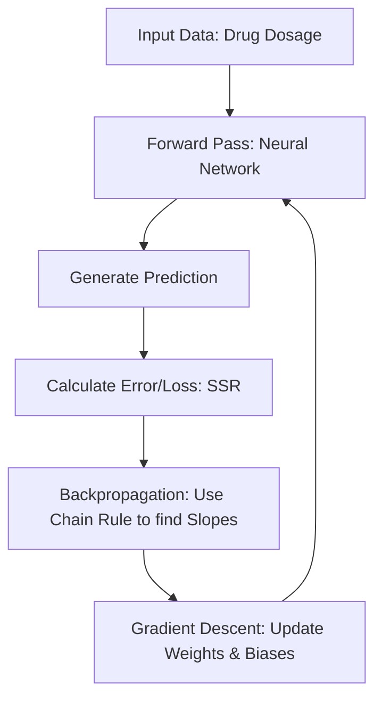

# 3. Neural Network Architecture and Notation

## 3.1 What a Neural Network Is

To understand Neural Networks, it is best to view them as a massive collection of adjustable knobs and dials. These "knobs" are mathematically represented as **weights**. When data passes through a network, it interacts with these weights to produce an output. However, a completely untrained network will inevitably produce incorrect outputs.

The central challenge of Machine Learning is: **How do we know which knobs to turn, in which direction, and by how much, to make the network more accurate?**

This is where **Backpropagation** (short for "backward propagation of errors") comes in. It is the workhorse algorithm of Neural Networks — a systematic, mathematical process used to calculate how much each individual weight contributed to the final error. Once we know who is to blame for the mistake, we can "nudge" those specific weights in the correct direction using Gradient Descent to minimize the error in the future.

---

## 3.2 The Network Architecture

### Essential Background Knowledge

Before diving into the mathematics of how a neural network learns, it is strictly necessary to understand how the network is structured and how data flows through it. A neural network is fundamentally a mathematical model inspired by biological brains, designed to recognize patterns. To compute these patterns efficiently, we rely heavily on **Linear Algebra**, specifically Matrices and Vectors.

### A Two-Layer Network (Three-Layer Architecture)

In this course, we are working with what is traditionally called a **Two-Layer Network** (counting the layers of *weights*, not the nodes) or a **Three-Layer Architecture** (counting the Input, Hidden, and Output nodes). The network consists of:

1. **Input Layer:** The raw data entering the system.
2. **Hidden Layer(s):** Where the network extracts abstract features.
3. **Output Layer:** The final prediction or classification.

The network is **Fully Connected** (Dense): every single node in a layer is connected to every single node in the subsequent layer.

### A Specific Example: 2 Inputs, 2 Hidden, 1 Output

The network discussed in the calculus derivations has:
- **Input Layer:** 2 features ($x_1, x_2$)
- **Hidden Layer:** 2 neurons ($h_1, h_2$)
- **Output Layer:** 1 neuron ($\hat{p}$), outputting the predicted probability

Both the hidden layer and the output layer include a **bias term** (+1), which acts as a constant input multiplied by its own trainable weight.

### Parameter Count

A crucial step in backpropagation is knowing exactly how many parameters (weights and biases) we need to update:
- **Input to Hidden Layer:** 2 inputs × 2 hidden nodes = 4 weights. Plus 2 bias weights = **6 parameters**.
- **Hidden to Output Layer:** 2 hidden nodes × 1 output node = 2 weights. Plus 1 bias weight = **3 parameters**.
- **Total Parameters to optimize:** **9 parameters**.

> **The goal of Backpropagation and Gradient Descent is to find the optimal specific numerical values for all parameters so that the network makes accurate predictions.**

### The "Green" vs. "Red" Parameter Concept

In reality, backpropagation optimizes *all* parameters simultaneously. However, doing that on paper is conceptually overwhelming when first learning the mechanics.

To learn the mechanics step by step, we isolate the problem:
- **Green Parameters:** We assume that certain parameters have **already been optimized**. We treat them as constants.
- **Red Parameter:** We calculate backpropagation for just one parameter at a time, focusing on the "unknown" parameter.

For example, when first learning, we might assume $W_1, W_2, W_3, W_4, b_1,$ and $b_2$ are already optimized (Green), and only calculate backpropagation for the very last parameter in the network: **the final bias, $b_3$** (Red).

> [!warning] Essential Conceptual Reminder
> Conceptually, backpropagation always starts at the *end* of the network (the Output) and works its way *backwards* to the Input. By focusing on $b_3$ first, we are executing the literal first step of the backpropagation algorithm.

---

## 3.3 From Nodes to Matrices

Drawing lines between nodes is helpful for intuition, but terrible for computation. In software, we represent these connections using matrices.

- **Inputs ($X$):** A single-column matrix (a vector) representing the incoming data. If we have 3 inputs, it's a $3 \times 1$ matrix.
- **Weights ($W$):** A matrix representing the strength of the connections.
  - $W_{ih}$: Weights between the Input and Hidden layer.
  - $W_{ho}$: Weights between the Hidden and Output layer.
- **Outputs ($Y$):** A vector representing the final guess of the network.
- **Biases ($B$):** Vectors that shift the activation function left or right.

### How to Read Weight Indices

A weight is often denoted as $w_{ij}$. This represents the weight of the connection *from* node $j$ in the previous layer *to* node $i$ in the current layer. (Note: different textbooks sometimes flip this convention, but keeping the "to-from" convention makes matrix multiplication row-by-column alignment much easier.)

### The Forgotten Parameter: Bias

> **Common Pitfall:** It is incredibly common to forget the **Bias**.

While weights determine the *slope* or *strength* of a connection, the Bias is an extra parameter added to the weighted sum before passing it through the activation function. It acts like the $y$-intercept in a linear equation, allowing the activation function to shift left or right. Without a bias, a network fed an input of exactly $0$ would always output $0$, regardless of the weights. You must have a Bias vector for the Hidden layer and a Bias vector for the Output layer.

---

## 3.4 Mathematical Notation (Fancy Indexing)

As we move data through the network, we are calculating coordinates for multiple data points through multiple nodes. If we just call everything $x$ and $y$, the math becomes unreadable. To calculate derivatives using the Chain Rule, we must introduce structured mathematical indexing.

### The Notation Breakdown

1. **The Index $i$:** Represents the **data point** in our dataset. If $i = 1$, we are talking about the first dosage; if $i = 3$, the third dosage.
2. **The Node Index (1 or 2):** The number 1 represents the **Top Node** in the hidden layer; the number 2 represents the **Bottom Node**.

### How It Looks in Practice

If you see the variable $x_{1,i}$:
- $x$ means we are calculating the raw horizontal axis input for an activation function.
- $1$ means we are calculating this for the **Top Node**.
- $i$ means we are doing this for the $i$-th data point in our dataset.

If you see $y_{2,3}$:
- $y$ means we are looking at the vertical axis output *after* the activation function is applied.
- $2$ means this is coming from the **Bottom Node**.
- $3$ means this is the result of feeding the **3rd data point** into the network.

---

## 3.5 The StatQuest Drug Dosage Network

A concrete running example used throughout these notes involves predicting drug effectiveness based on **Dosage**:

- **Input (X-axis):** Dosage, scaled from `0` (low) to `1` (high).
- **Output (Y-axis):** Virus effectiveness (0 or 1).
- **Observation:** Both low and high dosages are ineffective, but a medium dosage is highly effective. This creates a non-linear arch shape.

The network parameters are explicitly named:
- **Weights:** $W_1$ (Input → Top Hidden), $W_2$ (Input → Bottom Hidden), $W_3$ (Top Hidden → Output), $W_4$ (Bottom Hidden → Output)
- **Biases:** $b_1$ (Top Hidden), $b_2$ (Bottom Hidden), $b_3$ (Output)

### The Computational Graph (Full Forward Path)

### The Problem Scope: Multiple Parameter Optimization

In standard machine learning, **optimization** is the process of finding the mathematical parameters (weights and biases) that allow a model to make the most accurate predictions possible. Initially, we may assume that almost all parameters are already perfectly tuned, leaving only a single parameter to be optimized. However, real-world neural networks require us to optimize **all parameters simultaneously**.

Our network architecture features:
1. **An Input Layer:** A single node receiving a numerical dosage.
2. **A Hidden Layer:** Two nodes utilizing a specific activation function.
3. **An Output Layer:** A single node that sums the results to generate a prediction.

*Note: The network also contains biases $b_1, b_2, b_3$. In the early stages of learning, we may assume $w_1, w_2, b_1, b_2$ are already optimized. We need to find the optimal values for $w_3, w_4,$ and $b_3$.*

### Why the Chain Rule?

When optimizing just one parameter (e.g., $b_3$), a simple derivative suffices. But when changes to $w_3$ and $w_4$ interact with changes to $b_3$, we must use **The Chain Rule** of calculus. The Chain Rule allows us to isolate the specific impact that *one* parameter has on the final error, by tracing its effect backward through the network's operations.

---

## 3.6 Parameter Initialization

Before a neural network can learn, it must have a starting point. We must **initialize** our parameters.

### Standard Practice

- **Weights ($w_1, w_2, w_3, w_4$):** Initialized using a **Standard Normal Distribution** (Mean = 0, Standard Deviation = 1).
- **Biases ($b_1, b_2, b_3$):** Initialized to exactly **0**.

### Why Random Weights?

If we initialize all weights to 0 (or the same number), every neuron in the hidden layer would compute the exact same output. During backpropagation, the gradients would also be identical, meaning every weight would be updated by the exact same amount. This is called the **symmetry problem**. By initializing with random numbers, we "break symmetry," allowing different weights to learn different features of the data.

### Why Normal Distribution?

We draw from a distribution centered at 0 to ensure our initial outputs are not wildly huge or infinitely small, which would cause the activation functions to saturate (leading to the "vanishing gradient" problem where learning stops).

### Why Start Biases at 0?

Unlike weights, biases do not interact multiplicatively with the input data. They just shift the activation function left or right. Starting them at 0 is perfectly safe because the random weights have already broken the symmetry.

> **Common Interview Question:** "Can you initialize all weights in a neural network to zero?" The answer is an emphatic **no**, due to the symmetry problem. However, initializing biases to zero is entirely correct.

> [!warning] Student Tip
> A very common interview question is: "Can you initialize all weights in a neural network to zero?" The answer is an emphatic **no**, due to the symmetry problem. However, initializing biases to zero is entirely correct and standard practice.

*Example Initializations:*
- $w_1 = 2.74$, $w_2 = -1.13$, $w_3 = 0.36$, $w_4 = 0.63$
- $b_1 = b_2 = b_3 = 0.00$

---

## 3.7 Supervised Learning and Data Strategy

### What is Supervised Learning?

Supervised learning is a paradigm of machine learning where the algorithm is trained on **labeled data**. This means for every set of inputs fed into the network, there is a known, correct "target" output. The network acts like a student taking a test where the teacher has the answer key.

1. The network is given an input (e.g., an image).
2. The network makes a prediction, which we call the **Guess**.
3. We, acting as the "Teacher," know the actual, correct **Answer** (the target label).
4. We compare the Guess to the Answer to calculate the **Error**.

Once the error is calculated at the final output layer, backpropagation allows us to take that error and feed it backwards through the network, layer by layer, adjusting the weights as we go.

### The Data Split Strategy

When training a network, you cannot simply feed it all your data at once and hope it learns perfectly. If you do this, the network will simply memorize the data (a problem known as **Overfitting**) and will fail completely when presented with data it has never seen before.

To prevent this, datasets are rigorously split into three categories:
1. **Training Data:** The data with known labels used to adjust the network's weights.
2. **Test/Validation Data:** Data with known labels that is *hidden* from the network during training. It is used periodically to test if the network is actually learning underlying patterns or just memorizing the training set.
3. **Unknown/Production Data:** Completely new data the network will encounter in the real world once deployed.

> [!warning] Overfitting
> Overfitting is one of the most dangerous pitfalls in machine learning. If a network achieves near-perfect accuracy on training data but performs poorly on test data, it has overfit — it has memorized the training examples rather than learning the underlying patterns. Always evaluate your model on held-out test/validation data!

### Calculating the Error

When training data is fed forward through the network (Feedforward), the network produces a "guess" ($Y$). Because this is supervised learning, we also have the absolute "target" value.

To figure out how wrong the network is, we calculate the Error:

$$ \text{Error} = \text{Target} - \text{Output (Guess)} $$

> [!tip] Target - Guess vs. Guess - Target
> In many strict mathematical cost functions (like Mean Squared Error), we square the error: $(Target - Y)^2$. Because a negative squared is a positive, the order doesn't matter for the raw *magnitude* of the error.
> **However**, when we perform calculus to find the direction to adjust our weights, the sign (positive or negative) determines which direction down the error curve we step. Standard convention dictates $Target - Output$ so that a positive error implies we need to increase our weights, and a negative error implies we need to decrease them.

### Cost Functions

The simple subtraction above is the raw error. In professional machine learning, we aggregate these raw errors over a batch of data using a **Cost Function** (or Loss Function). The most common for simple regressions is the **Mean Squared Error (MSE)**.

The goal of training a neural network is singular: **Minimize the Cost Function.** We want to find the exact combination of millions of weights and biases that result in the lowest possible error.

---

## 3.8 Essential Prerequisites for Backpropagation

To fully understand backpropagation, you must be comfortable with three concepts. These are the "engines" under the hood of neural networks:

1. **Neural Networks (Inside the Black Box):**
   - You must understand how data moves forward through a network (Input → Weights/Biases → Activation Function → Output).
   - *Reminder:* Activation functions (like the Softplus function) allow the network to bend and warp data to fit complex, non-linear shapes.
2. **The Chain Rule (Calculus):**
   - The Chain Rule is used to take the derivative of composite functions (functions inside of functions). Because a neural network is essentially one massive nested mathematical function, the Chain Rule allows us to unpack it layer by layer.
   - *Formula Reminder:* If $y = f(g(x))$, then $\frac{dy}{dx} = f'(g(x)) \times g'(x)$.
3. **Gradient Descent:**
   - Once backpropagation uses the Chain Rule to find the *slope* (derivative) of the error at a given point, Gradient Descent is the algorithm that takes a "step" down that slope to find the minimum error.

> [!tip] What Students Often Miss
> Backpropagation and Gradient Descent are **not** the same thing.
> - **Backpropagation** only calculates the derivatives (the slopes).
> - **Gradient Descent** uses those derivatives to physically update the weights and biases. They work together as a two-part team.

### High-Level Workflow Diagram

