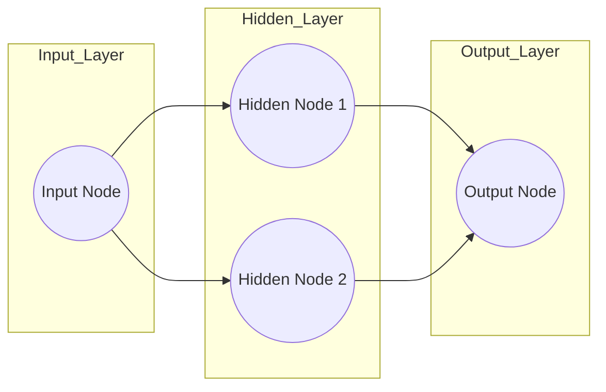

# 1. The Goal of Neural Networks

## Overview
At their most fundamental level, Neural Networks are powerful tools for **fitting a curve (a "squiggle") to data**. While they are often described as "Black Boxes" or modeled after the human brain, mathematically, they function as complex curve-fitting machines.

## The Problem with Simple Lines
Imagine a dataset representing the effectiveness of a drug at different dosages:
*   **Low Dosage:** Not Effective (Value: 0)
*   **Medium Dosage:** Effective (Value: 1)
*   **High Dosage:** Not Effective (Value: 0)

If we try to fit this data using standard **Linear Regression** (fitting a straight line), we fail.

```mermaid
graph LR
    A[Low Dosage (0)] -->|Line goes here?| B[Misses High/Med]
    C[Med Dosage (1)] -->|Line goes here?| D[Misses Low/High]
    E[High Dosage (0)] -->|Line goes here?| F[Misses Low/Med]
    style A fill:#ffcccc,stroke:#333
    style C fill:#ccffcc,stroke:#333
    style E fill:#ffcccc,stroke:#333
```

> [!FAILURE]
> **Linear Regression Limitation**
> No matter how you rotate a straight line, it can only pass through or near two of these three groups. It cannot go Up (Low to Med) and then Down (Med to High).

## The Neural Network Solution
A Neural Network solves this by creating a curve (or "squiggle") rather than a straight line.
1.  **Low Dosage:** The curve stays near 0.
2.  **Medium Dosage:** The curve rises up near 1.
3.  **High Dosage:** The curve goes back down near 0.

### Key Insight
This "Squiggle" allows the model to capture accurate predictions for complex datasets where the relationship between input (Dosage) and output (Effectiveness) is not linear.


# 2. Neural Network Architecture

## Anatomy of a Network
A Neural Network is composed of discrete components that pass information forward.



## Component Definitions

### 1. Input Node
*   **Function:** This is where the data enters the network.
*   **Example:** A numerical value representing "Dosage" (e.g., 0.5).
*   **Note:** In simple networks, raw data is fed here without calculation.

### 2. Hidden Layer(s)
*   **Function:** The layer(s) between Input and Output. This is where the magic happens.
*   **Name:** Called "Hidden" simply because we do not see their inputs/outputs directly in the final result; they are internal processing steps.
*   **Structure:** Can consist of one or many nodes. In our example, we use **1 Layer** with **2 Nodes**.

### 3. Output Node
*   **Function:** Consolidates the information from the Hidden Layer to produce the final prediction.
*   **Example:** A value representing "Effectiveness."

### 4. Connections (Synapses)
*   The lines connecting nodes.
*   Each connection carries a specific mathematical operation involving **Weights**.

> [!TIP]
> **Terminology Alert**
> While inspired by biological neurons (Nodes) and synapses (Connections), modern Neural Networks are best understood as **math operations**, not biological simulations. Think of the network as a "Big Fancy Squiggle Fitting Machine."

---


# 3. The Building Blocks Weights and Biases

To understand how the network calculates values, we must look at the parameters: **Weights** and **Biases**. These are analogous to the parameters in a simple line equation.

## The Linear Equation Analogy
Recall the equation for a straight line:
$$y = m \cdot x + b$$
*   $m$ = Slope
*   $b$ = y-intercept

## The Neural Network Equivalents
In a Neural Network, we use different terms for the same mathematical concepts along the connections:

1.  **Weight ($w$):**
    *   Corresponds to the **Slope ($m$)**.
    *   It determines how much influence the input has on the output.
    *   The numbers written *on the lines* connecting nodes are Weights.

2.  **Bias ($b$):**
    *   Corresponds to the **Intercept ($b$)**.
    *   It shifts the activation function left or right (or up and down at the output).
    *   The numbers added to the calculation *inside* or *before* the node are Biases.

## The Connection Formula
When data flows from one node to another, the following calculation occurs:

$$ \text{Node Input} = (\text{Input Data} \times \text{Weight}) + \text{Bias} $$

> [!INFO]
> **Where do these numbers come from?**
> When a network is created, weights and biases are unknown. They are estimated (learned) by fitting the network to data using a process called **Backpropagation**. For the purpose of understanding *how* the network works (Inference), we assume these numbers have already been calculated.

---


# 4. Activation Functions

## What is an Activation Function?
Inside the nodes of the Hidden Layer, there is a specific component that transforms the linear math (Weights and Biases) into a non-linear shape. This is the **Activation Function**.

Without Activation Functions, a Neural Network would essentially just be Linear Regression; it could only draw straight lines. The Activation Function introduces the **bend** or **curve**.

## Common Types

### 1. Softplus (Used in this example)
*   **Shape:** A smooth curve that looks like a transition from 0 to a linear increase.
*   **Equation:** $f(x) = \ln(1 + e^x)$ (Natural Log).
*   **Characteristics:** Smooth, differentiable everywhere.
*   **Mnemonic:** Sounds like a brand of toilet paper.

### 2. ReLU (Rectified Linear Unit)
*   **Shape:** A sharp bend. Flat at 0, then goes up linearly.
*   **Equation:** $f(x) = \max(0, x)$.
*   **Usage:** The most common activation function in modern Deep Learning.
*   **Mnemonic:** Sounds like a robot.

### 3. Sigmoid
*   **Shape:** An "S" shape.
*   **Equation:** $f(x) = \frac{e^x}{e^x + 1}$.
*   **Usage:** Classic, used often in teaching, but less common in hidden layers of deep networks now.

## How It Works in Context
The math $(\text{Input} \times \text{Weight}) + \text{Bias}$ produces an **X-axis coordinate**.
We plug that coordinate into the Activation Function to get the **Y-axis value**.

> [!example]
> If our linear math gives us $x = 2.14$, and we use **Softplus**:
> $$y = \ln(1 + e^{2.14}) \approx 2.25$$

---


# 5. The Mechanics of a Single Node

This note explains the exact mathematical sequence required to get a value out of a single hidden node.

## The Scenario
*   **Input (Dosage):** $0$
*   **Weight (Connection):** $-34.4$
*   **Bias:** $+2.14$
*   **Activation Function:** Softplus

## Step 1: Linear Combination
First, we apply the weight and bias to the input. This creates the **X-coordinate** for the activation function.

$$ x_{coord} = (\text{Dosage} \times \text{Weight}) + \text{Bias} $$
$$ x_{coord} = (0 \times -34.4) + 2.14 $$
$$ x_{coord} = 0 + 2.14 $$
$$ \mathbf{x_{coord} = 2.14} $$

## Step 2: Activation
Next, we plug the $x_{coord}$ into the Softplus equation to find the node's activation value (the **Y-coordinate**).

$$ y = \ln(1 + e^x) $$
$$ y = \ln(1 + e^{2.14}) $$

*   $e^{2.14} \approx 8.499$
*   $1 + 8.499 = 9.499$
*   $\ln(9.499) \approx 2.25$

$$ \mathbf{y = 2.25} $$

## Meaning of the Result
This value ($2.25$) is the output of this specific hidden node when the Dosage is $0$.

> [!IMPORTANT]
> **Sensitivity to Input**
> Because of the Weight ($-34.4$), this node is highly sensitive.
> *   If Dosage moves from **0 to 0.1**:
> *   $x_{coord} = (0.1 \times -34.4) + 2.14 = -3.44 + 2.14 = \mathbf{-1.3}$
> *   $y = \ln(1 + e^{-1.3}) \approx \mathbf{0.24}$
>
> The output dropped drastically from **2.25 to 0.24** with a small change in input. This ability to change values rapidly allows the network to create sharp curves.

---

### File Name: `6. Building the Curve Step by Step`

# 6. Building the Curve Step by Step

This is the detailed breakdown of the exercise presented in the StatQuest video. We will see how a simple network with **2 Hidden Nodes** creates a complex "Green Squiggle" to fit our Dosage data.

## The Architecture Setup
*   **Input:** Dosage (Values 0 to 1).
*   **Hidden Node 1 (Top):**
    *   Input Weight: $-34.4$
    *   Bias: $+2.14$
    *   Output Weight: $-1.30$
*   **Hidden Node 2 (Bottom):**
    *   Input Weight: $-2.52$
    *   Bias: $+1.29$
    *   Output Weight: $+2.28$
*   **Final Output Bias:** $-0.58$

---

## Part 1: The Top Node (Creating the Blue Curve)

The top node uses the Softplus function. However, the weights transform this shape significantly.

1.  **The Input Weight ($-34.4$) and Bias ($+2.14$):**
    *   We process inputs from Dosage $0$ to $1$.
    *   Because the weight is large and negative, as Dosage increases, the input to the activation function becomes essentially negative infinity very quickly.
    *   *Result:* This selects a specific "slice" of the Softplus curve.

2.  **The Output Weight ($-1.30$):**
    *   The output of the activation function is multiplied by $-1.30$.
    *   *Effect:* This **flips** the curve upside down (negative) and **scales** it (stretches it).
    *   **Visual Result:** A "Blue Curve" that starts high and plummets to zero.

**Example Calculation (Dosage = 0):**
1.  $x = (0 \times -34.4) + 2.14 = 2.14$
2.  Activation = $\text{Softplus}(2.14) = 2.25$
3.  Weighted Output = $2.25 \times -1.30 = \mathbf{-2.93}$

---

## Part 2: The Bottom Node (Creating the Orange Curve)

The bottom node is identical in structure but has different parameters.

1.  **The Input Weight ($-2.52$) and Bias ($+1.29$):**
    *   The weight is smaller than the top node. It traverses the activation function shape more slowly.
    *   *Result:* It selects a wider, smoother slice of the Softplus curve.

2.  **The Output Weight ($+2.28$):**
    *   The output is multiplied by a positive number.
    *   *Effect:* It keeps the curve upright and stretches it taller.
    *   **Visual Result:** An "Orange Curve" that starts moderately high and gently curves down.

**Example Calculation (Dosage = 0):**
1.  $x = (0 \times -2.52) + 1.29 = 1.29$
2.  Activation = $\text{Softplus}(1.29) = 1.53$
3.  Weighted Output = $1.53 \times 2.28 = \mathbf{3.49}$

---

## Part 3: The Combination (Creating the Green Squiggle)

The Neural Network's power comes from **adding** these nodes together.

**At Dosage = 0:**
*   Blue Curve Value: $-2.93$
*   Orange Curve Value: $3.49$
*   Sum: $-2.93 + 3.49 = 0.56$
*   **Final Bias:** $-0.58$ (The network subtracts 0.58 from the total).
*   **Result:** $0.56 - 0.58 = \mathbf{-0.02}$ (Approx 0).
*   *Interpretation:* Low Dosage = Not Effective.

**At Dosage = 0.5 (Medium):**
*   If we run the math for 0.5:
    *   Blue Curve drops to near zero (Weight -34.4 kills it).
    *   Orange Curve is still active (Weight -2.52 is gentler).
*   The sum results in a high positive number.
*   *Interpretation:* Medium Dosage = Effective (High value).

**At Dosage = 1.0 (High):**
*   Both curves have decayed significantly.
*   The result returns to near zero.
*   *Interpretation:* High Dosage = Not Effective.

## Conclusion: The Green Squiggle
By adding the **Blue Curve** (sharp drop) to the **Orange Curve** (gentle drop) and adjusting with the **Bias**, we create a new shape: **The Green Squiggle**.

*   Starts at 0.
*   Goes up to 1.
*   Goes back down to 0.

> [!SUMMARY]
> **The Big Picture**
> The Neural Network didn't memorize the data. It used **Weights** to slice and stretch basic Activation Functions into new shapes, and then added them together to fit a curve that matches the data pattern perfectly. This is how "Big Fancy Squiggle Fitting Machines" work.