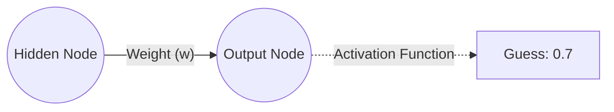
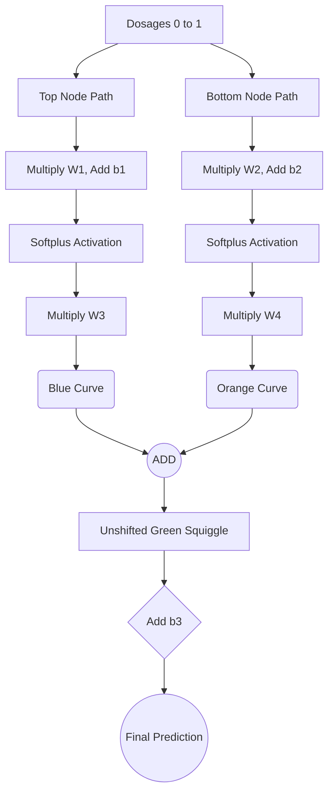
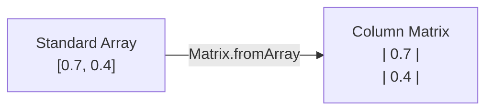

# 4. Forward Propagation and Activation Functions

## 4.1 The Feedforward Process

Before we can correct a mistake, the network must make a mistake. The process of making that initial guess is called **Feedforward** — passing data from the input layer, through the hidden layers, to the output layer.

At each neuron, two mathematical operations occur:
1. **Linear Combination ($z$):** A weighted sum of the inputs plus a bias.
2. **Activation ($\sigma$):** Passing the linear combination through a non-linear function to allow the network to learn complex patterns.

> **Feedforward** is the process of moving data *forward* (from left to right) through the network to get a guess. **Backpropagation** is the process of moving the error *backward* (from right to left) through the network to update the weights. You cannot have backpropagation without first doing a feedforward pass!

### Essential Background Knowledge

To train a neural network using **Supervised Learning**, the network must first make a prediction (a guess) based on a given set of inputs. The process of passing data from the input layer, through the hidden layers, to the output layer is called **Feedforward**.

You cannot calculate an error or adjust weights until the network has actually attempted to solve the problem. Therefore, the very first step in the `train()` function is to perform a feedforward pass. **Forward propagation must always precede backward propagation** — you need to know what the network guessed before you can determine how wrong it was.

---

## 4.2 A Single Connection Breakdown

Let's break down the mechanics of a single connection in the network:



1. **The Input Signal:** The hidden node holds a numerical value (a signal) that it needs to pass forward.
2. **The Weight:** The signal travels along a connection with a **weight** ($w$). The signal is multiplied by this weight. The weight determines how "important" this specific signal is to the final output.
3. **Summation & Activation:** The output node collects the incoming multiplied signal (along with a bias term, which shifts the activation threshold). The output node then passes this sum through an **Activation Function**.
4. **The Guess:** The final squished number is our network's guess.

> **Point Students Often Miss:** The weight is just a multiplier. If the weight is high, the input signal strongly affects the output. If the weight is near zero, the network is effectively ignoring that input signal.

---

## 4.3 Forward Propagation Mathematics (2-Input Network)

### Layer 1: Input to Hidden Layer

For the first hidden node ($h_1$):

$$z_1^{(1)} = w^{(1)}_{11}x_1 + w^{(1)}_{21}x_2 + b^{(1)}_1$$
$$h_1 = \sigma(z_1^{(1)})$$

For the second hidden node ($h_2$):

$$z_2^{(1)} = w^{(1)}_{12}x_1 + w^{(1)}_{22}x_2 + b^{(1)}_2$$
$$h_2 = \sigma(z_2^{(1)})$$

*(Notation note: The superscript $(1)$ denotes the first layer of weights, while the subscript denotes the connection from input $i$ to hidden node $j$.)*

### Layer 2: Hidden to Output Layer

The outputs of the hidden layer ($h_1, h_2$) now become the inputs for the final output layer.

$$z^{(2)} = w^{(2)}_1 h_1 + w^{(2)}_2 h_2 + b^{(2)}$$
$$\hat{p}_i = \sigma(z^{(2)})$$

Where $\hat{p}_i$ is the predicted probability for the $i$-th training example.

> [!info] Crucial Reminder
> The output of the activation functions ($h_1$ and $h_2$) become the **inputs** for the next layer of the network. This is a fundamental principle of feedforward networks — each layer's output is the next layer's input. They represent the "blue curve" and "orange curve" outputs before they are scaled by the next set of weights.

> **Why do we need this explicit math?** You cannot perform backpropagation without first completing forward propagation. Backpropagation uses the intermediate values calculated here (specifically $h_1, h_2$, and $\hat{p}$) to calculate the gradients. You **must** cache (save) these values in memory during the forward pass.

---

## 4.4 Forward Propagation with the StatQuest Drug Dosage Network

### Creating the Component Curves

Because our network has two hidden nodes, it generates two distinct curves that are later combined. We use the **Softplus activation function**: $f(x) = \log(1 + e^x)$.

1. **The Blue Curve (Top Node):**
   - We pass dosages from `0` to `1` through $W_1$ and $b_1$.
   - These values form the X-axis coordinates for the Softplus function.
   - The Softplus function outputs the Y-axis coordinates.
   - We multiply these Y-coordinates by $W_3$ (which in our example is `-1.22`). This flips and scales the curve, resulting in the final **Blue Curve**.

2. **The Orange Curve (Bottom Node):**
   - Similarly, dosages pass through $W_2$ and $b_2$.
   - They enter the Softplus function to get Y-coordinates.
   - These are multiplied by $W_4$ (`-2.30`), resulting in the **Orange Curve**.

### The Unshifted "Green Squiggle"

The neural network combines the hidden layer outputs by adding them together:
$$ \text{Green Squiggle}_{\text{unshifted}} = \text{Blue Curve} + \text{Orange Curve} $$

### The Role of $b_3$

At this stage, we have a green squiggly shape that resembles our data, but it is not positioned correctly on the Y-axis. This is where the final bias, $b_3$, comes in.

Because we don't know the optimal value of $b_3$ yet, we must initialize it with a starting guess.
- **Standard Initialization:** Bias terms are frequently initialized to `0`.
- Therefore, we set our initial $b_3 = 0$.

Because we are adding `0` to our green squiggle, its position on the graph does not change. Unsurprisingly, because $b_3$ is not optimized, our curve is sitting far away from the actual observed data points.

### Step-by-Step Forward Pass

**1. The Top Node (Blue Curve):**
- The Input is multiplied by **Weight 1** and **Bias 1** is added.
- $x_1 = (\text{Input} \times w_1) + b_1$
- $x_1$ is passed through the **Softplus** activation function.
- $y_1 = \log(1 + e^{x_1})$
- $y_1$ is multiplied by **Weight 3** to form the "Blue Curve."

**2. The Bottom Node (Orange Curve):**
- The Input is multiplied by **Weight 2** and **Bias 2** is added.
- $x_2 = (\text{Input} \times w_2) + b_2$
- $x_2$ is passed through the **Softplus** activation function.
- $y_2 = \log(1 + e^{x_2})$
- $y_2$ is multiplied by **Weight 4** to form the "Orange Curve."

**3. The Final Output:**
- The Blue Curve and Orange Curve are summed together, and Bias 3 is added.
- $$ \text{Predicted} = (y_1 \times w_3) + (y_2 \times w_4) + b_3 $$

### Calculating Hidden Node Activations (with Specific Values)

When we push actual data through the network using our fancy notation, we get specific numerical outputs:

#### Step 1: Linear Combinations ($x$ coordinates)

For every input data point $i$, we must calculate the raw input to our hidden nodes:

**For the Top Node ($x_{1,i}$):**
$$x_{1,i} = (Input_i \times w_1) + b_1$$
*(Given our pre-trained values, this is: $Input_i \times 3.34 - 1.43$)*

**For the Bottom Node ($x_{2,i}$):**
$$x_{2,i} = (Input_i \times w_2) + b_2$$
*(Given our pre-trained values, this is: $Input_i \times -3.53 + 0.57$)*

#### Step 2: Applying the Activation Function ($y$ coordinates)

The linear results ($x$) are then passed through the **Softplus** activation function:

**Output of Top Node:**
$$y_{1,i} = \log(1 + e^{x_{1,i}})$$

**Output of Bottom Node:**
$$y_{2,i} = \log(1 + e^{x_{2,i}})$$

> [!info] Crucial Reminder
> The output of the activation functions ($y_{1,i}$ and $y_{2,i}$) become the **inputs** for the final layer of the network. They represent the "blue curve" and "orange curve" outputs before they are scaled by $w_3$ and $w_4$.

### Forward Pass Flow Diagram



---

## 4.5 Activation Functions

### The Sigmoid Function

In many networks, we use the **Sigmoid** activation function to squash values between 0 and 1:

$$\sigma(x) = \frac{1}{1 + e^{-x}}$$

**Derivative of the Sigmoid:** Through calculus (quotient rule), this simplifies to:

$$\sigma'(x) = \sigma(x) \cdot (1 - \sigma(x))$$

Since our network outputs are exactly $\sigma(x)$ (e.g., $h_1 = \sigma(z_1)$), we can rewrite the derivative using the *already calculated outputs*:
- Derivative of $\hat{p}$ with respect to $z^{(2)}$: **$\hat{p}(1 - \hat{p})$**
- Derivative of $h_1$ with respect to $z_1^{(1)}$: **$h_1(1 - h_1)$**

This elegant property means we never need to compute the original exponential expression — we just use the output we already have.

### The Softplus Function

In the StatQuest examples, the **Softplus** activation function is used:

$$f(x) = \log(1 + e^x)$$

**Derivative of the Softplus:** Using the Chain Rule:

$$ \frac{d}{dx} \log(1 + e^x) = \frac{1}{1 + e^x} \times e^x = \frac{e^x}{1 + e^x} $$

### Detailed Softplus Derivative Derivation (Step by Step)

Let's derive this result carefully, showing every step:

Given: $y = \log(1 + e^x)$

**Step 1:** Let the inside function be $z = 1 + e^x$. So our function becomes $y = \log(z)$.

**Step 2:** The derivative of the outside function $\log(z)$ with respect to $z$ is:
$$\frac{dy}{dz} = \frac{1}{z} = \frac{1}{1 + e^x}$$

**Step 3:** The derivative of the inside function $z = 1 + e^x$ with respect to $x$ is:
- The derivative of the constant $1$ is $0$
- The derivative of $e^x$ is $e^x$
$$\frac{dz}{dx} = e^x$$

**Step 4:** Multiply the outside derivative by the inside derivative (Chain Rule):
$$\frac{dy}{dx} = \frac{dy}{dz} \times \frac{dz}{dx} = \frac{1}{1 + e^x} \times e^x = \frac{e^x}{1 + e^x}$$

This is actually the Sigmoid function! The Softplus derivative is the Sigmoid, which makes mathematical sense — Softplus is a smooth approximation of the ReLU function, and its derivative naturally gates the gradient.

### Why Activation Functions Matter

Activation functions allow the network to bend and warp data to fit complex, non-linear shapes. Without them, the network would only ever compute linear transformations (matrix multiplications), and no amount of stacking layers would enable it to learn non-linear patterns.

---

## 4.6 Forward Propagation in Code

When constructing a Neural Network class, we require a `train(inputs, targets)` method. The initial step is to perform a feedforward pass.

```javascript
train(inputs, targets) {
    // Step 1: Generate the neural network's guess
    let outputs = this.feedforward(inputs);
}
```

### 💡 Common Pitfall: What does `feedforward` return?

Students often forget the data types being passed around in custom neural network libraries. In this specific implementation, the user passes in standard JavaScript `Arrays` (e.g., `[1, 0]`). However, internally, neural networks rely on **Linear Algebra**.

In the instructor's architecture, the `feedforward` function processes the data using internal `Matrix` objects, but it ends with:

`return output.toArray();`

**Reminder:** At this stage, `outputs` is a standard 1-Dimensional Array, *not* a Matrix object. We will have to deal with this data type conversion shortly to perform our error calculations.

To perform neural network mathematics efficiently, we must convert these 1D Arrays into **Single-Column Matrices** (Vectors):



```javascript
train(inputs, targets) {
    let outputs = this.feedforward(inputs);

    // Convert arrays to Matrix objects
    outputs = Matrix.fromArray(outputs);
    targets = Matrix.fromArray(targets);
    
    // Calculate the error
    let output_errors = Matrix.subtract(targets, outputs);
}
```

> [!tip] Naming Conventions
> Notice how the instructor reassigns `outputs = Matrix.fromArray(outputs)`. While this saves memory, it can sometimes be confusing while debugging because the variable type changes from `Array` to `Matrix` midway through the function. A safer trick for beginners is to use distinct variable names, such as `outputs_matrix = Matrix.fromArray(outputs_array)`. However, keeping them as the same name is standard in optimizing lightweight libraries.

---

## 4.7 Matrix Formulation of Forward Propagation

In code, we do not calculate weights one by one using loops; that would be computationally disastrous. Instead, all inputs, weights, and errors are stored in **Matrices**. The forward pass can be expressed as a single matrix equation:

$$ Y = W \cdot X + B $$

Where:
- $W$ is the Weight Matrix
- $X$ is the Input Vector (or Hidden Layer Vector for deeper layers)
- $B$ is the Bias Vector
- $Y$ is the Output after activation

The linear equation becomes a matrix multiplication (the dot product), and to train the network, we are looking for **$\Delta W$** (a matrix of weight changes) and **$\Delta B$** (a vector of bias changes).
