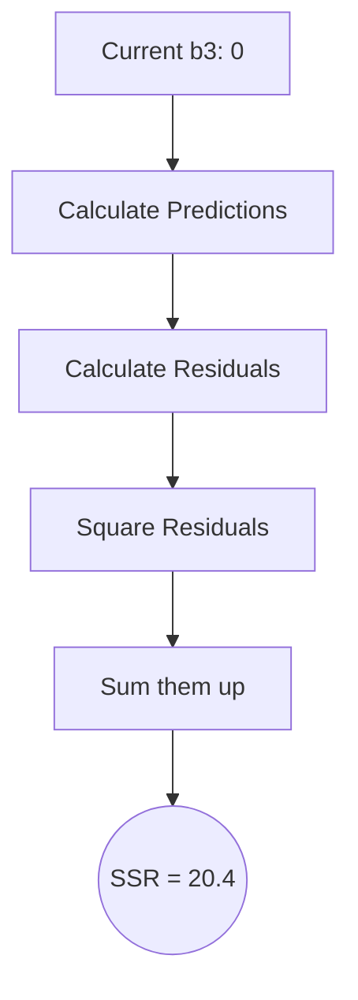
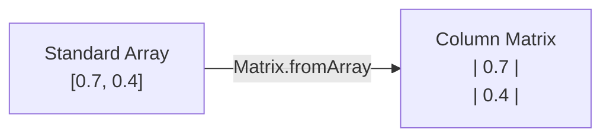

# 5. Loss Functions and Error Calculation

## 5.1 The Concept of Error in Supervised Learning

The mechanism of Backpropagation operates specifically within the paradigm of **Supervised Learning**. In Supervised Learning, the network is trained using a dataset that acts like an answer key:

1. The network is given an input (e.g., an image).
2. The network makes a prediction, which we call the **Guess**.
3. We, acting as the "Teacher," know the actual, correct **Answer** (the target label).
4. We compare the Guess to the Answer to calculate the **Error**.

Once the error is calculated at the final output layer, backpropagation allows us to take that error and feed it backwards through the network, layer by layer, adjusting the weights as we go.

### The Data Split Strategy

When training a network, datasets are rigorously split into three categories:

1. **Training Data:** The data with known labels used to adjust the network's weights.
2. **Test/Validation Data:** Data with known labels that is *hidden* from the network during training. Used to test if the network is actually learning underlying patterns or just memorizing.
3. **Unknown/Production Data:** Completely new data the network will encounter in the real world once deployed.

If you feed all data to the network at once, it will simply memorize the data (**Overfitting**) and fail completely when presented with unseen data.

---

## 5.2 Simple Error Calculation (Intuition)

The most intuitive way to calculate the error is a simple subtraction:

$$ \text{Error} = \text{Target Answer} - \text{Network Guess} $$

For example, if the target is `1.0` and the network outputs `0.7`:

$$ \text{Error} = 1.0 - 0.7 = 0.3 $$

### Analyzing the Error

The error tells us two critical things:
1. **Magnitude:** The network is off by 0.3. This represents how *much* we need to adjust our weights.
2. **Direction:** The error is positive, meaning our guess was too low. We need to "nudge" our weights higher. If the guess had been 1.2, the error would be -0.2, meaning we need to nudge the weights lower.

> **Target - Guess vs. Guess - Target:** Standard convention dictates $Target - Output$ so that a positive error implies we need to increase our weights, and a negative error implies we need to decrease them. In many cost functions (like MSE), we square the error, so the order doesn't matter for the raw *magnitude*. However, when we perform calculus to find the direction, the sign determines which direction to step.

---

## 5.3 The Sum of Squared Residuals (SSR)

### What Is a Residual?

A residual is the mathematical distance between what the model predicted and what actually happened in the real world:

$$ \text{Residual} = (\text{Observed Value}) - (\text{Predicted Value}) $$

For example, if the observed value is `0` and our network predicted `-2.6`, the residual is:

$$ 0 - (-2.6) = 2.6 $$

This tells us our prediction was `2.6` units below the actual data point.

### Why Square the Residual?

If we simply added the raw residuals together, positive and negative errors would cancel each other out, falsely suggesting the model is accurate. Squaring achieves three critical things:

1. **Removes Negative Signs (Positive Values):** If a prediction is off by $+2$ and another is off by $-2$, summing them without squaring would result in $0$ error, tricking the model into thinking it is perfect. Squaring ensures all errors are positive — no cancellation.
2. **Punishes Large Errors (Outliers):** Squaring an error of $5$ results in $25$. Squaring an error of $10$ results in $100$. This forces the network to aggressively fix predictions that are wildly incorrect, since $4^2 = 16$ is much bigger than $2^2 = 4$.
3. **Differentiability:** The resulting equation creates a smooth, convex parabola (a U-shape). This U-shape has a distinct bottom (minimum), which allows us to use calculus (derivatives) to find the exact bottom of the curve.

### The SSR Formula

For $n$ data points:

$$ \text{SSR} = \sum_{i=1}^{n} (\text{Observed}_i - \text{Predicted}_i)^2 $$

**Breaking down the notation:**
- $\sum$: The Summation symbol.
- $i=1$: The starting index.
- $n$: The total number of data points.
- $(\text{Observed}_i - \text{Predicted}_i)^2$: The squared residual for the $i$-th data point.

### The Verbose Equation

Before using summation notation, it is instructive to write out every single term explicitly for our 3-data-point example:

$$ \text{SSR} = (\text{Obs}_1 - \text{Pred}_1)^2 + (\text{Obs}_2 - \text{Pred}_2)^2 + (\text{Obs}_3 - \text{Pred}_3)^2 $$

Writing it this way makes it crystal clear that we are calculating each residual individually, squaring it, and then adding them all together.

> [!tip] Understanding "Predicted" in the equation
> Never forget what "Predicted" actually is. It is not just a simple number; it is the entire mathematical output of the neural network.
> Using the Blue/Orange Curve notation from StatQuest:
> $$ \text{Predicted}_i = (\text{Blue Curve}_i) + (\text{Orange Curve}_i) + b_3 $$
> Or equivalently, using the weight notation:
> $$ \text{Predicted}_i = (y_{1,i} \times w_3) + (y_{2,i} \times w_4) + b_3 $$
> This substitution will be vital when we start taking derivatives!

> [!warning] Student Tip — Parameters Hide Inside Predicted
> Do not forget that the $Predicted_i$ term in this equation *contains* our unknown parameters $w_3, w_4,$ and $b_3$. If we expand the equation, it looks like this:
> $$SSR = \sum (Observed_i - [(y_{1,i} \times w_3) + (y_{2,i} \times w_4) + b_3])^2$$
> This is why changing $w_3$ directly changes the SSR — the parameter is embedded inside the loss function!

### Visualizing the SSR Landscape

For our initial network where $b_3 = 0$, doing the math yields an SSR = 20.4.



---

## 5.4 The L2 Norm Squared (Mean Squared Error Variation)

In the calculus-based derivations, the error function for the entire dataset of $N$ examples is defined as:

$$ L = \sum_{i=1}^{N} \frac{1}{2} (\hat{p}_i - y_i)^2 $$

Let's break down this formula part by part:
- $N$: The total number of training examples.
- $i$: The index of the current training example.
- $\hat{p}_i$: Our network's predicted probability (a number between 0 and 1).
- $y_i$: The ground truth label (either exactly 0 or exactly 1).
- $(\hat{p}_i - y_i)$: The raw error.
- $(\hat{p}_i - y_i)^2$: Squaring ensures negative and positive errors don't cancel out, and heavily penalizes large errors.

### The Magic of the $\frac{1}{2}$

Why is there a $\frac{1}{2}$ in front of the formula? It is purely for mathematical convenience during calculus. When we take the derivative of $(x)^2$, the power rule brings the 2 to the front: $2 \cdot x$. By putting a $\frac{1}{2}$ in the loss function, the derivative becomes $\frac{1}{2} \cdot 2 \cdot x = x$. The constants cancel out beautifully, making the math cleaner. It does not change where the minimum of the function is located.

### Individual Example Loss

When performing Backpropagation, we usually calculate the gradient for one specific training example at a time:

$$ L_i = \frac{1}{2}(\hat{p}_i - y_i)^2 $$

---

## 5.5 Professional Cost Functions

While simple subtraction works for intuition, professional neural networks usually use more complex **Cost Functions** (or Loss Functions) because they provide cleaner mathematical derivatives for the calculus steps. The most common for simple regressions is the **Mean Squared Error (MSE)**.

The goal of training a neural network is singular: **Minimize the Cost Function.** We want to find the exact combination of millions of weights and biases that result in the lowest possible error.

---

## 5.6 Error Calculation in Code (Matrix Implementation)

### The Training Function Setup

When constructing a Neural Network class, we require a dedicated `train(inputs, targets)` method.
* **`inputs`**: The raw data being fed into the network.
* **`targets`**: The known, correct answers (labels) we want the network to eventually produce.

In JavaScript, the initial step of the training function looks like this:

```javascript
train(inputs, targets) {
    // Step 1: Generate the neural network's guess
    let outputs = this.feedforward(inputs);
    
    // Future steps will go here...
}
```

> [!warning] Common Pitfall: What does `feedforward` return?
> Students often forget the data types being passed around in custom neural network libraries. In this specific implementation, the user passes in standard JavaScript `Arrays` (e.g., `[1, 0]`). However, internally, neural networks rely on **Linear Algebra**.
> In the instructor's architecture, the `feedforward` function processes the data using internal `Matrix` objects, but it ends with:
> `return output.toArray();`
> **Reminder:** At this stage, `outputs` is a standard 1-Dimensional Array, *not* a Matrix object. We will have to deal with this data type conversion shortly to perform our error calculations.

---

### The Challenge: Arrays vs. Matrices

As established above, both our `targets` (passed in by the user) and our `outputs` (returned by the feedforward function) are standard 1D JavaScript Arrays. To perform neural network mathematics efficiently, we must convert these 1D Arrays into **Single-Column Matrices** (Vectors).



### Code Implementation

```javascript
train(inputs, targets) {
    let outputs = this.feedforward(inputs);

    // Convert arrays to Matrix objects
    outputs = Matrix.fromArray(outputs);
    targets = Matrix.fromArray(targets);
    
    // Calculate the error
    let output_errors = Matrix.subtract(targets, outputs);
}
```

> [!tip] Naming Conventions
> Notice how the instructor reassigns `outputs = Matrix.fromArray(outputs)`. While this saves memory, it can sometimes be confusing while debugging because the variable type changes from `Array` to `Matrix` midway through the function.
> A safer trick for beginners is to use distinct variable names, such as `outputs_matrix = Matrix.fromArray(outputs_array)`. However, keeping them as the same name is standard in optimizing lightweight libraries.

---

### Static vs. Instance Methods

This is a critical programming concept that students often miss:
* **Instance Method:** `matrixA.add(matrixB)`. This modifies `matrixA` *in place*.
* **Static Method:** `Matrix.subtract(matrixA, matrixB)`. This takes two matrices, leaves them completely untouched, and returns a **brand new** Matrix containing the result.

For error calculation, we *must* use a Static Method because we do not want to destroy our original Target or Output matrices — we might need them later!

---

### Code Implementation: Static Subtract

Here is the rigorous, step-by-step implementation of matrix subtraction:

```javascript
class Matrix {
    // ... other methods ...

    static subtract(a, b) {
        // Step 1: Create a new blank matrix with the exact same dimensions
        let result = new Matrix(a.rows, a.cols);
        
        // Step 2: Loop through every row
        for (let i = 0; i < result.rows; i++) {
            // Step 3: Loop through every column
            for (let j = 0; j < result.cols; j++) {
                // Step 4: Subtract the element in matrix 'b' from matrix 'a'
                result.data[i][j] = a.data[i][j] - b.data[i][j];
            }
        }
        
        // Step 5: Return the brand new matrix
        return result;
    }
}
```

> [!danger] Crucial Error Check Missing!
> In the video, the instructor skips error checking for brevity, but notes that he *should* do it.
> **Important Reminder:** Matrix subtraction is only mathematically valid if Matrix A and Matrix B have the **exact same dimensions**. You cannot subtract a $3 \times 1$ matrix from a $2 \times 1$ matrix. A robust library would include a check at the top:
> `if (a.rows !== b.rows || a.cols !== b.cols) { throw new Error("Columns and Rows must match!"); }`
