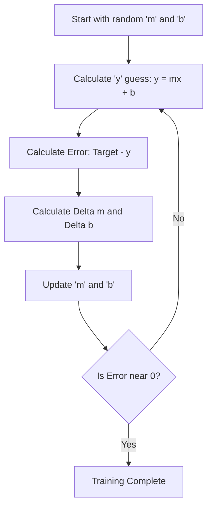
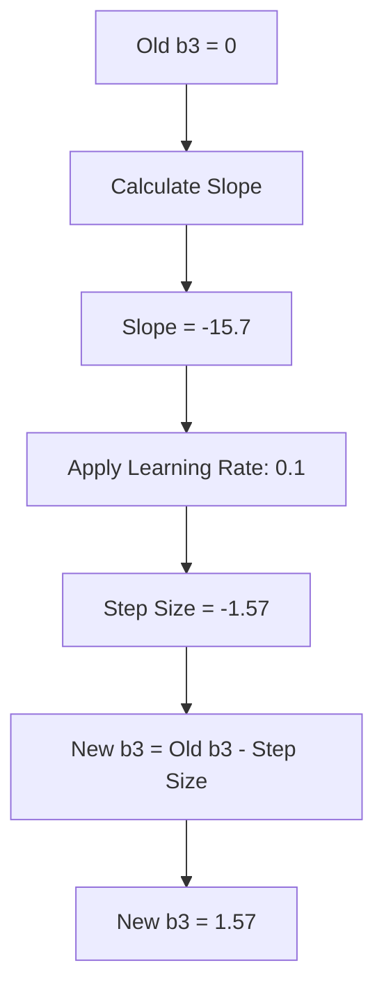
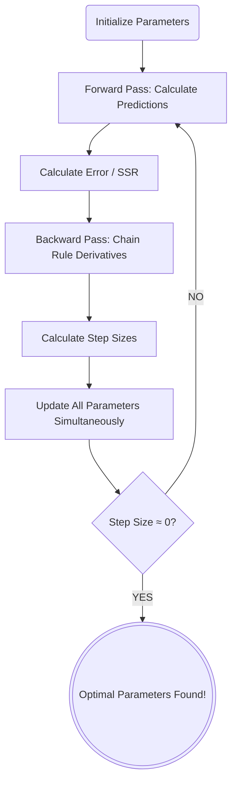

# 6. Gradient Descent — The Update Rule and Convergence

## 6.1 The Linear Regression Analogy

To understand how a neural network updates its weights, it is highly beneficial to look at a simpler, 2-dimensional problem: **Linear Regression**. Imagine a scatter plot of data points on an X-Y graph. Linear regression is the mathematical process of drawing a single straight line that best fits the trend of those points.

The equation for a straight line is:

$$ y = mx + b $$

Where $m$ = slope (weight), $b$ = y-intercept (bias), $x$ = input, $y$ = output.

A single artificial neuron (a perceptron) doing a simple task is functionally identical to linear regression. It takes an input ($x$), multiplies it by a weight ($m$), adds a bias ($b$), and generates an output ($y$).

If the line doesn't fit well, we have a high Error. The only "knobs" we can turn to adjust the line are $m$ (weight) and $b$ (bias). We cannot change $x$ (the data is the data) or $y$ (it is just the result of the math).

### Gradient Descent in 2D

We denote the change in weights and biases as $\Delta m$ and $\Delta b$:

$$ m_{new} = m_{old} + \Delta m $$
$$ b_{new} = b_{old} + \Delta b $$

How do we find $\Delta m$?

$$ \Delta m = \text{Learning Rate} \times \text{Error} \times x $$
$$ \Delta b = \text{Learning Rate} \times \text{Error} $$

- **Error:** Tells us *which direction* to move and *how far* we are from the goal.
- **$x$ (Input):** Tells us the magnitude of the contribution of this specific input to the error.
- **Learning Rate ($\alpha$):** A tiny scalar number (e.g., $0.01$). It acts as a speed limit. If we change $m$ by the raw error, the line will jump wildly across the graph and miss the optimal fit. The learning rate ensures we take tiny, calculated steps down the error curve until we reach the bottom (the minimum error).

> [!info] Why do we need the Learning Rate?
> If we subtract the raw derivative from our parameters, our "step" might be so massive that we overshoot the bottom of the error curve entirely, bouncing wildly back and forth. The learning rate forces the network to take small, cautious steps toward the minimum. Without it, gradient descent becomes unstable and may never converge.

---

## 6.2 Translating to Multi-Dimensional Space

Neural networks do not operate in a 2D space. Instead of one input $x$, there might be hundreds of inputs ($x_1, x_2, x_3, \dots$). Instead of one weight $m$, there is a matrix of weights ($m_1, m_2, m_3, \dots$).

$$ Y = (m_1x_1 + m_2x_2 + m_3x_3 + \dots + m_nx_n) + b $$

> **The Curse of Dimensionality:** As we add dimensions (inputs and neurons), the volume of the space we are trying to search for the perfect weights grows exponentially. This is why we cannot just use "random guessing" or brute-force search. We absolutely require the calculus-backed directionality of Gradient Descent to navigate this hyper-dimensional haystack.

### Mapping the Math to Neural Networks

| Linear Regression | Neural Network |
| --- | --- |
| $m$ (slope) | $W$ (Weight Matrix) |
| $b$ (y-intercept) | $B$ (Bias Vector) |
| $x$ (input) | $I$ (Input Vector) or $H$ (Hidden Layer Vector) |

Because we are dealing with matrices, we must use Matrix Multiplication (the dot product):

$$ Y = W \cdot X + B $$

We are no longer just looking for $\Delta m$ and $\Delta b$. We are looking for **$\Delta W$** (a matrix of weight changes) and **$\Delta B$** (a vector of bias changes), calculated using Matrix Calculus.

---

## 6.3 The Gradient Descent Update Rule

We have $N$ parameters (weights and biases), randomly initialized. We have a Loss Function ($L$). We want to minimize $L$. **Gradient Descent** is an iterative algorithm that answers the question: *"If I tweak this specific weight by a tiny amount, how will the overall Loss change?"*

We express this mathematically using partial derivatives:

$$\frac{\partial L}{\partial w}$$

This is read as: "The partial derivative of the Loss with respect to weight $w$."

- If $\frac{\partial L}{\partial w}$ is **positive**, increasing the weight *increases* the error → *decrease* the weight.
- If $\frac{\partial L}{\partial w}$ is **negative**, increasing the weight *decreases* the error → *increase* the weight.

### The Update Rule

Once we compute the gradient for all parameters, we update them simultaneously using a learning rate ($\alpha$):

$$w_{new} = w_{old} - \alpha \frac{\partial L}{\partial w}$$

The minus sign ensures we step in the *opposite* direction of the gradient. The gradient always points towards the steepest ascent (maximum error); we want the steepest *descent* (minimum error).

---

## 6.4 Step-by-Step Gradient Descent Example

### StatQuest: Optimizing $b_3$

With $b_3 = 0$ and observed values (0, 1, 0):

**Calculating the Current Slope (Iteration 1):**

We plug our actual data into the derivative formula to find the slope when $b_3 = 0$:

$$ \text{Slope} = \sum_{i=1}^{3} -2 \times (\text{Observed}_i - \text{Predicted}_i) \times 1 $$

We know our observed values (0, 1, 0) and our predicted values from the green squiggle when $b_3 = 0$:
1. Data point 1: $-2 \times (0 - (-2.6)) \times 1 = -5.2$
2. Data point 2: $-2 \times (1 - (-1.61)) \times 1 = -5.22$
3. Data point 3: $-2 \times (0 - (-2.61)) \times 1 = -5.22$

Adding them together: $-5.2 - 5.22 - 5.22 = -15.7$

**The slope of the SSR curve at $b_3 = 0$ is $-15.7$.**

**Iteration 1:**
- Slope = $-15.7$
- Step Size = $-15.7 \times 0.1 = -1.57$
- New $b_3 = 0 - (-1.57) = 1.57$

> [!tip] Why do we subtract a negative?
> A negative slope means the error curve is sloping downwards to the right. To find the minimum (the bottom of the valley), we *want* to move to the right (increase our $b_3$ value). Subtracting a negative number results in addition, moving us perfectly in the correct direction!

**Iteration 2:**
- Slope = $-6.26$
- Step Size = $-6.26 \times 0.1 = -0.626$
- New $b_3 = 1.57 - (-0.626) = 2.19$

**Convergence:** At $b_3 = 2.61$, the slope ≈ 0, and the parameter stops changing.

### StatQuest: Optimizing $w_3$

Assume the Chain Rule math gives a derivative of $1.26$ for $w_3$, with a learning rate of $0.1$:

1. **Calculate Step Size:** $1.26 \times 0.1 = 0.126$
2. **Calculate New Weight:** $0.36\ (\text{old}) - 0.126\ (\text{step size}) = 0.234$

Our new weight $w_3$ is $0.234$. We perform this exact operation simultaneously for $w_4$ and $b_3$.

> [!info] Conceptual Check
> Notice what happened here: The gradient for a weight ($w_3$) is scaled directly by the activation output of the node it connects to ($y_{1,i}$). If the top node outputs a very small number (inactive), then $w_3$ won't be updated very much, because that node didn't contribute much to the error! This is exactly how neural networks assign "blame" for incorrect predictions.

> [!success] Critical Shortcut — Reusing Derivatives
> Because the output layer node combines all parameters to form the prediction, the derivative $\frac{d(SSR)}{d(Predicted)}$ is exactly the same for all parameters connected to this output node. We calculate this *once* and reuse it for $w_3, w_4,$ and $b_3$. This concept of reusing calculated gradients is the secret to why Backpropagation is computationally efficient!

---

## 6.5 The Full Training Loop (An Epoch)

One full loop of this process is called an **Epoch**. The steps are:

1. **Forward Pass:** Use the current parameters to calculate the Predicted values for all data points.
2. **Calculate Error:** Compute the SSR / Loss.
3. **Backward Pass (Backpropagation):** Use the Chain Rule formulas to calculate the gradient for every parameter.
4. **Update Parameters:** Use Gradient Descent to subtract the (Derivative × Learning Rate) from the old parameters.

### The Detailed 7-Step Training Loop

A more granular breakdown of the training cycle:

1. **Initialize parameters** — Set weights (random) and biases (zero).
2. **Run a Forward Pass** — Feed data through the network to get Predictions.
3. **Calculate the SSR (Error)** — Quantify how wrong the predictions are.
4. **Use the Chain Rule** — Calculate the derivatives for all parameters.
5. **Multiply derivatives by the Learning Rate** — Get Step Sizes.
6. **Update all parameters simultaneously** — Subtract Step Sizes from current values.
7. **Repeat** steps 2–6 until convergence.

> [!info] Why Subtract?
> If the derivative (slope) is positive, it means the Error is increasing as the weight increases. Therefore, we want to decrease the weight (go in the opposite direction). Subtracting a positive step size decreases the value. If the derivative is negative, subtracting a negative number adds to the value, moving us in the correct direction.

### When Does It Stop?

We repeat this cycle until we hit a stopping criterion:

1. **Convergence:** The parameters stop changing significantly. The step size becomes so close to $0$ that the predictions no longer improve. We have found the bottom of the error curve.
2. **Maximum Steps:** We reach a predefined limit (e.g., 10,000 epochs) to prevent infinite loops if the model struggles to converge.

Once the loop stops, the parameters are considered **optimized**, and the neural network has successfully learned to fit the data.

---

## 6.6 Convergence — The Iterative Process

Backpropagation and Gradient Descent are not "one and done" operations. They form a loop. With every iteration:

1. **The Green Squiggle Shifts:** Because $b_3$ is added to the end of the network, changing its value physically pushes the entire green squiggle up (or down) the Y-axis.
2. **The Residuals Shrink:** Because the green squiggle moved closer to our observed data points, the residuals (the gaps between prediction and reality) get smaller.
3. **The SSR Drops:** Squaring and summing these smaller residuals results in a much lower total error.
4. **The Slope Changes:** Because we have moved further down the error curve, the slope is no longer as steep as it was.

### Step 2 and Beyond

After $b_3$ changes from `0` to `1.57`, everything in the network changes. We run the exact same math again with the new $b_3$ value:
- We plug the new predictions into the derivative formula.
- We calculate the new slope (which comes out to $-6.26$).
- We calculate the new Step Size: $-6.26 \times 0.1 = -0.626$.
- We update $b_3$: $1.57 - (-0.626) = 2.19$.

Changing $b_3$ to `2.19` shifts the green squiggle up even further, shrinking the residuals even more.

As we reach the bottom of the error curve, the slope gets flatter and flatter (approaching 0). When the slope approaches 0, the Step Size becomes so microscopic that the parameter basically stops changing. At this point, we have achieved **Convergence**.

$$ \text{Step Size} \approx 0 \times \text{Learning Rate} = 0 $$
$$ \text{New Parameter} = \text{Old Parameter} - 0 = \text{Old Parameter} $$

> [!summary] The Ultimate Takeaway
> The main idea behind Backpropagation is simple:
> 1. When a parameter is unknown, we use the **Chain Rule** to find the derivative of the loss function with respect to that specific parameter.
> 2. We initialize the parameter with a guess.
> 3. We use **Gradient Descent** (informed by the Chain Rule slope) to repeatedly update the parameter until the step size reaches zero.
