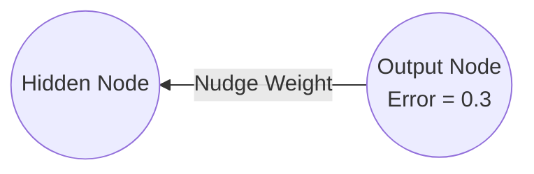
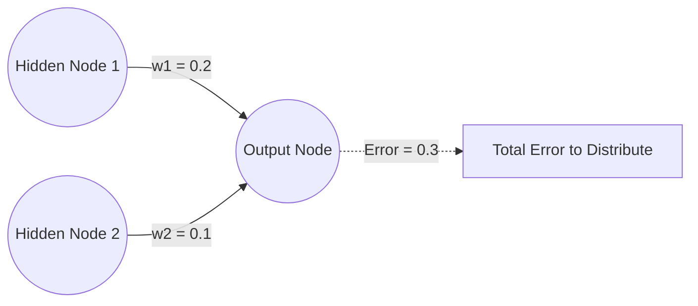

# 7. Backpropagating to the Output Layer

## 7.0 Supervised Learning Context

The mechanism discussed here operates specifically within the paradigm of **Supervised Learning**. In Supervised Learning, the network is trained using a dataset that acts like an answer key.

### The 4-Step Supervised Learning Process

1. **The network is given an input** (e.g., an image or a data point).
2. **The network makes a prediction**, which we call the **Guess**.
3. **We, acting as the "Teacher,"** know the actual, correct **Answer** (the target label).
4. **We compare the Guess to the Answer** to calculate the **Error**.

Once the error is calculated at the final output layer, backpropagation allows us to take that error and feed it backwards through the network, layer by layer, adjusting the weights as we go.

> [!info] Essential Background Knowledge — Feedforward vs. Backpropagation
> **Feedforward** is the process of moving data *forward* (from left to right) through the network to get a guess.
> **Backpropagation** is the process of moving the error *backward* (from right to left) through the network to update the weights. You cannot have backpropagation without first doing a feedforward pass!

---

## 7.1 Distributing the Error — Intuition (Proportional Blame)

Now that we possess the calculated error, we must use it to adjust the weights. Let's start with the simplest possible scenario and build up.

### The Feedforward Mechanics (Before We Can Distribute Error)

Before we can correct a mistake, the network must make a mistake. The process of making that initial guess is called **Feedforward**. Let's break down the mechanics of a single connection:

1. **The Input Signal:** The hidden node holds a numerical value (a signal) that it needs to pass forward.
2. **The Weight:** The signal travels along a connection. This connection has a **weight** ($w$). The signal is multiplied by this weight. The weight determines how "important" this specific signal is to the final output.
3. **Summation & Activation:** The output node collects the incoming multiplied signal (along with a bias term, which shifts the activation threshold). The output node then passes this sum through an **Activation Function** (like a Sigmoid function). The activation function squishes the number into a predictable range (e.g., between 0 and 1).
4. **The Guess:** The final squished number is our network's guess.

> [!tip] Point Students Often Miss
> The weight is just a multiplier. If the weight is high, the input signal strongly affects the output. If the weight is near zero, the network is effectively ignoring that input signal.

### Single Weight Adjustment

A network with only one hidden node connecting to one output node via a single weight: the single weight is 100% responsible for the error. We simply take the error and use it to nudge the weight higher.

### Multiple Weights and Proportional Blame

The network becomes significantly more complex with a second hidden node. Now we have two hidden nodes ($H_1$ and $H_2$), both sending signals to the same output node, via two distinct weights ($w_1$ and $w_2$).

**The Problem:** The total error at the output node is `0.3`. Do we add 0.3 to both weights? Split it 50/50? If we split it 50/50, we ignore the fact that one weight might have contributed vastly more to the bad guess than the other.

The logical and mathematically sound approach is to distribute the error **proportionally based on the size of the weights**.

### Proportional Distribution (The Math)

A weight with a higher value had a larger impact on the final output, so it deserves a larger share of the blame. With $w_1 = 0.2$ and $w_2 = 0.1$:

1. **Sum of the weights:** $w_1 + w_2 = 0.2 + 0.1 = 0.3$
2. **Proportion for $w_1$:** $\frac{w_1}{\text{Sum}} = \frac{0.2}{0.3} \approx 67\%$. We nudge $w_1$ by $67\%$ of the total error ($0.67 \times 0.3 = 0.2$).
3. **Proportion for $w_2$:** $\frac{w_2}{\text{Sum}} = \frac{0.1}{0.3} \approx 33\%$. We nudge $w_2$ by $33\%$ of the total error ($0.33 \times 0.3 = 0.1$).

> **Why divide by the sum?** We divide to **normalize** the fractions. We have exactly 100% of an error to hand out. If we don't normalize, we might end up distributing 150% or 40% of the error, which would cause the network adjustments to become mathematically unstable. Normalizing guarantees that the fractions always add up perfectly to 1 (or 100%).

### Calculating the Error

In a supervised learning environment, we already have the correct target value provided by our dataset. Let's assume the correct answer for our current input should have been `1.0`.

**The Error Formula:** The most intuitive way to calculate the error is a simple subtraction:
$$ \text{Error} = \text{Target Answer} - \text{Network Guess} $$
Using our specific numbers: $\text{Error} = 1.0 - 0.7 = 0.3$

**Analyzing the Error:** The error is `0.3`. This tells us two critical things:
1. **Magnitude:** The network is off by 0.3. This represents how *much* we need to adjust our weights.
2. **Direction:** The error is positive. This means our guess was too low. We need to "nudge" our weights higher so that the next time this input is seen, the output is closer to 1.0. If the guess had been 1.2, the error would be -0.2, meaning we need to nudge the weights lower.

> [!tip] Advanced Tip — Professional Cost Functions
> While simple subtraction works for intuition, professional neural networks usually use more complex Cost Functions (like **Mean Squared Error** or **Categorical Cross-Entropy**) because they provide cleaner mathematical derivatives for the calculus steps later on. However, the conceptual goal remains identical: finding the difference between the reality and the prediction.

> [!danger] The Denominator Trap
> When calculating proportional blame for a hidden node connected to multiple output nodes, look very closely at the denominator. Students often mistakenly think they should divide by the sum of weights *leaving* the hidden node. **This is strictly incorrect.** We are trying to distribute the error *of the output node*. Therefore, we must normalize using the sum of the weights *entering that specific output node*. The error $e_1$ was caused by the weights entering that output node working together. Therefore, those specific weights must share that specific error.

> [!info] Advanced Concept — Intuition vs. Calculus
> The proportional-blame formulas are brilliant for understanding the *logic* and *intuition* of backpropagation. However, when you eventually study the pure calculus of backpropagation, you will notice the denominators disappear! In rigorous math, the derivative simplifies to just: $e_{h1} = (w_{11} \cdot e_1) + (w_{21} \cdot e_2)$. Why? Because the mathematical goal of gradient descent doesn't require us to distribute exactly 100% of the error perfectly; it just requires a vector pointing in the right direction. The scaling provided by the denominator is practically absorbed by the **Learning Rate** hyperparameter in code. Do not let this confuse you: the proportional logic taught here is entirely correct for understanding *why* the matrix dot product works!

---

## 7.2 The Chain Rule for Output Layer Parameters

### The Goal

We want to find the gradient of the loss with respect to the output layer weights and biases. Specifically, let's find $\frac{\partial L_i}{\partial w^{(2)}_1}$ — the gradient for the weight connecting the first hidden node to the output node.

### Tracing the Path Backward

If we wiggle $w^{(2)}_1$, what happens?
1. It changes the linear combination $z^{(2)}$.
2. $z^{(2)}$ changes the output prediction $\hat{p}_i$.
3. $\hat{p}_i$ changes the loss $L_i$.

By the Chain Rule, we multiply these three effects:

$$\frac{\partial L_i}{\partial w^{(2)}_1} = \frac{\partial L_i}{\partial \hat{p}_i} \cdot \frac{\partial \hat{p}_i}{\partial z^{(2)}} \cdot \frac{\partial z^{(2)}}{\partial w^{(2)}_1}$$

### Step 1: Derivative of Loss w.r.t. Prediction

Recall our loss function: $L_i = \frac{1}{2}(\hat{p}_i - y_i)^2$. Using the power rule:

$$\frac{\partial L_i}{\partial \hat{p}_i} = 2 \cdot \frac{1}{2} (\hat{p}_i - y_i)^{2-1} \cdot (1) = (\hat{p}_i - y_i)$$

**Detailed Algebraic Steps (StatQuest Style):**
To take this derivative, we use the **Power Rule** and the **Chain Rule** (at the micro-level):
1. **Power Rule:** Bring the exponent `2` down to the front: $2 \times \frac{1}{2}(\hat{p}_i - y_i)^2$.
2. **Reduce the exponent:** Subtract 1 from the power: $(\hat{p}_i - y_i)^{2-1} = (\hat{p}_i - y_i)^1$.
3. **Inner Derivative:** We must multiply by the derivative of the *inside* of the parentheses with respect to $\hat{p}_i$. Since $y_i$ is a constant (it doesn't change), its derivative is 0. The variable $\hat{p}_i$ has a negative sign in front of it. So the derivative of $(-\hat{p}_i)$ is `-1`. Multiply by this `-1`.
4. **Simplify:** $2 \times \frac{1}{2} = 1$, and multiplying by $-1$ gives us: $\frac{\partial L_i}{\partial \hat{p}_i} = (\hat{p}_i - y_i)$.

### Step 2: Derivative of Prediction w.r.t. Linear Combination

Recall $\hat{p}_i = \sigma(z^{(2)})$. Using our Sigmoid derivative shortcut:

$$\frac{\partial \hat{p}_i}{\partial z^{(2)}} = \hat{p}_i(1 - \hat{p}_i)$$

### Step 3: Derivative of Linear Combination w.r.t. Weight

Recall $z^{(2)} = w^{(2)}_1 h_1 + w^{(2)}_2 h_2 + b^{(2)}$. The derivative with respect to $w^{(2)}_1$ is just the coefficient:

$$\frac{\partial z^{(2)}}{\partial w^{(2)}_1} = h_1$$

### Step 4: Combine the Pieces

$$\frac{\partial L_i}{\partial w^{(2)}_1} = (\hat{p}_i - y_i) \cdot \hat{p}_i(1 - \hat{p}_i) \cdot h_1$$

Rearranging:

$$\frac{\partial L_i}{\partial w^{(2)}_1} = h_1 \cdot \left[ \hat{p}_i(1 - \hat{p}_i)(\hat{p}_i - y_i) \right]$$

---

## 7.3 Introducing Delta ($\delta$) Notation

Notice the large bracketed term in the equation above. This term represents "the error at the output node before the weight was applied." To keep our math clean, and because we will **reuse** this exact term when calculating gradients for deeper layers, we define it as Delta ($\delta_{\hat{p}_i}$).

$$\delta_{\hat{p}_i} = \hat{p}_i(1 - \hat{p}_i)(\hat{p}_i - y_i)$$

Therefore, our final, elegant equation for the gradient of the output weight is simply:

$$\frac{\partial L_i}{\partial w^{(2)}_1} = h_1 \cdot \delta_{\hat{p}_i}$$

*Intuition: The gradient is the "Input to the weight ($h_1$)" multiplied by the "Error signal coming backward through the weight ($\delta$)."*

This is the most important pattern in all of backpropagation.

---

## 7.4 The Chain Rule for $b_3$ (StatQuest)

### Applying the Chain Rule

$$\frac{d(\text{SSR})}{db_3} = \frac{d(\text{SSR})}{d(\text{Predicted})} \times \frac{d(\text{Predicted})}{db_3}$$

**First half:** $\sum -2(Observed_i - Predicted_i)$ (this is the same for all output layer parameters!)

**Second half:** Since $Predicted_i = (y_{1,i} \times w_3) + (y_{2,i} \times w_4) + b_3$, the derivative with respect to $b_3$ is just $1$.

**Final gradient for $b_3$:**

$$\frac{d(\text{SSR})}{db_3} = \sum_{i=1}^{n} -2(Observed_i - Predicted_i) \times 1$$

> [!warning] Don't Ignore the "Times 1"
> Mathematically, multiplying by 1 changes nothing. You might be tempted to erase it. However, in neural networks, you should leave it there conceptually. If we were optimizing a *different* parameter (like a Weight), that second part would *not* be 1. Leaving it in reminds us that backpropagation is fundamentally built on the Chain Rule and consists of distinct parts chained together.

---

## 7.5 The Chain Rule for $w_3$ and $w_4$ (StatQuest)

### For $w_3$

$$\frac{d(\text{SSR})}{dw_3} = \frac{d(\text{SSR})}{d(\text{Predicted})} \times \frac{d(\text{Predicted})}{dw_3}$$

**Second half:** The derivative of $(y_{1,i} \times w_3)$ with respect to $w_3$ is simply $y_{1,i}$.

$$\frac{d(\text{SSR})}{dw_3} = \sum_{i=1}^{n} \left[ -2(Observed_i - Predicted_i) \times y_{1,i} \right]$$

### For $w_4$

$$\frac{d(\text{SSR})}{dw_4} = \sum_{i=1}^{n} \left[ -2(Observed_i - Predicted_i) \times y_{2,i} \right]$$

> [!success] Critical Shortcut
> Because the output layer node combines all parameters to form the prediction, **the first derivative $\frac{d(\text{SSR})}{d(\text{Predicted})}$ is exactly the same for all parameters connected to this output node.** We calculate this *once* and reuse it for $w_3, w_4,$ and $b_3$. This concept of reusing calculated gradients is the secret to why Backpropagation is computationally efficient!

> [!info] Conceptual Check — Gradients Scaled by Activation Outputs
> Notice that the gradient for a weight ($w_3$) is scaled directly by the activation output of the node it connects to ($y_{1,i}$). If the top node outputs a very small number (inactive), then $w_3$ won't be updated very much, because that node didn't contribute much to the error! This is exactly how neural networks assign "blame" for incorrect predictions.

---

## 7.6 The Universal Gradient Pattern

> **The Ultimate Backprop Trick:** Notice a universal pattern — The gradient of **ANY** weight in a feedforward network is simply:
>
> **(The activation of the node the weight comes FROM) × (The accumulated error $\delta$ of the node the weight goes TO)**
>
> - Output weight gradient: FROM ($h_1$) × TO ($\delta_{\hat{p}}$)
> - Hidden weight gradient: FROM ($x_2$) × TO ($\delta_{h_1}$)
>
> Once you understand this, you can write the gradient code for a network of *any* depth!
