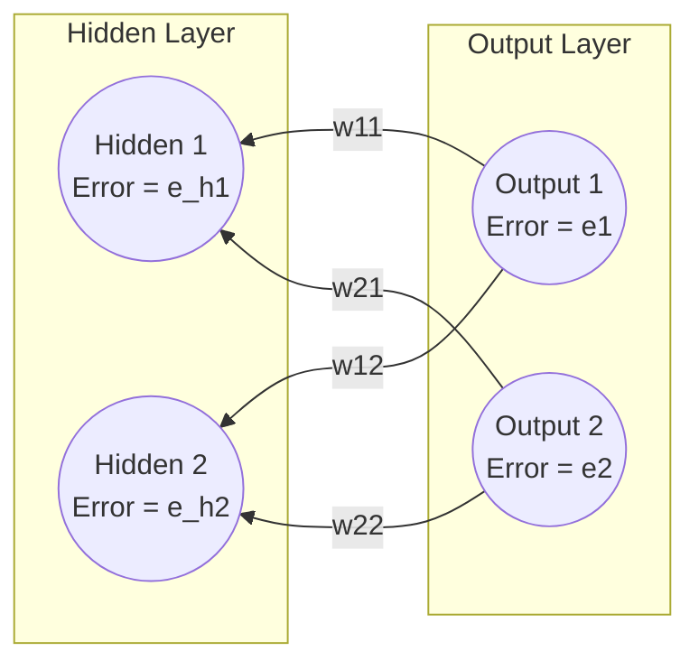
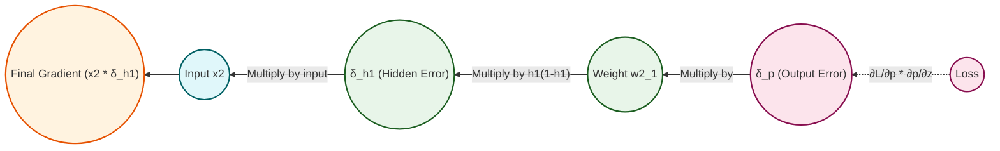
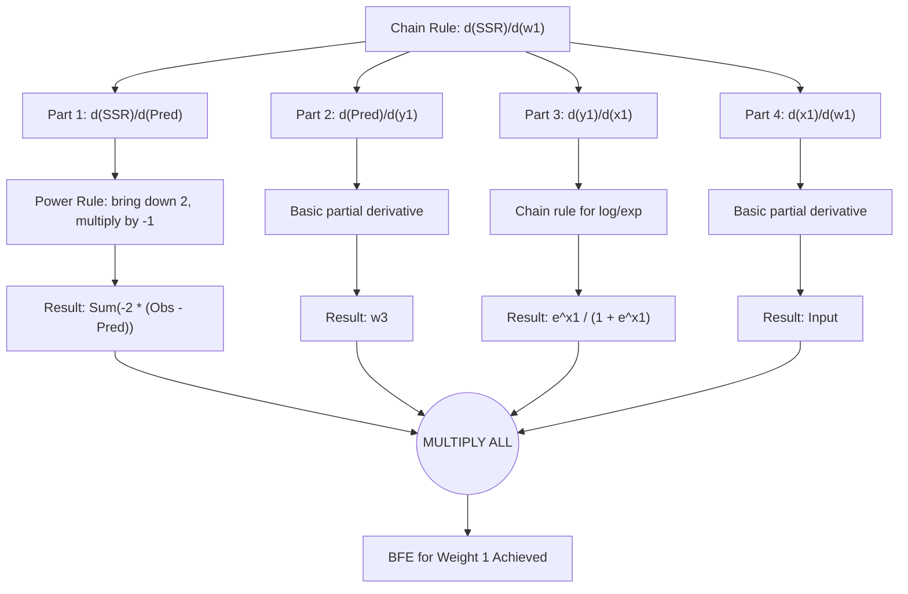
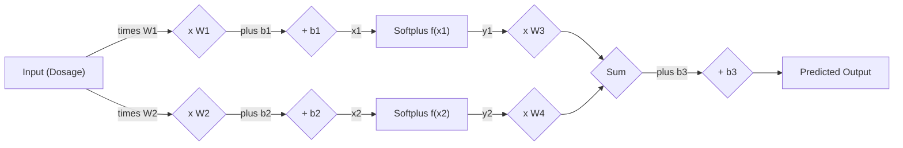

# 8. Backpropagating to the Hidden Layer

> [!info] Context and Prerequisites
> This note builds upon the output layer backpropagation derived in Note 7. In Note 7, we calculated the derivatives of the Error (Sum of Squared Residuals) with respect to the output layer parameters: Weight 3, Weight 4, and Bias 3. Because these parameters do not change during the derivation of the inner layers, we can simply plug those existing derivatives into our Gradient Descent algorithm.
> **Our goal now is to look deeper into the network and optimize the hidden layer parameters: Weight 1, Bias 1, Weight 2, and Bias 2.**

## 8.1 The Dilemma: Hidden Nodes Have No Target

So far, we have looked at the output error and used it to adjust the weights immediately touching the output node. But what about the weights *before* the hidden nodes? To adjust those deeper weights, we need to know the error of the hidden nodes themselves!

We calculated the output error simply because we had a target answer from our dataset. But the dataset does not tell us what the hidden nodes *should* have outputted. We have no target answer for the hidden layer!

### The Solution: Backpropagation

To find the error of a hidden node, we literally push the output error backward across the weights. The error of a hidden node is defined as the exact amount of the output's error that the hidden node was deemed "responsible" for.

In the previous note, we determined that Hidden Node 1 was responsible for 67% of the output error. Therefore, the "Error of Hidden Node 1" ($e_{h1}$) is simply that chunk of the output error!

### Step-by-Step Forward Pass Breakdown

To understand how to backpropagate the error, we must first deeply understand the forward propagation (how data moves from input to output).

1. **The Top Node (Blue Curve):**
   - The Input is multiplied by **Weight 1**.
   - We add **Bias 1**.
   - This results in an x-axis coordinate: $x_1 = (\text{Input} \times w_1) + b_1$.
   - $x_1$ is passed through the Activation Function (Softplus) to get a y-axis coordinate: $y_1 = \log(1 + e^{x_1})$.
   - Finally, $y_1$ is multiplied by **Weight 3** to form the "Blue Curve".

2. **The Bottom Node (Orange Curve):**
   - The Input is multiplied by **Weight 2**.
   - We add **Bias 2**.
   - This results in an x-axis coordinate: $x_2 = (\text{Input} \times w_2) + b_2$.
   - $x_2$ is passed through the Activation Function to get a y-axis coordinate: $y_2 = \log(1 + e^{x_2})$.
   - Finally, $y_2$ is multiplied by **Weight 4** to form the "Orange Curve".

3. **The Final Output:**
   - The Blue Curve and Orange Curve are summed together.
   - **Bias 3** is added to shift the entire combined curve up or down.
   - The result is the final Predicted value (the Green Squiggle).

$$ \text{Predicted} = (y_1 \times w_3) + (y_2 \times w_4) + b_3 $$

$$ e_{h1} = \left( \frac{w_1}{w_1 + w_2} \right) \times \text{Error}_{\text{output}} $$

Once $e_{h1}$ is calculated, Hidden Node 1 acts just like an output node for the layer behind it. We repeat the exact same process going further and further back, chaining the errors together.

---

## 8.2 Handling Multiple Output Nodes

The most complex scenario is calculating the hidden error when a hidden node is connected to **multiple** output nodes.

> [!warning] A Common Point of Confusion — Residuals
> A "Residual" is simply the difference between the actual observed data point and the prediction our neural network made. Residual = $(\text{Observed} - \text{Predicted})$. Do not confuse residuals (the individual errors) with the total error (SSR). Each residual tells us about one data point; the SSR aggregates them all.

Let's assume an architecture with 2 Hidden Nodes and 2 Output Nodes.

### Matrix Notation for Weights

Notice the notation on the weights: $w_{ij}$. In standard matrix notation for neural networks, $i$ represents the destination node (output index), and $j$ represents the source node (hidden index).
- $w_{11}$: connects Hidden 1 to Output 1.
- $w_{12}$: connects Hidden 2 to Output 1.
- $w_{21}$: connects Hidden 1 to Output 2.
- $w_{22}$: connects Hidden 2 to Output 2.

### The Calculation

Hidden Node 1 ($H_1$) connects to both $O_1$ and $O_2$, so $H_1$ contributed to the error at $O_1$ **AND** $O_2$. To find the total error for $H_1$, we sum its proportional blame from *every output node it touches*.

**Part A: Blame from Output 1 ($e_1$)**

$$ \text{Blame from } O_1 = \left( \frac{w_{11}}{w_{11} + w_{12}} \right) \times e_1 $$

**Part B: Blame from Output 2 ($e_2$)**

$$ \text{Blame from } O_2 = \left( \frac{w_{21}}{w_{21} + w_{22}} \right) \times e_2 $$

**Total Error for Hidden Node 1 ($e_{h1}$):**

$$ e_{h1} = \left( \frac{w_{11}}{w_{11} + w_{12}} \right) e_1 + \left( \frac{w_{21}}{w_{21} + w_{22}} \right) e_2 $$

**Total Error for Hidden Node 2 ($e_{h2}$):**

$$ e_{h2} = \left( \frac{w_{12}}{w_{11} + w_{12}} \right) e_1 + \left( \frac{w_{22}}{w_{21} + w_{22}} \right) e_2 $$

> **The Denominator Trap:** Look very closely at the denominator for $e_{h1}$: $(w_{11} + w_{12})$. Students often mistakenly think they should divide by the sum of weights *leaving* $H_1$ (which would be $w_{11} + w_{21}$). **This is strictly incorrect.** We are trying to distribute the error *of the output node*. Therefore, we must normalize using the sum of the weights *entering that specific output node*.

> **Intuition vs. Calculus:** The formulas above are brilliant for understanding the *intuition* of backpropagation (distributing blame proportionally). However, when you study the pure calculus, the denominators disappear! In rigorous math, the derivative simplifies to just: $e_{h1} = (w_{11} \cdot e_1) + (w_{21} \cdot e_2)$. Why? Because the mathematical goal of gradient descent doesn't require us to distribute exactly 100% of the error perfectly; it just requires a vector pointing in the right direction. The scaling provided by the denominator is practically absorbed by the **Learning Rate** hyperparameter. Do not let this confuse you: the proportional logic taught here is entirely correct for understanding *why* the matrix dot product works!

---

## 8.3 The Chain Rule for Hidden Layer Weights (2-Input Network)

### Why Do We Need the Derivative of SSR?

Gradient Descent relies on knowing the slope (derivative) of the Loss Function with respect to every single parameter ($w_1, b_1, w_2, b_2, w_3, w_4, b_3$). The derivative tells us two critical pieces of information:

1. **Direction:** Should we increase or decrease the parameter to make the SSR smaller?
2. **Magnitude:** How steeply is the error changing? (This dictates how big of a step we take).

To find out how a change in a hidden layer parameter (like $w_1$) affects the final SSR, we must trace the mathematical relationship backwards from the SSR all the way to $w_1$. Because $w_1$ is buried inside multiple functions (linear equation → activation function → output equation → loss function), we absolutely must use **The Chain Rule** of calculus.

### The Goal

We want to find the gradient for a weight deep in the network. Specifically, the weight connecting input $x_2$ to hidden node $h_1$: $w^{(1)}_{21}$.

$$\frac{\partial L_i}{\partial w^{(1)}_{21}}$$

### Tracing the Path Backward

If we wiggle $w^{(1)}_{21}$, it causes a long ripple effect:
1. $w^{(1)}_{21}$ changes $z_1^{(1)}$.
2. $z_1^{(1)}$ changes $h_1$.
3. $h_1$ changes $z^{(2)}$.
4. $z^{(2)}$ changes $\hat{p}_i$.
5. $\hat{p}_i$ changes $L_i$.

Using the Chain Rule, we get a 5-term multiplication:

$$\frac{\partial L_i}{\partial w^{(1)}_{21}} = \left[ \frac{\partial L_i}{\partial \hat{p}_i} \cdot \frac{\partial \hat{p}_i}{\partial z^{(2)}} \right] \cdot \frac{\partial z^{(2)}}{\partial h_1} \cdot \frac{\partial h_1}{\partial z_1^{(1)}} \cdot \frac{\partial z_1^{(1)}}{\partial w^{(1)}_{21}}$$

> **Pro-Tip: Reusing Caches:** The first two terms in the bracket we **already calculated** when we derived the output layer gradient! $\frac{\partial L_i}{\partial \hat{p}_i} \cdot \frac{\partial \hat{p}_i}{\partial z^{(2)}} = \delta_{\hat{p}_i}$. This is why it's called Backpropagation — we compute the error at the end, save it, and pass it backward.

### Solving the Remaining Three Terms

**Step 1:** Derivative of $z^{(2)}$ w.r.t. $h_1$: Recall $z^{(2)} = w^{(2)}_1 h_1 + w^{(2)}_2 h_2 + b^{(2)}$. The derivative with respect to $h_1$ is just the weight:

$$\frac{\partial z^{(2)}}{\partial h_1} = w^{(2)}_1$$

**Step 2:** Derivative of $h_1$ w.r.t. $z_1^{(1)}$: Recall $h_1 = \sigma(z_1^{(1)})$. Using our Sigmoid rule:

$$\frac{\partial h_1}{\partial z_1^{(1)}} = h_1(1 - h_1)$$

**Step 3:** Derivative of $z_1^{(1)}$ w.r.t. $w^{(1)}_{21}$: Recall $z_1^{(1)} = w^{(1)}_{11}x_1 + w^{(1)}_{21}x_2 + b^{(1)}_1$. The derivative is the input feature attached to it:

$$\frac{\partial z_1^{(1)}}{\partial w^{(1)}_{21}} = x_2$$

### Combining All Five Terms

$$\frac{\partial L_i}{\partial w^{(1)}_{21}} = \delta_{\hat{p}_i} \cdot w^{(2)}_1 \cdot h_1(1 - h_1) \cdot x_2$$

Rearranging:

$$\frac{\partial L_i}{\partial w^{(1)}_{21}} = x_2 \cdot \left[ h_1(1 - h_1) \cdot w^{(2)}_1 \cdot \delta_{\hat{p}_i} \right]$$

---

## 8.4 The Hidden Layer Delta ($\delta_{h_1}$)

Just like we did for the output layer, we encapsulate all the error coming backwards into this specific node as a new Delta term:

$$\delta_{h_1} = h_1(1 - h_1) \cdot w^{(2)}_1 \cdot \delta_{\hat{p}_i}$$

*Intuition for Hidden Delta:* The error at the hidden node is equal to the error from the layer above ($\delta_{\hat{p}_i}$), scaled by the weight connecting them ($w^{(2)}_1$), and squished by the derivative of the node's own activation function ($h_1(1 - h_1)$).

Our final gradient for the hidden weight is:

$$\frac{\partial L_i}{\partial w^{(1)}_{21}} = x_2 \cdot \delta_{h_1}$$

This confirms the universal pattern: **gradient = (activation FROM) × (delta TO)**.

---

## 8.5 The Big Fancy Equations (StatQuest — Softplus Network)

> [!info] Naming Convention — "Big Fancy Equation" (BFE)
> The StatQuest series refers to the fully expanded Chain Rule derivative formulas as **Big Fancy Equations (BFEs)**. This naming convention helps distinguish the final, plug-in-the-numbers formula from the intermediate derivation steps. Each hidden layer parameter has its own BFE.

### Deriving Weight 1 ($w_1$)

> [!info] Goal
> We need to calculate $\frac{\partial \text{SSR}}{\partial w_1}$. Read this as: "How much does the Sum of Squared Residuals change when we make a tiny change to Weight 1?"

To get to $w_1$, we have to unpeel the mathematical onion layer by layer using the Chain Rule.

$$ \frac{\partial \text{SSR}}{\partial w_1} = \frac{\partial \text{SSR}}{\partial \text{Predicted}} \times \frac{\partial \text{Predicted}}{\partial y_1} \times \frac{\partial y_1}{\partial x_1} \times \frac{\partial x_1}{\partial w_1} $$

Let us calculate each of these four terms strictly and rigorously, specifying the calculus rule used for each.

**Term 1: Derivative of SSR with respect to Predicted**
- *Equation:* $\text{SSR} = \sum (\text{Observed} - \text{Predicted})^2$
- *Rule:* **Power Rule** and **Chain Rule**.
- *Derivation:* Bring the 2 down to the front. The derivative of the inside $(-\text{Predicted})$ is $-1$. Multiply them together.
- *Result:* $\frac{\partial \text{SSR}}{\partial \text{Predicted}} = \sum -2 \times (\text{Observed} - \text{Predicted})$

**Term 2: Derivative of Predicted with respect to $y_1$**
- *Equation:* $\text{Predicted} = (y_1 \times w_3) + (y_2 \times w_4) + b_3$
- *Rule:* **Basic partial derivative.** We treat everything that is *not* $y_1$ as a constant.
- *Derivation:* The terms $(y_2 \times w_4)$ and $b_3$ become $0$. The derivative of $(y_1 \times w_3)$ with respect to $y_1$ is just $w_3$.
- *Result:* $\frac{\partial \text{Predicted}}{\partial y_1} = w_3$

**Term 3: Derivative of $y_1$ with respect to $x_1$ (The Softplus Derivative)**
- *Equation:* $y_1 = \log(1 + e^{x_1})$
- *Rule:* **Chain rule for natural logarithms and exponentials.**
- *Derivation Breakdown:*
  - Let the inside function be $z = 1 + e^{x_1}$.
  - The derivative of the outside function $\log(z)$ is $\frac{1}{z}$. So, $\frac{1}{1 + e^{x_1}}$.
  - The derivative of the inside function $z$ with respect to $x_1$ is $e^{x_1}$ (since the derivative of $1$ is $0$, and the derivative of $e^{x_1}$ is $e^{x_1}$).
  - Multiply the outside by the inside.
- *Result:* $\frac{\partial y_1}{\partial x_1} = \frac{e^{x_1}}{1 + e^{x_1}}$

**Term 4: Derivative of $x_1$ with respect to $w_1$**
- *Equation:* $x_1 = (\text{Input} \times w_1) + b_1$
- *Rule:* **Basic partial derivative.**
- *Derivation:* $b_1$ is a constant, so it becomes $0$. The derivative of $(\text{Input} \times w_1)$ with respect to $w_1$ is simply the Input.
- *Result:* $\frac{\partial x_1}{\partial w_1} = \text{Input}$

**The Big Fancy Equation (BFE) for Weight 1:**

$$ \frac{\partial \text{SSR}}{\partial w_1} = \sum_{i=1}^{n} \left[ -2 (\text{Observed}_i - \text{Predicted}_i) \times w_3 \times \left( \frac{e^{x_{1,i}}}{1 + e^{x_{1,i}}} \right) \times \text{Input}_i \right] $$

### Deriving Bias 1 ($b_1$)

The brilliant thing about the Chain Rule is that much of the path is identical to the path for Weight 1. The first three terms are exactly the same; only the fourth term differs:

$$ \frac{\partial x_1}{\partial b_1} = 1 $$

- *Equation:* $x_1 = (\text{Input} \times w_1) + b_1$
- *Derivation:* We are deriving with respect to $b_1$. The entire term $(\text{Input} \times w_1)$ is treated as a constant, so it becomes $0$. The derivative of $b_1$ is $1$.

**The BFE for Bias 1:**

$$ \frac{\partial \text{SSR}}{\partial b_1} = \sum_{i=1}^{n} \left[ -2 (\text{Observed}_i - \text{Predicted}_i) \times w_3 \times \left( \frac{e^{x_{1,i}}}{1 + e^{x_{1,i}}} \right) \times 1 \right] $$

### Deriving Weight 2 and Bias 2

> [!tip] Symmetry in Neural Networks
> Because the bottom node (Node 2) has the exact same mathematical structure as the top node (Node 1), we do not need to completely re-derive the calculus from scratch. We simply swap the specific parameters. The path goes through $x_2$, $y_2$, and $w_4$.

**The BFE for Weight 2:**

$$ \frac{\partial \text{SSR}}{\partial w_2} = \sum_{i=1}^{n} \left[ -2 (\text{Observed}_i - \text{Predicted}_i) \times w_4 \times \left( \frac{e^{x_{2,i}}}{1 + e^{x_{2,i}}} \right) \times \text{Input}_i \right] $$

**The BFE for Bias 2:**

$$ \frac{\partial \text{SSR}}{\partial b_2} = \sum_{i=1}^{n} \left[ -2 (\text{Observed}_i - \text{Predicted}_i) \times w_4 \times \left( \frac{e^{x_{2,i}}}{1 + e^{x_{2,i}}} \right) \times 1 \right] $$

---

## 8.6 Numerical Example: Calculating a Hidden Layer Derivative

To solve our Big Fancy Equations (BFEs), we must pass the data through the network to generate the necessary variables.

Using the StatQuest drug dosage network with Input = 0.5 and Observed = 1.0:

**1. Calculate Predicted Values:**
- $x_1 = (0.5 \times 2.74) + 0.00 = 1.37$
- $y_1 = \log(1 + e^{1.37}) \approx 1.60$ (Passed into top node)
- $x_2 = (0.5 \times -1.13) + 0.00 = -0.565$
- $y_2 = \log(1 + e^{-0.565}) \approx 0.45$ (Passed into bottom node)
- $\text{Predicted} = (1.60 \times 0.36) + (0.45 \times 0.63) + 0.00 = 0.859$

**2. Plug into the BFE for Weight 1:**
Now we take these specific numbers and place them into the derivative equation we derived above.

$$ \frac{\partial \text{SSR}}{\partial w_1} = -2 (1.0 - 0.859) \times 0.36 \times \left( \frac{e^{1.37}}{1 + e^{1.37}} \right) \times 0.5 $$

By doing the math, this might yield a derivative of approximately `0.76` (summed across all data points).

*(Note: In reality, you sum this equation across ALL data points, not just one. The video shows this conceptual step resulting in a final summed derivative of 0.76).*

---

## 8.7 Derivation Summary Flow

### The Complete Computational Graph

Here is the full computational graph showing how data flows forward through the network, which is essential context for understanding the backward chain rule derivations:

