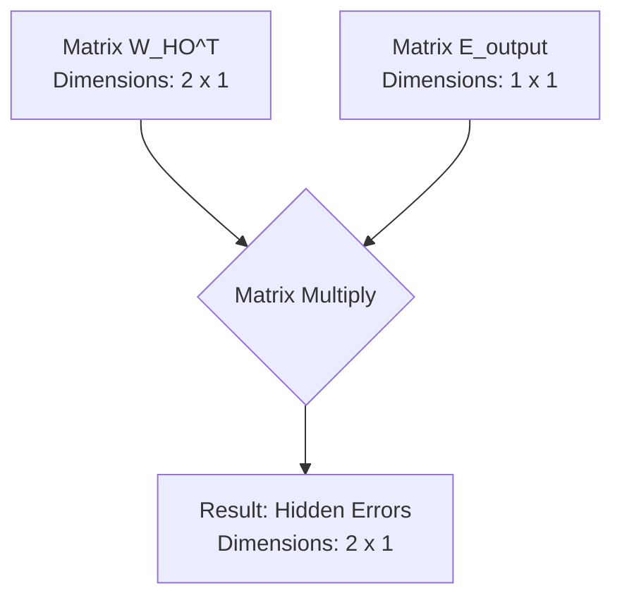
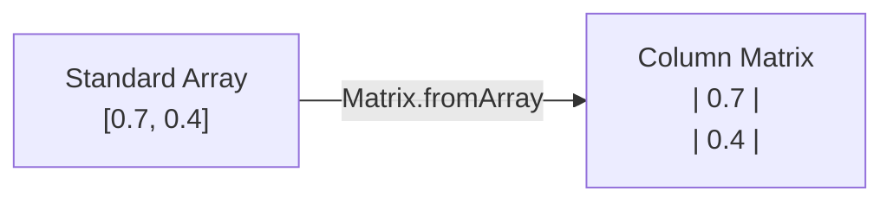
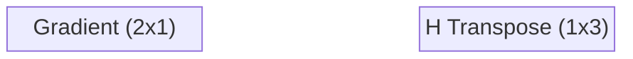

# 9. Matrix Implementation and the Delta Weight Formula

## 9.1 Why Matrices?

In code, we do not calculate weights one by one using loops; that would be computationally disastrous. Instead, all inputs, weights, and errors are stored in **Matrices**. You must understand how to perform dot products and matrix transpositions to implement backpropagation efficiently.

The simplified formula for backpropagating error in matrix form is:

$$ \text{Error}_{hidden} = W_{hidden\_to\_output}^T \cdot \text{Error}_{output} $$

We don't worry about the lack of normalization here, because later in the process, the **Learning Rate** will scale these numbers down to microscopic levels anyway.

---

## 9.2 Matrix Subtraction (Static Method Implementation)

When building a custom linear algebra library from scratch, you will often find you are missing basic utility functions. To calculate $Error = Target - Output$, we need to subtract two matrices.

### Static vs. Instance Methods — Detailed Comparison

This is a critical programming concept that students often miss:

| Aspect | Instance Method | Static Method |
|--------|----------------|---------------|
| **Syntax** | `matrixA.add(matrixB)` | `Matrix.subtract(matrixA, matrixB)` |
| **Effect** | Modifies `matrixA` *in place* | Leaves both matrices untouched |
| **Return** | Returns reference to modified `matrixA` | Returns a **brand new** Matrix |
| **Use Case** | When you want to update existing data | When you need to preserve original data |

For error calculation, we *must* use a Static Method because we do not want to destroy our original Target or Output matrices — we might need them later!

### Code Implementation

Here is the rigorous, step-by-step implementation of matrix subtraction:

```javascript
class Matrix {
    // ... other methods ...

    static subtract(a, b) {
        // Step 1: Create a new blank matrix with the exact same dimensions
        let result = new Matrix(a.rows, a.cols);
        
        // Step 2: Loop through every row
        for (let i = 0; i < result.rows; i++) {
            // Step 3: Loop through every column
            for (let j = 0; j < result.cols; j++) {
                // Step 4: Subtract the element in matrix 'b' from matrix 'a'
                result.data[i][j] = a.data[i][j] - b.data[i][j];
            }
        }
        
        // Step 5: Return the brand new matrix
        return result;
    }
}
```

> [!danger] Crucial Error Check Missing!
> In the video, the instructor skips error checking for brevity, but notes that he *should* do it. **Important Reminder:** Matrix subtraction is only mathematically valid if Matrix A and Matrix B have the **exact same dimensions**. You cannot subtract a $3 \times 1$ matrix from a $2 \times 1$ matrix. A robust library would include a check at the top:
> `if (a.rows !== b.rows || a.cols !== b.cols) { throw new Error("Columns and Rows must match!"); }`

---

## 9.3 Matrix Transposition

### What Is Transposition?

Matrix Transposition is a fundamental operation in linear algebra, denoted by a superscript $T$ (e.g., $W^T$). Transposing a matrix simply means flipping it over its main diagonal — the rows become columns, and the columns become rows.

```mermaid
graph TD
    subgraph Original Matrix 2x3
        A["| W11  W12  W13 |<br>| W21  W22  W23 |"]
    end
    
    subgraph Transposed Matrix 3x2
        B["| W11  W21 |<br>| W12  W22 |<br>| W13  W23 |"]
    end
    
    Original Matrix 2x3 -->|Transpose Operation| Transposed Matrix 3x2
```

### Why Do We Care About Transposition? — Forward vs. Backward Data Flow

In feedforward, data flows *forward* through the network. We multiply our inputs by our weights to get outputs.

In backpropagation, we need data (the errors) to flow *backward* through the exact same network. To reverse a matrix multiplication operation geometrically and calculate proportional blame, we must use the Transpose of the weight matrix.

**The intuition:** Think of the weight matrix as a one-way street connecting hidden nodes to output nodes. In the forward pass, traffic flows from hidden → output. In the backward pass, we need traffic to flow from output → hidden. The transpose is what "reverses the direction" of the matrix so the math works in the opposite direction.

### Code Implementation

```javascript
static transpose(matrix) {
    // Notice the arguments are flipped: matrix.cols becomes rows, matrix.rows becomes cols
    let result = new Matrix(matrix.cols, matrix.rows);
    
    for (let i = 0; i < matrix.rows; i++) {
        for (let j = 0; j < matrix.cols; j++) {
            // The mapping is inverted: [j][i] gets [i][j]
            result.data[j][i] = matrix.data[i][j];
        }
    }
    return result;
}
```

---

## 9.4 The Dimensionality Puzzle — Why Transpose Is Required

This is the single most confusing concept for students learning backpropagation math. *Why do we transpose the matrix instead of just multiplying them normally?*

**Rule:** You can only multiply Matrix $A$ and Matrix $B$ if the *Columns of A match the Rows of B*.

Let's look at a network with **2 Hidden Nodes** and **1 Output Node**.

### Scenario A: Without Transpose (Guaranteed to Fail)

1. $W_{HO}$ (Hidden to Output Weights): Since there is 1 output node receiving data from 2 hidden nodes, this matrix is $1 \times 2$.
2. $E_{output}$ (Output Errors): Since there is 1 output node, this is a $1 \times 1$ matrix.

Can we multiply a $(1 \times 2)$ matrix by a $(1 \times 1)$ matrix? **No.** The inner dimensions (2 and 1) do not match. The math will literally crash your program.

### Scenario B: With Transpose (Perfect Harmony)

1. **Transpose $W_{HO}$:** We turn the $1 \times 2$ matrix into a $2 \times 1$ matrix.
2. $E_{output}$: Remains a $1 \times 1$ matrix.

Can we multiply a $(2 \times 1)$ matrix by a $(1 \times 1)$ matrix? **Yes!** The inner dimensions (1 and 1) match perfectly.



**The Beauty of the Result:** The resulting matrix dimension is $2 \times 1$ — exactly 2 rows and 1 column. This is perfect, because we have exactly **2 hidden nodes**, and each node now has its very own error calculated and stored in this resulting matrix! The math naturally self-organizes the data perfectly, *but only if you transpose the weight matrix first*.

---

## 9.5 Backpropagating the Error — Code Implementation

### Common Pitfall: What Does `feedforward` Return?

Students often forget the data types being passed around in custom neural network libraries. In this specific implementation, the user passes in standard JavaScript `Arrays` (e.g., `[1, 0]`). However, internally, neural networks rely on **Linear Algebra**.

In the instructor's architecture, the `feedforward` function processes the data using internal `Matrix` objects, but it ends with:
`return output.toArray();`

**Reminder:** At this stage, `outputs` is a standard 1-Dimensional Array, *not* a Matrix object. We must deal with this data type conversion to perform our error calculations:

```javascript
// Convert arrays to Matrix objects
outputs = Matrix.fromArray(outputs);
targets = Matrix.fromArray(targets);
```

The conversion is visualized below:



### The Training Function Setup

When constructing a Neural Network class, we require a dedicated `train(inputs, targets)` method.
* **`inputs`**: The raw data being fed into the network.
* **`targets`**: The known, correct answers (labels) we want the network to eventually produce.

```javascript
train(inputs, targets) {
    // Step 1: Generate the neural network's guess
    let outputs = this.feedforward(inputs);
    
    // Step 2: Convert arrays to Matrix objects
    outputs = Matrix.fromArray(outputs);
    targets = Matrix.fromArray(targets);
    
    // Step 3: Calculate the error
    let output_errors = Matrix.subtract(targets, outputs);
    
    // Future steps will go here...
}
```

> [!tip] Naming Conventions
> The instructor uses names like `weights_ho_t` (or `who_t`): `h` = hidden, `o` = output, `_t` = transposed. Adopting strict naming conventions like this will save you hours of debugging when you have multiple layers.

We use the static methods to grab the transposed weights and perform matrix multiplication:

```javascript
// Step 1: Get the transpose of the hidden-to-output weights
let weights_ho_t = Matrix.transpose(this.weights_ho);

// Step 2: Multiply the transposed weights by the output layer's errors
let hidden_errors = Matrix.multiply(weights_ho_t, output_errors);
```

---

## 9.6 The Delta Weight Formula

The ultimate goal of the backpropagation step is to calculate the matrix $\Delta W$. This matrix contains the exact amount every single weight in a given layer needs to be adjusted by to reduce the total error.

The resulting formula for calculating the change in weights for a layer is:

$$ \Delta W = \text{learning\_rate} \times \left( E \circ S'(Y) \right) \cdot X^T $$

Let's break down every single component:

### Component Breakdown

**1. $\text{learning\_rate}$ (Scalar)**
A standard floating-point number (e.g., $0.1$). It scales down the entire matrix operation so the network doesn't overcorrect.

**2. $E$ (The Error Vector)**
A single-column matrix containing the error for the current layer we are calculating.

**3. $S'(Y)$ (The Derivative of the Activation Function)**
The derivative of the Sigmoid function $S(x)$ at the current output point:

$$ S'(x) = S(x) \times (1 - S(x)) $$

Since $Y$ is *already* the result of the sigmoid function, we simply apply: $Y \circ (1 - Y)$.

**4. The Hadamard Product ($\circ$)**

> [!warning] Element-wise vs. Matrix Multiplication
> Look closely at the formula: $E \circ S'(Y)$. The $\circ$ symbol represents the **Hadamard Product** (Element-wise multiplication). You are NOT doing a matrix dot product here. You are taking the Error of Node 1 and multiplying it by the Derivative of Node 1. Error of Node 2 times Derivative of Node 2. The result is a new single-column vector. This resultant vector is called the **Gradient**.
>
> Mixing up Hadamard product with matrix dot product is one of the most common bugs in neural network code. Always check: if you see $\circ$, it's element-wise. If you see $\cdot$, it's a dot product.

**5. $X^T$ (The Transposed Input Matrix)**
Once we have our Gradient vector, we must multiply it by the inputs that fed into this layer. We must **Transpose** the input matrix, turning our $3 \times 1$ column into a $1 \times 3$ row. Now, a $(2 \times 1) \cdot (1 \times 3)$ multiplication results in a $2 \times 3$ matrix — exactly the same shape as the original Weight Matrix we are trying to update!

---

## 9.7 Calculating Hidden-to-Output Weight Deltas

Applying the universal Delta Weight formula to the weights connecting the Hidden Layer to the Output Layer ($W_{ho}$):

$$ \Delta W_{ho} = lr \times \left( E_o \circ (O \circ (1 - O)) \right) \cdot H^T $$

Where:
- $E_o$: Output Error (Target - Output)
- $O$: Final output guess (after sigmoid activation)
- $H$: Values from the hidden layer (which act as the "inputs" to the output layer)
- $lr$: Learning Rate

### Visualizing the Matrix Math (3 hidden nodes, 2 output nodes)

1. **Calculate the Gradient:** Element-wise multiply the Error ($2 \times 1$) by the derivative of the outputs ($2 \times 1$). Multiply by the scalar learning rate. Result: Gradient vector ($2 \times 1$).
2. **Transpose the Input:** $H$ originally a $3 \times 1$ column vector, transposed to $1 \times 3$ row vector.
3. **The Matrix Dot Product:**



$$\begin{bmatrix} g_1 \\ g_2 \end{bmatrix} \cdot \begin{bmatrix} h_1 & h_2 & h_3 \end{bmatrix} = \begin{bmatrix} \Delta w_{11} & \Delta w_{12} & \Delta w_{13} \\ \Delta w_{21} & \Delta w_{22} & \Delta w_{23} \end{bmatrix}$$

The result is a $2 \times 3$ matrix — our $\Delta W_{ho}$.

> [!tip] The Beauty of the Result
> Look at the resulting matrix dimension: **$2 \times 3$**. This is exactly 2 rows and 3 columns. This is perfect, because we have exactly **2 output nodes** and **3 hidden nodes**, and each weight connection now has its very own delta calculated and stored in this resulting matrix! The math naturally self-organizes the data perfectly, *but only if you transpose the input matrix first*.

### The Final Update Step

$$ W_{ho(new)} = W_{ho(old)} + \Delta W_{ho} $$

### Updating the Bias

$$ \Delta B_o = lr \times \left( E_o \circ (O \circ (1 - O)) \right) $$
$$ B_{o(new)} = B_{o(old)} + \Delta B_o $$

---

## 9.8 Calculating Input-to-Hidden Weight Deltas

Once the Hidden-to-Output weights are updated, the algorithm steps backwards to update the Input-to-Hidden weights ($W_{ih}$). The process is exactly the same, but we swap the variables.

$$ \Delta W_{ih} = lr \times \left( E_h \circ (H \circ (1 - H)) \right) \cdot I^T $$

Where:
- $E_h$: Hidden Error (calculated by passing output errors backwards through the transposed weight matrix: $E_h = W_{ho}^T \cdot E_o$)
- $H$: Values from the hidden layer (the "outputs" of this specific section)
- $I$: The raw inputs to the network
- $lr$: Learning Rate

### Execution Steps

1. **Calculate the Hidden Gradient:** $H \circ (1 - H)$, then multiply element-wise by $E_h$, then scale by $lr$.
2. **Transpose the Inputs:** $I^T$.
3. **Multiply:** Perform the matrix dot product of the Hidden Gradient and $I^T$. This generates the $\Delta W_{ih}$ matrix.
4. **Update Weights:** $W_{ih(new)} = W_{ih(old)} + \Delta W_{ih}$
5. **Update Hidden Bias:** $\Delta B_h = lr \times \left( E_h \circ (H \circ (1 - H)) \right)$, then $B_{h(new)} = B_{h(old)} + \Delta B_h$

---

## 9.9 Summary of the Epoch

Once you have executed these steps for the Hidden layer and the Output layer, the network has successfully learned from one piece of training data. Doing this repeatedly across the entire training dataset over multiple iterations (epochs) allows the Gradient Descent algorithm to slowly navigate the multi-dimensional error space until the network becomes highly accurate.

### What Happens in a Complete Epoch?

1. **Forward Pass:** Use the current parameters ($W_{ih}, B_h, W_{ho}, B_o$) to calculate the $Predicted$ values for all data points.
2. **Calculate Error:** Compute the output error ($E_o = Target - Output$).
3. **Backward Pass — Output Layer:** Use the Delta Weight formula to calculate the gradient for $W_{ho}$ and $B_o$. Update these parameters.
4. **Backward Pass — Hidden Layer:** Propagate the output error backward through the transposed weight matrix to get hidden errors ($E_h = W_{ho}^T \cdot E_o$). Calculate the gradient for $W_{ih}$ and $B_h$. Update these parameters.
5. **Repeat:** The cycle repeats until convergence (the step sizes become so close to 0 that predictions no longer improve).

### The Complete Training Function Structure

```javascript
train(inputs, targets) {
    // === FORWARD PASS ===
    let outputs = this.feedforward(inputs);
    
    // Convert to matrices
    outputs = Matrix.fromArray(outputs);
    targets = Matrix.fromArray(targets);
    
    // === ERROR CALCULATION ===
    let output_errors = Matrix.subtract(targets, outputs);
    
    // === OUTPUT LAYER WEIGHT UPDATE ===
    // Calculate gradients and deltas for hidden-to-output weights
    // Update W_ho and B_o
    
    // === HIDDEN LAYER ERROR ===
    let weights_ho_t = Matrix.transpose(this.weights_ho);
    let hidden_errors = Matrix.multiply(weights_ho_t, output_errors);
    
    // === HIDDEN LAYER WEIGHT UPDATE ===
    // Calculate gradients and deltas for input-to-hidden weights
    // Update W_ih and B_h
}
```

This function is called repeatedly in a training loop, once for each training example (or batch), across many epochs, until convergence is achieved.
