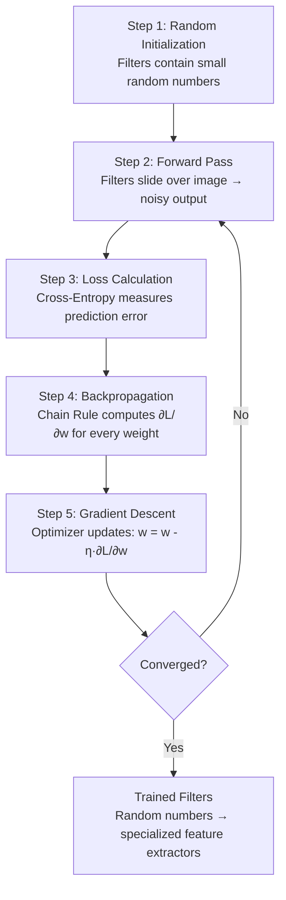
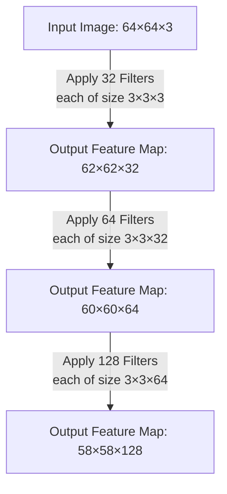

# 1.1 The Bridge: From Basic Convolution to Learned Weights

You already understand the mechanical process of basic convolution from classic image processing: taking a small matrix (a filter or kernel), sliding it across an input image, performing element-wise multiplication at every stop, and summing the results to create an output feature map. In classical computer vision, experts manually crafted these filters. For example, a **Sobel filter** was built with specific hand-picked numbers (e.g., `[-1, 0, 1]` arrays) explicitly to detect vertical or horizontal edges. A **Gaussian blur** filter was designed with a specific bell-curve distribution of values to smooth images. A **Laplacian filter** was constructed to detect regions of rapid intensity change. Every single one of these was a product of human engineering — a domain expert sat down, reasoned about the mathematics of the visual feature they wanted to extract, and hard-coded the numbers.

**The fundamental leap from basic image filtering to Deep Convolutional Neural Networks (CNNs) is this:** In a CNN, we **do not hand-craft the filters**. The numbers inside the matrix are the **learnable weights** of the neural network itself. The network discovers, through iterative mathematical optimization, exactly what values those filters should contain in order to minimize a task-specific error function. This single conceptual shift — from human-designed feature extractors to machine-learned feature extractors — is the engine that powered the computer vision revolution of the 2010s and beyond.

---

### The Flaw of Manual Feature Engineering

Before Deep Learning, if you wanted to detect a cat in a photograph, the process was painstaking and brittle. Experts had to sit down and write algorithms to extract lines, calculate fur textures, and find shapes that looked like ears. They might design a Sobel filter for edges, a Gabor filter for textures, and a Hough transform for geometric shapes, then chain all of these hand-crafted features together into a pipeline that fed a classifier like a Support Vector Machine (SVM). If the lighting changed, or the cat turned around, or the image was slightly rotated, the hand-crafted filters usually failed — because they were designed for a narrow set of visual conditions. Scaling this approach to thousands of object categories was effectively impossible; you would need human experts to engineer custom feature extractors for every single object you ever wanted to detect.

This approach suffered from three crippling weaknesses. First, it was **brittle**: small changes in viewpoint, illumination, or occlusion would cause the carefully engineered features to produce unreliable outputs. Second, it was **non-scalable**: each new visual category required a fresh round of expert engineering. Third, it was **suboptimal**: hand-crafted features were designed based on human intuition about what visual patterns matter, but human intuition is a poor substitute for mathematical optimization across millions of data points.

A CNN bypasses all of these problems completely by *learning its own optimal features* directly from the raw pixel data. Instead of a human deciding what patterns to look for, the network discovers the patterns that are most useful for minimizing prediction error across the training dataset. The features that emerge are often ones that no human would have thought to engineer — complex, multi-scale patterns that are statistically optimal for the task at hand.

> [!important] The Paradigm Shift
> Classical vision: **"Tell me what features to look for, and I will design a filter for each one."**
> Deep Learning: **"Give me data and a loss function, and I will discover the features myself."**

---

### From Fixed to Learned Kernels

To make this transition concrete, consider the direct comparison between the classical and deep learning paradigms:

| Aspect | Classical Vision | Deep Learning (CNNs) |
|---|---|---|
| **Filter Design** | Human expert manually selects every number in the kernel | Network initializes random numbers and learns optimal values through training |
| **Feature Discovery** | You must know in advance what features matter (edges, corners, textures) | The network discovers which features matter by minimizing a loss function |
| **Adaptability** | Fixed once designed — cannot adapt to new data distributions | Continuously adaptive — retraining on new data shifts the filter values |
| **Example Workflow** | You want to detect edges → Apply a pre-defined $3 \times 3$ Sobel filter | You tell the network: "Here is an image. Here are 32 empty $3 \times 3$ filters. Adjust the numbers until you can classify this." |
| **Output** | Filters are static and hand-designed; they detect exactly one thing | The network might learn one filter that acts like an edge detector, another that detects specific color gradients, and another that detects textures — all from the same training process |
| **Scalability** | Each new visual category requires new hand-crafted features | The same training loop scales to any number of categories |

The deep learning approach does not discard the mathematical machinery of convolution — it still slides a small matrix across the image, performs element-wise multiplication, and sums the results. What changes is *who decides what numbers go in the matrix*. In classical vision, a human decides. In a CNN, the optimization algorithm decides.

---

### The Lifecycle of a Learnable Filter

How does a network figure out what numbers belong inside the filter to make it act like an edge-detector or a fur-detector? It uses the same fundamental deep learning loop used by a standard multi-layer perceptron (MLP). Below, each step is explained in full detail, because understanding this loop is the key to understanding how CNNs learn.

#### Step 1: Initialization

The network starts with algorithmically generated, very small random numbers inside its kernel matrices. This is not arbitrary — the initialization strategy matters enormously for training stability and convergence speed. Two common techniques dominate modern practice:

- **Xavier (Glorot) Initialization:** Draws weights from a distribution with variance $\frac{2}{n_{in} + n_{out}}$, where $n_{in}$ is the number of input units and $n_{out}$ is the number of output units. This keeps the variance of activations roughly constant across layers, preventing early layers from producing values that are either vanishingly small or explosively large.
- **Kaiming (He) Initialization:** Draws weights from a distribution with variance $\frac{2}{n_{in}}$. This variant is specifically designed for networks using ReLU activations, which zero out half the values and thus require a compensating factor of 2 in the variance to maintain signal magnitude through the network.

At this point, the filter does absolutely nothing useful. The random numbers bear no resemblance to an edge detector, a texture extractor, or any other meaningful feature. The output they produce when convolved with an input image is essentially structured noise.

#### Step 2: The Forward Pass

These randomly initialized filters slide over the raw input image according to the convolution operation. Because the numbers are random, the initial output feature maps are essentially mathematical noise — there is no meaningful spatial structure in the activations. This noise passes all the way through the network's subsequent layers, through any pooling operations, and ultimately to the classification head (typically a set of fully connected layers followed by a softmax). The classification head inevitably makes a completely random guess — for example, it might predict with 90% confidence that the image is a dog, when the image actually contains a car. This is expected and correct behavior for the first forward pass; the network has not yet learned anything.

#### Step 3: Loss Calculation

The network uses an objective **Loss Function** to measure exactly the magnitude and direction of how incorrect its final prediction was. For classification tasks, the standard choice is **Cross-Entropy Loss** (also called Log Loss), which is defined as:

$$\mathcal{L} = -\sum_{c=1}^{C} y_c \log(\hat{y}_c)$$

where $C$ is the number of classes, $y_c$ is the true label (1 for the correct class, 0 for all others), and $\hat{y}_c$ is the predicted probability for class $c$. Cross-entropy loss is zero when the prediction is perfect and increases without bound as the prediction gets worse. This scalar value — a single number quantifying the total error — is the compass that guides all subsequent learning.

#### Step 4: Backpropagation

Using the **Chain Rule of calculus**, the gradient of the loss is calculated backwards through every layer of the network. This is the most computationally intensive and mathematically sophisticated step. For every single weight in every single filter, the network asks and answers the question: *"If I increase this weight by a tiny fraction $\epsilon$, does my overall classification error go up or down, and by exactly how much?"*

Mathematically, for a filter weight $w_{i,j,d}$ (where $i$ and $j$ are spatial positions and $d$ is the depth index), the network computes:

$$\frac{\partial \mathcal{L}}{\partial w_{i,j,d}}$$

This partial derivative tells us the slope of the loss surface with respect to that specific weight. A positive gradient means increasing the weight will increase the loss (bad), and a negative gradient means increasing the weight will decrease the loss (good). The chain rule allows this gradient to be computed efficiently by propagating error signals backward from the loss, through each layer's activation function, all the way to the individual filter weights.

> [!tip] Why Backpropagation is Revolutionary
> Without the chain rule, computing the gradient for each weight would require a separate perturbation experiment for every single parameter — an astronomically expensive process. The chain rule allows all gradients to be computed in a single backward pass, making training deep networks with millions of parameters computationally feasible.

#### Step 5: Gradient Descent Optimization

The optimizer takes these gradients and slightly adjusts the filter values in the direction that reduces the error. The most fundamental update rule is:

$$W_{new} = W_{old} - \eta \cdot \frac{\partial \mathcal{L}}{\partial W}$$

where $\eta$ is the **learning rate** — a hyperparameter that controls the step size of each update. Set it too large and the updates overshoot minima, causing the loss to oscillate or diverge. Set it too small and training takes impractically long to converge.

Two dominant optimizer families are used in practice:

- **Stochastic Gradient Descent (SGD):** The simplest optimizer. It updates weights using the gradient computed from a single mini-batch, with an optional momentum term that accumulates a velocity vector to smooth out oscillations and accelerate convergence along consistent gradient directions. SGD with momentum is still widely used in production training of large vision models.
- **Adam (Adaptive Moment Estimation):** Maintains per-parameter adaptive learning rates by computing running averages of both the gradients (first moment) and the squared gradients (second moment). Adam converges faster than SGD on many problems and requires less manual learning rate tuning, though the final converged solution may sometimes be slightly worse than well-tuned SGD with momentum.

---

### The Training Loop Visualized

The entire lifecycle forms a closed loop that iterates until convergence:

By iterating this loop millions of times over a large dataset, those completely random initial numbers morph precisely into highly specialized feature extractors. The network mathematically proves to itself that having a specific arrangement of numbers (like an edge detector) minimizes its loss. No human ever explicitly programmed the network to detect edges — the optimization process discovered that edge-like filters are useful for reducing classification error, and it converged on those filter values automatically.

> [!warning] A Common Misconception
> Beginners sometimes assume that the network learns a Sobel filter or a Gabor filter. In reality, the learned filters often resemble these classical filters in early layers (because edges and gradients are universally useful for visual tasks), but they are not identical to them. The network learns *task-specific* features that are optimal for minimizing its particular loss function on its particular dataset. Later layers learn features that have no classical analogue — abstract patterns that combine lower-level features in ways that are meaningful only to the network.

---

### The Dimension of Depth (Channels)

In standard 2D image filtering, you typically deal with grayscale images — flat $X \times Y$ grids. In CNNs, data exists in **volumes**. An RGB image is not just an $X \times Y$ grid; it is $X \times Y \times 3$ (Height $\times$ Width $\times$ Channels). Therefore, a filter in a CNN must also be 3-Dimensional. If you use a $3 \times 3$ filter on an RGB image, the actual filter size is $3 \times 3 \times 3$. It slides across the height and width dimensions, but it always extends through the *full depth* of the input volume. This critical concept is explored in full detail in note [[1.3 Processing 3D Volumes, Depth Summation, and Biases]].

### Multiple Filters Produce Multiple Output Channels

If one 3D filter produces a single 2D output feature map, what happens when we use 32 different filters? We stack their 2D output maps on top of each other along a new channel dimension. The new output becomes a volume with a depth of 32. This volume then becomes the input for the next layer, where each filter will now have a depth of 32 to match. This cascading process is what gives deep CNNs their representational power — each layer builds increasingly abstract feature representations by combining the outputs of the previous layer's filters.

> [!tip] Common Student Trap
> Students often confuse the number of channels in the input image with the number of filters. These are two completely independent quantities. Remember:
> - The **depth of each filter** must mathematically match the **depth of the input volume** (this is a hard constraint — the element-wise multiplication requires matching dimensions).
> - The **number of filters** you choose is a free design decision, and it dictates the **depth of the output volume**.
> - These two numbers are only related in that the *next* layer's filter depth will equal the *current* layer's number of filters (because the current output becomes the next input).

---

### Summary

The transition from classical convolution to learned convolution is the foundational idea of CNNs. Instead of hand-crafting filter coefficients based on human intuition, we initialize them randomly and let an optimization algorithm discover the values that minimize prediction error. This process — initialization, forward pass, loss calculation, backpropagation, and gradient descent — iterates until the filters converge on task-optimal feature extractors. The result is a system that can learn to detect edges, textures, shapes, and complex object parts without any explicit programming of what those features should look like.
