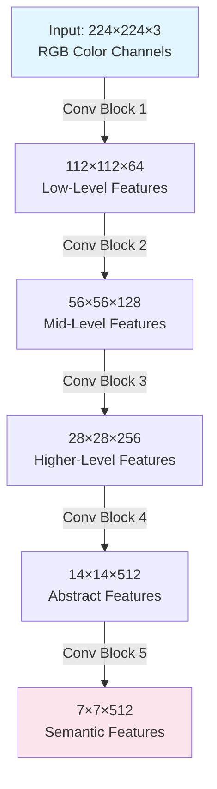

# 1.2 Demystifying Tensors: Volumes, Depth, and Data Formats

A pervasive and massive hurdle for beginners reading PyTorch or TensorFlow code is making implicitly flawed assumptions about data shapes. In Convolutional Neural Networks, we do not pass single 2D images. We pass **Batches** of **Volumes** called **Tensors**. A tensor is simply a generalization of a matrix to an arbitrary number of dimensions — a scalar is a 0D tensor, a vector is a 1D tensor, a matrix is a 2D tensor, and the 4D arrays we use in CNNs are just tensors of rank 4. Understanding tensor shapes — and being able to reason about them fluently — is not optional; it is the single most important practical skill for implementing CNNs.

If you do not strictly visualize and track your tensor dimensions mentally as they move through a CNN, you will inevitably crash your code with shape mismatch errors when you try to transition to a Fully Connected layer, when you attempt to concatenate features from different branches, or when you try to implement skip connections. Every single error message you encounter in deep learning practice will, at its root, be a tensor shape error. Mastering shapes early saves weeks of debugging.

---

### The Problem with 2D Thinking

An RGB image is not just a flat $X \times Y$ grid. It fundamentally has a 3rd dimension: **Color Channels**. Therefore, an RGB image is $Height \times Width \times 3$. Our data is a 3-Dimensional Volume — a stack of three 2D grids (one for Red, one for Green, one for Blue), each containing pixel intensities, all aligned spatially. If you treat an RGB image as a flat 2D array, you lose the critical information that each spatial position has three independent color values, and you make it impossible for the convolution operation to learn features that depend on color relationships (such as distinguishing a ripe red tomato from an unripe green one based on the Red-Green channel ratio).

But the dimensional complexity does not stop at 3D. Modern deep learning frameworks never process one image at a time. This is because **performing thousands of parallel computations at once is what GPUs are designed for**. A GPU contains thousands of cores that can execute identical operations on different data simultaneously — this is the Single Instruction, Multiple Data (SIMD) paradigm. If you feed the GPU one image at a time, you are leaving the vast majority of its computational capacity idle. By grouping multiple images into a **batch**, you give the GPU enough parallel work to fully utilize its hardware, dramatically accelerating training. Thus, we introduce a 4th dimension: **The Batch Size**.

> [!important] Why Batches Exist: GPU Parallelism
> GPUs achieve their massive throughput through parallelism. When you process a batch of 32 images simultaneously, the GPU can load 32 images into memory and perform the same convolution operation on all 32 at once, using its thousands of cores in parallel. This is not a mathematical requirement of the convolution operation itself — it is an engineering optimization that makes training on large datasets feasible. The batch dimension does not mix mathematically during basic convolution; each image in the batch is convolved independently. The only time batch information mixes is during gradient averaging — the gradients computed from each image in the batch are averaged together before updating the weights, which provides a more stable estimate of the true gradient direction.

---

### The 4D Tensor Formats

When inputting data into a CNN, your input is almost exclusively a 4-Dimensional Tensor. The four axes are always the same — Batch Size, Channels, Height, and Width — but depending on the deep learning library you are using, the **ordering** of these four dimensions changes:

1. **NCHW (The PyTorch and CUDA Standard):** `[Batch_Size, Channels, Height, Width]`
2. **NHWC (The TensorFlow Standard):** `[Batch_Size, Height, Width, Channels]`

Both formats contain exactly the same data. The difference is purely one of memory layout convention. However, this convention has profound implications for computational performance and code correctness. Mixing up the format — for example, writing PyTorch code that assumes NHWC ordering — will cause silent bugs where channels are interpreted as spatial dimensions and vice versa, producing completely wrong results without necessarily raising a runtime error.

> [!important] Terminology Reminder
> * **$N$** commonly stands for **Number of samples** (Batch Size). This is the number of images processed simultaneously in one forward/backward pass.
> * **$C$** stands for **Channels** (or Feature Maps / Depth). This is the number of independent 2D grids stacked along the depth axis.
> * **$H$** stands for **Height** — the number of pixel rows in each 2D grid.
> * **$W$** stands for **Width** — the number of pixel columns in each 2D grid.

---

### NCHW vs NHWC: A Detailed Comparison

| Feature | NCHW (PyTorch / CUDA) | NHWC (TensorFlow) |
|---|---|---|
| **Dimension Order** | `[N, C, H, W]` | `[N, H, W, C]` |
| **Channel Location** | Channels are axis 1 (second position) | Channels are axis 3 (last position) |
| **Memory Layout** | Channels are non-contiguous in spatial memory; all channels for one pixel are separated | Channels are contiguous in spatial memory; all channels for one pixel are adjacent |
| **Primary Advantage** | Naturally maps to cuDNN kernel conventions; historically more efficient for GPU convolution algorithms | Better data locality for operations that access all channels at a spatial position (like depthwise convolution); preferred by XLA compiler |
| **Framework** | PyTorch, MXNet, Caffe | TensorFlow, JAX (by default) |
| **Conversion** | `tensor.permute(0, 2, 3, 1)` converts NCHW → NHWC | `tensor.permute(0, 3, 1, 2)` converts NHWC → NCHW |

> [!caution] Format Confusion is the #1 Source of Silent Bugs
> If you ever convert between frameworks or use pre-trained weights from a different library, you **must** verify the tensor format. A model trained in TensorFlow with NHWC format will have its weight tensors stored in a different order than a PyTorch model with NCHW format. Simply copying the weight values without reordering the axes will produce a model that runs without errors but produces garbage predictions.

---

### Detailed Example in PyTorch (NCHW)

If you pass a mini-batch of 32 RGB images, each sized $224 \times 224$ pixels, the mathematical tensor shape entering the very first layer of your CNN is exactly:

```
[32, 3, 224, 224]
```

Let's break down every dimension in detail:

- **Dimension 0 (N=32):** There are 32 distinct images in this batch. Each image is processed completely independently during the forward pass. The batch dimension exists solely for computational efficiency and stable gradient estimation.
- **Dimension 1 (C=3):** Each image has 3 color channels: Red, Green, and Blue. These are the three 2D grids that make up the RGB volume.
- **Dimension 2 (H=224):** Each 2D grid has 224 rows of pixels.
- **Dimension 3 (W=224):** Each 2D grid has 224 columns of pixels.

The total number of individual numerical values stored in this tensor is $32 \times 3 \times 224 \times 224 = 4,816,896$ floating-point numbers. At 32 bits (4 bytes) per float32 value, this tensor occupies approximately 19.3 megabytes of GPU memory — and this is just the input to the very first layer.

**How the CNN processes this in memory:**

The internal operations inside a Convolutional layer will structurally map over the spatial dimensions ($H$ and $W$) — sliding the filter across every valid position. They will deeply iterate through all numbers along the depth axis ($C$) — performing element-wise multiplication across all input channels. And they will execute all of this in parallel, totally independently, for all 32 distinct items inside the batch ($N$). The batch dimension $N$ generally does not mix mathematically during basic convolution; it is purely parallel execution to speed up training gradients. When the backward pass computes gradients, the gradients from all 32 images are averaged together to produce a single gradient estimate for each weight, which is then used to update the model parameters.

---

### Understanding Feature Maps as Channels

As this tensor moves deep into the network, a profound transformation occurs: the $Height$ and $Width$ usually shrink (via pooling or strides — see [[2.3 Strides - Skipping Pixels and Downsampling]]), but the $Channels$ number wildly expands. A typical progression might look like this:

| Layer | Spatial Dimensions | Channels | What the Channels Represent |
|---|---|---|---|
| Input | $224 \times 224$ | 3 | Raw color data: Red, Green, Blue |
| Conv Block 1 | $112 \times 112$ | 64 | Low-level features: edges, gradients, simple textures |
| Conv Block 2 | $56 \times 56$ | 128 | Mid-level features: corners, curves, basic shapes |
| Conv Block 3 | $28 \times 28$ | 256 | Higher-level features: object parts, complex textures |
| Conv Block 4 | $14 \times 14$ | 512 | Abstract features: semantic patterns, object components |
| Conv Block 5 | $7 \times 7$ | 512 | Highly abstract features: full object representations |

Deep inside a network, a channel no longer means "Red, Green, or Blue." Instead, each channel represents a unique **Feature Map** — a 2D grid expressing the spatial locations where one specific feature was detected. One channel might light up (produce high activation values) wherever a diagonal edge is present. Another channel might activate strongly for circular shapes. A deeper channel might respond specifically to the pattern of a dog's ear. The network learns these feature detectors through the training process described in [[1.1 The Bridge - From Basic Convolution to Learned Weights]], and each one becomes an independent channel in the output tensor.

The evolution from 3 channels (RGB) to 64 to 128 to 256 to 512 channels is not arbitrary. Each increase in channel count gives the network more "capacity" to represent diverse features. Early layers need only a few dozen feature detectors because raw pixel patterns are relatively simple (edges, gradients). Deeper layers need hundreds of feature detectors because they must represent increasingly complex and diverse patterns. The spatial resolution decreases at the same time, so the total number of values in the tensor (spatial × channels) remains roughly controlled.



---

### How Tensor Shapes Flow Through Layers

One of the most important practical skills is being able to trace the tensor shape as it flows through the network. Let's trace the shape through a simple two-layer CNN in PyTorch:

```python
import torch
import torch.nn as nn

# Input: batch of 32 RGB images, 64x64 pixels
x = torch.randn(32, 3, 64, 64)  # Shape: [N, C, H, W] = [32, 3, 64, 64]

# First Conv Layer: 32 filters, 3x3 kernel
conv1 = nn.Conv2d(in_channels=3, out_channels=32, kernel_size=3)
x = conv1(x)  # Shape: [32, 32, 62, 62]
# H/W changed: 64 → 62 (no padding, so 64-3+1=62)
# C changed: 3 → 32 (we used 32 filters)

# Second Conv Layer: 64 filters, 3x3 kernel
conv2 = nn.Conv2d(in_channels=32, out_channels=64, kernel_size=3)
x = conv2(x)  # Shape: [32, 64, 60, 60]
# H/W changed: 62 → 60 (62-3+1=60)
# C changed: 32 → 64 (we used 64 filters)
# in_channels=32 must match previous out_channels=32!
```

> [!warning] The #1 Shape Error
> When stacking Conv2d layers, the `in_channels` of the next layer **must exactly equal** the `out_channels` of the previous layer. If you get this wrong, PyTorch will throw a runtime error like:
> ```
> RuntimeError: Expected input channels 32 but got 64
> ```
> This is why mental shape tracking is essential — you should always know the shape of your tensor at every point in the network.

---

### Common Student Traps

> [!tip] Common Student Trap: Input Channels vs. Number of Filters
> Students often confuse the number of channels in the input image with the number of filters. These are two completely different quantities that serve different roles:
> - The **depth of each filter** (i.e., `in_channels`) must match the **depth of the input volume**. This is a hard mathematical constraint — you cannot perform element-wise multiplication between arrays of different sizes.
> - The **number of filters** you choose (i.e., `out_channels`) is a free design decision. It determines how many different features the layer can detect simultaneously, and it becomes the depth of the output volume.
>
> For example, if your input has 64 channels and you apply 128 filters of size 3×3, each filter has shape `[3, 3, 64]` and the total weight tensor has shape `[128, 64, 3, 3]`. The number 64 appears in both the input shape and the filter shape — that is not a coincidence, it is a mathematical requirement. The number 128 appears only in the number of filters and the output shape — that is a design choice.

> [!caution] Another Common Trap: "More Channels = Better"
> Increasing the number of channels increases the network's capacity to learn diverse features, but it also increases memory consumption, computation time, and the risk of overfitting. The channel counts at each layer are hyperparameters that must be tuned based on the complexity of the task, the size of the training dataset, and the available computational budget. Simply doubling all channel counts will not necessarily improve performance — it may just make training slower and cause overfitting on smaller datasets.

---

### Summary

Tensors are the fundamental data structure of deep learning. In CNNs, they are always 4-dimensional: `[N, C, H, W]` in PyTorch or `[N, H, W, C]` in TensorFlow. The batch dimension ($N$) exists for GPU parallelism, the channel dimension ($C$) represents color channels in early layers and feature maps in deeper layers, and the spatial dimensions ($H$, $W$) represent the image grid. As data flows through the network, spatial dimensions typically shrink while the channel count grows, transforming raw pixel data into increasingly abstract feature representations. Always track your tensor shapes mentally — it is the single most important practical skill for implementing CNNs.
