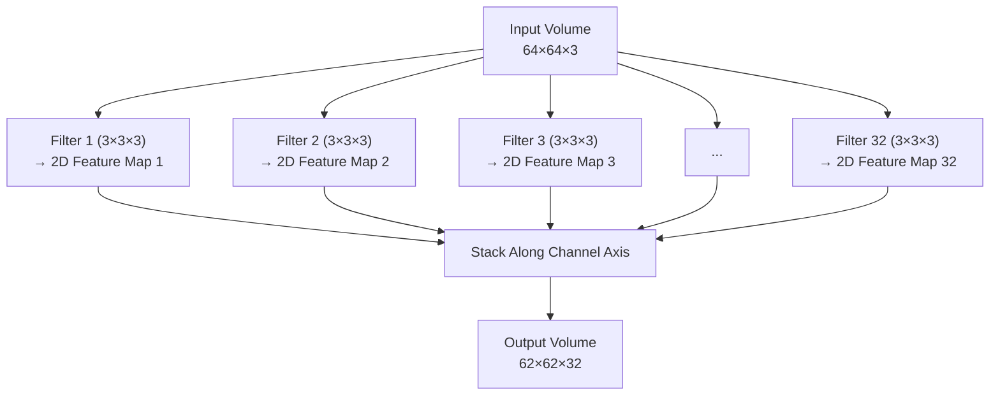

# 1.3 Processing 3D Volumes, Depth Summation, and Biases

Because our input data comes as a 3D volume (for example, $C=3$ for an RGB image), a standard 2D Convolutional neural network filter must structurally adapt. The filter cannot be a flat 2D matrix — it must be a 3D volume itself, extending through the full depth of the input. This requirement is absolute and non-negotiable: every element-wise multiplication in the convolution operation requires the filter and the input patch to have exactly the same shape.

**The Rule:** A filter in a CNN must *always* match the exact channel depth of the input volume it is convolving over.

If an author writes that they are using a "$3 \times 3$ filter" on the first layer over an RGB image, they are using shorthand. The actual, true mathematical shape of that filter tensor is **$3 \times 3 \times 3$** ($Height \times Width \times Input\_Channels$). This shorthand is ubiquitous in the literature, which makes it a common source of confusion for beginners who wonder why their hand calculations never match the framework's output shape. Always remember: the filter is always as deep as the input.

---

### The Depth Summation Process: Step-by-Step

Understanding the transition from an input tensor volume to an output feature map requires grasping exactly how calculations happen in three dimensions. This is the single most important mechanical process to understand in all of CNN theory, and it is where the vast majority of beginners get lost. We will walk through it with agonizing precision.

Let's assume we slide one $3 \times 3 \times 3$ filter over an RGB image of size $64 \times 64 \times 3$:

#### Step 1: The Overlap Check

At any given stopping location, the filter's footprint overlaps entirely with a block of the input image spanning $3 \times 3$ pixels horizontally and vertically, natively extending down through all 3 RGB color channels. This means the filter covers a volumetric patch of $3 \times 3 \times 3 = 27$ values in the input tensor. Think of it as a small 3D cube of data being extracted from the larger 3D volume of the image. The spatial position of this cube is determined by where the filter is currently "parked" as it slides across the image.

#### Step 2: Element-Wise Multiplication

The filter performs $3 \times 3 \times 3 = 27$ distinct element-wise multiplications. Every pixel value in the overlapping 3D patch of the input is multiplied by its corresponding learned weight in the filter. Crucially, this multiplication happens across *all three* color channels simultaneously — the filter does not process the Red channel separately from the Green and Blue channels. Each of the 9 spatial positions in the $3 \times 3$ grid has 3 weight values (one for each color channel), and each of these 3 weights multiplies the corresponding color value at that spatial position.

To make this concrete, suppose at a particular filter position the overlapping input patch and filter weights look like this (showing just one spatial position for clarity):

| Channel | Input Pixel Value | Filter Weight | Product |
|---|---|---|---|
| Red | 0.8 | 0.3 | 0.24 |
| Green | 0.5 | -0.7 | -0.35 |
| Blue | 0.2 | 0.1 | 0.02 |

This happens at all 9 spatial positions, producing 27 products total.

#### Step 3: The Critical Summation

This is where beginners get lost. Those 27 individual multiplication results are **not kept separate**. They are all immediately added together into a single, massive summation. There is no separate "Red output" and "Green output" and "Blue output" — the information from all three channels is collapsed into a single scalar number. This summation is what allows the filter to learn cross-channel features. For example, a filter might learn that a high Red value combined with a low Green value (characteristic of ripe fruit) is an important signal, and the summation allows it to combine these channel-specific observations into a single activation.

Mathematically, if we denote the input pixel values in the overlapping patch as $x_{i,j,c}$ (where $i$ and $j$ are spatial indices and $c$ is the channel index) and the filter weights as $w_{i,j,c}$, the summation is:

$$\text{sum} = \sum_{c=1}^{3} \sum_{i=1}^{3} \sum_{j=1}^{3} w_{i,j,c} \cdot x_{i,j,c}$$

This produces exactly one number.

> [!important] The Critical Summation Explained
> The depth summation is the reason why one 3D filter produces one 2D output, not one 3D output. The spatial dimensions ($H \times W$) are preserved in the sense that the filter slides to every valid spatial position, but the depth dimension is entirely collapsed by the summation. This is not a bug — it is a feature. The summation allows the filter to learn relationships *between* channels (e.g., "high Red and low Green means this patch looks like a certain texture"), which is exactly the kind of cross-channel information that a purely 2D filter could never capture.

#### Step 4: Adding the Bias

Every filter comes equipped with *exactly one* distinct scalar bias parameter ($b$). This learnable scalar is added directly to the massive summation from Step 3:

$$\text{sum\_with\_bias} = \text{sum} + b$$

The bias serves the same purpose it serves in all neural network layers: it allows the activation function's operating point to be shifted. Without a bias, the filter would always require the weighted sum to cross the activation threshold from zero, which would severely limit the filter's ability to detect features in low-activation regions of the input.

> [!caution] Bias: Exactly One Per Filter, Not Per Channel or Per Pixel
> This is a common source of confusion. There is exactly **one** bias parameter per filter — not one per channel, not one per spatial position, not one per output pixel. A filter that produces a $62 \times 62$ output feature map still has only one bias value. That same bias value is added to every single output pixel in the feature map. This makes intuitive sense when you think about it: the bias shifts the decision threshold for the entire feature detector, not for individual spatial positions. If you declared a layer with 32 filters, you would have 32 bias parameters total.

#### Step 5: Non-Linear Activation

The result from Step 4 is passed through a non-linear activation function. The standard choice is the **Rectified Linear Unit (ReLU)**, defined as:

$$\text{ReLU}(x) = \max(0, x)$$

ReLU simply turns any negative number to 0 and leaves positive numbers unchanged. This operation is critical for two reasons. First, it introduces **non-linearity** into the network. Without non-linear activation functions, stacking multiple convolutional layers would be mathematically equivalent to a single linear transformation — no matter how deep the network, the composition of linear operations is still linear, and linear models cannot represent the complex, non-linear decision boundaries required for image classification. Second, ReLU is computationally efficient (a simple threshold operation) and helps mitigate the vanishing gradient problem that plagued earlier activation functions like sigmoid and tanh, whose gradients become extremely small for large input values.

> [!info] Why ReLU Specifically?
> ReLU has several properties that make it the default choice for CNNs:
> - **Sparse activations:** Since roughly half the neurons output zero, the network naturally learns sparse representations, which are computationally efficient and often more robust.
> - **No vanishing gradient for positive inputs:** The gradient of ReLU is exactly 1 for positive inputs, so gradients flow freely through activated neurons during backpropagation.
> - **Fast computation:** A simple comparison against zero is much faster than computing exponentials (sigmoid) or hyperbolic tangents (tanh).
> - **Biological plausibility:** Real neurons have a firing threshold below which they are silent, analogous to ReLU's zero-output for negative inputs.

#### Step 6: The Output Pixel

This single, final activated number becomes **one single pixel** stationed in the new 2D output feature map. Its spatial position in the output map corresponds to the spatial position where the filter was placed on the input. As the filter slides to the next position (shifting by the stride amount), the entire process repeats, producing the next pixel in the output feature map.

---

### The Complete Pipeline: One Pixel

To summarize the complete mathematical pipeline that produces a single output pixel from a $3 \times 3 \times 3$ filter on an RGB input:

$$\text{Output Pixel} = \text{ReLU}\left(\sum_{c=1}^{3} \sum_{i=1}^{3} \sum_{j=1}^{3} w_{i,j,c} \cdot x_{i,j,c} + b\right)$$

In words: **27 multiplications → one summation → add one bias → apply ReLU → produce one pixel**. This is the atomic operation of a convolutional layer, repeated thousands of times as the filter slides across the image.

> [!CAUTION] The Core Mathematical Insight
> **One 3-Dimensional filter ALWAYS condenses an entire volumetric chunk of data to produce exactly ONE 2-Dimensional output feature map.**
> It squashes the spatial data locally (the $3 \times 3$ patch is compressed into a single value) and collapses the depth data entirely (all $C$ channels are summed into a single number). This dual compression — spatial and depth-wise — is the fundamental operation of convolution in a CNN.

---

### Generating Multiple Output Channels

If one filter produces only one 2D feature map, how does a deep network get 64 or 512 channels? To give the network the capacity to detect multiple *different* kinds of features simultaneously, we apply **multiple independent filters** in the same layer.

Each filter learns to detect a different pattern. For example:
- **Filter A** might learn to detect horizontal edges
- **Filter B** might learn to detect diagonal curves
- **Filter C** might learn to detect red-orange color gradients
- **Filter D** might learn to detect circular textures

These filters operate completely independently — they do not share weights, they do not communicate with each other, and they do not influence each other's computations in any way. Each one performs its own sliding window operation over the same input, producing its own 2D feature map.

If we explicitly instantiate a Convolutional Layer with **32 filters** (each internally structured as $3 \times 3 \times 3$), they will each run their own independent sliding window operations over the same raw input image. The results are:

1. **Thirty-two separate 2D feature maps** are produced, one per filter.
2. The framework automatically **stacks** these 2D maps directly on top of each other along the Channel axis, creating a new 3D volume.
3. The final output of this entire operation becomes a brand new tensor volume with an output depth (Channels) of exactly 32.

This new 32-channel volume then becomes the input to the next layer. In the next layer, every filter will have a depth of 32 (matching the input depth), and each filter will have $3 \times 3 \times 32 = 288$ weights instead of 27. The depth summation process will now sum 288 products instead of 27, but the fundamental operation is identical: all values are summed into a single scalar, a bias is added, and ReLU is applied.

---

### Crucial Shape Tracking Rule

This is the most important shape-tracking rule in all of CNN design. If you internalize nothing else from this note, internalize this:

> [!tip] Crucial Shape Tracking Rule
> Always remember:
> * The **Depth of a single filter matrix** must mathematically match the **Depth of the Input Volume**. (This is a hard constraint — element-wise multiplication requires matching dimensions.)
> * The arbitrarily chosen **Number of filters** dictated in your code becomes the **Depth of the Output Volume**. (This is a design choice — you decide how many features the layer should detect.)
>
> *Shape tracking example in code:*
> * **Input Tensor:** `[Batch: 32, Channels: 3, Height: 64, Width: 64]`
> * **We declare a layer:** `Conv2D(out_channels=128, kernel_size=3)`
> * **Internal Filter Tensor Shape:** `[128, 3, 3, 3]` (NumFilters, InputChannels, Height, Width)
> * **Output Tensor:** `[Batch: 32, Channels: 128, Height: 62, Width: 62]`

Notice how the number 3 appears in three different roles: it is the number of input channels (determined by the RGB format), it is the depth of each filter (constrained to match the input), and it is the spatial kernel size (a design choice). These three occurrences of the number 3 are entirely independent — the kernel size happens to also be 3 in this example, but it could just as easily be 5 or 7, and the filter depth would still be 3 because that is the input depth.

---

### Parameter Counting: A Worked Example

Understanding the depth summation process is essential for counting the number of learnable parameters in a convolutional layer. Let's work through a concrete example:

**Layer declaration:** `Conv2D(in_channels=3, out_channels=128, kernel_size=3)`

- **Filter weights:** Each filter has shape $3 \times 3 \times 3 = 27$ weights. There are 128 filters. Total weights = $27 \times 128 = 3,456$.
- **Bias parameters:** One bias per filter. Total biases = 128.
- **Total learnable parameters:** $3,456 + 128 = 3,584$.

For comparison, a Fully Connected layer mapping a $64 \times 64 \times 3$ input (12,288 values) to 128 output neurons would require $12,288 \times 128 + 128 = 1,573,000$ parameters — over 400 times more! This dramatic parameter efficiency is one of the key reasons why CNNs can be trained effectively on visual data.

---

### Summary

The convolution operation in a CNN processes 3D input volumes using 3D filters that always match the input's channel depth. At each spatial position, the filter performs element-wise multiplication across all channels and all spatial positions in its receptive field, sums the results into a single scalar, adds a single bias term, and applies a non-linear activation function (typically ReLU) to produce one output pixel. One filter produces one 2D feature map; multiple filters produce multiple 2D feature maps that are stacked along the channel axis to form the output volume. The filter depth is determined by the input depth (a constraint), while the output depth is determined by the number of filters (a design choice). This process is the fundamental building block of every convolutional layer in every CNN architecture.
