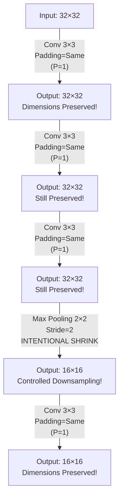

# 2.2 Padding: Mathematics, Edge Effects, and Valid vs. Same

Looking at the spatial output formula ($O = \lfloor (W - K + 2P)/S \rfloor + 1$), it mathematically guarantees that passing over raw pixels structurally forces the image to constantly shrink — assuming $S=1$ and $K>1$, every convolutional layer without padding reduces the spatial dimensions. For a $3 \times 3$ kernel with stride 1 and no padding, each layer removes exactly 2 pixels from each spatial dimension (1 from each side). This is not a bug in the formula; it is a geometric consequence of the fact that a filter placed at the boundary of an image would extend beyond the image's edge, which is not a valid position.

At first glance, this shrinkage seems harmless — going from $64 \times 64$ to $62 \times 62$ is only a 6% reduction in pixels. But the cumulative effect is devastating. This note explains why uncontrolled shrinkage is catastrophic, how padding solves the problem, and the two dominant padding paradigms used in modern architectures.

---

### Premature Spatial Collapse: The 40-Layer Problem

If you stack 40 successive un-padded $3 \times 3$ convolutional layers onto a $64 \times 64$ medical scan, the spatial resolution violently recursively collapses:

| Layer | Spatial Dimension | Pixels Remaining |
|---|---|---|
| Input | $64 \times 64$ | 4,096 |
| Layer 1 | $62 \times 62$ | 3,844 |
| Layer 5 | $54 \times 54$ | 2,916 |
| Layer 10 | $44 \times 44$ | 1,936 |
| Layer 20 | $24 \times 24$ | 576 |
| Layer 30 | $4 \times 4$ | 16 |
| Layer 32 | $0 \times 0$ | **CRASH** |

By layer 32, the spatial dimensions have collapsed to zero. The image no longer exists in any meaningful sense — there is no grid left to slide a filter over, and any attempt to continue processing will throw a runtime error. This means that with no padding, a 64-pixel input can support a maximum of roughly 31 convolutional layers before the image vanishes entirely.

This is a fatal constraint. Modern state-of-the-art architectures routinely use 50, 100, or even 152 layers (ResNet-152). Without padding, these architectures would be physically impossible to construct — the image would shrink to nothing long before the network reached its full depth. Padding is not an optional cosmetic feature; it is the engineering foundation that makes deep networks feasible.

---

### The Edge Mismatch Problem

Even before the image collapses to zero, there is a subtler but equally damaging problem: **grossly disproportionate information treatment of border pixels versus interior pixels.**

Consider how a $3 \times 3$ filter slides across an image. At each position, all 9 weights of the filter multiply the 9 pixel values in the overlapping patch. The key insight is that **different pixels in the input image are multiplied by different numbers of filter weights**, depending on their spatial location:

- A pixel located precisely **dead-center** in the input image is overlapped and explicitly multiplied by all 9 weights of the $3 \times 3$ filter as the filter iteratively passes over it. The filter visits every position where the center pixel falls within the filter's receptive field, which means the center pixel contributes to 9 different output feature map values.
- A pixel trapped securely in the very **top-left absolute corner** is unfortunately only ever functionally multiplied precisely *once* — by the single bottom-right-most weight of the kernel, when the filter is placed in the one valid position that includes the corner pixel. That corner pixel contributes to only 1 output feature map value.

This disparity is illustrated in the table below for a $3 \times 3$ filter on a $5 \times 5$ input:

```
Number of times each input pixel is "visited" by a 3×3 filter:

1  2  3  3  2  1
2  4  6  6  4  2
3  6  9  9  6  3     ← Center pixels: 9 visits each
3  6  9  9  6  3
2  4  6  6  4  2
1  2  3  3  2  1     ← Corner pixels: only 1 visit each
```

The center pixels contribute 9 times more information to the output than the corner pixels. This means the network systematically under-weights border information — exactly the information that gets progressively shaved off as the image shrinks through successive layers. In applications like medical imaging or satellite imagery, where critical features often appear at image boundaries, this bias can cause significant performance degradation.

> [!important] The Dual Problem
> Unpadded convolution causes two distinct but related failures:
> 1. **Spatial Collapse:** The image shrinks to nothing, making deep architectures impossible.
> 2. **Edge Neglect:** Border pixels are systematically under-represented in the output, causing information loss that gets worse with each layer.
> Padding solves both problems simultaneously — it prevents spatial collapse by adding extra "room" for the filter to operate, and it gives border pixels more opportunities to be visited by the filter, reducing the edge-attention disparity.

---

### The Solution: Zero-Padding Paradigms

To solve both failures simultaneously, deep learning engineers add temporary, external concentric rings composed entirely of fake numerical values (standardly zeroes) dynamically surrounding the perimeter boundary of the input image tensor, right before executing the convolution logic step. After the convolution is computed, the padding is discarded — it is purely a computational scaffold that exists only to give the filter room to operate near the image boundary.

**Why zeros specifically?** Adding zeros is the standard choice for two reasons. First, zero is the identity element for addition — when the filter's weights multiply a padded zero, the product is zero, which means the padded positions contribute nothing to the summation. This ensures that the padding does not inject any artificial signal into the computation. Second, zeros are compatible with ReLU activations: $\text{ReLU}(0) = 0$, so padded positions that make it through the activation function remain inert. Alternative padding strategies (reflecting the image boundary, repeating edge pixels, or using the mean value) exist but are less common in standard CNN architectures.

---

### Valid Padding ($P=0$)

"Valid" padding is the historical framework-specific keyword phrase meaning explicitly **no padding applied whatsoever**. The name comes from the constraint that the sliding filter is rigorously restricted only to geometrically "valid" overlapping positions — positions where every element of the filter overlaps with a real pixel in the input, never with a hypothetical pixel outside the boundary.

With valid padding:
- The filter is placed only at positions where it fits entirely within the image.
- The output dimensions continuously drop based strictly on the pure mathematical formula: $O = W - K + 1$ (for $S=1$, $P=0$).
- Every value in the output feature map is computed from only real input data — no zeros are ever involved in the computation.

**When to use Valid Padding:**
- When you explicitly want the spatial dimensions to decrease (e.g., as a form of downsampling).
- In the final layers of a network where the feature map is already small and further shrinkage is acceptable.
- When using pooling or strided convolutions for intentional downsampling, making padding unnecessary.

**Drawback of Valid Padding:**
- Cumulative shrinkage limits network depth.
- Border pixels are systematically under-represented.
- You lose precise control over when and where the spatial dimensions change — every layer always shrinks the image.

---

### Same Padding (The "Half" Formula)

"Same" padding operates logically to algorithmically force the newly produced output spatial size ($O$) to fundamentally match the original incoming dimension block size ($W$). When we say "same," we mean the output spatial dimensions are the *same* as the input spatial dimensions — the image does not shrink.

To derive the padding required for "Same" behavior, we rigorously solve the master formula algebraically while setting Stride $S=1$ and demanding exactly $O=W$:

Starting from:
$$O = \frac{W - K + 2P}{S} + 1$$

Setting $S=1$ and $O=W$:
$$W = W - K + 2P + 1$$

Subtract $W$ from both sides:
$$0 = -K + 2P + 1$$

Solve for $P$:
$$2P = K - 1$$

$$\boxed{P = \frac{K - 1}{2}}$$

This is the **Same Padding Formula** (also called the "Half" formula, since $P$ equals half of $K-1$). It tells us exactly how many rings of zero-padding to add on each side of the image to preserve the spatial dimensions.

---

### Worked Examples of Same Padding

#### For a $3 \times 3$ Kernel:
$$P = \frac{3 - 1}{2} = 1$$

The framework explicitly adds **1 complete contiguous ring of zero-pixels** systematically across the perimeter boundary. The input image effectively grows from $W \times W$ to $(W+2) \times (W+2)$ before convolution, and after the $3 \times 3$ filter slides across this padded image, the output is exactly $W \times W$ — the same size as the original input.

Let's verify with $W = 64$, $K = 3$, $P = 1$, $S = 1$:
$$O = \frac{64 - 3 + 2(1)}{1} + 1 = \frac{63}{1} + 1 = 64 \quad \checkmark$$

#### For a $5 \times 5$ Kernel:
$$P = \frac{5 - 1}{2} = 2$$

The framework explicitly adds **2 total concentric rings of zeros** around the perimeter. The input grows from $W \times W$ to $(W+4) \times (W+4)$ before convolution.

Let's verify with $W = 64$, $K = 5$, $P = 2$, $S = 1$:
$$O = \frac{64 - 5 + 2(2)}{1} + 1 = \frac{63}{1} + 1 = 64 \quad \checkmark$$

#### For a $7 \times 7$ Kernel:
$$P = \frac{7 - 1}{2} = 3$$

The framework adds **3 concentric rings of zeros**. This is the configuration used in the first layer of ResNet architectures, where a large $7 \times 7$ kernel is applied with stride 2 for aggressive initial downsampling.

---

### Why Odd-Numbered Kernels Are Preferred

This dictates logically why modern CNNs drastically prefer odd-numbered Kernel blocks consistently. The reason is mathematical symmetry:

- **Odd kernel sizes** ($K = 3, 5, 7$): The Same Padding formula $P = (K-1)/2$ produces an **integer** result. One ring of zeros is added symmetrically on all sides. The filter has a well-defined center pixel, which makes the spatial alignment between the input and output feature maps unambiguous — the center of the filter aligns exactly with the center of the corresponding output pixel.

- **Even kernel sizes** ($K = 2, 4, 6$): The Same Padding formula $P = (K-1)/2$ produces a **non-integer** result. For $K = 4$, we get $P = 1.5$, which is impossible — you cannot add 1.5 rings of zeros. The framework must resort to **asymmetric padding** (e.g., adding 1 ring on the left/top and 2 rings on the right/bottom), which introduces a subtle spatial shift between the input and output feature maps. This misalignment is undesirable because it makes the feature map positions ambiguous relative to the original image coordinates.

For this reason, virtually all standard CNN architectures use odd kernel sizes — primarily $3 \times 3$ and occasionally $5 \times 5$ or $7 \times 7$.

> [!tip] The Power of Same Architecting
> By deliberately implementing `padding='same'` universally across raw Convolutional blocks, the architect locks the spatial $X, Y$ proportions entirely statically. This prevents any passive "accidental" resolution shrinkage, thus effectively giving back explicit mathematical control to the software engineer regarding exactly *when and where* the network resolution deliberately shrinks. Instead of every convolution shrinking the image, the image stays the same size until the architect explicitly applies a pooling layer or a strided convolution to shrink it on purpose. This design philosophy — preserve dimensions by default, shrink intentionally — is the foundation of all modern CNN architectures.



---

### Important Caveat: Same Padding with Stride > 1

> [!warning] Important Caveat
> "Same" padding only perfectly maintains dimensions when **Stride = 1**. When using strides greater than 1, even with `padding='same'`, the spatial dimensions will decrease according to the master formula. The term "same" in this context means "the padding is computed such that the output would be the same size as the input if the stride were 1" — but the stride greater than 1 overrides this and causes downsampling anyway.
>
> For example, with $W=64$, $K=3$, $P=1$ (same padding for $K=3$), and $S=2$:
> $$O = \lfloor(64 - 3 + 2)/2\rfloor + 1 = \lfloor 63/2 \rfloor + 1 = 32$$
> The output is $32 \times 32$ — halved, not preserved. The "same" padding value of $P=1$ was computed for stride-1 preservation, but the stride of 2 causes a 2× reduction regardless.
>
> In TensorFlow, `padding='same'` with $S>1$ automatically computes the padding needed to produce an output of $\lceil W/S \rceil$, which is the closest integer to "same" behavior at that stride. In PyTorch, `padding=1` with `stride=2` simply applies 1 ring of zeros and then applies the stride — the formula result speaks for itself.

---

### Summary: Valid vs. Same Padding

| Feature | Valid Padding ($P=0$) | Same Padding ($P = \frac{K-1}{2}$) |
|---|---|---|
| **Output Size** | $O = W - K + 1$ (always smaller) | $O = W$ (same as input, when $S=1$) |
| **Border Treatment** | No padding; filter stays strictly within image | Rings of zeros added around image boundary |
| **Edge Pixel Attention** | Border pixels visited fewer times than center | Border pixels visited as often as center |
| **Network Depth** | Limits maximum depth due to spatial collapse | Enables arbitrarily deep architectures |
| **When to Use** | When intentional shrinkage is desired | As the default choice for most convolutional layers |
| **Framework Keyword** | `padding='valid'` (TF) or `padding=0` (PyTorch) | `padding='same'` (TF) or `padding=(K-1)//2` (PyTorch) |

Padding is not a minor implementation detail — it is a fundamental architectural decision that determines whether deep networks are even possible. Same padding preserves spatial dimensions, equalizes attention across all pixels, and gives the architect explicit control over when and where downsampling occurs. Valid padding allows natural shrinkage and is used when downsampling is intentional. In modern practice, same padding is the default, and downsampling is achieved through explicit pooling or strided convolutions — never through accidental spatial collapse.
