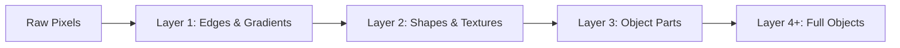

# 4.2 Hierarchical Feature Extraction

Why do we stack 100 Convolutional layers on top of each other instead of just deploying one massive layer? This is one of the most fundamental questions in deep learning architecture, and the answer reveals the core magic of why depth is essential.

The core magic of deep neural architectures is **Hierarchical Feature Extraction**. As tensor data successfully passes through consecutive sequential layers, the network learns to systematically mathematically combine extremely simple basic concepts recursively into increasingly complex macro concepts. Each layer takes the abstractions produced by the previous layer and builds new, more sophisticated abstractions on top of them. This creates a pyramid of increasing complexity, where the base is raw pixels and the apex is the recognition of complete objects.

### Level-by-Level Abstraction

#### Layer 1 — Low-Level Features (Edges and Gradients)
The absolute very first convolutional layer looks directly at the raw pixel input completely. Because its Receptive Field mapping is functionally small geographically, the filters here exclusively learn to detect very basic topological geometries: horizontal edges, clean vertical boundaries, diagonal strict lines, and simple standard color gradients. These are the atomic building blocks of visual perception — they are so fundamental that the first-layer filters of CNNs trained on completely different datasets (ImageNet, medical scans, satellite imagery) end up looking remarkably similar. This is because edges and gradients are universal visual primitives that form the basis of all higher-level perception.

#### Layer 2 — Mid-Level Features (Shapes and Textures)
The second sequential layer **does not** physically look at the raw image pixels. It looks exclusively at the abstract feature map consisting of the *edges detected previously by Layer 1*. By algorithmically combining separate geometric edges, Layer 2 learns to identify simple abstract shapes: circles, corners, crosses, and textures (like fur or wood grain). A circle, for example, is nothing more than a specific arrangement of curved edge segments. A corner is the intersection of two edges at a specific angle. These mid-level features are more abstract than raw edges but still lack the complexity to represent complete objects.

#### Layer 3+ — High-Level Features (Object Parts and Complete Objects)
By combining shapes, deeper layers learn to recognize complex object parts. A combination of circles and curves becomes a wheel or an eye. Further down, combinations of eyes, noses, and fur become a "dog face." At the deepest layers, the network combines high-level object parts into complete abstract representations of entire objects — "Dog," "Car," "Building." The progression is strictly hierarchical: edges → shapes → parts → objects.

### Why Not One Massive Layer?

One might wonder: why not simply use a single $11 \times 11$ or $21 \times 21$ filter instead of stacking many $3 \times 3$ filters? The answer is twofold:

#### 1. Parameter Efficiency
Three stacked $3 \times 3$ filters give an effective receptive field of $7 \times 7$, but require only $3 \times (3 \times 3) = 27$ parameters per channel, versus a single $7 \times 7$ filter requiring $49$ parameters per channel. The savings become even more dramatic with deeper stacks: seven stacked $3 \times 3$ filters (effective RF = $15 \times 15$) require $7 \times 9 = 63$ parameters, while a single $15 \times 15$ filter requires $225$ parameters — a 3.6x reduction. This is a powerful mathematical result: depth allows you to cover the same receptive field with far fewer parameters.

#### 2. Non-Linearity and Expressive Power
Three stacked layers introduce three ReLU activations between them, allowing the network to learn far more complex, non-linear feature combinations than a single linear operation could ever express. Without these intermediate non-linearities, stacking three $3 \times 3$ convolutions would be mathematically equivalent to a single $7 \times 7$ convolution (because linear operations compose into linear operations). The ReLU activations break this equivalence and allow each layer to learn a genuinely new, non-linear transformation of its input.

This is precisely why VGG-16 proved that stacking many small ($3 \times 3$) filters is mathematically superior to using few large filters. The VGG architecture demonstrated that depth, combined with small filters and non-linearities, produces better feature representations than shallow networks with large filters — even when the effective receptive field is the same.

### The Receptive Field Growth Behind Hierarchy

The hierarchical feature extraction is directly enabled by the growth of the receptive field through layer stacking:

* **Layer 1:** A neuron looks at a $3 \times 3$ patch of the raw image. It can only detect features that fit within a 3-pixel window — edges and gradients.
* **Layer 2:** A $3 \times 3$ filter in Layer 2 looks at a $3 \times 3$ grid of Layer 1 features. But because each of those Layer 1 features already represents a $3 \times 3$ patch of the raw image, a single Layer 2 neuron effectively "sees" a $5 \times 5$ region of the original input.
* **Layer 3:** By the same logic, a Layer 3 neuron sees a $7 \times 7$ region.
* **Deeper Layers:** Each additional layer expands the receptive field further, until deep neurons can "see" the entire input image.

This progressive expansion of the receptive field is what allows deeper layers to detect increasingly global, complex features. A neuron that can only see 3 pixels cannot detect a circle; a neuron that can see 15 pixels can.

> [!info] The Depth-Efficiency Principle
> The key insight of hierarchical feature extraction is that **depth is more efficient than width**. A deep network with small filters can represent the same functions as a shallow network with large filters, but with fewer parameters and more non-linear expressive power. This is why modern CNNs are deep — not because depth is arbitrarily desirable, but because depth provides a mathematically superior way to build complex feature representations.
