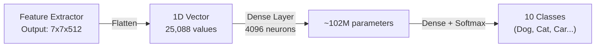

# 4.4 The Fully Connected Layer (Classification Head) and Flattening

*(The critical bridge between Feature Extraction and Decision Making.)*

### The Separation of Responsibilities

A CNN is fundamentally split into two distinct halves, each with a radically different computational role. Understanding this separation is essential for grasping why modern architectures have evolved the way they have.

1. **The Feature Extractor (Convolutional Base):** The Conv and Pooling layers whose sole job is to locate edges, shapes, and patterns. They output a deep, spatially-shrunk tensor (e.g., $7 \times 7 \times 512$). The feature extractor operates in 2D spatial space — it slides filters across height and width, detecting *where* features are located in the image. It produces a rich, multi-channel map that encodes the presence and location of hundreds of different features.

2. **The Decision Maker (Classification Head):** The Fully Connected (Dense) layers at the very end of the network. They do not care *where* a feature is; they only care *which* features were found to make a final prediction (e.g., "Dog vs. Cat"). The classification head operates on a 1D vector — it takes the entire collection of detected features and combines them through weighted connections to produce a final classification decision. It is essentially a standard Multi-Layer Perceptron that takes the feature vector as input.

This architectural division of labor is profound: the convolutional base answers the question "what features exist and where?" while the classification head answers the question "given these features, what object is this?" The transition between these two halves requires a critical transformation — from a 3D spatial volume to a 1D feature vector.

### The Mechanics of Flattening

Fully Connected layers (Standard MLPs) only accept 1D arrays (vectors). They cannot process a 3D volume. A Dense layer performs the operation $Y = WX + B$, where $W$ is a 2D weight matrix, $X$ is a 1D input vector, and $B$ is a bias vector. The matrix multiplication $WX$ requires $X$ to be a 1D vector — there is no way to multiply a 2D weight matrix by a 3D tensor. Therefore, before passing our final feature maps into the dense layers, we must perform a **Flattening** operation.

* **The Math:** If our final Conv layer outputs a tensor of shape `[Batch_Size, 512, 7, 7]`, Flattening unrolls the spatial and depth dimensions into a single continuous 1D line per image. The channels dimension, the height, and the width are all collapsed into one long vector.
* **Result:** The shape becomes `[Batch_Size, 512 * 7 * 7]`, which equals `[Batch_Size, 25088]`.
* This 25,088-length vector is fed into a standard Dense layer with, for example, 4096 neurons ($Y = WX + B$).

**How Flattening Works in Detail:**
The flattening operation simply reads the 3D tensor in memory order and writes it into a 1D array. For a tensor of shape `[512, 7, 7]`, it reads the first $7 \times 7$ spatial map (channel 0), then the second $7 \times 7$ map (channel 1), and so on through all 512 channels, concatenating them end-to-end. The spatial relationships between adjacent channels are lost — channel 0's last pixel is followed immediately by channel 1's first pixel, even though they represent completely different features. This is acceptable because the subsequent Dense layer will learn to re-associate the relevant features through its weight matrix.

### The Output and Softmax

The final Fully Connected layer will have exactly as many neurons as you have classes (e.g., 10 neurons for classifying digits 0-9). This output is passed through a **Softmax Activation Function**, which converts the raw scores (called "logits") into probabilities that sum to 1.0 (100%).

The Softmax function is defined as:

$$ \text{Softmax}(z_i) = \frac{e^{z_i}}{\sum_{j=1}^{K} e^{z_j}} $$

Where $z_i$ is the raw logit for class $i$, and $K$ is the total number of classes. The exponential function ensures all outputs are positive, and the division by the sum ensures they all add up to 1.0. The class with the highest probability is the network's prediction.

> [!warning] The Danger of Flattening
> The weight matrix connecting the 25,088 flattened values to the 4,096 Dense neurons requires $25,088 \times 4,096 \approx 102$ Million parameters! This is where 90% of a classic CNN's memory is consumed, and it is highly prone to overfitting.
>
> To put this in perspective: the entire convolutional base of VGG-16 (all 13 convolutional layers combined) contains approximately 14.7 million parameters. The two fully connected layers at the end contain approximately 119 million parameters — roughly 90% of the network's total parameter count. This means the vast majority of the network's capacity is concentrated in the classification head, not the feature extractor, which is architecturally wasteful and dangerously prone to memorization.
>
> *(See [[5.2 Global Average Pooling (GAP)]] for how modern architectures avoid this using Global Average Pooling).*

### The Classical Pipeline: From Pixels to Predictions

To summarize the complete classical CNN pipeline:

1. **Input:** Raw image tensor `[Batch, 3, 224, 224]`
2. **Conv + Pool layers:** Repeatedly extract features and downsample spatially
3. **Final Conv output:** Deep, compact feature tensor `[Batch, 512, 7, 7]`
4. **Flatten:** Convert 3D volume to 1D vector `[Batch, 25,088]`
5. **Dense layers:** Fully connected layers combine features `[Batch, 4096]`
6. **Output layer:** One neuron per class `[Batch, NumClasses]`
7. **Softmax:** Convert to probabilities `[Batch, NumClasses]`

The problem with this pipeline is step 4-5: the flattening and dense layers create a parameter explosion that dominates the network's memory and computational cost, while also being the primary source of overfitting. Modern architectures (starting with ResNet and Network-in-Network) replace steps 4-5 with Global Average Pooling, which achieves the same dimensionality reduction with zero additional parameters.

> [!info] Historical Note
> The Flattening + Dense approach was standard in all early CNN architectures: LeNet-5, AlexNet, and VGG-16 all used this design. It was not until the introduction of Global Average Pooling in the Network-in-Network paper (2013) and its popularization by ResNet (2015) that the field began moving away from this parameter-heavy approach. Understanding both methods is essential because the classical approach is still used in many practical settings, and the problems it creates directly motivate the design of modern alternatives.
