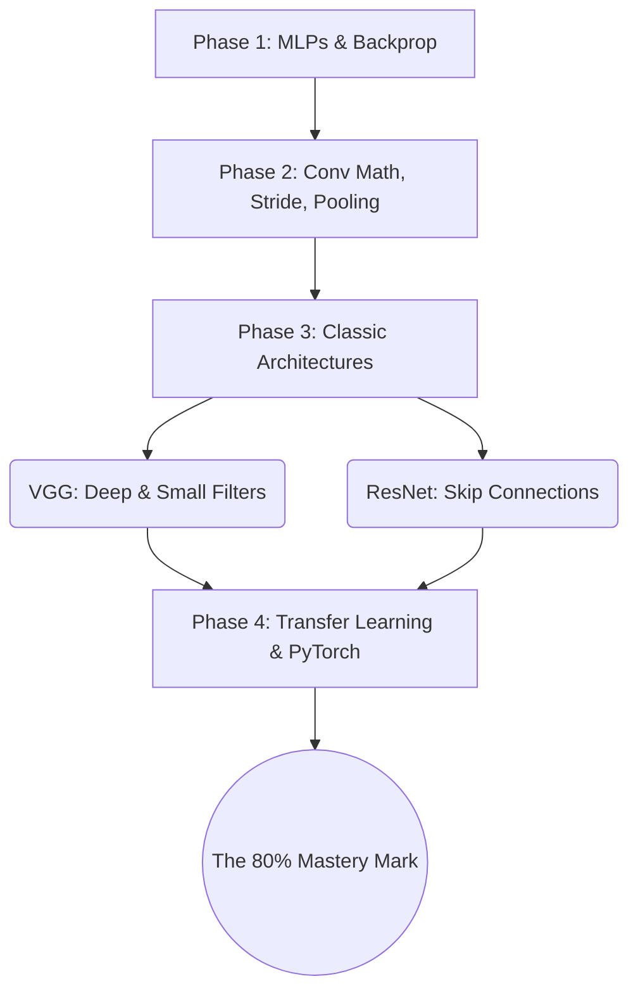

# 7.1 The CNN Mastery Roadmap

To transition from conceptual understanding to confident framework engineering in PyTorch, follow this exact progression. This roadmap is designed to build knowledge systematically — each phase depends on mastery of the previous one. Jumping ahead without building the foundation will leave you unable to debug when things inevitably go wrong.

### Phase 1: Deep Learning Fundamentals (Do not skip)

Before touching CNNs, you must have a solid foundation in standard deep learning. Many students rush past these fundamentals and then find themselves unable to understand why their CNN isn't training. Every problem you encounter in CNN training — vanishing gradients, exploding losses, shape mismatches — traces back to concepts that are introduced at the MLP level.

1. **Tensor Math:** Master Numpy. Understand dot products, broadcasting, axes, and transpositions. If you cannot confidently manipulate multi-dimensional arrays in Numpy, you will struggle with PyTorch tensors. Practice reshaping arrays, understanding which axis is which, and computing dot products by hand. This is not optional — tensor manipulation is the basic literacy of deep learning.

2. **The MLP Framework:** Build a simple Feed-Forward network. Understand Activation functions (ReLU, Sigmoid, Softmax) and Loss functions (Cross-Entropy, Mean Squared Error). You should be able to implement a basic neural network from scratch using only Numpy — no PyTorch, no TensorFlow. If you cannot do this, you do not truly understand how neural networks compute their outputs.

3. **Backpropagation:** Understand exactly how Gradients flow backward through the Chain Rule to update weights. You should be able to manually compute the gradient of a 2-layer MLP for a single training example on paper. If you cannot do this, you will not understand why your CNN's loss plateaus or why certain layers fail to learn.

4. **Optimization:** Understand SGD, Adam, and exactly how the learning rate scales the gradient. Know the difference between batch gradient descent, stochastic gradient descent, and mini-batch gradient descent. Understand why Adam is generally preferred over vanilla SGD, but also why SGD with momentum can sometimes achieve better final accuracy.

### Phase 2: CNN Micro-Mechanics (Manual Calculation)

You must mathematically understand the operations happening inside the tensors. This phase is about building intuition through manual calculation — not about writing code.

1. **The Forward Pass:** Draw out a $5 \times 5$ grid and manually calculate a $3 \times 3$ convolution on paper. Understand the Depth Summation Rule implicitly. Compute every multiplication, every addition, and verify that your hand-calculated output matches the formula $O = (W - K + 2P)/S + 1$. This exercise takes 30 minutes but will give you more intuition than hours of reading.

2. **Spatial Math:** Memorize the $O = \lfloor(W - K + 2P)/S\rfloor + 1$ formula. Practice calculating tensor shapes through a mock 5-layer network. Given an input tensor `[3, 224, 224]`, trace the shape through each layer (including padding, stride, and pooling operations) until you reach the final output. If you cannot track tensor shapes mentally, you will spend hours debugging shape mismatch errors.

3. **Receptive Fields:** Understand how Strides and Pooling exponentially increase the receptive field. Calculate the receptive field of the final layer in a sample architecture. Verify that it covers the entire input image — if it doesn't, the network cannot detect global features.

4. **Backpropagation Intuition:** Understand that gradients flow backward via convolutions and flipped filters. Know the difference between the weight gradient (how to update the filter weights) and the input gradient (how to route errors to previous layers). You don't need to implement these manually, but you should understand the mathematical principles well enough to explain them to someone else.

### Phase 3: Architectural History (Macro-Mechanics)

Do not try to invent your own architectures yet. Study how the pioneers did it. They reveal the evolution of deep learning thought, and each architecture solved a specific problem that the previous one could not.

1. **LeNet-5 (1998):** The grandfather. Teaches the basic `Conv -> Pool -> Conv -> Pool -> Flatten -> Dense` paradigm. Study this architecture to understand the fundamental CNN pipeline. It is simple enough to implement in an afternoon, and every subsequent architecture builds on the same basic pattern.

2. **AlexNet (2012):** The breakthrough. Introduced ReLU (replacing sigmoid/tanh, which suffered from vanishing gradients), Dropout (randomly disabling neurons during training to prevent co-adaptation and overfitting), and heavy data augmentation (artificially expanding the training set through random transformations). Understand *why* it beat traditional computer vision — it was the first network to demonstrate that learned features could comprehensively outperform hand-crafted features on a large-scale benchmark (ImageNet).

3. **VGG-16 (2014):** The elegance of simplicity. Proved that stacking many small ($3 \times 3$) filters is mathematically superior to using few large ($7 \times 7$ or $11 \times 11$) filters. Understand the mathematical argument: three $3 \times 3$ layers have the same receptive field as one $7 \times 7$ layer, but with fewer parameters (27 vs 49) and more non-linearities (3 ReLUs vs 1). This is one of the most important architectural insights in deep learning.

4. **ResNet (2015):** The deepest breakthrough. Understand the **Vanishing Gradient Problem** — as networks get deeper, gradients become exponentially smaller as they propagate backward through hundreds of layers, causing early layers to learn extremely slowly or not at all. Understand how **Skip Connections (Residual Blocks)** bypass layers by adding the input directly to the output ($y = F(x) + x$), creating a "gradient superhighway" that allows gradients to flow unimpeded through the shortcut path. This single innovation unlocked 150+ layer depths and won the 2015 ImageNet competition by a massive margin.

### Phase 4: Modern Practical Implementation

1. **Framework Mastery:** Pick PyTorch (recommended). Learn to build custom `Dataset` and `DataLoader` classes for images. Master `torch.nn.Conv2d` and `torch.nn.MaxPool2d`. Understand the `NCHW` tensor format. Know how to inspect tensor shapes at every layer of your network using `.shape` and how to debug shape mismatches by tracing the shapes manually through the forward pass.

2. **Transfer Learning:** You will rarely train from scratch. Learn to load a pre-trained ResNet, freeze the early convolutional layers (which detect universal edges/shapes that are useful for all vision tasks), and replace/train only the final classification head for your specific dataset. This allows you to achieve high accuracy on small datasets by leveraging the features learned from millions of images on ImageNet.

3. **Data Augmentation:** Understand how to dynamically rotate, flip, and color-jitter images during training (`torchvision.transforms`) to artificially expand your dataset and prevent overfitting. Know the difference between training transforms (which include random augmentations) and validation transforms (which only include deterministic normalization). Understand why augmentations must be random — if they are deterministic, the network will memorize the augmented images just as easily as the originals.

4. **Handling Overfitting:** Master Batch Normalization (normalizes activations within each mini-batch to stabilize training and add slight regularization), Dropout (randomly disables neurons during training), and Weight Decay (adds an L2 penalty to the loss function to prevent weights from growing too large). Know when to use each technique and how to diagnose which type of overfitting your network is suffering from.

> [!info] The Key Principle
> Jumping straight into PyTorch code without understanding the math will leave you unable to debug when things go wrong. The roadmap is designed to build understanding from the ground up — each phase depends on the previous one. If you skip Phase 1, you won't understand Phase 2. If you skip Phase 2, you won't understand Phase 3. If you skip Phase 3, you won't understand why modern architectures are designed the way they are.
