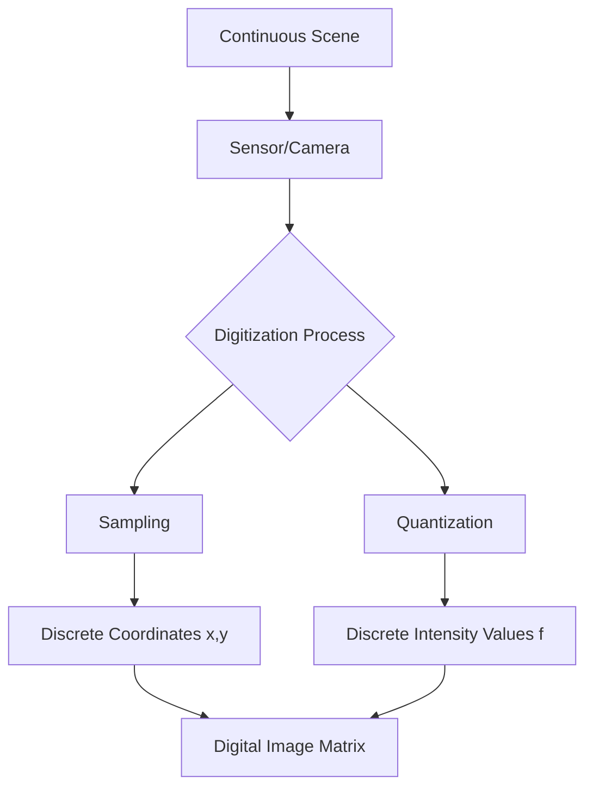

# 1.1 What is a Digital Image?

## 1. Definition and Concept
A digital image is a representation of a two-dimensional visual scene as a finite set of digital values. While the human eye perceives the world as a continuous stream of light and color (Analog), a computer must break this continuity down into discrete chunks to store and process it.

Mathematically, a digital image is defined as a two-dimensional function:
$$ f(x, y) $$
Where:
*   $x$ and $y$ are **spatial coordinates** (the location).
*   The amplitude of $f$ at any pair of coordinates $(x, y)$ is the **intensity** or **gray level** of the image at that point.

When $x$, $y$, and the amplitude values of $f$ are all finite, discrete quantities, we call the image a **digital image**.

## 2. From Analog to Digital: The Two-Step Process
To convert a continuous (analog) scene into a digital image, two specific processes must occur. Students often confuse these two, but they control different aspects of image quality.

### A. Sampling (Controls Spatial Resolution)
Sampling is the process of digitizing the **coordinate values** ($x, y$).
*   Imagine placing a grid over a photograph.
*   We take a sample reading at each intersection of the grid.
*   **Result:** The continuous physical space is converted into a discrete grid of pixels.
*   **Implication:** If you sample too few points (coarse grid), the image looks "blocky" or "pixelated."

### B. Quantization (Controls Intensity Resolution)
Quantization is the process of digitizing the **amplitude values** (intensity).
*   Once we have a sample at $(x, y)$, we measure the brightness.
*   The brightness in real life is continuous (infinite precision). However, a computer can only store a limited number of integers.
*   We map the continuous brightness to the nearest integer value (e.g., 0 to 255).
*   **Implication:** If you have too few quantization levels, you see "false contouring" (banding) in smooth gradients like the sky.

## 3. The Pixel
The term **Pixel** stands for "Picture Element." It is the smallest addressable element in an all-points-addressable display device.
*   **Atomic Nature:** In the context of a bitmap image, you cannot have "half a pixel." It is the fundamental unit.
*   **Attributes:** A pixel typically stores:
    1.  **Location:** Its row and column index.
    2.  **Value:** A number (or set of numbers) representing color/brightness.

## 4. Matrix Representation
In Computer Science and libraries like **NumPy** or **MATLAB**, an image is strictly treated as a Matrix (or Array).

For an image of size $M \times N$ (Height $\times$ Width):

$$
f(x, y) = \begin{bmatrix}
f(0,0) & f(0,1) & \cdots & f(0, N-1) \\
f(1,0) & f(1,1) & \cdots & f(1, N-1) \\
\vdots & \vdots & \ddots & \vdots \\
f(M-1,0) & f(M-1,1) & \cdots & f(M-1, N-1)
\end{bmatrix}
$$

**Crucial Note on Coordinate Systems:**
*   **Math/Graphs:** Usually, $(0,0)$ is at the bottom-left.
*   **Image Processing:** $(0,0)$ is almost always at the **Top-Left** corner.
    *   $x$ usually refers to columns (horizontal).
    *   $y$ usually refers to rows (vertical).
    *   *Warning:* In NumPy, you access data as `array[row, column]`, which effectively translates to `array[y, x]`. This swap causes many bugs for beginners.