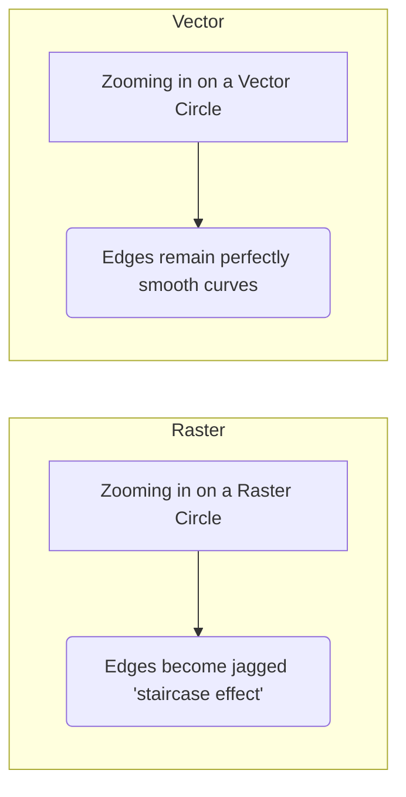

# 1.2 Image Representation: Bitmap vs. Vector

There are two fundamentally different ways to instruct a computer to display an image. Understanding the difference is vital for knowing when to use which format.

## 1. Bitmap Images (Raster Graphics)
Raster graphics are the primary focus of Image Processing.

### Definition
A bitmap is a grid of pixels. The file stores color information for each individual pixel map. It is essentially a "map of bits."

### Characteristics
*   **Resolution Dependent:** The image has a fixed number of pixels. If you zoom in, the computer must interpolate (guess) new pixels, leading to blockiness or blur (pixelation).
*   **File Size:** Proportional to the resolution. A $1000 \times 1000$ image stores 1 million pixels, regardless of whether the image is a complex photo or a plain white square (before compression).
*   **Use Cases:** Photographs, photorealistic art, detailed textures.
*   **Common Formats:** `.jpg`, `.png`, `.bmp`, `.tiff`, `.gif`.

### Pros and Cons
|                                Pros                                |                  Cons                  |
| :----------------------------------------------------------------: | :------------------------------------: |
| Can represent subtle color gradations (continuous tone) perfectly. |     Loses quality when scaled up.      |
|              Standard output for all digital cameras.              | Large file sizes for high resolutions. |
|            Precise pixel-by-pixel editing is possible.             |                                        |

## 2. Vector Images
Vector graphics are the focus of Computer Graphics and Design, not Image Processing.

### Definition
A vector image is composed of **mathematical primitives**: points, lines, curves, and polygons. The file contains a set of instructions.
*   *Example instruction:* "Draw a circle, center at (100,100), radius 50, fill color red."

### Characteristics
*   **Resolution Independent:** Because the image is math-based, if you scale it up by 1000%, the computer simply recalculates the curve equation. The edges remain perfectly crisp and sharp at any size.
*   **File Size:** Proportional to the *complexity* of the image, not the size. A huge simple circle takes bytes to store. A tiny complex drawing takes kilobytes.
*   **Use Cases:** Logos, fonts (typography), icons, technical drawings (CAD).
*   **Common Formats:** `.svg`, `.ai`, `.eps`, `.pdf`.

### Visual Comparison

## 3. The Rasterization Process
Monitors and printers are inherently raster devices (they have a grid of pixels or dots). Therefore, even vector images must be converted into pixels to be displayed. This process is called **Rasterization**.
*   Vectors are for *storage* and *manipulation*.
*   Rasters are for *display* and *capture*.