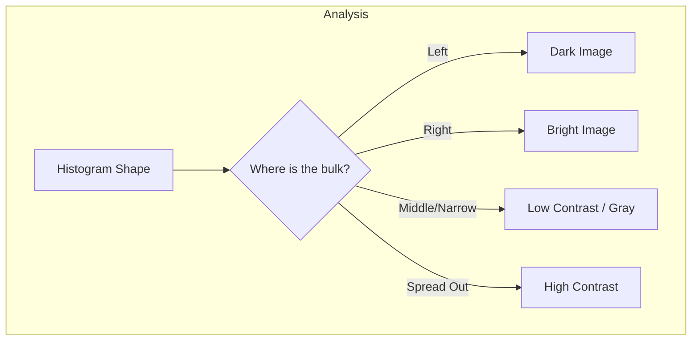

# 2.1 The Image Histogram

## 1. Definition and Significance
The histogram is the most fundamental tool for image analysis. It provides a global description of the appearance of an image.

Mathematically, for a digital image with gray levels in the range $[0, L-1]$, the histogram is a discrete function:
$$ h(r_k) = n_k $$
Where:
*   $r_k$ is the $k$-th gray level (e.g., if 8-bit, $r_0=0$, $r_{255}=255$).
*   $n_k$ is the number of pixels in the image having gray level $r_k$.

### Normalization (PDF)
Ideally, we want to compare images of different sizes. To do this, we normalize the histogram by dividing each count by the total number of pixels ($M \times N$). This gives us the **Probability Density Function (PDF)**:
$$ p(r_k) = \frac{n_k}{M \times N} $$
*   $p(r_k)$ represents the probability that a randomly selected pixel has the intensity $r_k$.
*   The sum of all components of a normalized histogram is exactly 1.

## 2. Visual Analysis: Reading a Histogram
A histogram tells you about the **brightness**, **contrast**, and **dynamic range** of an image.

### A. Brightness (Exposure)
*   **Dark Image (Underexposed):** The components of the histogram are concentrated on the low (left) side of the gray scale.
*   **Bright Image (Overexposed):** The components are concentrated on the high (right) side.
*   **Well-Exposed Image:** The components cover a broad range of the gray scale.

### B. Contrast
*   **Low Contrast:** The histogram is narrow and centered. The pixels are all a similar shade of gray (e.g., a photo in heavy fog).
*   **High Contrast:** The histogram covers a broad range of the gray scale *and* the distribution is not uniform (often bimodal, with peaks at black and white).
*   **Dynamic Range:** If the histogram touches both 0 and 255, the image uses the full dynamic range. If it has gaps at the ends, the dynamic range is compressed.

## 3. Practical Implementation
In Python (OpenCV/NumPy), computing a histogram is efficient.

*   **Logic:**
    1.  Create an array of size 256 (initialized to zeros).
    2.  Iterate through every pixel in the image.
    3.  Read the pixel value $v$.
    4.  Increment the array index $v$ by 1.
*   **Performance:** $O(N)$ where $N$ is the number of pixels.