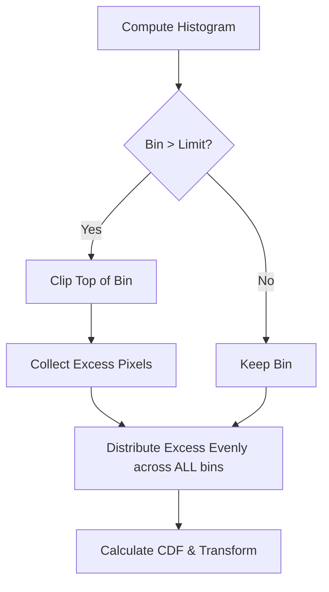

# 2.5 Advanced Histogram Techniques

Standard Histogram Equalization (HE) is global. It applies the same transformation to every pixel based on the *entire* image's statistics. This can fail when image content varies significantly in brightness.

## 1. Adaptive Histogram Equalization (AHE)
Global HE can wash out local details.
*   *Example:* A photo of a person standing in a dark tunnel with a bright light at the end. Global HE will make the light blinding or the tunnel pitch black to balance the average.

### The Algorithm
1.  Divide the image into a grid of rectangular sub-regions (tiles or blocks).
2.  For each block, calculate the histogram and the CDF.
3.  Use the local CDF to equalize the center pixel of that block.
4.  **Interpolation:** To prevent visible "checkerboard" artifacts at the block boundaries, the transformation for a pixel is computed by interpolating the results from the nearest neighboring blocks.

### The Problem with AHE
AHE amplifies **noise** in homogeneous (flat) regions.
*   If a block is purely sky (all blue), the histogram is a single spike.
*   Equalization forces this spike to spread across 0-255.
*   Tiny random noise variations (sensor grain) are stretched to become massive black and white speckles.

## 2. CLAHE (Contrast Limited AHE)
**Contrast Limited Adaptive Histogram Equalization** is the industry standard (used in medical imaging, underwater photography, etc.).

### Mechanism
CLAHE fixes the noise amplification problem of AHE by **Clipping**.

1.  **Grid:** Divide image into tiles (e.g., $8 \times 8$).
2.  **Histogram:** Compute histogram for a tile.
3.  **Clip:** Set a **Clip Limit** (e.g., 2.0 or 40 pixels).
    *   Any histogram bin that is taller than this limit is cut off.
    *   This limits the slope of the CDF transformation, which limits contrast enhancement.
4.  **Redistribute:** The pixels that were cut off (the "excess") are NOT discarded. They are distributed evenly (uniformly) to all other bins in that histogram.
    *   *Why?* The total number of pixels must remain constant (area under histogram = 1).
5.  **Equalize:** Compute CDF of this modified histogram and apply.

## 3. Histogram Specification (Matching)
Equalization forces the output to be **Uniform**. What if we want the output to match a specific style (e.g., "Make this sunny photo look like this sunset photo")?

### The Goal
Transform image $A$ so its histogram matches the histogram of image $B$.

### The Algorithm
We cannot transform $A$ directly to $B$. We use the Uniform distribution as a bridge.

1.  **Equalize $A$:** Compute $s = T(r)$ where $T$ is the CDF of image $A$. Now $A$ is flat.
2.  **Equalize $B$:** Compute $v = G(z)$ where $G$ is the CDF of image $B$. Now $B$ is flat.
3.  **Inverse Mapping:** Since both are now flat (approximately equal), we can equate them: $s \approx v$.
    $$ v = G(z) \implies z = G^{-1}(v) $$
    Since $s = v$:
    $$ z = G^{-1}(s) = G^{-1}(T(r)) $$

**Summary:**
To match image $A$ to $B$, we apply the CDF of $A$, then apply the **Inverse CDF** of $B$.