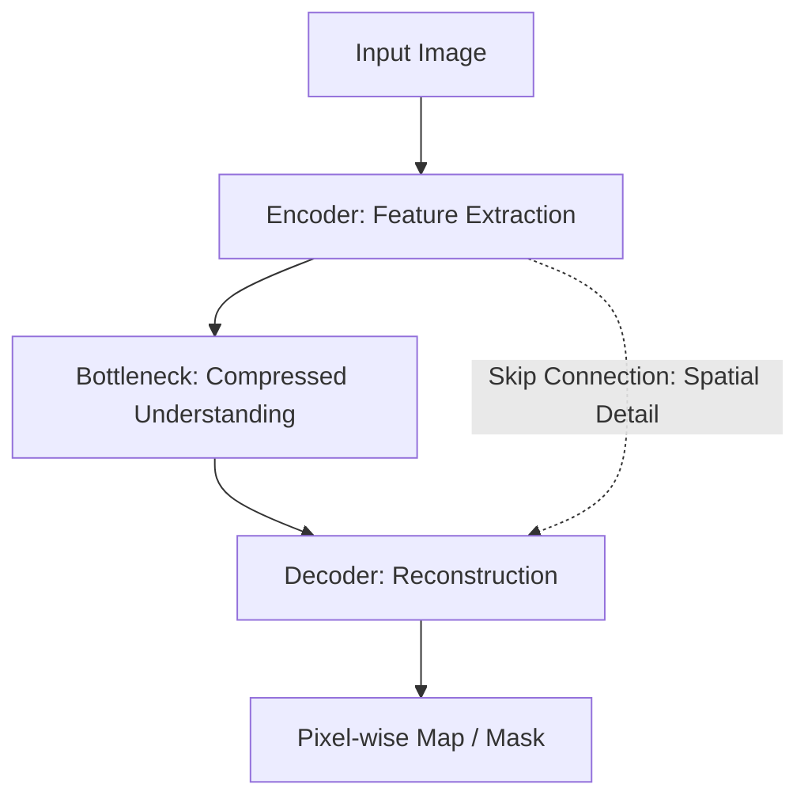

# 5.5 Deep Learning for Imaging

Modern image processing has moved from "hand-crafting" kernels (like we did in Chapters 3 and 5) to **learning** them from data using Neural Networks.

## 1. Convolutional Neural Networks (CNNs)
A CNN is essentially a stack of hundreds of spatial filters. However, the coefficients in the kernels are not set by a human (like the Sobel or Gaussian kernels); they are optimized using **Backpropagation**.

## 2. Deep Learning for Denoising (Restoration)
Traditional filters (Median/Nagao) work well but often blur textures.
### DnCNN (Denoising CNN)
A famous architecture that uses **Residual Learning**.
*   **Concept:** Instead of trying to predict the "Clean Image," the network is trained to predict the **Noise** ($V$).
*   **Logic:** $Y (\text{Noisy}) = X (\text{Clean}) + V (\text{Noise})$.
*   The network predicts $\hat{V}$.
*   The output is $Y - \hat{V}$.
*   **Why?** It is mathematically easier for a network to isolate random noise than to reconstruct complex human faces or landscapes from scratch.

## 3. Deep Learning for Segmentation (U-Net)
Segmentation is the process of labeling every pixel (e.g., "This pixel is a tumor," "This pixel is healthy tissue").

### The U-Net Architecture
The most successful architecture for medical imaging. It has a "U" shape:
1.  **Encoder (Downsampling):** Like a standard CNN. It captures the "context" (What is in the image?) but loses "localization" (Where is it?).
2.  **Decoder (Upsampling):** It reconstructs the spatial resolution.
3.  **Skip Connections:** This is the "Secret Sauce." It passes high-resolution information directly from the Encoder to the Decoder.
    *   **Result:** The network knows *what* the object is (from the bottom of the U) and exactly *where* the boundaries are (from the skip connections).

## 4. Summary: The Evolution of the Field
*   **1970s-90s:** Focus on Math (Fourier, Morphology). Precise but limited to simple scenes.
*   **2000s:** Focus on Features (SIFT, Gabor). Better at object detection.
*   **2012-Present:** Focus on Deep Learning. Massive performance gains, but requires high computing power (GPUs) and massive datasets.