# 1.1. Introduction & Philosophy of ML

## 1. Definition and Core Concept

**Machine Learning (ML)**—known as *Apprentissage Automatique* in French—is a sub-field of **Artificial Intelligence (AI)**. It is defined as the science of programming computers so they can learn from data without being explicitly programmed for specific tasks.

### The "Intelligence" Distinction
To understand ML, one must distinguish between the hardware and the mathematical logic:
1.  **The Computer (Hardware):** Is **not** intelligent. It is merely a calculator capable of executing instructions at high speed.
2.  **The Algorithm (Software/Math):** This is where the "intelligence" resides. It uses mathematical models (statistics, calculus, linear algebra) to identify patterns in data.

> [!INFO] Terminology Note
> You will often hear **Machine Learning** and **Statistical Learning** used interchangeably.
> *   **Machine Learning:** tends to focus on prediction and algorithms.
> *   **Statistical Learning:** tends to focus on inference and statistical properties.
>
> In this course, we treat them as the same discipline: **Methods for automated learning from data.**

---

## 2. The General Process ($X \to Y$)

The fundamental operation of almost all supervised machine learning is finding a mapping function $f$ that transforms inputs into outputs.

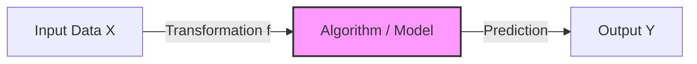

### The Data Structure
Data is typically organized in a structured tabular format (Dataset / BDD - Base de Données):

1.  **Vector $X$ (Inputs):**
    *   Also known as: **Descriptors**, **Features**, **Explanatory Variables**, or **Independent Variables**.
    *   *Definition:* The information we observe and measure.
    *   *Examples:* A patient's blood sugar level, the pixel intensity of an image, the square footage of a house.

2.  **Vector $Y$ (Outputs):**
    *   Also known as: **Labels**, **Targets**, **Responses**, or **Dependent Variables**.
    *   *Definition:* The "answer" we want the machine to predict.
    *   *Examples:* The diagnosis (Sick/Healthy), the object name (Cat/Dog), the price of the house.

---

## 3. The Role of the Human Expert
In the initial phase of creating a dataset, the "Ground Truth" is established by humans. The machine does not create knowledge from thin air; it mimics human expertise.

**The Workflow of Knowledge Transfer:**
1.  **Observation:** We collect raw data (e.g., X-ray images).
2.  **Labeling:** An **Expert** (e.g., a Radiologist) analyzes the data and assigns the correct label ($Y$).
3.  **Training:** The algorithm analyzes the pairs ($X, Y$) to learn the logic used by the expert.
4.  **Prediction:** The algorithm applies that logic to new $X$ data where the expert is not present.

> [!TIP] Exam Insight
> Never forget that the quality of a Machine Learning model is capped by the quality of the data labeled by the expert. If the expert makes mistakes, the model will learn those mistakes. This is often referred to as "Garbage In, Garbage Out."

# 1.2. Taxonomy of Learning Algorithms

Machine Learning is strictly categorized based on the *nature of the data* available during the training phase.

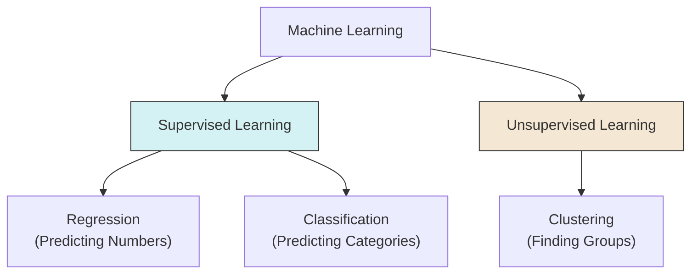

## 1. Supervised Learning (Apprentissage Supervisé)

In supervised learning, the model is trained on a **labeled dataset**. This is akin to a student learning with a teacher who provides the answer key.

### Key Characteristics
*   **Input ($X$):** Known.
*   **Output ($Y$):** **Known** and provided during training.
*   **Goal:** Learn the mapping $Y \approx f(X)$ to predict $Y$ for future unseen $X$.

### Sub-Categories
1.  **Regression:**
    *   **Output:** A continuous numerical value (Quantitative).
    *   *Examples:* Predicting temperature ($24.5^\circ C$), Predicting House Price ($350,000), Predicting Stock Market value.
    *   *Algorithms:* Linear Regression, Non-Linear Regression, Neural Networks (Output layer linear).
2.  **Classification:**
    *   **Output:** A discrete class or category (Qualitative).
    *   *Examples:* Spam vs. Not Spam, Benign vs. Malignant, Handwriting recognition (0-9).
    *   *Algorithms:* Logistic Regression, SVM, KNN, Neural Networks (Output layer Softmax).

---

## 2. Unsupervised Learning (Apprentissage Non Supervisé)

In unsupervised learning, the model is trained on an **unlabeled dataset**. There is no teacher, and there are no "correct answers."

### Key Characteristics
*   **Input ($X$):** Known.
*   **Output ($Y$):** **Unknown / Non-existent**.
*   **Goal:** Discovery of structure. The algorithm looks for patterns, groupings, or densities within $X$.

### Primary Task: Clustering (Regroupement)
Clustering involves grouping data points such that points in the same group are more similar to each other than to points in other groups.
*   *Algorithm Example:* **K-Means**.
*   *Process:* The algorithm proposes the groups ($Y$) based on data proximity.

---

## 3. Concrete Example: The Medical Diagnosis

To fully grasp the difference, consider a medical table containing patient data.

| Descriptors ($X$) | | | Label ($Y$) |
| :--- | :---: | :---: | :--- |
| **Sugar Level** | **Iron Level** | ... | **Disease Type** |
| High | Low | ... | *Sick (Type A)* |
| Normal | Normal | ... | *Healthy* |
| High | High | ... | *Sick (Type B)* |

### How the approaches differ:

1.  **Supervised View (Classification):**
    *   **Training:** You feed the computer the **Sugar**, **Iron**, AND the **Disease Type**.
    *   **Logic:** The computer learns: *"If Sugar is High and Iron is Low, the output should be Type A."*
    *   **Use Case:** A new patient arrives. We measure Sugar/Iron. The model predicts: "This patient has Type A."

2.  **Unsupervised View (Clustering):**
    *   **Training:** You feed the computer **ONLY** the **Sugar** and **Iron** levels. You **hide** the Disease Type column.
    *   **Logic:** The computer analyzes the data geometry. It says: *"I noticed that Patient 1 and Patient 3 have very similar strange blood levels. I will put them in 'Group 1'. Patient 2 looks different, so they go in 'Group 2'."*
    *   **Result:** It discovers distinct groups of patients, but it cannot name the disease. It just knows they are mathematically similar.

> [!WARNING] Common Pitfall
> Do not confuse **Clustering** with **Classification**.
> *   **Classification:** You define the classes beforehand (e.g., "Cats" and "Dogs").
> *   **Clustering:** The machine invents the classes based on similarity (e.g., "Group 1" and "Group 2").

# 1.3. Data Management & Generalization

The ultimate goal of Machine Learning is not to memorize data, but to **generalize**. Generalization is the ability of a model to perform accurately on new, unseen data.

## 1. The Dataset Split Strategy
To ensure a model can generalize, we never train and test on the same data. This would be like giving a student the exam questions to study; they would score 100% but learn nothing (memorization).

We typically split the full dataset into three distinct subsets:

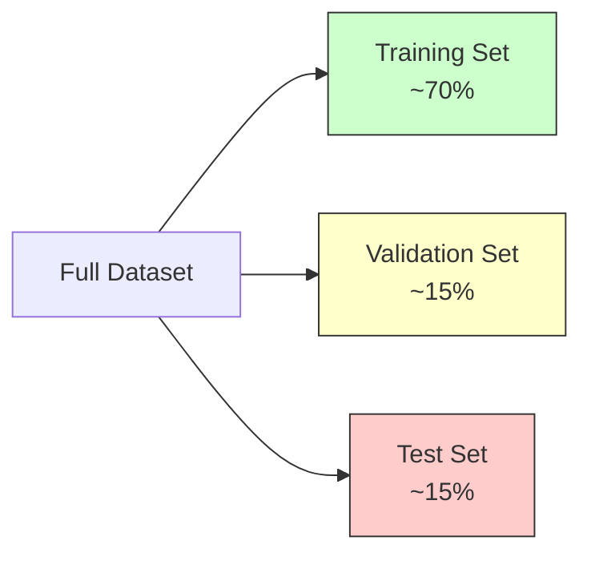

1.  **Training Set (70%):**
    *   **Purpose:** Used to "teach" the model.
    *   **Action:** The algorithm sees $X$ and $Y$, calculates errors, and updates its internal parameters (weights/biases).
2.  **Validation Set (15%):**
    *   **Purpose:** Used for **Model Selection** and **[[Hyperparameter Tuning]]**.
    *   **Action:** Used *during* training to check performance. If the model does well on Training but bad on Validation, we are Overfitting. We use this set to choose parameters like $K$ in KNN or learning rate in Neural Networks.
3.  **Test Set (15%):**
    *   **Purpose:** Final Evaluation.
    *   **Action:** Used **only once** at the very end. It acts as the "Final Exam" to report the real-world accuracy of the model.

> [!DANGER] Critical Rule
> **Never** use the Test Set for training or tuning. If you peek at the Test Set to adjust your model, you commit **Data Leakage**, and your reported accuracy will be fake.

---

## 2. Overfitting vs. Underfitting (Bias-Variance Tradeoff)

### A. Underfitting (High Bias)
*   **Definition:** The model is too simple to capture the underlying structure of the data.
*   **Symptoms:** Poor performance on Training Data AND Poor performance on Validation Data.
*   **Example:** Trying to fit a complex curve with a straight line.
*   **Solution:** Use a more complex model (e.g., add layers to ANN, use polynomial regression).

### B. Overfitting (High Variance)
*   **Definition:** The model is too complex. It memorizes the "noise" and random fluctuations in the training data rather than the pattern.
*   **Symptoms:** Amazing performance on Training Data (near 100%), but Terrible performance on Validation Data.
*   **Example:** Connecting every single dot in a scatter plot with a jagged line.
*   **Solution:** Get more data, simplify the model, use regularization, or stop training earlier (Early Stopping).

---

## 3. Cross-Validation (Robust Evaluation)
When the dataset is small, splitting off 30% for validation/testing might leave too little data for training. We use **Cross-Validation** to solve this.

### K-Fold Cross-Validation
1.  Divide the dataset into $K$ equal parts (folds).
2.  **Iteration 1:** Train on Folds 1-4, Test on Fold 5.
3.  **Iteration 2:** Train on Folds 1,2,3,5, Test on Fold 4.
4.  ...Repeat $K$ times.
5.  **Result:** The final score is the **average** of all $K$ iterations.

This ensures that every data point has been used for testing exactly once, providing a statistically robust estimate of model performance.

# Train-Validation-Test Split

## Overview

In supervised learning, datasets are commonly split into **three disjoint parts**, each serving a distinct purpose in the model development process.

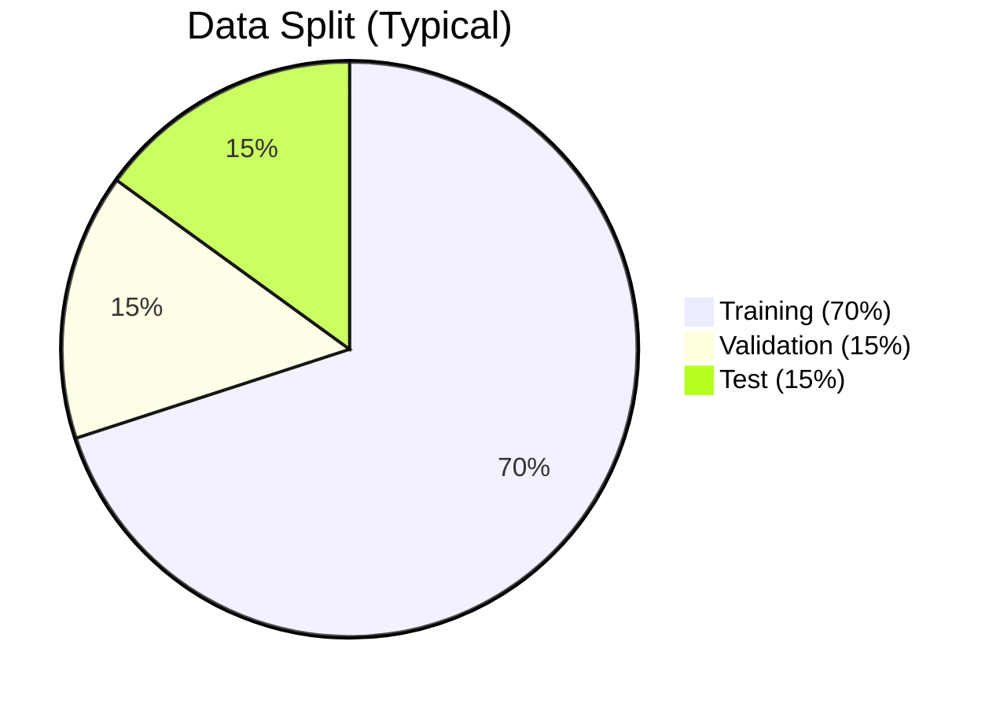

---

## The Three Sets

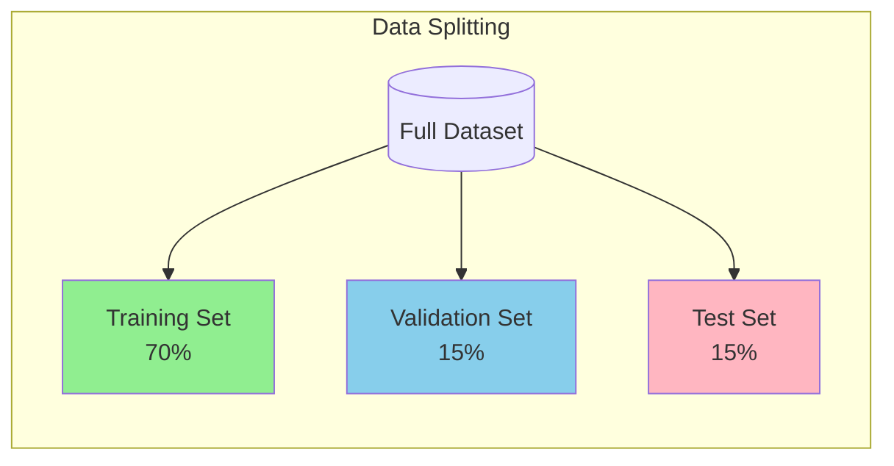

---

## 1. Training Set (70%)

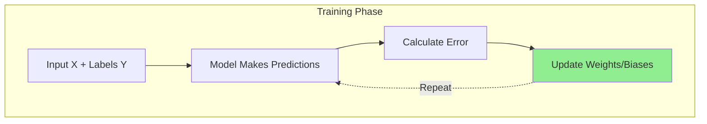

| Aspect | Details |
|--------|---------|
| **Purpose** | Used to "teach" the model |
| **Action** | Algorithm sees X and Y, calculates errors, updates parameters |
| **What It Does** | The model **learns** patterns from this data |

**Key Point:** This is where the model's weights and biases are adjusted through optimization (like gradient descent).

---

## 2. Validation Set (15%)

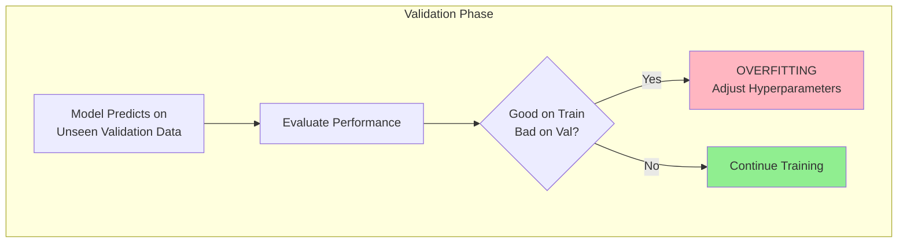

| Aspect | Details |
|--------|---------|
| **Purpose** | **Model Selection** and **Hyperparameter Tuning** |
| **Action** | Used *during* training to check performance |
| **What It Does** | Detects overfitting, guides hyperparameter choices |

### Why Validation Matters

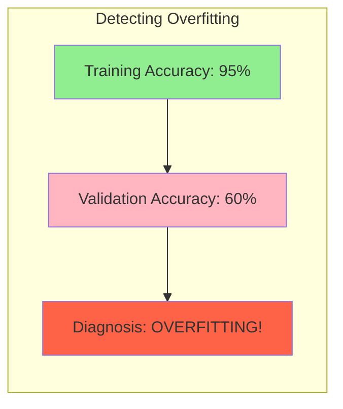

**If model performs well on Training but poorly on Validation → OVERFITTING**

### What We Use Validation For

| Hyperparameter | Example Values to Try |
|----------------|----------------------|
| K in KNN | 3, 5, 7, 9, 11 |
| Learning Rate | 0.001, 0.01, 0.1 |
| Number of Trees (Random Forest) | 50, 100, 200 |
| Max Depth | 5, 10, 20, None |
| Number of Epochs | Early stopping when val loss increases |

---

## 3. Test Set (15%)

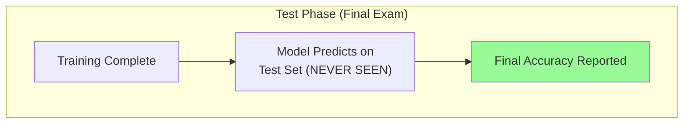

| Aspect | Details |
|--------|---------|
| **Purpose** | **Final Evaluation** |
| **Action** | Used **only once** at the very end |
| **What It Does** | Acts as the "Final Exam" for real-world accuracy |

###  Critical Rule

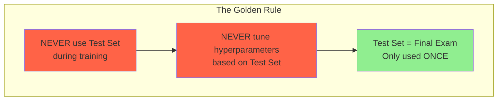

**If you use the Test Set to tune your model, you're cheating!** The test set should represent truly unseen data.

---

# The Validation Step (Deep Dive)

## What Is the Validation Step?

The **validation step** is the phase where:

> The current version of the trained model is evaluated on unseen data (validation set) **without updating parameters**.

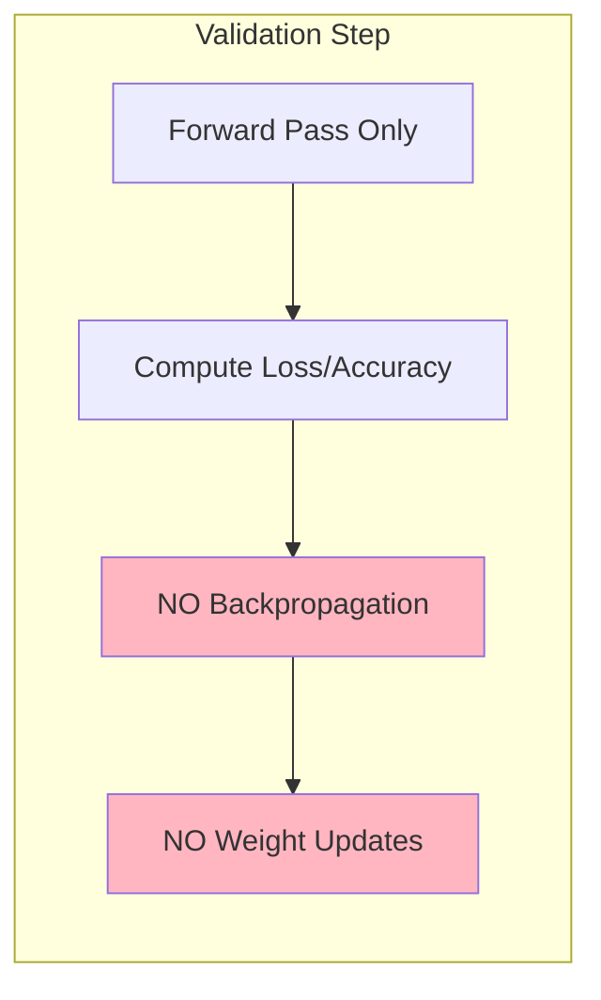

**Formally:**
- No backpropagation
- No weight updates
- No gradient computation
- Only forward pass + metric computation

**Its role is diagnostic and regulatory, not learning.**

It is not part of learning the weights. It is part of **learning how to train the model correctly**.

---

## How It Works During Each Epoch

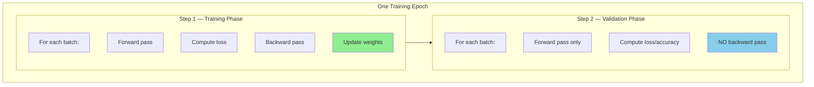

After every epoch, you get:
- Training Loss
- Training Accuracy
- Validation Loss
- Validation Accuracy

These values are tracked over time.

---

## Why the Validation Step Exists

### 1. Detecting Overfitting

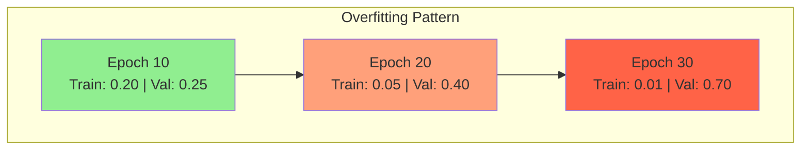

| Epoch | Train Loss | Val Loss | Interpretation |
|-------|------------|----------|----------------|
| 10 | 0.20 | 0.25 |  Good |
| 20 | 0.05 | 0.40 |  Starting to overfit |
| 30 | 0.01 | 0.70 |  Severe overfitting |

**Interpretation:**
- Model keeps improving on training
- Gets worse on validation
- Means: **memorizing, not generalizing**

**Without validation, you would never see this.**

---

### 2. Hyperparameter Selection

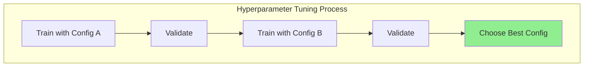

**Hyperparameters cannot be learned by gradient descent.**

| Hyperparameter | What It Controls |
|----------------|------------------|
| Learning Rate | Step size in optimization |
| Batch Size | Samples per gradient update |
| Number of Layers | Network depth |
| K in KNN | Number of neighbors |
| Regularization Strength | Penalty on complexity |
| Dropout Rate | Fraction of neurons to drop |

**Process:**
1. Train model with config A → Validate
2. Train model with config B → Validate
3. Choose best config based on validation performance

**Validation set decides.**

---

### 3. Early Stopping

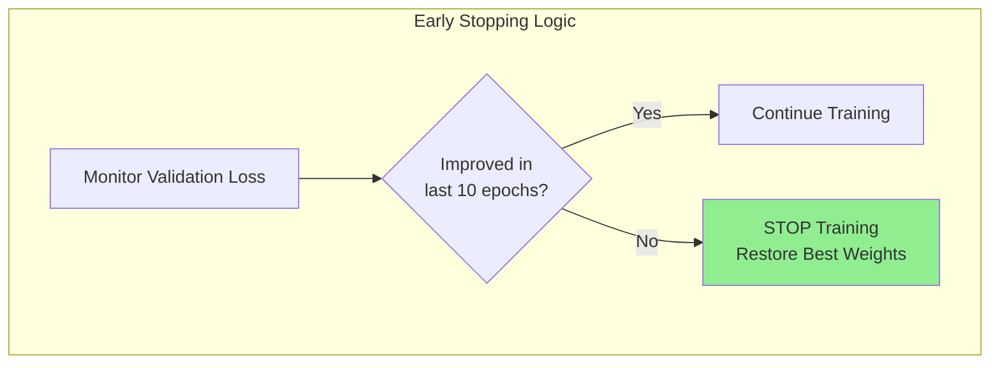

**Rule Example:**
> If validation loss does not improve for 10 epochs → stop training.

This prevents over-training and automatically selects the best epoch.

---

## Validation vs Training vs Test (Key Differences)

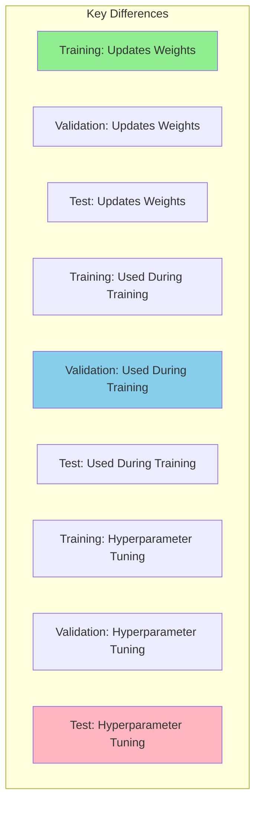

| Property | Training | Validation | Test |
|----------|----------|------------|------|
| **Updates Weights** |  Yes |  No |  No |
| **Used During Training** |  Yes |  Yes |  No |
| **Hyperparameter Tuning** |  No |  Yes |  No |
| **Performance Reporting** |  No |  No |  Yes |
| **Seen by Model** |  Yes | Indirectly |  Never |

**Important:** The model **never learns directly from validation**, but training decisions depend on it.

---

## Mathematical View

Let:
- θ = model parameters (weights)
- λ = hyperparameters

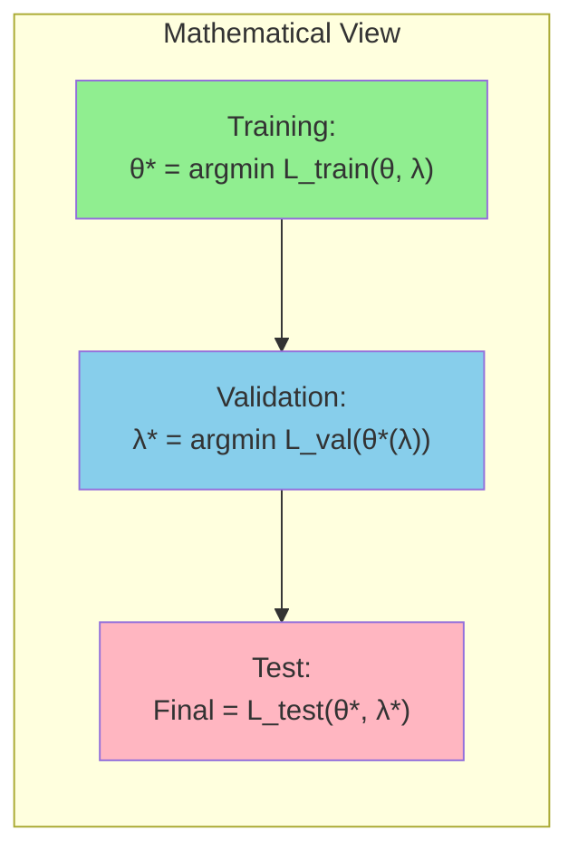

**Meaning:**
- **Training** optimizes θ (weights)
- **Validation** optimizes λ (hyperparameters)
- **Test** evaluates final model

---

## Cross-Validation vs Validation Set

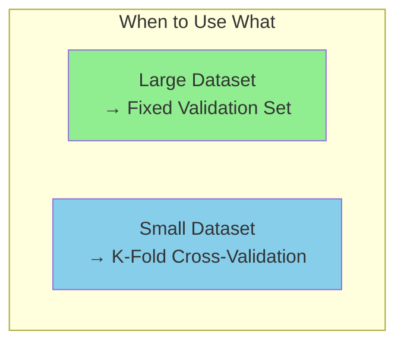

**When you don't have enough data:**

Instead of a fixed validation set, use **K-Fold Cross-Validation**:
- Split data into K folds
- Rotate which fold is validation
- Average results across all folds

This replaces a static validation set when data is limited.

---

## Common Mistakes

### Mistake 1: Tuning on Test Set

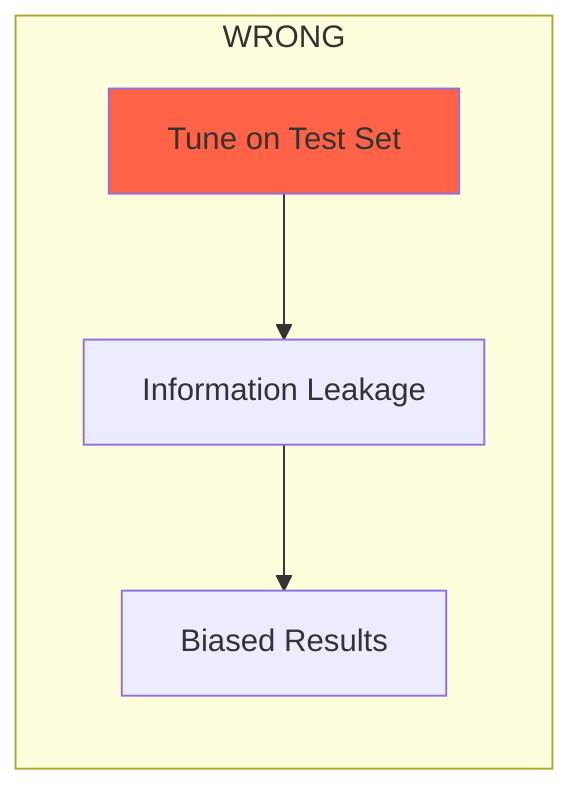

**If you tune using test data → You leak information → Result is biased → Not publishable.**

---

### Mistake 2: Training on Validation Later

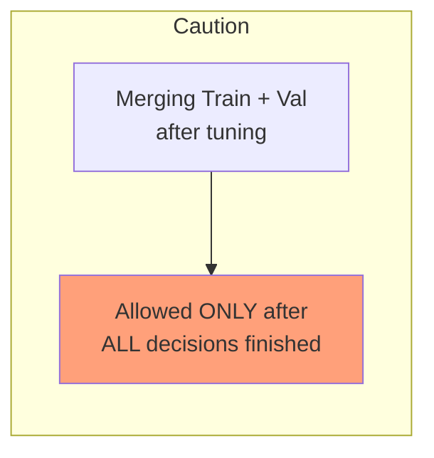

Sometimes people merge train+val after tuning. This is allowed **only after all decisions are finished**.

---

### Mistake 3: Ignoring Validation Curves

```mermaid
flowchart TB
    subgraph Always[" Always Plot"]
        A1["Train vs Val Loss"]
        A2["Train vs Val Accuracy"]
    end
    
    style A1 fill:#90EE90
    style A2 fill:#90EE90
```

Only looking at final accuracy hides overfitting. **Always plot curves over time.**

---

## Mental Model

```mermaid
mindmap
    root((ML Process))
        Training
            Learning
            Updates weights
            Like studying
        Validation
            Supervision
            Checks if learning correctly
            Like practice exams
        Test
            Certification
            Final proof
            Like final exam
```

| Phase | Analogy | Purpose |
|-------|---------|---------|
| **Training** | Learning / Studying | Makes you better |
| **Validation** | Supervision / Practice Exams | Checks if you're learning correctly |
| **Test** | Certification / Final Exam | Proves your ability |

---

## Why Validation Matters (Opinion)

> Validation is one of the most underestimated parts of ML.

Many "good" models are actually:
- Overfit models with bad validation discipline
- Poorly tuned models with no early stopping
- Models optimized on leaked test data

**A clean validation pipeline matters more than fancy architectures.**

**If validation is wrong, your results are meaningless.**

---

## Comparison Table

| Set | Purpose | When Used | Can Model "See" It? |
|-----|---------|-----------|---------------------|
| **Training** | Learn patterns | Throughout training |  Yes (weights updated) |
| **Validation** | Tune & detect overfitting | During training |  No (only evaluation) |
| **Test** | Final evaluation | Once at the end |  No (final exam) |

---

## Visual: The Complete Workflow

```mermaid
flowchart TB
    subgraph Workflow["ML Development Workflow"]
        Start[("Full Dataset")]
        
        Start --> Split["Split Data<br/>70/15/15"]
        
        Split --> Train["Training Set"]
        Split --> Val["Validation Set"]
        Split --> Test["Test Set"]
        
        Train --> Learn["Train Model<br/>(Update Weights)"]
        Val --> Check["Validate<br/>(Check Overfitting)"]
        
        Check --> Tune["Tune Hyperparameters"]
        Tune --> Learn
        
        Learn --> Done["Training Complete"]
        Done --> Final["Evaluate on Test Set<br/>(Final Score)"]
    end
    
    style Final fill:#90EE90
```

---

## Analogy: Student Learning

| Set | Student Analogy |
|-----|-----------------|
| **Training** | Textbook, notes, practice problems (student learns from these) |
| **Validation** | Practice exams (check understanding, adjust study methods) |
| **Test** | Final exam (never seen before, real measure of knowledge) |

---

## Common Split Ratios

| Ratio | When to Use |
|-------|-------------|
| **70/15/15** | Standard, balanced approach |
| **80/10/10** | Large datasets, less need for validation |
| **60/20/20** | Small datasets, need more validation reliability |
| **98/1/1** | Very large data (millions of samples) |

---

## Quick Memory Aid

| Set | Purpose | Remember As |
|-----|---------|-------------|
| **Training** | Learn | "Textbook" - model learns here |
| **Validation** | Tune | "Practice Exam" - adjust hyperparameters |
| **Test** | Evaluate | "Final Exam" - used ONCE for final score |

**Training = Learn | Validation = Tune | Test = Final Score**

# Cross-Validation (K-Fold)

## Definition
**Cross-validation** is a technique to evaluate model performance by splitting data into multiple training/validation sets.

---

## K-Fold Cross-Validation Visual

```mermaid
block-beta
    columns 5
    
    block:fold1
        A1["TEST"]
        A2["TRAIN"]
        A3["TRAIN"]
        A4["TRAIN"]
        A5["TRAIN"]
    end
    
    block:fold2
        B1["TRAIN"]
        B2["TEST"]
        B3["TRAIN"]
        B4["TRAIN"]
        B5["TRAIN"]
    end
    
    block:fold3
        C1["TRAIN"]
        C2["TRAIN"]
        C3["TEST"]
        C4["TRAIN"]
        C5["TRAIN"]
    end
    
    block:fold4
        D1["TRAIN"]
        D2["TRAIN"]
        D3["TRAIN"]
        D4["TEST"]
        D5["TRAIN"]
    end
    
    block:fold5
        E1["TRAIN"]
        E2["TRAIN"]
        E3["TRAIN"]
        E4["TRAIN"]
        E5["TEST"]
    end
```

**Final Score = Average of all 5 fold scores**

---

## How It Works

```mermaid
flowchart LR
    A[Full Dataset] --> B[Split into K parts]
    B --> C[Train on K-1 folds]
    C --> D[Validate on 1 fold]
    D --> E[Repeat K times]
    E --> F[Average all scores]
    
    style F fill:#90EE90
```

1. **Split data into K equal parts** (folds)
2. **Train on K-1 folds**, validate on 1 fold
3. **Repeat K times**, each fold used as validation once
4. **Average all K scores** for final evaluation

---

## Why Use Cross-Validation?

| Benefit | Explanation |
|---------|-------------|
| **More Reliable Evaluation** | Uses all data for validation eventually |
| **Detects Overfitting** | High variance across folds indicates overfitting |
| **Better for Small Data** | Maximizes use of limited data |
| **Hyperparameter Tuning** | More robust than single train/test split |

---

## Common Values of K

```mermaid
graph LR
    K5["K=5<br/> Recommended"] --- K10["K=10<br/>More thorough"]
    K10 --- KN["K=N<br/>Leave-One-Out"]
    
    style K5 fill:#90EE90
    style K10 fill:#98FB98
    style KN fill:#FFA07A
```

| K Value | Use Case |
|---------|----------|
| **K=5** | Standard choice, good balance |
| **K=10** | More thorough, more computation |
| **K=N** (Leave-One-Out) | Maximum accuracy, very expensive |

---

## Stratified K-Fold

For **imbalanced datasets**, use Stratified K-Fold to maintain class distribution:

```mermaid
flowchart TB
    subgraph Regular["Regular K-Fold (Imbalanced Data)"]
        R1["Fold 1: 80% Class A, 20% Class B"]
        R2["Fold 2: 60% Class A, 40% Class B"]
        R3["Fold 3: 90% Class A, 10% Class B"]
    end
    
    subgraph Stratified["Stratified K-Fold (Balanced)"]
        S1["Fold 1: 70% Class A, 30% Class B"]
        S2["Fold 2: 70% Class A, 30% Class B"]
        S3["Fold 3: 70% Class A, 30% Class B"]
    end
    
    Regular --> Stratified
    
    style R2 fill:#FFA07A
    style R3 fill:#FFB6C1
    style S1 fill:#90EE90
    style S2 fill:#90EE90
    style S3 fill:#90EE90
```

---

## Python Example

```python
from sklearn.model_selection import cross_val_score, KFold
from sklearn.ensemble import RandomForestClassifier

# Set up K-Fold
kf = KFold(n_splits=5, shuffle=True, random_state=42)

# Perform cross-validation
model = RandomForestClassifier()
scores = cross_val_score(model, X, y, cv=kf, scoring='accuracy')

print(f"Fold scores: {scores}")
print(f"Mean accuracy: {scores.mean():.3f}")
print(f"Standard deviation: {scores.std():.3f}")
```

### Stratified Version

```python
from sklearn.model_selection import StratifiedKFold

skf = StratifiedKFold(n_splits=5, shuffle=True, random_state=42)
scores = cross_val_score(model, X, y, cv=skf)
```

---

## Cross-Validation vs Single Split

```mermaid
flowchart TB
    subgraph Single["Single Train/Test Split"]
        ST[One evaluation] --> SR["Result may be lucky/unlucky"]
    end
    
    subgraph CV["K-Fold Cross-Validation"]
        CT[K evaluations] --> CR["Reliable average score"]
    end
    
    style SR fill:#FFA07A
    style CR fill:#90EE90
```

---

## Quick Memory Aid
**Cross-Validation** = Rotate test data → Reliable scores → Use K=5 or K=10

# 1.4. Evaluation Metrics & Confusion Matrix

In Classification problems, "Accuracy" is often a misleading metric. To truly understand how a model performs, we use the **Confusion Matrix**.

## 1. The Confusion Matrix Structure
The matrix compares the **Predicted Class** against the **Actual Class** (Ground Truth).

**Scenario:** Detecting a Disease (Positive = Sick, Negative = Healthy).

| | **Predicted: Positive (1)** | **Predicted: Negative (0)** |
| :--- | :---: | :---: |
| **Actual: Positive (1)** | **TP** (True Positive) | **FN** (False Negative) |
| **Actual: Negative (0)** | **FP** (False Positive) | **TN** (True Negative) |

### Definition of Terms
*   **TP (True Positive):** The patient is Sick, and the model correctly predicted Sick. (Success).
*   **TN (True Negative):** The patient is Healthy, and the model correctly predicted Healthy. (Success).
*   **FP (False Positive):** The patient is Healthy, but the model predicted Sick.
    *   *Also known as:* **Type 1 Error** ("False Alarm").
*   **FN (False Negative):** The patient is Sick, but the model predicted Healthy.
    *   *Also known as:* **Type 2 Error** ("Missed Detection").

> [!TIP] Danger of Errors
> In medicine, a **Type 2 Error (FN)** is usually more dangerous than a Type 1 Error. Missing a sick patient means they don't get treatment. Falsely diagnosing a healthy patient (FP) just leads to more tests.

---

## 2. Calculated Metrics

From the four values in the matrix, we derive specific metrics.

### A. Accuracy
*   **Formula:** $\frac{TP + TN}{Total}$
*   **Meaning:** How often is the model correct overall?
*   **Flaw:** If 99% of patients are healthy, a model that *always* predicts "Healthy" has 99% accuracy but is useless at finding sick people.

### B. Precision
*   **Formula:** $\frac{TP}{TP + FP}$
*   **Meaning:** When the model claims a patient is sick, how confident can we be?
*   **Focus:** Minimizing False Positives.
*   **Use Case:** Email Spam filters (You don't want to lose important emails in the spam folder).

### C. Recall (Sensitivity)
*   **Formula:** $\frac{TP}{TP + FN}$
*   **Meaning:** Out of all the actually sick people, what percentage did we find?
*   **Focus:** Minimizing False Negatives.
*   **Use Case:** Cancer detection, Security screenings.

### D. F1-Score
*   **Formula:** $2 \times \frac{Precision \times Recall}{Precision + Recall}$
*   **Meaning:** The Harmonic Mean of Precision and Recall.
*   **Usage:** This is the go-to metric when you have **imbalanced classes**. It punishes the model if *either* Precision or Recall is low.

### E. Specificity
*   **Formula:** $\frac{TN}{TN + FP}$
*   **Meaning:** The ability to correctly reject healthy patients.

---

## 3. Multi-Class Extension
If you have 3 classes (Cat, Dog, Horse), the logic remains the same but is calculated per class.

**To calculate Precision for "Dog":**
1.  **TP:** Actual Dog predicted as Dog.
2.  **FP:** Cat or Horse predicted as Dog.
3.  **FN:** Actual Dog predicted as Cat or Horse.
4.  Apply the standard formulas.

# Hyperparameter Tuning

## What is a Hyperparameter?

A **hyperparameter** is a configuration setting that is set **before** the training process begins and is **not learned** from the data. Unlike model parameters (like weights and biases in neural networks), hyperparameters control the learning process itself.

### Hyperparameter vs Parameter

| Aspect | Parameter | Hyperparameter |
|--------|-----------|----------------|
| **When Set** | During training | Before training |
| **Learned From** | Data | Not learned from data |
| **Examples** | Weights, biases | Learning rate, K in KNN |
| **Control** | Model behavior | Learning process |

---

## Common Hyperparameters by Algorithm

### 1. K-Nearest Neighbors (KNN)
- **K** (number of neighbors)
- Distance metric (Euclidean, Manhattan)

### 2. Support Vector Machines (SVM)
- **C** (regularization parameter)
- **Gamma** (kernel coefficient)
- Kernel type (linear, RBF, polynomial)

### 3. Neural Networks
- **Learning rate**
- Number of hidden layers
- Number of neurons per layer
- Batch size
- Number of epochs
- Dropout rate
- Activation functions

### 4. Decision Trees & Random Forests
- Max depth
- Min samples split
- Number of trees (for Random Forest)

---

## Why Hyperparameter Tuning Matters

The choice of hyperparameters significantly impacts:

1. **Model Performance**: Poor choices lead to underfitting or overfitting
2. **Training Speed**: Some settings affect convergence time
3. **Generalization**: Proper tuning helps the model work well on unseen data

---

## Hyperparameter Tuning Methods

### 1. Grid Search
Exhaustively tries all combinations of hyperparameter values from a predefined grid.

```python
from sklearn.model_selection import GridSearchCV

param_grid = {
    'n_estimators': [50, 100, 200],
    'max_depth': [None, 10, 20]
}

grid_search = GridSearchCV(model, param_grid, cv=5)
grid_search.fit(X_train, y_train)
```

### 2. Random Search
Randomly samples hyperparameter combinations from specified distributions.

```python
from sklearn.model_selection import RandomizedSearchCV

param_distributions = {
    'n_estimators': [50, 100, 200, 500],
    'max_depth': [None, 10, 20, 30, 50]
}

random_search = RandomizedSearchCV(model, param_distributions, n_iter=10, cv=5)
random_search.fit(X_train, y_train)
```

### 3. Bayesian Optimization
Uses probabilistic models to guide the search toward promising hyperparameter regions.

- More efficient than grid/random search
- Learns from previous evaluations
- Tools: Optuna, Hyperopt, Ray Tune

### 4. Manual Tuning
Domain knowledge-based selection and iterative refinement.

---

## Best Practices

1. **Use [[Cross-Validation]]**: Always evaluate hyperparameters using CV to avoid overfitting
2. **Start Simple**: Begin with coarse grid, then refine
3. **Prioritize**: Focus on hyperparameters with the most impact first
4. **Track Experiments**: Use tools like MLflow, Weights & Biases
5. **Consider Compute**: Balance thoroughness with computational resources

---

## Example: Learning Rate Impact

| Learning Rate | Effect |
|---------------|--------|
| Too High | Overshooting, divergence |
| Too Low | Slow convergence, stuck in local minima |
| Optimal | Fast, stable convergence |

---

## Summary

- **Hyperparameters** are pre-training configuration settings
- They **control** how the model learns, not what it learns
- **Tuning** is the process of finding optimal values
- Methods include **Grid Search**, **Random Search**, and **Bayesian Optimization**

