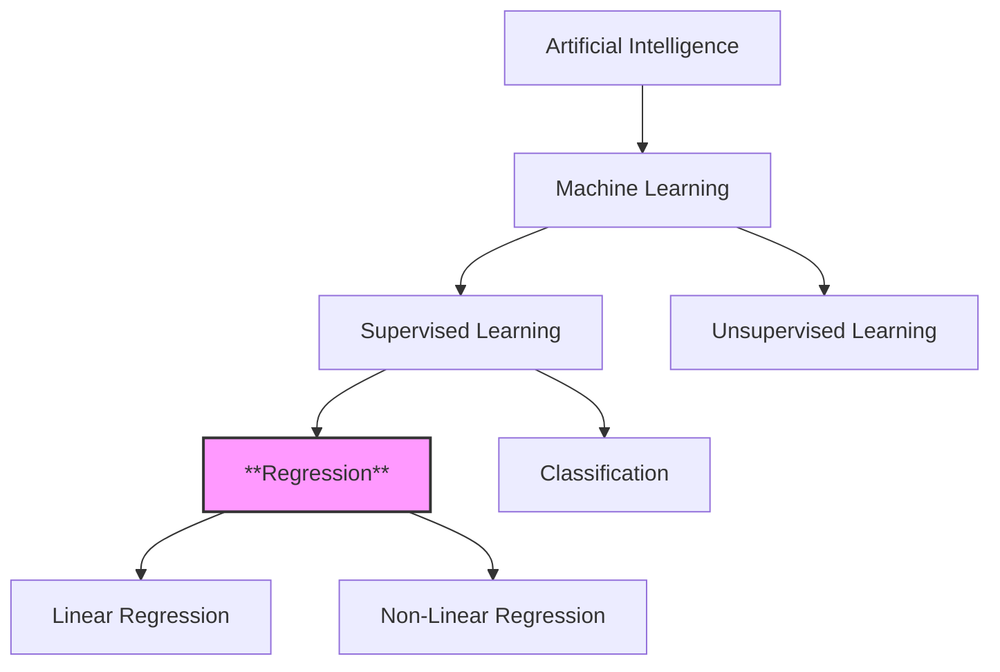
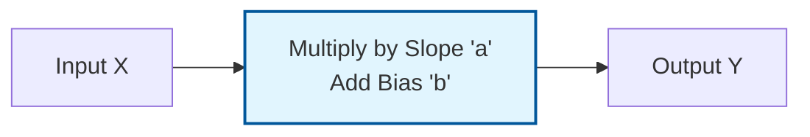
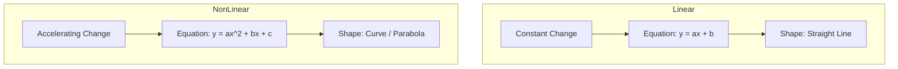
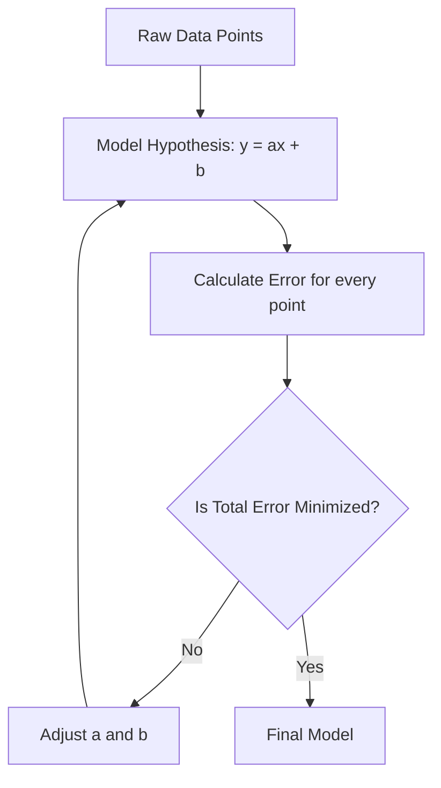
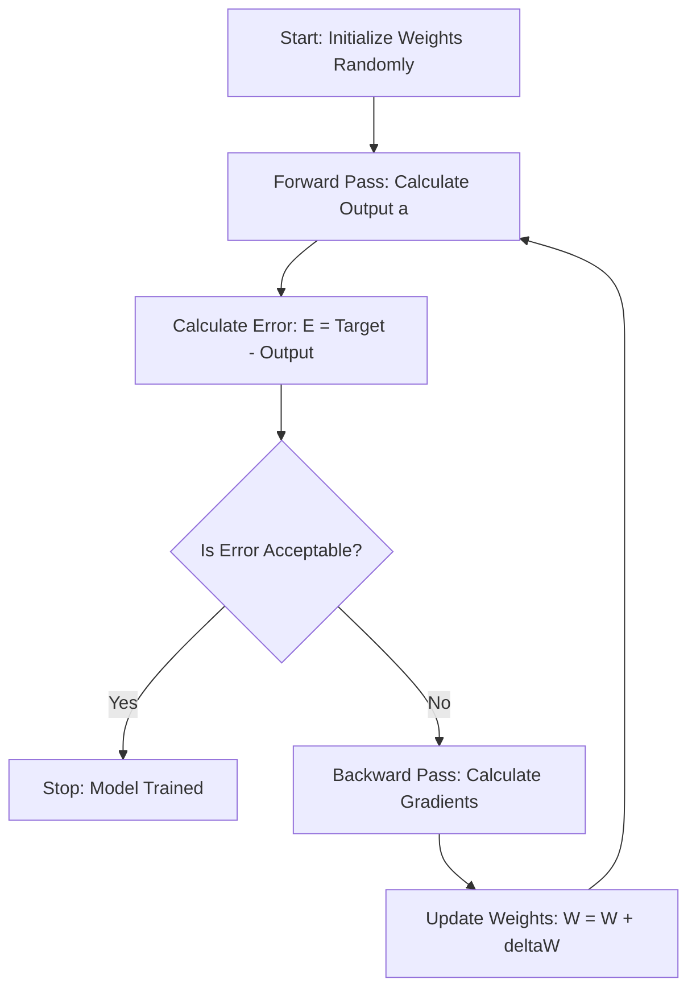
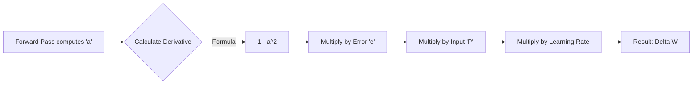
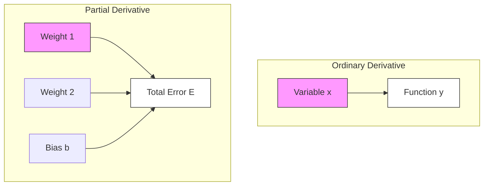
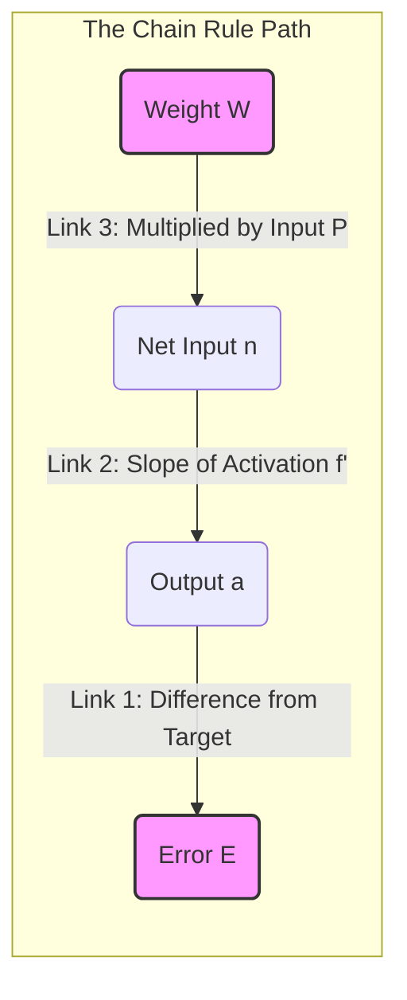
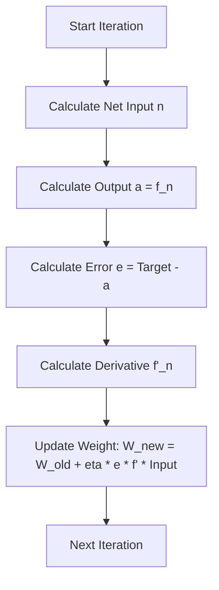
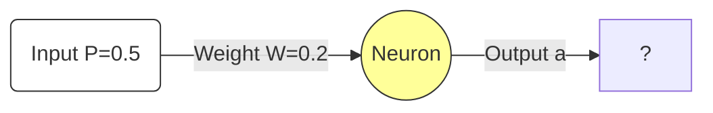

# 1. Regression Fundamentals

## Overview
Regression is a sub-field of **Supervised Machine Learning**. Unlike classification, which predicts a category (e.g., "Sick" or "Healthy"), Regression is used to predict a **continuous numerical value** (e.g., price, temperature, speed, or growth).

### Context in Machine Learning
The source material places Regression clearly within the ML hierarchy:



### The Core Concept: Inputs vs. Outputs
In any regression problem, we are dealing with two main components:
1.  **Vector $X$ (The Input):** Also known as predictors, descriptors, or explanatory variables. This is the data we have.
2.  **Vector $Y$ (The Output):** Also known as the label, target, or correct response. This is the value we want to predict.

> [!INFO] Key Goal
> The goal of regression is to find a mathematical function $f(x)$ such that $f(X) \approx Y$. We want to find the relationship that explains how $Y$ changes when $X$ changes.

---

# 2. Linear Regression

## Definition
Linear Regression attempts to model the relationship between two variables by fitting a linear equation to observed data.

According to your notes, the defining characteristic of linearity is **Constant Variation**.

### The Concept of Constant Variation
In a linear relationship, the "step" or change between two terms is constant. If you increase the input ($x$) by a fixed amount, the output ($y$) increases (or decreases) by a fixed amount.

**Example from Notes (Arithmetic Progression):**
Consider the sequence:
$$10, 20, 30, 40, 50...$$

*   **Observation:** To get from 10 to 20, you add 10. To get from 20 to 30, you add 10.
*   **The Variation ($r$):** The difference is constant ($r = 10$).

### Mathematical Formulation
The notes bridge the gap between distinct mathematical sequences and continuous functions.

#### 1. Sequence Notation (Discrete)
For an arithmetic sequence (a list of numbers with a constant pattern), the formula is:
$$U_n = U_0 + n \cdot r$$
*   $U_n$: The value at step $n$.
*   $U_0$: The starting value (initial term).
*   $n$: The step number.
*   $r$: The constant rate of change (common difference).

**Applying the example:**
$$U_n = 10 + 10n$$
If $n=0$, $U_0 = 10$.
If $n=1$, $U_1 = 20$.

#### 2. Function Notation (Continuous ML Model)
In Machine Learning, we translate this sequence logic into the equation of a line:
$$y = ax + b$$
*   **$y$ (Prediction):** Equivalent to $U_n$.
*   **$x$ (Input Feature):** Equivalent to $n$.
*   **$a$ (Slope/Weight):** Equivalent to $r$. It represents the constant variation.
*   **$b$ (Bias/Intercept):** Equivalent to $U_0$. It represents the starting point when $x=0$.



> [!TIP] Important Reminder
> A linear regression model assumes that the relationship is a **straight line**. It cannot bend. If the real-world data curves, a simple linear model will result in "Underfitting" (it's too simple to capture the pattern).

---

# 3. Non-Linear Regression

## Definition
Non-Linear Regression is required when the data implies that the relationship between $X$ and $Y$ is **not constant**.

According to the notes: **"The variation changes."**
The difference between step 1 and step 2 is not the same as the difference between step 2 and step 3.

### The Concept of Changing Variation
Here, the growth might accelerate or decelerate. You cannot simply "add a fixed number" to get the next value.

**Example from Notes (Geometric Progression):**
Consider the sequence:
$$2, 4, 8, 16, 32...$$

*   **Observation:**
    *   $4 - 2 = 2$
    *   $8 - 4 = 4$
    *   $16 - 8 = 8$
*   **The Variation:** The difference doubles every time. It is not fixed.

### Mathematical Formulation

#### 1. Sequence Notation (Exponential)
For a geometric sequence (where values multiply instead of add), the formula is:
$$U_n = U_0 \cdot q^n$$
*   $U_n$: The value at step $n$.
*   $U_0$: The starting value.
*   $q$: The ratio (factor by which we multiply).

**Applying the example:**
$$U_n = 2 \times 2^n$$
(This describes exponential growth, which is a non-linear shape).

#### 2. Polynomial Function Notation (General ML Model)
In Machine Learning, we handle non-linearity by adding powers to the input features (e.g., squared, cubed).

**The Polynomial Equation:**
$$y = a_0 + a_1x + a_2x^2 + a_3x^3 + ...$$

*   **$x^2$ term:** Creates a parabola (U-shape).
*   **$x^3$ term:** Creates an S-curve shape.

By adding these terms, the line is allowed to curve to fit complex data points.

> [!failure] Common Pitfall
> Students often think "Linear Regression" refers only to straight lines in 2D.
> Actually, "Linear" in Linear Regression technically refers to the *parameters* (weights), but in the context of your slides, the distinction is strictly about the **shape of the output**:
> *   **Linear:** Straight line ($y=ax+b$).
> *   **Non-Linear:** Curves, Exponentials, Parabolas.

### Visual Comparison



---

# 4. Summary: Linear vs. Non-Linear

This table summarizes the key distinctions found on Page 2 of your notes.

| Feature | Linear Regression | Non-Linear Regression |
| :--- | :--- | :--- |
| **Variation** | Constant (The "gap" is always the same) | Changing (The "gap" grows or shrinks) |
| **Math Sequence** | Arithmetic ($U_n = U_0 + n \cdot r$) | Geometric ($U_n = U_0 \cdot q^n$) |
| **Equation Type** | $y = ax + b$ | $y = a_0 + a_1x + a_2x^2 ...$ |
| **Visual Shape** | Straight Line | Curve |
| **Complexity** | Simple, easy to interpret | Complex, fits intricate patterns |

> [!example] Real World Analogies
> *   **Linear:** A taxi fare. It starts at $5.00 (bias) and adds $2.00 for every mile (slope). The cost per mile never changes.
> *   **Non-Linear:** Bacteria growth. 1 becomes 2, 2 becomes 4, 4 becomes 8. The population explosion accelerates over time.

---

# 5. Exercises & Reasoning (Implicit)

While the explicit math exercises are in the Neural Networks section, the regression notes imply a specific exercise in identifying patterns.

**Task:** Identify the type of regression needed for the following data sequence.

**Data A:** `[10, 20, 30, 40]`
1.  **Check Differences:**
    *   $20 - 10 = 10$
    *   $30 - 20 = 10$
    *   $40 - 30 = 10$
2.  **Conclusion:** The difference is constant.
3.  **Model:** Linear Regression ($y = 10x + 10$).

**Data B:** `[2, 4, 8, 16]`
1.  **Check Differences:**
    *   $4 - 2 = 2$
    *   $8 - 4 = 4$
    *   $16 - 8 = 8$
2.  **Conclusion:** The difference is NOT constant (it is changing).
3.  **Model:** Non-Linear Regression (Exponential/Geometric).

> [!note] Critical Takeaway for Exam
> If asked to distinguish between the two, look at the **rate of change**. If the rate of change is stable, use Linear. If the rate of change depends on the current value (e.g., "growth is 10% of current size"), use Non-Linear.

# 2.1. Linear Regression Mechanics

## 1. Definition and Objective
**Linear Regression** is the "Hello World" of Machine Learning algorithms. It is a **Supervised Learning** technique used for **Regression** tasks, meaning the target variable ($Y$) is continuous (a number), not a category.

### The Goal
The objective is to model the relationship between a dependent variable ($Y$) and one or more independent variables ($X$) by fitting a **linear equation** to observed data.

*   **Input ($X$):** The features (e.g., Study Time, House Size).
*   **Output ($Y$):** The target (e.g., Exam Score, House Price).
*   **Model:** A straight line (in 2D) or a hyperplane (in higher dimensions) that passes as close as possible to all data points.

---

## 2. The Linear Hypothesis (Scalar Form)

In its simplest form (Univariate Linear Regression), the relationship is defined by the equation of a line:

$$ \hat{y} = ax + b $$

### Components:
1.  **$x$ (Input/Feature):** The known data point.
2.  **$a$ (Slope / Weight):**
    *   Determines the **steepness** of the line.
    *   Represents the **rate of change**. If $a=2$, it means for every 1 unit increase in $x$, $y$ increases by 2.
    *   *In ML notation:* Often denoted as $w$ (weight) or $\theta_1$.
3.  **$b$ (Y-Intercept / Bias):**
    *   Determines where the line crosses the Y-axis (when $x=0$).
    *   Represents the **baseline**. Even if you study 0 hours ($x=0$), you might still get a score of 10 ($b=10$).
    *   *In ML notation:* Often denoted as $\theta_0$.
4.  **$\hat{y}$ (Prediction):** The value the model *thinks* $y$ should be.

> [!NOTE] Linearity vs. Non-Linearity
> *   **Linear Regression:** Assumes a constant rate of change (Arithmetic Progression). $10, 20, 30 \dots$
> *   **Non-Linear Regression:** Required when the rate of change is not constant (Geometric/Exponential Progression). $2, 4, 8, 16 \dots$. This requires polynomial terms ($x^2, x^3$).

---

## 3. The Best Fit Line
Consider a dataset of students with Study Time vs. Scores.
If we plot the points, they will be scattered. We cannot draw a line that touches *every* point perfectly (unless the data is fake).

*   **The Challenge:** There are infinite possible lines we could draw (infinite combinations of $a$ and $b$).
*   **The Solution:** We must define a metric to measure "how bad" a line is (The Cost Function) and minimize it.



### Visualizing the Error (Residuals)
For any given data point $(x^{(i)}, y^{(i)})$, the **error** is the vertical distance between the actual point and the line.
$$ \text{Error}^{(i)} = y^{(i)} - \hat{y}^{(i)} $$

*   **Positive Error:** The point is above the line (Model underestimated).
*   **Negative Error:** The point is below the line (Model overestimated).

# 2.2. Mathematical Notation & Vectorization

To implement Machine Learning efficiently (and to understand advanced papers), we must move from high-school algebra ($y=ax+b$) to **Linear Algebra (Matrix Notation)**. This allows us to calculate predictions for millions of data points in a single operation.

## 1. Standard Notation Reference

| Symbol | Definition | Dimensions |
| :--- | :--- | :--- |
| **$m$** | Number of training examples (rows in dataset). | Scalar |
| **$n$** | Number of features (columns in dataset). | Scalar |
| **$x^{(i)}$** | The input vector for the $i$-th example. | Vector $(n \times 1)$ |
| **$y^{(i)}$** | The actual target value for the $i$-th example. | Scalar |
| **$\theta$** | The parameter vector (Weights + Bias). | Vector $((n+1) \times 1)$ |
| **$h_\theta(x)$** | The hypothesis function (prediction). | Scalar |

> [!WARNING] Indexing Confusion
> *   **Superscript $(i)$**: Refers to the **Row** (Sample number). $x^{(3)}$ is the 3rd student.
> *   **Subscript $j$**: Refers to the **Column** (Feature number). $\theta_1$ is the weight for the 1st feature.

---

## 2. The Parameter Vector ($\theta$)
Instead of using $a$ and $b$, we use a single vector $\theta$ (Theta).

$$ \theta = \begin{bmatrix} \theta_0 \\ \theta_1 \\ \vdots \\ \theta_n \end{bmatrix} $$

*   **$\theta_0$**: The Bias (formerly $b$).
*   **$\theta_1 \dots \theta_n$**: The Weights for each feature (formerly $a$).

## 3. The Bias Trick (Adding $x_0$)
To make the math work as a single matrix multiplication, we add a "fake" feature $x_0$ to every data point, which is always equal to **1**.

*   Original Equation: $y = \theta_0 + \theta_1 x_1$
*   Vector Equation: $y = \theta_0 \cdot 1 + \theta_1 \cdot x_1$

Now, both terms are a multiplication of a parameter $\theta$ and a feature $x$.

---

## 4. Vectorized Prediction
This is the most important concept for programming efficiency. Instead of writing a `for loop` to calculate predictions for every student, we perform one **Matrix-Vector Multiplication**.

### The Hypothesis Function
$$ h_\theta(x) = \theta^T x $$
*(Note: $\theta^T$ is the transpose of $\theta$. This is simply the dot product).*

### Calculating All Predictions ($\hat{Y}$) at Once
Let $X$ be the "Design Matrix" containing all data, with the column of 1s added.

$$ X = \begin{bmatrix} 
1 & x^{(1)} \\
1 & x^{(2)} \\
\vdots & \vdots \\
1 & x^{(m)}
\end{bmatrix} $$

The prediction vector $\hat{Y}$ is:

$$ \hat{Y} = X \cdot \theta $$

$$ \begin{bmatrix} \hat{y}^{(1)} \\ \hat{y}^{(2)} \\ \vdots \end{bmatrix} = \begin{bmatrix} 1 & x^{(1)} \\ 1 & x^{(2)} \\ \vdots \end{bmatrix} \cdot \begin{bmatrix} \theta_0 \\ \theta_1 \end{bmatrix} $$

> [!TIP] Why Vectorization?
> Modern CPUs and GPUs are optimized for matrix operations (SIMD). Calculating $X \cdot \theta$ is thousands of times faster than looping through rows in Python.

# 2.3. The Cost Function (MSE)

To find the "best" line, we must mathematically define what "best" means. We do this by defining a **Cost Function** (or Loss Function), denoted as $J(\theta)$. The goal of learning is to find the $\theta$ that **minimizes** $J(\theta)$.

## 1. Defining Error
For a single example $i$, the error is the difference between the prediction and the reality:
$$ \text{Error} = h_\theta(x^{(i)}) - y^{(i)} $$

## 2. Mean Squared Error (MSE)
We cannot simply sum the errors, because positive and negative errors would cancel each other out (e.g., $+10$ and $-10$ sum to 0, looking perfect, but the model is actually terrible).

We **square** the errors to ensure they are always positive.

$$ J(\theta) = \frac{1}{2m} \sum_{i=1}^{m} (h_\theta(x^{(i)}) - y^{(i)})^2 $$

### Why this specific formula?
1.  **Squaring $(\dots)^2$**:
    *   Ensures positivity.
    *   **Penalizes large errors:** An error of 10 becomes 100. This forces the model to pay extra attention to outliers (points far from the line).
2.  **Sum $\sum$**: Aggregates the error over the entire dataset.
3.  **Division by $m$**: Calculates the average (Mean), so the error doesn't grow just because we added more data.
4.  **Division by $2$**:
    *   This is a mathematical convenience for Calculus.
    *   When we take the derivative of the squared function $x^2$, the power rule gives us $2x$.
    *   The $\frac{1}{2}$ cancels out the $2$ from the derivative, making the math cleaner later. It does not change the location of the minimum.

---

## 3. Visualizing the Cost Landscape
Imagine a graph where:
*   **X-axis:** Parameter $\theta_0$ (Bias).
*   **Y-axis:** Parameter $\theta_1$ (Slope).
*   **Z-axis (Height):** The Cost $J(\theta)$.

For Linear Regression, this graph always forms a **Convex Bowl** (a Paraboloid).
*   **Convexity Property:** This is crucial. It means there is only **one** Global Minimum. There are no "traps" or local minima where the algorithm can get stuck.
*   **The Bottom of the Bowl:** The coordinates $(\theta_0, \theta_1)$ at the very bottom represent the optimal model parameters.

```mermaid
graph TD
    A[Parameter Space] --> B[Calculate J for every Theta]
    B --> C[Result: 3D Bowl Shape]
    C --> D[Goal: Find the lowest point]

Here are the polished, structured Obsidian notes explaining the mathematics of Gradient Descent, based specifically on **Pages 6 and 7** of your provided material, with additional context to ensure complete understanding.

---

### 1. Gradient Descent Fundamentals

**Filename:** `1. Gradient Descent Fundamentals.md`

#### **1. Introduction**
Gradient Descent is the core optimization algorithm used in Machine Learning (specifically Neural Networks) to "learn."
In the context of the provided slides (Page 1 & 7), "Learning" mathematically means **updating the weights ($W_{ij}$)** of the neural network to minimize the difference between the network's output and the real (expected) output.

#### **2. The Goal: Minimizing Error**
Before understanding the movement (descent), we must understand the landscape (the error function).
*   **$W$ (Weights):** The adjustable parameters of the network.
*   **$E$ (Error):** A function that measures how "wrong" the network is.

The goal is to find the specific set of weights $W$ where $E$ is at its lowest possible point (Global Minimum).

#### **3. Types of Learning Updates**
According to **Page 6**, there are two ways to apply this algorithm:

1.  **Incremental Learning (Stochastic):**
    *   Weights are updated after presenting **one simple** (single data point) at a time.
    *   Formula: $E(k) = \frac{1}{2} e_i^2(k)$
2.  **Batch Learning:**
    *   Weights are updated only after presenting **all $K$ samples** (the whole dataset).
    *   Formula: $E = \frac{1}{K} \sum_{k=1}^{K} E^2(k)$ (Mean Square Error).

> [!TIP] **Student Tip: Why $\frac{1}{2}$?**
> You will often see the error defined as $E = \frac{1}{2}(y - output)^2$.
> Why the $\frac{1}{2}$? It is a mathematical convenience. When we take the derivative of the squared error during Gradient Descent, the power of $2$ comes down and cancels out the $\frac{1}{2}$, making the math cleaner. It does not affect the location of the minimum.

---

### 2. The Weight Update Formula

**Filename:** `2. The Weight Update Formula.md`

This note dissects the fundamental equation found on **Page 7**.

#### **1. The General Update Equation**
To teach the network, we adjust the weights from the current iteration ($k$) to the next iteration ($k+1$).

$$ W_{ij}(k+1) = W_{ij}(k) + \Delta W_{ij}(k) $$

**Dissection:**
*   **$W_{ij}(k+1)$**: The *new* weight value.
*   **$W_{ij}(k)$**: The *old* (current) weight value.
*   **$\Delta W_{ij}(k)$**: The "Delta" or the **change** applied to the weight.

---

#### **2. The Delta Rule ($\Delta W$)**
The magic lies in calculating $\Delta W$. How much do we change the weight, and in which direction?

$$ \Delta W_{ij}(k) = -\eta \cdot \frac{\partial E(k)}{\partial W_{ij}(k)} $$

**Dissection - Part by Part:**

1.  **The Negative Sign ($-$)**:
    *   **Meaning:** We want to go *downhill*.
    *   **Reasoning:** The gradient ($\frac{\partial E}{\partial W}$) points in the direction of the steepest *increase* in error. Since we want to *decrease* error, we subtract the gradient.

2.  **$\eta$ (Eta) - The Learning Rate**:
    *   **Definition:** A scalar value between 0 and 1 ($\eta \in ]0, 1]$).
    *   **Function:** It controls the "step size."
        *   If $\eta$ is too big: You might overstep the minimum and diverge.
        *   If $\eta$ is too small: Learning is very slow.

3.  **$\frac{\partial E(k)}{\partial W_{ij}(k)}$ - The Gradient**:
    *   **Definition:** The partial derivative of the Error with respect to the specific Weight ($W_{ij}$).
    *   **Meaning:** "If I nudge weight $W_{ij}$ slightly, how much does the Total Error change?"

---

### 3. Deriving the Gradient (The Chain Rule)

**Filename:** `3. Deriving the Gradient via Chain Rule.md`

This is the most complex part of **Page 7**, explained step-by-step using the **Chain Rule**. We cannot calculate $\frac{\partial E}{\partial W}$ directly because $E$ doesn't touch $W$ directly. We must go through the layers.

#### **1. The Architecture of Dependencies**
To understand the math, look at the flow of data:
`Input (P) -> Weighted Sum (n) -> Activation Output (a) -> Error (E)`

```mermaid
graph LR
    W[Weight W] -->|affects| n[Net Input n]
    n -->|affects| a[Output a]
    a -->|affects| e[Error e]
    e -->|affects| E[Total Error E]
```

#### **2. The Chain Rule Formula**
We break the derivative into three linkable parts:

$$ \frac{\partial E}{\partial W_{ij}} = \underbrace{\frac{\partial E}{\partial e_i}}_{\text{Part A}} \cdot \underbrace{\frac{\partial e_i}{\partial a_i} \cdot \frac{\partial a_i}{\partial n_i}}_{\text{Part B}} \cdot \underbrace{\frac{\partial n_i}{\partial W_{ij}}}_{\text{Part C}} $$

*(Note: In the slides, $y_i$ is used effectively as $a_i$ or output output)*.

---

#### **3. Dissecting the Parts**

**Part A: Derivative of Error w.r.t Error Term**
Given $E = \frac{1}{2}e_i^2$:
$$ \frac{\partial E}{\partial e_i} = e_i $$

**Part B: Derivative of Error Term w.r.t Net Input**
*   We know $e_i = (y_{target} - a_{output})$.
*   Therefore, the change in error w.r.t output is $-1$.
*   However, the slides simplify this by looking at the derivative of the output function itself.
*   Let's denote the activation function derivative as $f'(n_i)$.

**Part C: Derivative of Net Input w.r.t Weight**
*   The Net Input is $n_i = \sum (W_{ij} \cdot P_j)$.
*   If we differentiate this sum with respect to **one** specific weight $W_{ij}$, all other terms become zero.
*   We are left with the input associated with that weight: **$P_j$** (Input from previous layer).

---

#### **4. Putting it Together (The Final Formula)**
Combining Parts A, B, and C as shown on Page 7:

$$ \Delta W_{ij}(k) = \eta \cdot \underbrace{e_i(k)}_{\text{Error}} \cdot \underbrace{f'(n_i)}_{\text{Slope}} \cdot \underbrace{P_j(k)}_{\text{Input}} $$

*   **$\eta$:** Learning Rate.
*   **$e_i$:** The error (Target - Output).
*   **$f'(n_i)$:** The derivative of the activation function (gradient of the curve).
*   **$P_j$:** The input value coming into that connection.

> [!INFO] **Background Knowledge: The "Local Gradient"**
> Often, the terms $e_i(k) \cdot f'(n_i)$ are grouped together and called $\delta$ (delta).
> This represents the "responsibility" of that specific neuron for the error.

---

### 4. Worked Example: Tanh Activation

**Filename:** `4. Worked Example - Tanh Activation.md`

**Page 7** provides a specific example using the **Hyperbolic Tangent (tanh)** function. Here is the detailed breakdown of that derivation.

#### **1. The Function**
$$ f(n) = \tanh(n) = \frac{e^{n} - e^{-n}}{e^{n} + e^{-n}} $$

#### **2. The Derivative ($f'(n)$)**
To use Gradient Descent, we need the derivative of this function.
The derivative of $\tanh(n)$ is a known identity:
$$ f'(n) = 1 - (f(n))^2 $$
Or, written using the output variable $a$:
$$ f'(n) = 1 - a^2 $$

> [!WARNING] **The Math in the Slides**
> The slides (Page 7) show a complex fraction derivation:
> $\frac{\partial}{\partial n} (\frac{e^{2n}-1}{e^{2n}+1})$
>
> While mathematically correct, it simplifies to the identity above. The key takeaway for the exam is the result: **$1 - \text{output}^2$**.

#### **3. Final Update Rule for Tanh**
Substituting the Tanh derivative back into our main update formula:

$$ \Delta W_{ij} = \eta \cdot e_i(k) \cdot \underbrace{[1 - a_i(k)^2]}_{\text{Derivative of Tanh}} \cdot P_j(k) $$

**Interpretation:**
1.  Calculate the error ($e_i$).
2.  Calculate how "sensitive" the neuron is at its current activation level ($1 - a^2$).
    *   *Note: If output $a$ is near +1 or -1, the slope is near 0. Learning stops. This is called the "Vanishing Gradient" problem.*
3.  Multiply by the input ($P_j$) that caused this activation.
4.  Scale by learning rate $\eta$.
5.  Add this result to the old weight.

#### **4. Summary of Variables (Page 7 notation)**
*   $i = 1 \dots S$ (Number of output neurons).
*   $j = 1 \dots R$ (Number of inputs/previous neurons).
*   $P_j$: Input vector.
*   $e_i$: Error vector.

# 2.4. Gradient Descent Optimization

We have a Cost Function $J(\theta)$ that tells us how bad our model is. Now we need an algorithm to automatically tune $\theta$ to find the minimum cost. We use **Gradient Descent**.

## 1. The Algorithm Intuition
Imagine you are standing on top of a mountain (high cost) at night (blindfolded). You want to reach the valley (minimum cost).
1.  **Feel the slope:** You tap the ground with your foot to find which way is "down."
2.  **Take a step:** You take a small step in the steepest downhill direction.
3.  **Repeat:** You continually check the slope and step until you reach a flat area (the bottom).

## 2. The Mathematical Update Rule
We update the parameters $\theta_j$ iteratively using this formula:

$$ \theta_j := \theta_j - \alpha \frac{\partial}{\partial \theta_j} J(\theta) $$

### Breakdown:
1.  **$\theta_j$**: The parameter we are updating (Bias or Weight).
2.  **$:=$**: Assignment operator (update the old value with the new value).
3.  **$\alpha$ (Alpha)**: The **Learning Rate**.
    *   It controls the **size of the step**.
    *   *If $\alpha$ is too small:* Convergence is agonizingly slow.
    *   *If $\alpha$ is too large:* You might overshoot the valley and diverge (Cost explodes to infinity).
4.  **$\frac{\partial}{\partial \theta_j} J(\theta)$**: The **Gradient** (Partial Derivative).
    *   Mathematically represents the slope of the cost function at the current point.
    *   If slope is positive, we go left (subtract). If slope is negative, we go right (add).

---

## 3. Deriving the Gradient (Calculus)
We need to solve for the derivative of the MSE cost function.

$$ J(\theta) = \frac{1}{2m} \sum (h_\theta(x) - y)^2 $$

Applying the **Chain Rule**:
1.  Derivative of outer function $(\dots)^2$ is $2(\dots)$. The $2$ cancels the $\frac{1}{2}$.
2.  Derivative of inner function $(h_\theta(x) - y)$ with respect to $\theta_j$ is $x_j$.

**Final Gradient Formula:**
$$ \frac{\partial J}{\partial \theta_j} = \frac{1}{m} \sum_{i=1}^{m} (h_\theta(x^{(i)}) - y^{(i)}) \cdot x_j^{(i)} $$

**Final Update Rule:**
$$ \theta_j := \theta_j - \alpha \frac{1}{m} \sum_{i=1}^{m} (\text{Prediction}^{(i)} - \text{Actual}^{(i)}) \cdot \text{Feature}_j^{(i)} $$

---

## 4. Types of Gradient Descent
The formula above sums over $m$ (all examples) for *one* single step. This can be slow.

1.  **Batch Gradient Descent:**
    *   Uses **all $m$ data points** to compute the gradient for one step.
    *   *Pros:* Stable convergence. Optimal for convex problems.
    *   *Cons:* Very slow on massive datasets. Requires huge memory.

2.  **Stochastic Gradient Descent (SGD):**
    *   Uses **one single random data point** to update weights.
    *   *Pros:* Extremely fast.
    *   *Cons:* Noisy convergence (bounces around the bottom).

3.  **Mini-Batch Gradient Descent (Standard):**
    *   Uses a **small batch** (e.g., 32 or 64 samples).
    *   *Pros:* Best of both worlds. Stable enough to converge, fast enough for big data.

Here are the detailed, structured Obsidian notes covering **Gradient Descent** and **Backpropagation** based on pages 6 and 7 of your provided material, enriched with the context from the earlier pages.

---

### 1. Gradient Descent and Learning Basics

This note explains the fundamental theory behind how a neural network "learns" by minimizing error. It covers the types of learning strategies (Batch vs. Incremental) and the definitions of error.

#### **1. Introduction to Learning**
In the context of Neural Networks (like the Multi-Layer Perceptron - MLP), "Learning" is the process of adjusting the weights ($W$) and biases ($b$) to minimize the difference between the **actual output** predicted by the network and the **desired target output**.

> [!INFO] Key Concept
> The network is not "smart" on its own. The "intelligence" comes from the mathematical algorithm (Gradient Descent) that iteratively updates the weights to reduce error.

#### **2. Forward Calculation (Recall)**
Before we can update weights, we must calculate the current state. Based on Page 6, the calculation flows as follows:
1.  **Net Input ($n$):** The weighted sum of inputs plus bias.
    $$ n_j = \sum (x_i \cdot w_{ij}) + b $$
2.  **Activation ($a$):** The result of passing the net input through an activation function (like Sigmoid or Tanh).
    $$ a_j = f(n_j) $$

#### **3. Calculating Error**
To know how much to adjust the weights, we first quantify how "wrong" the network is.

**Notation:**
*   $t_i$ (or $y_{desired}$): The target value (Truth).
*   $a_i$ (or $y_{out}$): The computed output from the network.
*   $e_i(k)$: The error for a specific neuron $i$ at iteration $k$.

**The Error Formula:**
$$ e_i(k) = t_i(k) - a_i(k) $$

**Total Error (Cost Function):**
To measure the performance of the whole layer or dataset, we usually square the error (to remove negative signs and punish large errors more severely).
$$ E(k) = \frac{1}{2} \sum (t_i - a_i)^2 $$
*(Note: The factor $\frac{1}{2}$ is often added to make the derivative cleaner later on, as $\frac{d}{dx} x^2 = 2x$, which cancels the $\frac{1}{2}$.)*

#### **4. Types of Learning (Weight Update Strategies)**
Page 6 distinguishes between two major approaches to updating weights.

**A. Incremental Learning (Stochastic)**
*   **Method:** The weights are updated **immediately** after presenting **one single sample** (one row of data).
*   **Process:**
    1. Input sample 1 $\rightarrow$ Calculate Error $\rightarrow$ Update Weights.
    2. Input sample 2 $\rightarrow$ Calculate Error $\rightarrow$ Update Weights.
*   **Pros:** Can converge faster for large datasets; escapes local minima easier.
*   **Cons:** The error path is "noisy" (zig-zags).

**B. Batch Learning**
*   **Method:** The weights are updated only after presenting **all $K$ samples** (the entire dataset or a large batch).
*   **Process:**
    1. Calculate error for Sample 1.
    2. Calculate error for Sample 2...
    3. Sum all errors (Mean Square Error).
    4. Update Weights **once** based on the average gradient.
*   **Formula (Mean Square Error - MSE):**
    $$ E = \frac{1}{K} \sum_{k=1}^{K} E(k) $$

#### **5. Visualizing the Process**



---

### 2. Backpropagation and The Chain Rule

This note details the mathematical derivation of the **Delta Rule** used to update weights, specifically focusing on the Chain Rule as presented on Page 7.

#### **1. The Goal of Backpropagation**
We want to change a specific weight $W_{ij}$ to reduce the total Error $E$. To do this, we need to find the **derivative** (gradient) of the Error with respect to that Weight.

$$ \frac{\partial E}{\partial W_{ij}} $$

This value tells us: *"If I increase weight $W_{ij}$ slightly, how does the Error change?"*

#### **2. The Weight Update Formula (Delta Rule)**
The general formula for updating a weight at iteration $k+1$ is:

$$ W_{ij}(k+1) = W_{ij}(k) + \Delta W_{ij}(k) $$

Where the change in weight ($\Delta W$) is defined by the Gradient Descent law:

$$ \Delta W_{ij}(k) = - \eta \cdot \frac{\partial E(k)}{\partial W_{ij}(k)} $$

*   **$\eta$ (Eta):** The **Learning Rate**. A value usually between $[0, 1]$.
    *   If $\eta$ is too small: Learning is very slow.
    *   If $\eta$ is too large: The model might overshoot the minimum and never converge.
*   **Minus Sign $(-)$:** We move in the *opposite* direction of the gradient to *minimize* error.

#### **3. Deriving the Gradient using the Chain Rule**
Since $E$ is not directly a function of $W$ (it goes through the activation $a$ and the net input $n$), we must use the **Chain Rule** to link them.

**The Chain:**
1.  Error $E$ depends on Output $a$.
2.  Output $a$ depends on Net Input $n$.
3.  Net Input $n$ depends on Weight $W$.

**The Derivation (Step-by-Step):**

$$ \frac{\partial E}{\partial W_{ij}} = \underbrace{\frac{\partial E}{\partial a_i}}_{\text{Part 1}} \cdot \underbrace{\frac{\partial a_i}{\partial n_i}}_{\text{Part 2}} \cdot \underbrace{\frac{\partial n_i}{\partial W_{ij}}}_{\text{Part 3}} $$

Let's break down the three parts from the handwritten notes (Page 7):

**Part 1: Change in Error w.r.t Output**
Given $E = \frac{1}{2}(t - a)^2$:
$$ \frac{\partial E}{\partial a_i} = -(t_i - a_i) = -e_i $$
*(Note: The notes simplify this term directly into the standard Delta rule format, treating the error term $e_i$ as the driver).*

**Part 2: Change in Output w.r.t Net Input (Derivative of Activation)**
This depends on the function $f(n)$.
$$ \frac{\partial a_i}{\partial n_i} = f'(n_i) $$

**Part 3: Change in Net Input w.r.t Weight**
Since $n_i = \sum W_{ij} P_j + b$:
$$ \frac{\partial n_i}{\partial W_{ij}} = P_j $$
*(Where $P_j$ is the input from the previous layer connected to this weight).*

#### **4. The Final Update Equation**
Combining the parts:

$$ \Delta W_{ij} = \eta \cdot \underbrace{e_i(k)}_{\text{Error}} \cdot \underbrace{f'(n_i)}_{\text{Slope}} \cdot \underbrace{P_j}_{\text{Input}} $$

> [!TIP] Memory Aid
> To update a weight connecting Neuron A to Neuron B:
> **New Weight = Old Weight + (Learning Rate × Error of B × Derivative of B × Output of A)**

---

### 3. Mathematical Example with Tanh Function

This note focuses on the specific mathematical derivation found on Page 7, where the activation function is the **Hyperbolic Tangent (Tanh)**. This is a common exam question format.

#### **1. The Activation Function: Tanh**
The problem specifies the activation function:
$$ f(n) = \tanh(n) = \frac{e^n - e^{-n}}{e^n + e^{-n}} $$

#### **2. Calculating the Derivative $f'(n)$**
To perform backpropagation, we need the derivative of this function.
Recall the quotient rule: $(\frac{u}{v})' = \frac{u'v - v'u}{v^2}$.

Let $u = e^n - e^{-n}$ and $v = e^n + e^{-n}$.
*   $u' = e^n - (-e^{-n}) = e^n + e^{-n}$
*   $v' = e^n + (-e^{-n}) = e^n - e^{-n}$

Applying the quotient rule:
$$ f'(n) = \frac{(e^n + e^{-n})(e^n + e^{-n}) - (e^n - e^{-n})(e^n - e^{-n})}{(e^n + e^{-n})^2} $$

$$ f'(n) = \frac{(e^n + e^{-n})^2 - (e^n - e^{-n})^2}{(e^n + e^{-n})^2} $$

$$ f'(n) = 1 - \left( \frac{e^n - e^{-n}}{e^n + e^{-n}} \right)^2 $$

**Key Identity:**
Since $f(n) = \frac{e^n - e^{-n}}{e^n + e^{-n}}$, we can simplify the derivative to:
$$ f'(n) = 1 - (f(n))^2 $$
Or in the notation of output $a$:
$$ f'(n) = 1 - a^2 $$

> [!IMPORTANT] Exam Note
> This derivation allows the computer to calculate the gradient extremely fast because it already knows $a$ (the output) from the forward pass. It doesn't need to recalculate exponentials.

#### **3. Applying to the Update Rule**
Using the chain rule established in the previous note, and substituting the specific derivative for Tanh.

**For the Output Layer:**
Let $e_i(k)$ be the error at the output.
The update for weight $W_{ij}$ is:

$$ \Delta W_{ij}(k) = \eta \cdot e_i(k) \cdot (1 - a_i(k)^2) \cdot P_j(k) $$

*   $\eta$: Learning Rate.
*   $e_i$: Difference between target and actual output.
*   $(1 - a_i^2)$: The derivative of Tanh (gradient of the neuron).
*   $P_j$: The input coming into this weight.

#### **4. Numeric Example (Hypothetical reconstruction from Page 7 logic)**
If:
*   Target $t = 1$
*   Output $a = 0.6$
*   Input $P = 0.5$
*   Learning Rate $\eta = 0.1$

**Step 1: Calculate Error**
$e = t - a = 1 - 0.6 = 0.4$

**Step 2: Calculate Derivative (Tanh)**
$f'(n) = 1 - a^2 = 1 - (0.6)^2 = 1 - 0.36 = 0.64$

**Step 3: Calculate Weight Change**
$\Delta W = 0.1 \times 0.4 \times 0.64 \times 0.5$
$\Delta W = 0.0128$

**Step 4: Update Weight**
$W_{new} = W_{old} + 0.0128$

#### **5. Summary Flowchart for Tanh Backprop**



Based on your request, here is a detailed note specifically explaining the mathematical notation found in the Backpropagation chapter. This concept is crucial for understanding **why** the formulas look the way they do on Pages 6 and 7.

---

### 4. Mathematical Foundation: Partial vs. Ordinary Derivatives

This note clarifies the difference between the standard derivative symbol ($d$) and the "curly d" symbol ($\partial$) used in Neural Networks.

#### **1. The Symbols**

*   **$d$ (Ordinary Derivative):** Used when a function depends on **only one** variable.
    *   Example: $y = f(x)$. If $x$ changes, $y$ changes. There is no other factor.
*   **$\partial$ (Partial Derivative):** Used when a function depends on **multiple** variables.
    *   Example: $z = f(x, y)$. The value of $z$ depends on both $x$ and $y$.
    *   Pronounced "Del", "Partial", or "Curly D".

#### **2. Why Neural Networks Use $\partial$**

Look at the Neural Network structure on Page 4 or 5. The Total Error ($E$) of the network doesn't depend on just one weight. It depends on **hundreds or thousands** of weights ($W_{11}, W_{12}, W_{21}...$) and biases ($b_1, b_2...$).

Because the Error is a function of *many* variables, we cannot use a normal derivative. We must use **Partial Derivatives**.

> [!INFO] The Intuitive Meaning
> When we write $\frac{\partial E}{\partial W_{ij}}$, we are asking:
>
> **"If I change *only* this specific weight ($W_{ij}$) by a tiny amount, while holding ALL other weights completely frozen (constant), how much does the Error ($E$) change?"**
>
> This allows us to isolate the "blame" (or contribution) of a single connection without worrying about the rest of the network for that specific calculation.

#### **3. The Calculation Rule (The "Constant" Trick)**

The mechanics of calculating a partial derivative are exactly the same as a normal derivative, with one **critical rule**:

**Rule:** When calculating the partial derivative with respect to one variable (e.g., $x$), treat **all other variables (e.g., $y, z$) as if they are just numbers (constants).**

**Mathematical Example:**
Imagine a function:
$$ f(x, y) = x^2 + 3xy + y^2 $$

**Scenario A: Find $\frac{\partial f}{\partial x}$** (Change in function relative to $x$)
1.  Treat $y$ as a constant (like the number 5).
2.  Derivative of $x^2$ is $2x$.
3.  Derivative of $3xy$: Since $3$ and $y$ are constants, they stay. Derivative of $x$ is 1. Result: $3y$.
4.  Derivative of $y^2$: Since $y$ is a constant, $y^2$ is a constant (like 25). Derivative of a constant is **0**.
    $$ \frac{\partial f}{\partial x} = 2x + 3y $$

**Scenario B: Find $\frac{\partial f}{\partial y}$** (Change in function relative to $y$)
1.  Treat $x$ as a constant.
2.  Derivative of $x^2$ is **0** (it's a constant now).
3.  Derivative of $3xy$: $3x$ is constant. Derivative of $y$ is 1. Result: $3x$.
4.  Derivative of $y^2$ is $2y$.
    $$ \frac{\partial f}{\partial y} = 3x + 2y $$

#### **4. Application to Your Slide (Page 7)**

On Page 7 (and in the crop you sent), you see this term inside the Chain Rule:

$$ \frac{\partial n_i}{\partial W_{ij}} $$

Let's break down why the result is what it is.

**Recall the formula for Net Input ($n_i$):**
$$ n_i = W_{i1} \cdot x_1 + W_{i2} \cdot x_2 + W_{i3} \cdot x_3 + ... + b $$

If we want to find the gradient for Weight 1 ($W_{i1}$):
$$ \frac{\partial n_i}{\partial W_{i1}} $$

1.  We look at the first term $W_{i1} \cdot x_1$. The derivative with respect to $W_{i1}$ is just **$x_1$**.
2.  We look at the second term $W_{i2} \cdot x_2$. Since we are focusing on $W_{i1}$, **$W_{i2}$ is treated as a constant**. The whole term becomes 0.
3.  The bias $b$ is treated as a constant. It becomes 0.

**Result:**
$$ \frac{\partial n_i}{\partial W_{ij}} = x_j \quad (\text{or } P_j \text{ in your notes}) $$

This is why the complicated sum formula disappears and leaves only the specific input connected to that weight.

#### **5. Visualizing the Difference**



*   **Left Side (Ordinary):** One path. Changing $x$ accounts for 100% of the change in $y$.
*   **Right Side (Partial):** Many paths. Changing "Weight 1" only accounts for a *part* of the change in $E$. We use $\partial$ to signify we are ignoring the contributions of Weight 2 and Bias for a moment.

#### **6. Summary for Exam**
*   **Symbol:** $\partial$ means "Partial Derivative".
*   **When to use:** When calculating Error in a Neural Network (because Error depends on many weights).
*   **How to solve:** Pretend every variable except the one you are calculating for is a plain number (constant).
    *   If the term doesn't contain your variable, it becomes **Zero**.
    *   If the term is multiplied by your variable, only the multipliers remain.

Here is a specific, detailed note to clear up the confusion about "wrt" and the Chain Rule. This is often the biggest stumbling block in understanding neural networks, so we will break it down into plain English before looking at the math.

---

### 5. Understanding the Math Notation (Chain Rule & wrt)

**Filename:** `5. Understanding the Math Notation.md`

#### **1. What does "wrt" mean?**

**"wrt"** stands for **"With Respect To"**.

In calculus and machine learning, we are always measuring **change**. But things depend on many different factors. "With respect to" tells you specifically which factor we are looking at right now.

**Analogy:**
Imagine you are driving a car.
*   If you press the gas pedal harder, the car goes faster.
    *   Math: The change in **Speed** *with respect to* **Gas Pedal Pressure**.
*   If the road goes uphill, the car slows down.
    *   Math: The change in **Speed** *with respect to* **Road Incline**.

In Gradient Descent:
We want to know: "How does the **Error ($E$)** change **with respect to** the **Weight ($W$)**?"
*   Notation: $\frac{\partial E}{\partial W}$
*   Meaning: If I wiggle this weight $W$ just a tiny bit, how much does the Error $E$ go up or down?

---

#### **2. The Chain Rule: The "Blame Game"**

The **Chain Rule** is used when two things are connected, but not directly.

**The Problem:**
You want to know how the **Weight ($W$)** affects the **Error ($E$)**.
But the Weight doesn't touch the Error directly. There are steps in between.

**The Flow of the Network:**
1.  The **Weight ($W$)** determines the strength of the signal entering the neuron (Net Input $n$).
2.  The **Net Input ($n$)** determines what the neuron outputs (Activation $a$).
3.  The **Output ($a$)** is compared to the target to calculate the **Error ($E$)**.

$$ \text{Weight } W \rightarrow \text{Net Input } n \rightarrow \text{Output } a \rightarrow \text{Error } E $$

**The Logic:**
If we want to know the relationship between the first item ($W$) and the last item ($E$), we have to multiply the relationships of every step in between.

**The Formula (In English):**
$$ (\text{Effect of } W \text{ on } E) = (\text{Effect of } W \text{ on } n) \times (\text{Effect of } n \text{ on } a) \times (\text{Effect of } a \text{ on } E) $$

---

#### **3. Dissecting the Formula on Page 7**

Now let's look at the math symbols from your slide again.

$$ \frac{\partial E}{\partial W_{ij}} = \frac{\partial E}{\partial a_i} \cdot \frac{\partial a_i}{\partial n_i} \cdot \frac{\partial n_i}{\partial W_{ij}} $$

*(Note: Sometimes $y$ is used instead of $a$, and $e$ instead of $E$, but the structure is identical).*

Let's break this chain into its three links:

**Link 1: $\frac{\partial E}{\partial a_i}$ (Error wrt Output)**
*   **Question:** If the Output changes, how much does the Error change?
*   **Calculation:** The Error is usually $(Target - Output)$. So if Output goes up, Error goes down.
*   **Result in Slide:** This gives us the term $e_i$ (or strictly $-e_i$, but the negative is handled in the update rule).

**Link 2: $\frac{\partial a_i}{\partial n_i}$ (Output wrt Net Input)**
*   **Question:** If the incoming signal (Net Input) changes, how much does the actual Output change?
*   **Context:** This depends on the **Activation Function** (like Sigmoid, Tanh, or ReLU).
*   **Calculation:** This is the slope (derivative) of the activation curve.
*   **Result in Slide:** This gives us the term $f'(n)$.

**Link 3: $\frac{\partial n_i}{\partial W_{ij}}$ (Net Input wrt Weight)**
*   **Question:** If we change the Weight, how much does the Net Input change?
*   **Calculation:** Since $n = W \cdot P$ (Weight $\times$ Input), the derivative is just the Input $P$.
*   **Result in Slide:** This gives us the term $P_j$ (The input value).

---

#### **4. Summary Diagram**

Here is how the Chain Rule connects the "Start" (Weight) to the "End" (Error).



**Final Conclusion:**
When the slide says:
$$ \Delta W = \eta \cdot e_i \cdot f'(n) \cdot P_j $$
It is simply multiplying the three links of the chain together so we know exactly how to adjust the weight to fix the error.

Here are the complete, detailed notes covering the mathematics of Gradient Descent and its derivation as shown in your slides (specifically Pages 6 and 7).

I have structured this to first explain the symbols, then the "Chain Rule" logic (answering your question about "wrt"), and finally the specific derivation for the Tanh function found on the slide.

---

### 1. Mathematical Notation and Symbols

**Filename:** `1. Mathematical Notation and Symbols.md`

Before solving the equations, we must define the "vocabulary" used in **Page 6 and 7**. If you misunderstand a symbol, the math will not make sense.

#### **Variables Definitions**
*   **$W_{ij}$ (Weight):** The strength of the connection between input neuron $j$ and output neuron $i$. This is what the network "learns" by changing.
*   **$k$ (Iteration):** Time step. $W(k)$ is the weight now; $W(k+1)$ is the weight after the update.
*   **$P_j$ (Input Pattern):** The input data entering the neuron (e.g., a pixel value or a feature).
*   **$n_i$ (Net Input):** The weighted sum calculated inside the neuron before activation.
    $$ n_i = \sum (W_{ij} \cdot P_j) + \text{bias} $$
*   **$a_i$ or $y_i$ (Output):** The final result coming out of the neuron after the activation function is applied.
*   **$d_i$ or $g_i$ (Target):** The "desired" or correct answer we want the network to produce.
*   **$e_i$ (Error Signal):** The difference between the Target and the Output.
    $$ e_i = d_i - a_i $$
*   **$\eta$ (Eta - Learning Rate):** A small number (e.g., 0.01) that controls how big our steps are.

---

### 2. The Core Logic: Gradient Descent

**Filename:** `2. The Core Logic - Gradient Descent.md`

#### **1. The Goal**
We want to minimize the **Total Error ($E$)**.
To do this, we must adjust the weights ($W$). The question is: **"In which direction do we move $W$, and by how much?"**

#### **2. The Update Formula**
This is the fundamental equation of learning (Page 7, top left):

$$ W(k+1) = W(k) + \Delta W(k) $$

*   **$W(k)$**: The old weight.
*   **$\Delta W(k)$**: The adjustment (Delta).

#### **3. Calculating Delta ($\Delta W$)**
To find the adjustment, we use the derivative. We want to move *against* the slope of the error.

$$ \Delta W = - \eta \cdot \frac{\partial E}{\partial W} $$

*   **The Negative Sign ($-$)**: Meaning "Go downhill" (minimize error).
*   **$\frac{\partial E}{\partial W}$**: The Gradient. This reads as "The change in Error **with respect to** the change in Weight."

---

### 3. Deriving the Gradient (The Chain Rule)

**Filename:** `3. Deriving the Gradient via Chain Rule.md`

This is the detailed explanation of the complex formulas on **Page 7**.

#### **1. Why use the Chain Rule?**
We want to calculate $\frac{\partial E}{\partial W}$ (Change in Error wrt Weight).
However, $W$ is deep inside the equation.
1.  $W$ affects the Net Input ($n$).
2.  $n$ affects the Output ($a$).
3.  $a$ affects the Error ($E$).

We must multiply the derivatives of these three steps. This is the **Chain Rule**.

#### **2. The Chain Rule Formula**
$$ \frac{\partial E}{\partial W_{ij}} = \frac{\partial E}{\partial a_i} \cdot \frac{\partial a_i}{\partial n_i} \cdot \frac{\partial n_i}{\partial W_{ij}} $$

Let's break down each of the three terms (Links):

#### **Link 1: $\frac{\partial E}{\partial a_i}$ (Error wrt Output)**
*   **Concept:** How much does the total error change if the output changes?
*   **Math:**
    *   Assume $E = \frac{1}{2}(Target - Output)^2$.
    *   The derivative moves the 2 down, canceling the $\frac{1}{2}$.
    *   We are left with $-(Target - Output)$, which is the negative Error ($-e_i$).
*   **Result:** This term represents the **Error Magnitude**.

#### **Link 2: $\frac{\partial a_i}{\partial n_i}$ (Output wrt Net Input)**
*   **Concept:** How much does the output change if the sum inside the neuron changes?
*   **Math:** This depends entirely on the Activation Function used (Sigmoid, Tanh, ReLU).
*   **Result:** This is the slope of the activation function, written as **$f'(n)$**.

#### **Link 3: $\frac{\partial n_i}{\partial W_{ij}}$ (Net Input wrt Weight)**
*   **Concept:** How much does the internal sum change if we tweak one weight?
*   **Math:**
    *   Formula for Net Input: $n_i = W_{i1}P_1 + W_{i2}P_2 + \dots$
    *   If we differentiate with respect to $W_{ij}$, all other terms disappear except the input $P_j$ attached to that weight.
*   **Result:** This is simply the **Input Value ($P_j$)**.

---

### 4. The Final Update Equation

**Filename:** `4. The Final Update Equation.md`

Now we combine the links from the previous note.

$$ \frac{\partial E}{\partial W} = (-e_i) \cdot (f'(n_i)) \cdot (P_j) $$

Substitute this back into our Delta formula ($\Delta W = -\eta \cdot \text{Gradient}$).
The two negative signs cancel out ($-\eta \times -e_i$).

#### **The Grand Formula (Memorize This)**

$$ \Delta W_{ij} = \eta \cdot \underbrace{e_i}_{\text{Error}} \cdot \underbrace{f'(n_i)}_{\text{Slope}} \cdot \underbrace{P_j}_{\text{Input}} $$

**In simple English:**
"To update a weight, multiply the **Learning Rate** by the **Error**, multiply that by the **steepness of the curve**, and multiply that by the **Input** that came through that connection."

---

### 5. Detailed Example: Tanh Function

**Filename:** `5. Detailed Example - Tanh Function.md`

**Page 7** devotes half the page to this specific example. Here is the step-by-step breakdown.

#### **1. The Activation Function**
The Hyperbolic Tangent (Tanh) maps inputs to a range between -1 and 1.
$$ f(n) = \tanh(n) = \frac{e^{n} - e^{-n}}{e^{n} + e^{-n}} $$

#### **2. The Derivative (The Hard Math on Slide 7)**
We need $f'(n)$ for our update formula.
The slide performs a derivation involving exponentials. However, there is a famous trigonometric identity for the derivative of Tanh:

$$ \frac{d}{dn} \tanh(n) = 1 - \tanh^2(n) $$

Since the output of the neuron $a_i = \tanh(n)$, we can substitute:

$$ f'(n) = 1 - a_i^2 $$

> [!NOTE] **Why is this cool?**
> We don't need to do complex calculus during the computer simulation. We just take the current output ($a_i$), square it, and subtract it from 1. That gives us the slope!

#### **3. The Tanh Update Rule**
Substituting $(1 - a_i^2)$ into our Grand Formula:

$$ \Delta W_{ij} = \eta \cdot e_i(k) \cdot \underbrace{[1 - a_i(k)^2]}_{\text{Derivative term}} \cdot P_j(k) $$

#### **4. Slide Walkthrough (Page 7 - Bottom Right)**
The slide writes:
$$ \Delta W_{ij}(k) = 2 \cdot \eta \cdot e_i(k) \dots $$
*Wait, where did the 2 come from?*
Sometimes, the Sigmoid or Tanh definitions vary slightly (e.g., using $2n$ instead of $n$).
*   If $f(n) = \tanh(n)$, derivative is $1 - a^2$.
*   If $f(n) = \tanh(2n)$, derivative is $2(1 - a^2)$.

**Key Takeaway for Exam:**
Look closely at the formula provided in the exam question.
1.  Identify the activation function.
2.  Find its derivative.
3.  Plug it into the slot: $\Delta W = \eta \cdot \text{Error} \cdot \mathbf{Derivative} \cdot \text{Input}$.



Here is a complete, step-by-step numerical example. This is designed to show you exactly how the formula derived in the previous notes is applied in a real calculation.

We will use the **Tanh (Hyperbolic Tangent)** activation function, as this matches the complex derivation on **Page 7** of your slides.

---

### 6. Gradient Descent - Complete Numerical Example

**Filename:** `6. Gradient Descent - Complete Numerical Example.md`

#### **1. The Scenario**

We have a single neuron with one input. We want to train it for **one single iteration**.

**Initial Parameters:**
*   **Input ($P$):** $0.5$
*   **Initial Weight ($W$):** $0.2$
*   **Target Output ($d$):** $0.8$ (We want the neuron to output 0.8)
*   **Learning Rate ($\eta$):** $0.1$
*   **Activation Function:** $f(n) = \tanh(n)$

**Goal:** Update the weight $W$ so the output gets closer to $0.8$.



---

#### **2. Step 1: The Forward Pass**
First, we must calculate what the neuron *currently* thinks.

1.  **Calculate Net Input ($n$):**
    $$ n = W \times P $$
    $$ n = 0.2 \times 0.5 = 0.1 $$

2.  **Calculate Output ($a$):**
    Apply the activation function ($\tanh$).
    $$ a = \tanh(0.1) $$
    $$ a \approx 0.0996 $$

> [!INFO] **Current Status**
> The network output is **0.0996**.
> The target is **0.8**.
> The network is currently outputting a value that is *too low*. We expect the weight to *increase*.

---

#### **3. Step 2: Calculate Error**
How wrong is the network?

$$ e = \text{Target} - \text{Output} $$
$$ e = 0.8 - 0.0996 = 0.7004 $$

*   **$e \approx 0.7004$**

---

#### **4. Step 3: Calculate the Derivative (Slope)**
We need to know the slope of the Tanh curve at our current position ($n=0.1$).
From our previous derivation note, we know the derivative of Tanh is $(1 - \text{output}^2)$.

$$ f'(n) = 1 - a^2 $$
$$ f'(n) = 1 - (0.0996)^2 $$
$$ f'(n) = 1 - 0.0099 $$
$$ f'(n) = 0.9901 $$

*   **Slope $\approx 0.9901$**

---

#### **5. Step 4: The Backward Pass (Weight Update)**
Now we use the **Grand Formula** derived from the Chain Rule.

**The Formula:**
$$ \Delta W = \eta \cdot e \cdot f'(n) \cdot P $$

**Plug in the numbers:**
1.  **$\eta$ (Learning Rate):** $0.1$
2.  **$e$ (Error):** $0.7004$
3.  **$f'(n)$ (Slope):** $0.9901$
4.  **$P$ (Input):** $0.5$

$$ \Delta W = 0.1 \times 0.7004 \times 0.9901 \times 0.5 $$

**Calculate:**
$$ \Delta W = 0.1 \times 0.3467 $$
$$ \Delta W = 0.0347 $$

*   **The Adjustment ($\Delta W$) is $+0.0347$.**

---

#### **6. Step 5: Final Update**
Apply the change to the old weight.

$$ W_{new} = W_{old} + \Delta W $$
$$ W_{new} = 0.2 + 0.0347 $$
$$ W_{new} = 0.2347 $$

---

#### **7. Verification (Did it work?)**
Let's see if this new weight actually improves the result.
Let's run a "Forward Pass" again with **$W = 0.2347$**.

1.  **New Net Input:** $0.2347 \times 0.5 = 0.11735$
2.  **New Output:** $\tanh(0.11735) \approx 0.1168$

**Comparison:**
*   **Old Output:** $0.0996$
*   **New Output:** $0.1168$
*   **Target:** $0.8$

**Conclusion:** The output moved from $0.0996$ up to $0.1168$. It got closer to the target ($0.8$). The Gradient Descent step was **correct**.

