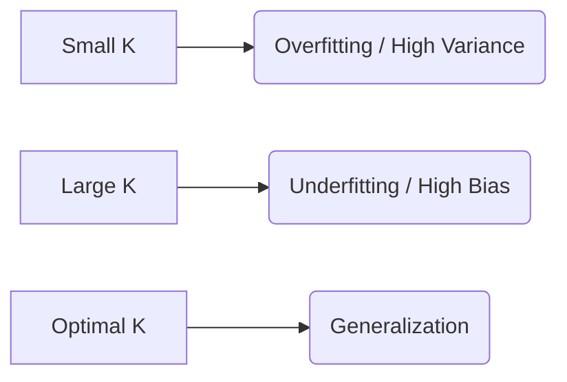

# 4.1. The KNN Algorithm & Lazy Learning

## 1. Definition and Fundamental Logic
**K-Nearest Neighbors (KNN)** is a non-parametric, supervised learning algorithm used for both **classification** and **regression**. Its logic is based on the **Similarity Principle**: *Data points that are close to each other in the feature space are likely to share the same properties or labels.*

In simple terms: "Tell me who your neighbors are, and I'll tell you who you are."

---

## 2. The Concept of "Lazy Learning"
KNN is categorized as a **Lazy Learner** (or Instance-Based Learner). This distinguishes it from "Eager Learners" like Neural Networks or Linear Regression.

### Eager Learners (e.g., ANN, Regression):
*   **Training Phase:** They spend a lot of time analyzing data to find weights ($W$) and a mathematical function ($f$).
*   **Prediction Phase:** Very fast. They just plug the new $X$ into the formula.
*   **Memory:** They can throw away the training data once the model is "built."

### Lazy Learners (KNN):
*   **Training Phase:** Practically zero. The algorithm simply **stores** (memorizes) the entire training dataset.
*   **Prediction Phase:** Very slow. Every time a new prediction is needed, the algorithm must calculate distances to every single point in its memory.
*   **Memory:** It must keep the entire dataset in RAM at all times.

---

## 3. Step-by-Step Algorithm Logic
When a new, unknown data point $X_{new}$ arrives, the algorithm follows these rigorous steps:

1.  **Select $K$:** Choose the number of neighbors to consider (e.g., $K=3$).
2.  **Calculate Distances:** Compute the distance between $X_{new}$ and **every single point** in the training database.
3.  **Sort:** Rank all training points based on their distance to $X_{new}$ (from closest to furthest).
4.  **Pick Top $K$:** Identify the $K$ points with the smallest distances.
5.  **Vote (Classification) or Average (Regression):**
    *   **Classification:** Look at the labels of the $K$ neighbors. The majority label wins.
    *   **Regression:** Take the mean (average) of the $K$ neighbors' values.

---

## 4. Non-Parametric Nature
KNN is **Non-Parametric**, meaning it makes no assumptions about the underlying distribution of the data (e.g., it doesn't assume the data follows a bell curve or a straight line). 
*   **Advantage:** It can learn highly complex, irregular decision boundaries that a straight line could never capture.
*   **Disadvantage:** It is very sensitive to "noise" and outliers.

### END OF FILE: 4.1. The KNN Algorithm & Lazy Learning.md

# 4.2. Distance Metrics

Since KNN relies on "closeness," the choice of mathematical distance is the most critical part of the algorithm.

## 1. Euclidean Distance ($L^2$ Norm)
This is the default and most common metric. It represents the "as-the-crow-flies" straight-line distance between two points in a Cartesian plane.

### The Formula (2D):
$$ d = \sqrt{(x_2 - x_1)^2 + (y_2 - y_1)^2} $$

### The General Formula ($n$ dimensions):
$$ d(x, y) = \sqrt{\sum_{i=1}^{n} (x_i - y_i)^2} $$

*   **Best For:** Continuous numerical data where "straight-line" proximity makes sense.

---

## 2. Manhattan Distance ($L^1$ Norm)
Also called "City Block" distance. It represents the distance if you could only travel along grid-like paths (moving only horizontally or vertically).

### The Formula:
$$ d(x, y) = \sum_{i=1}^{n} |x_i - y_i| $$

*   **Best For:** High-dimensional data or discrete data where diagonal movement is physically or logically impossible.

---

## 3. The Mandatory Requirement: Data Normalization
This is the **number one mistake** students make with KNN. Because KNN uses distance, the **scale** of your features matters immensely.

### The Problem:
Imagine a dataset with two features:
1.  **Income:** Range [20,000 to 100,000]
2.  **Age:** Range [18 to 80]

If you calculate Euclidean distance, a difference of \$1,000 in income will completely overwhelm a difference of 40 years in age. The "Income" feature will dictate the distance, and "Age" will be ignored.

### The Solution: Feature Scaling
Before running KNN, you **must** scale all features to the same range (usually 0 to 1) using **Min-Max Scaling**:

$$ X_{scaled} = \frac{X - X_{min}}{X_{max} - X_{min}} $$

> [!DANGER] Rigorous Rule
> If you do not normalize your data, KNN is mathematically invalid because it treats 1 unit of "Salary" as equal to 1 unit of "Age," which is nonsensical.

---

## 4. Other Metrics
*   **Minkowski Distance:** A generalized formula that can become Euclidean or Manhattan depending on a parameter $p$.
*   **Cosine Similarity:** Measures the **angle** between two vectors rather than the distance. Often used in text mining and recommendation systems.

# 4.3. The Hyperparameter K & Bias-Variance

The variable $K$ is a **Hyperparameter**. This means the algorithm cannot "learn" the best $K$ on its own; you, the designer, must choose it.

## 1. The Impact of Small $K$ (e.g., $K=1$)
If $K$ is too small, the model is overly sensitive to the data points in its immediate vicinity.
*   **Overfitting:** The model captures the "noise" and outliers.
*   **High Variance:** If you change the training data slightly, the prediction might change completely.
*   **Decision Boundary:** Very jagged and complex.

---

## 2. The Impact of Large $K$ (e.g., $K=N$)
If $K$ is too large (e.g., equal to the total number of samples $N$), the model considers everyone a neighbor.
*   **Underfitting:** The model becomes too simple.
*   **High Bias:** It will likely just predict the majority class of the entire dataset every time.
*   **Decision Boundary:** Very smooth, essentially ignoring local patterns.

---

## 3. Finding the "Optimal" $K$
We typically find the best $K$ using **Cross-Validation**. 
*   We try $K=1, 3, 5, 7, \dots$
*   We plot the **Error Rate** for each $K$.
*   We choose the $K$ that results in the lowest error on the **Validation Set**.

### Rigorous Tie-Breaking Rules:
1.  **Always choose an Odd Number:** If you have 2 classes and choose $K=4$, you might get a 2-vs-2 tie. Choosing $K=3$ or $K=5$ guarantees a winner.
2.  **Weighted Voting:** Instead of a simple vote, you can give more "weight" to neighbors that are closer. A neighbor that is 0.1 units away should count more than a neighbor that is 5 units away.

# 4.4. Practical Exercise Analysis (The Crocodile Problem)

This note breaks down the manual calculation of KNN using the classic "Crocodile vs. Alligator" classification exercise found in the course materials.

## 1. Problem Scenario
We have a database of animals with two features: **Size** and **Head Length**. We want to classify a **New Unknown Animal**.

*   **New Animal Features ($X_{new}$):** [Head: 0.17, Size: 2.84]
*   **Goal:** Classify with $K=3$.

---

## 2. The Calculation Process (Manual Euclidean)
To find the neighbors, we calculate the distance between the New Animal and every row in the Training Table.

**Example Calculation (Distance to Row 4):**
*   Row 4: [Head: 0.25, Size: 2.6, Class: Alligator]
$$ d = \sqrt{(0.25 - 0.17)^2 + (2.6 - 2.84)^2} $$
$$ d = \sqrt{(0.08)^2 + (-0.24)^2} $$
$$ d = \sqrt{0.0064 + 0.0576} = \sqrt{0.064} \approx \mathbf{0.253} $$

---

## 3. The Sorting and Selection
After calculating for all 8 rows, we rank them:

| Neighbor Rank | Distance | Class |
| :--- | :--- | :--- |
| **1st (Closest)** | 0.072 | Alligator |
| **2nd** | 0.482 | Alligator |
| **3rd** | 0.811 | Alligator |
| 4th | 1.310 | Crocodile |

### Decision for $K=3$:
*   The 3 closest are all **Alligators**.
*   **Result:** The New Animal is classified as an **Alligator**.

---

## 4. Analysis of K-Shift
What happens if we increase $K$ to 9?
*   In the provided dataset, as we look further out, more Crocodiles appear.
*   If we take $K=9$, we might find 4 Alligators and 5 Crocodiles.
*   **Result shifts to: Crocodile.**

### The Lesson:
This exercise proves that KNN is not "absolute truth." The prediction depends entirely on the **locality** ($K$) you choose. $K=3$ focused on the immediate physical similarity, while $K=9$ was overwhelmed by the global population count.

> [!TIP] Lab Reminder
> In your Python Lab 5, you will use `KNeighborsClassifier` from `sklearn`. Remember that it defaults to $K=5$ and Euclidean distance unless you specify otherwise.

