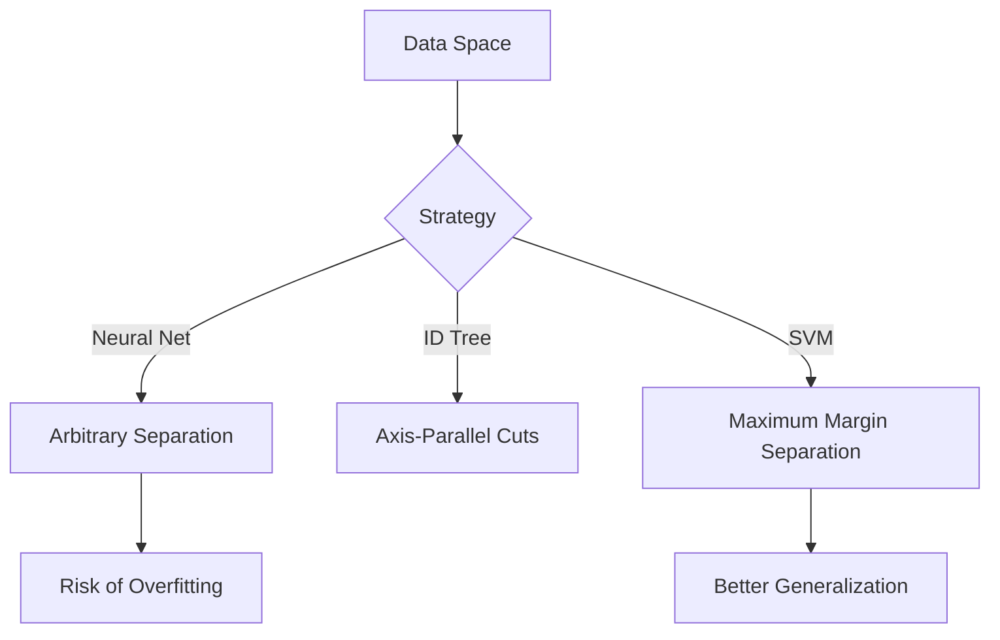
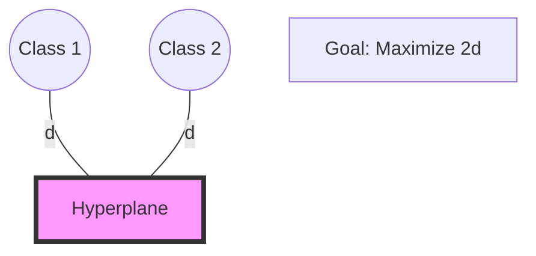
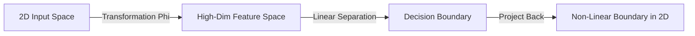
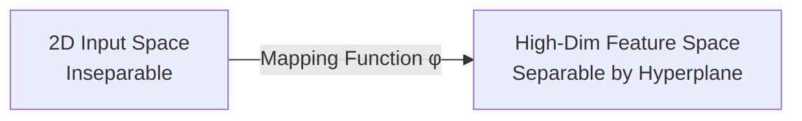

# 1. Introduction and The Widest Street

## 1. Context: The Evolution of Learning
Before diving into Support Vector Machines (SVMs), it is helpful to situate them among other learning algorithms.

| Algorithm | Basic Idea | Limitation |
| :--- | :--- | :--- |
| **Nearest Neighbors** | "Do what your neighbor does." | Can be computationally expensive at runtime; sensitive to noise. |
| **ID Trees** | "Slice the space with axis-parallel cuts." | Greedy approach; doesn't always find the optimal geometric separation. |
| **Neural Networks** | "biologically inspired layering." | Prone to getting stuck in **local maxima**; often considered a "black box." |

**Support Vector Machines** represent a sophisticated mathematical approach to dividing a space. While Neural Networks can draw many arbitrary lines to separate data, SVMs ask a fundamental question: **"Which line is the *best* line?"**

## 2. The Problem Setup
Imagine a 2D space with two classes of data:
*   **Positive Samples (+)**
*   **Negative Samples (-)**

We want to draw a **Decision Boundary** (a line in 2D, a hyperplane in higher dimensions) that separates these samples.

### Comparison of Boundaries
In the diagram below, a Neural Network might draw any of the lines. An SVM specifically looks for the line that creates the greatest separation.



## 3. The Widest Street Approach
Vapnik (the creator of SVMs) formulated the "Widest Street" intuition.

Instead of just drawing a thin line, imagine drawing a **street** (or a highway) between the positive and negative samples.
1.  ** The Median:** The center line of the street is our actual **Decision Boundary**.
2.  **The Gutters:** The edges of the street touch the nearest positive and negative samples.
3.  **The Goal:** Make the street **as wide as possible**.

### Why the Widest Street?
If you place a decision boundary excessively close to the negative samples (even if it separates the training data perfectly), it is statistically dangerous. New, unseen data (test data) might fall slightly on the wrong side.
*   A **wider margin** implies greater confidence and better generalization to future data.

### Visualizing the Street
Imagine a vector $\vec{w}$ that is perpendicular (normal) to the direction of the street.

```mermaid
graph LR
    subgraph Space
    P1((+))
    P2((+))
    N1((-))
    N2((-))
    
    L1[Left Gutter] --- L2[Median Line] --- L3[Right Gutter]
    end
    
    style P1 fill:#9f9,stroke:#333
    style P2 fill:#9f9,stroke:#333
    style N1 fill:#f99,stroke:#333
    style N2 fill:#f99,stroke:#333
    style L2 stroke-width:4px,stroke:blue
```

*   **Support Vectors:** The specific data points that touch the "gutters" (the edges of the street) are called **Support Vectors**.
*   **Crucial Insight:** The entire solution depends *only* on these Support Vectors. The data points far away from the street do not influence the position of the boundary.


# 5.1. Hyperplanes & Margins

## 1. Introduction to SVM
**Support Vector Machines (SVM)** are a set of supervised learning methods used for classification, regression, and outliers detection. The core philosophy of SVM is not just to find a boundary that separates classes, but to find the **Optimal Hyperplane**—the one that maximizes the distance between the classes.

---

## 2. Geometric Definitions

### The Hyperplane
A hyperplane is a subspace of one dimension less than its ambient space.
*   In **2D**, a hyperplane is a **line**.
*   In **3D**, a hyperplane is a **flat plane**.
*   In **nD**, it is a **hyperplane**.

Mathematically, it is defined by the equation:
$$ w \cdot x + b = 0 $$
*   $w$: The weight vector (normal to the hyperplane).
*   $b$: The bias (intercept).

### The Margin
The margin is the "street" or the gap between the two classes. SVM is a **Maximal Margin Classifier**. It looks for a decision boundary where the distance to the nearest data point on either side is maximized.

### Support Vectors
These are the most important data points in the entire set.
*   **Definition:** Support vectors are the data points that lie exactly on the edge of the margin.
*   **The Logic:** If you move any other data point (that is not a support vector), the hyperplane stays the same. If you move a support vector, the hyperplane shifts. This makes SVM very memory efficient, as it only needs to "remember" these few critical points.

---

## 3. Hard Margin vs. Soft Margin

### A. Hard Margin
*   **Assumption:** The data is perfectly linearly separable.
*   **Constraint:** No data points are allowed to enter the margin.
*   **Problem:** It is extremely sensitive to outliers. A single "noisy" point can make the margin tiny or impossible to find.

### B. Soft Margin
*   **Assumption:** Real-world data is messy and has overlap.
*   **Constraint:** We allow some points to "violate" the margin (enter the street) or even be misclassified.
*   **Benefit:** This creates a much more robust model that generalizes better to new data. This is controlled by the **C Parameter** (covered in Note 5.3).

---

## 4. The Optimization Objective
To maximize the margin width ($M$), we must minimize the norm of the weight vector.
$$ \text{Margin Width} = \frac{2}{\|w\|} $$

Therefore, the mathematical goal of training an SVM is:
**Minimize $\frac{1}{2}\|w\|^2$** subject to the constraint that all points are correctly classified outside the margin.




To maximize the width of the street, we must first mathematically define the decision rule and the constraints.

## 1. The Decision Rule
We define a vector $\vec{w}$ that is perpendicular to the median of the street. We also have an unknown vector $\vec{u}$ (a new sample we want to classify).

The decision rule is based on the **projection** of $\vec{u}$ onto $\vec{w}$.
$$ \vec{w} \cdot \vec{u} + b \geq 0 $$

*   **$\vec{w}$**: The normal vector (orientation of the street).
*   **$\vec{u}$**: The vector pointing to the unknown sample.
*   **$b$**: A bias term (shifts the line relative to the origin).
*   **$\cdot$**: The Dot Product.

**The Rule:**
*   If the result is $\geq 0$, classify as **Positive (+)**.
*   If the result is $< 0$, classify as **Negative (-)**.

---

## 2. Setting the Constraints
We don't just want to classify; we want to enforce the "Widest Street." We assume the street has a measurable width.

We impose strict mathematical constraints on the "gutters":

1.  **Positive Constraint:** For all positive samples ($\vec{x}_+$), the value must be greater than or equal to 1 (the right gutter).
    $$ \vec{w} \cdot \vec{x}_+ + b \geq 1 $$
2.  **Negative Constraint:** For all negative samples ($\vec{x}_-$), the value must be less than or equal to -1 (the left gutter).
    $$ \vec{w} \cdot \vec{x}_- + b \leq -1 $$

*Note: The choice of "1" and "-1" is mathematically convenient. It establishes a scale.*

### The Mathematical Convenience Variable ($y_i$)
To avoid carrying two separate equations, we introduce a variable $y_i$:
*   $y_i = +1$ for positive samples.
*   $y_i = -1$ for negative samples.

We can now multiply the equations by $y_i$ to create a single, unified constraint:

$$ y_i (\vec{w} \cdot \vec{x}_i + b) - 1 \geq 0 $$

*   **For Positive Samples:** $(1)(\text{something} \geq 1) - 1 \to \geq 0$. (Holds true).
*   **For Negative Samples:** $(-1)(\text{something} \leq -1)$. Multiplying by a negative flips the inequality. It becomes $\geq 1$. Subtracting 1 makes it $\geq 0$. (Holds true).

**Important:** For the specific samples that sit *exactly* on the gutters (the **Support Vectors**), this equation equals **zero**. For points further away, it is $>0$.

---

## 3. Calculating the Width
How wide is the street? We calculate this using geometry.
Take a positive support vector $\vec{x}_+$ and a negative support vector $\vec{x}_-$.

The width is the projection of the difference vector $(\vec{x}_+ - \vec{x}_-)$ onto the unit normal vector.

1.  **Unit Normal:** $\frac{\vec{w}}{||\vec{w}||}$
2.  **Width Equation:**
    $$ \text{Width} = (\vec{x}_+ - \vec{x}_-) \cdot \frac{\vec{w}}{||\vec{w}||} $$

Using our constraints ($\vec{w}\vec{x}_+ = 1-b$ and $\vec{w}\vec{x}_- = -1-b$):
$$ \text{Width} = \frac{\vec{w} \cdot \vec{x}_+ - \vec{w} \cdot \vec{x}_-}{||\vec{w}||} = \frac{(1-b) - (-1-b)}{||\vec{w}||} = \frac{2}{||\vec{w}||} $$

### The Optimization Goal
To get the **Widest Street**, we need to **MAXIMIZE** the Width:
$$ \text{Maximize } \frac{2}{||\vec{w}||} $$

To make the math easier (for derivatives later), maximizing $\frac{2}{||\vec{w}||}$ is equivalent to:
$$ \text{Minimize } \frac{1}{2} ||\vec{w}||^2 $$

This is the canonical objective function of the Support Vector Machine.


# 3. The Lagrangian Optimization

We now have a classic constrained optimization problem.
1.  **Minimize:** $\frac{1}{2} ||\vec{w}||^2$ (Minimize magnitude of w to maximize width).
2.  **Subject to:** $y_i (\vec{w} \cdot \vec{x}_i + b) - 1 \geq 0$ (Every sample must be on the correct side of the street).

## 1. Lagrange Multipliers
In calculus, when we want to find a minimum subject to constraints, we use **Lagrange Multipliers** ($\alpha$). We subtract the sum of the constraints from the objective function to create the **Lagrangian ($L$)**.

$$ L = \frac{1}{2}||\vec{w}||^2 - \sum_{i} \alpha_i [y_i(\vec{w} \cdot \vec{x}_i + b) - 1] $$

*   **$\alpha_i$**: The Lagrange multiplier for the $i$-th data point.
*   **Intuition**: We are looking for an extremum (minimum/maximum) of this new function $L$.

---

## 2. Taking Derivatives
To find the extremum, we take the partial derivatives of $L$ with respect to the variables we want to find ($\vec{w}$ and $b$) and set them to zero.

### Derivative with respect to $\vec{w}$
$$ \frac{\partial L}{\partial \vec{w}} = \vec{w} - \sum \alpha_i y_i \vec{x}_i = 0 $$
$$ \implies \vec{w} = \sum_{i} \alpha_i y_i \vec{x}_i $$

**Major Insight #1:** The vector $\vec{w}$ is simply a **linear sum of the sample vectors**.
*   Note: Most $\alpha_i$ will be zero. Only the Support Vectors (points in the gutter) have non-zero $\alpha$. Thus, $\vec{w}$ is a linear sum of the *Support Vectors*.

### Derivative with respect to $b$
$$ \frac{\partial L}{\partial b} = - \sum \alpha_i y_i = 0 $$
$$ \implies \sum_{i} \alpha_i y_i = 0 $$

**Major Insight #2:** The sum of the alphas times their labels must be zero. This provides a constraint on the optimization variables.

---

## 3. Plugging Back In (The Transformation)
We substitute these results back into the original Lagrangian equation to simplify it. This effectively removes the primal variables ($\vec{w}$ and $b$) and leaves us with only the dual variables ($\alpha$).

After a significant amount of algebra (substituting $\vec{w}$ and grouping terms), we arrive at the **Dual Form**:

$$ L = \sum_{i} \alpha_i - \frac{1}{2} \sum_{i} \sum_{j} \alpha_i \alpha_j y_i y_j (\vec{x}_i \cdot \vec{x}_j) $$

**Why is this amazing?**
Look closely at the equation. The optimization depends **ONLY** on the **dot product** of pairs of samples:
$$ (\vec{x}_i \cdot \vec{x}_j) $$

This realization leads us to the "Miracle" of SVMs.


In the previous note, we derived the Dual Form of the Lagrangian:
$$ L = \sum \alpha_i - \frac{1}{2} \sum_{i} \sum_{j} \alpha_i \alpha_j y_i y_j (\vec{x}_i \cdot \vec{x}_j) $$

Furthermore, look at the decision rule for a new unknown point $\vec{u}$:
$$ \vec{w} \cdot \vec{u} + b \geq 0 $$

Since we know that $\vec{w} = \sum \alpha_i y_i \vec{x}_i$, we can substitute that into the decision rule:
$$ (\sum \alpha_i y_i \vec{x}_i) \cdot \vec{u} + b \geq 0 $$
$$ \sum \alpha_i y_i (\vec{x}_i \cdot \vec{u}) + b \geq 0 $$

## 2. The "Miracle"
Both the **training** (optimization of $L$) and the **classification** (decision rule) depend **exclusively** on the dot products of data vectors.

*   Optimization uses: $\vec{x}_i \cdot \vec{x}_j$
*   Decision uses: $\vec{x}_i \cdot \vec{u}$

We never actually need to know the vectors themselves in isolation, nor do we need to calculate $\vec{w}$ explicitly if we calculate these products.

## 3. Convexity
Because of the squared term in the minimization ($\frac{1}{2}||\vec{w}||^2$) and linear constraints, this is a **Convex Optimization Problem**.

*   **Neural Nets:** The error landscape is rugged with many local minima. You might get stuck.
*   **SVMs:** The landscape is a bowl. There is **one global minimum**. You cannot get stuck in a local minimum.
*   The solution is guaranteed to be the optimal solution for the given constraints.


# 5. The Kernel Trick

## 1. Linearly Inseparable Data
What if the data cannot be separated by a straight line? (e.g., the XOR problem, or a ring of positive samples surrounding negative samples).
*   A Standard SVM would fail.
*   We need a non-linear boundary.

## 2. Transforming the Space
The "Kernel Trick" is a method to separate non-linear data without making the math impossible.

**Concept:** Project the data from the current space (Input Space) into a higher-dimensional space (Feature Space).
*   Data that is tangled in 2D might be separable by a flat sheet in 3D.

Let $\Phi(\vec{x})$ be a transformation function that maps $\vec{x}$ to a higher dimension.



## 3. The Power of Dot Products
Usually, calculating in high-dimensional space is computationally expensive (The Curse of Dimensionality).

**However**, remember the "Miracle" from Note 4: **We only need the dot product.**

We do not need to calculate the transformation $\Phi(\vec{x})$ explicitly. We only need a function $K$ (The Kernel Function) that equals the dot product in that high-dimensional space.

$$ K(\vec{u}, \vec{v}) = \Phi(\vec{u}) \cdot \Phi(\vec{v}) $$

We substitute $K(\vec{x}_i, \vec{x}_j)$ into our optimization equation instead of $(\vec{x}_i \cdot \vec{x}_j)$.

## 4. Common Kernels
We don't even need to know what space we are projecting into. We just pick a Kernel function that satisfies certain mathematical properties (Mercer's Theorem).

### A. Polynomial Kernel
$$ K(\vec{u}, \vec{v}) = (\vec{u} \cdot \vec{v} + 1)^n $$
*   Projects data into a space representing all polynomial combinations of the features.
*   $n=2$ allows for curved boundaries (parabolas, circles, etc.).

### B. Radial Basis Function (RBF) / Gaussian Kernel
$$ K(\vec{u}, \vec{v}) = e^{-\frac{||\vec{u} - \vec{v}||^2}{\sigma}} $$
*   **Infinite Dimensions:** This kernel essentially projects data into an infinite-dimensional space.
*   It creates "islands" of support around specific data points.
*   **Interpretation:** It acts like a nearest-neighbor similarity measure but within the strict mathematical framework of the SVM.

## 5. Overfitting vs. Generalization
*   **Low Sigma (RBF):** The kernel wraps tightly around specific data points. High risk of **overfitting** (memorizing the data).
*   **High Sigma (RBF):** Smooth, broader boundaries. Better generalization.

The Kernel Trick allows SVMs to create highly complex, non-linear boundaries while retaining the guarantee of finding the global optimum.


# 5.2. The Kernel Trick & Non-Linearity

## 1. The Problem: Non-Linear Separability
In many real-world cases, you cannot separate classes with a straight line.
*   *Example:* Imagine a cluster of points (Class A) in the center, surrounded by a ring of points (Class B).
*   Any straight line drawn through this will result in ~50% error.

---

## 2. Feature Mapping (Lifting Dimensions)
The solution is to map the data from its original low-dimensional space into a **higher-dimensional space**.

**The Intuition:**
Imagine two classes of dots on a table that are mixed. You can't separate them with a ruler. But if you could "lift" one class into the air (a 3rd dimension), you could slide a sheet of paper (a 2D hyperplane) between them.



---

## 3. The "Kernel Trick"
Lifting data into 100 or 1,000 dimensions is computationally "expensive" (it crashes computers). The **Kernel Trick** is a mathematical shortcut.

### The Mathematical Insight
The SVM optimization formula only depends on the **dot product** of the data points ($x_i \cdot x_j$).
The Kernel Function $K(x_i, x_j)$ calculates the dot product in the high-dimensional space **without actually moving the data there**.

$$ K(x_i, x_j) = \phi(x_i) \cdot \phi(x_j) $$

This allows us to get the power of infinite dimensions with the computational cost of low dimensions.

---

## 4. Common Kernel Functions

1.  **Linear Kernel:**
    *   No mapping. Used when data is already separable.
2.  **Polynomial Kernel:**
    *   Maps data into a space of degree $d$. Good for curved boundaries.
3.  **Radial Basis Function (RBF) / Gaussian Kernel:**
    *   The most popular kernel.
    *   Conceptually maps data into **infinite-dimensional space**.
    *   It creates "bubbles" around data points. It can learn almost any complex boundary.

> [!INFO] Why use RBF?
> The RBF kernel measures similarity based on distance to a point. If points are close, they are in the same class. It is the "Swiss Army Knife" of SVM kernels.


# 5.3. SVM Parameters (C and Gamma)

To get a Support Vector Machine to work correctly, you must tune its two "knobs": **C** and **Gamma**.

## 1. The C Parameter (Regularization)
C determines the tradeoff between a **Wide Margin** and **Correct Classification**. It is the "penalty" for misclassifying a point.

### Small C (e.g., 0.01):
*   **Philosophy:** "It's okay to make mistakes if it keeps the street wide."
*   **Result:** Large margin, more misclassified training points.
*   **Bias/Variance:** High Bias, Low Variance (**Underfitting** risk).
*   **Generalization:** Usually better on new data.

### Large C (e.g., 1000):
*   **Philosophy:** "Misclassification is unacceptable! Make the street as narrow as needed to get everyone right."
*   **Result:** Small margin, zero/few misclassified training points.
*   **Bias/Variance:** Low Bias, High Variance (**Overfitting** risk).
*   **Generalization:** Often poor; the model "hugs" the training data too tightly.

---

## 2. The Gamma Parameter ($\gamma$)
*Note: Gamma is only used with the RBF kernel.*
Gamma defines how far the influence of a single training example reaches.

### Small Gamma:
*   **Reach:** Long-range. Even points far away are considered "neighbors."
*   **Result:** The decision boundary is smooth and very "vague."
*   **Bias/Variance:** Risk of **Underfitting**.

### Large Gamma:
*   **Reach:** Short-range. Only points very close have an influence.
*   **Result:** The decision boundary becomes very wiggly and creates "islands" around individual points.
*   **Bias/Variance:** Risk of **Overfitting**.

---

## 3. The Mandatory Requirement: Feature Scaling
SVM is a **Distance-Based** algorithm. If your features are on different scales, the model will fail.

*   **Example:** Feature 1 is "Income" (0 to 100,000) and Feature 2 is "Age" (18 to 80).
*   The large numbers in "Income" will dominate the calculation of the hyperplane, making "Age" mathematically invisible.

> [!DANGER] Rigorous Rule
> You **must** use `StandardScaler` (Mean=0, Variance=1) or `MinMaxScaler` (0 to 1) before training an SVM. Without scaling, the margin calculations are meaningless.

## 4. Summary Table: Bias-Variance in SVM

| Parameter | Increase Value | Effect on Margin | Complexity | Risk |
| :--- | :--- | :--- | :--- | :--- |
| **C** | $\uparrow$ | Narrower | More Complex | Overfitting |
| **C** | $\downarrow$ | Wider | Simpler | Underfitting |
| **Gamma** | $\uparrow$ | N/A | High Curvature | Overfitting |
| **Gamma** | $\downarrow$ | N/A | Smooth/Flat | Underfitting |


