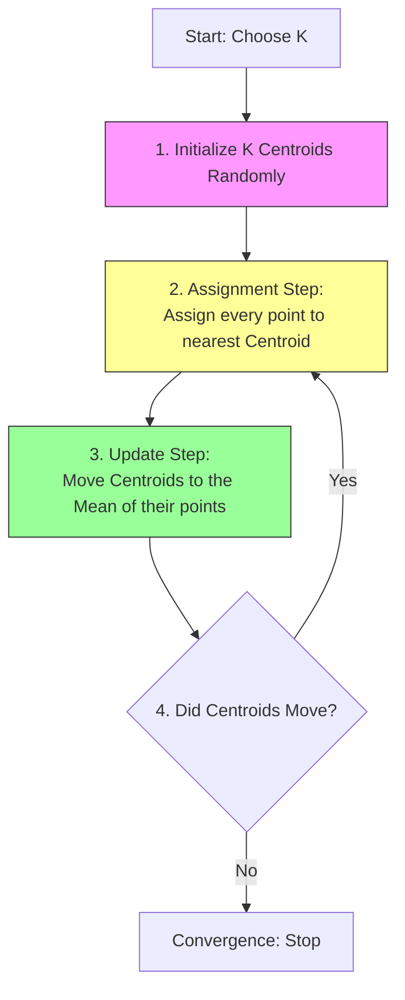

# 6.1. Clustering Fundamentals & Logic

## 1. Definition of Clustering
**Clustering** (or *Regroupement*) is the task of dividing a population or data points into a number of groups such that data points in the same groups are more similar to other data points in the same group than those in other groups.

Unlike **Classification** (Supervised Learning), where the classes are predefined (e.g., "Cat" vs. "Dog"), in **Clustering** (Unsupervised Learning), the groups are **discovered** by the algorithm.

### The Goal: Discovery of Structure
The objective is to minimize the **Intra-Cluster Distance** (distance between points inside a group) and maximize the **Inter-Cluster Distance** (distance between the groups themselves).

> [!INFO] Analogy: The Library
> *   **Classification:** A librarian receives a book with a sticker that says "Science Fiction" and puts it on the Sci-Fi shelf.
> *   **Clustering:** A librarian receives a pile of books with no covers or stickers. They must read the summaries and organize them into piles based on similarity (e.g., "These books talk about spaceships," "These books talk about history"). The librarian names the piles *after* grouping them.

---

## 2. The Geometric Intuition
Clustering relies entirely on the concept of **Distance** in a vector space.

*   If two data points are close together in the feature space (e.g., in a graph of $X_1$ vs $X_2$), they likely share similar properties.
*   The algorithm assumes that **Proximity = Similarity**.

### Example from Chapter 1 (Recalled)
Remember the medical diagnosis example:
*   **Input:** Patient data (Blood Sugar, Iron Levels).
*   **Label:** None.
*   **Result:** The algorithm notices distinct "clouds" of data points.
    *   *Cloud A:* High Sugar, Low Iron.
    *   *Cloud B:* Normal Sugar, Normal Iron.
*   It assigns them to "Cluster 1" and "Cluster 2". It is up to the human expert to later look at Cluster 1 and name it "Type A Diabetes."

---

## 3. Types of Clustering
While K-Means is the most popular, it is part of a broader family:
1.  **Partitioning Methods (K-Means):** Divide data into $K$ distinct, non-overlapping groups.
2.  **Hierarchical Methods:** Create a tree of clusters (Dendrogram), grouping small clusters into larger ones.
3.  **Density-Based Methods (DBSCAN):** Find areas of high density and separate them from areas of low density (outliers).

# 6.2. The K-Means Algorithm (Step-by-Step)

**K-Means** is an iterative algorithm that partitions a dataset into $K$ pre-defined distinct non-overlapping subgroups (clusters).

## 1. Core Concepts
*   **$K$:** The number of clusters (a hyperparameter you must choose).
*   **Centroid ($\mu$):** The center point of a cluster. It is the arithmetic mean of all data points belonging to that cluster.

## 2. The Algorithm Cycle
The process loops through two main steps (Assignment and Update) until it converges.

### Step 1: Initialization
*   We select $K$ points in the data space to act as the initial centroids.
*   *Note:* These can be random points or actual data points selected at random.

### Step 2: Cluster Assignment (Expectation)
*   For every data point $x_i$ in the dataset, we calculate its distance to every centroid $\mu_j$.
*   We typically use **Euclidean Distance**: $d(x, \mu) = ||x - \mu||^2$.
*   The point is assigned to the cluster of the closest centroid.

### Step 3: Move Centroids (Maximization)
*   Once all points are assigned, the centroid position is usually no longer in the center of its cluster.
*   We calculate the new position of centroid $\mu_j$ by taking the **Average (Mean)** of all points $x$ currently assigned to cluster $j$.
    $$ \mu_j = \frac{1}{|S_j|} \sum_{x \in S_j} x $$
    *(Where $S_j$ is the set of points in cluster $j$).*

### Step 4: Convergence
*   Steps 2 and 3 are repeated.
*   The algorithm stops when:
    1.  The centroids no longer change position (Stability).
    2.  No points change their cluster assignment.
    3.  A maximum number of iterations is reached.

---

## 3. Mathematical Example
Imagine 1D data: `[2, 3, 10, 11, 12]` and $K=2$.
1.  **Init:** Random centroids $\mu_1 = 2$, $\mu_2 = 12$.
2.  **Assign:**
    *   `2` is close to $\mu_1$.
    *   `3` is close to $\mu_1$.
    *   `10` is close to $\mu_2$.
    *   `11` is close to $\mu_2$.
    *   `12` is close to $\mu_2$.
    *   Cluster 1: `{2, 3}`, Cluster 2: `{10, 11, 12}`.
3.  **Update:**
    *   New $\mu_1 = \text{Average}(2, 3) = 2.5$.
    *   New $\mu_2 = \text{Average}(10, 11, 12) = 11$.
4.  **Repeat:** The process continues with centroids $2.5$ and $11$.

# 6.3. Optimization: WCSS & The Elbow Method

One of the biggest challenges in K-Means is answering the question: **"How many clusters ($K$) should I choose?"**

Unlike Classification, where we know the classes (e.g., Dog/Cat means $K=2$), in Clustering, we often don't know the answer.

## 1. Evaluating Cluster Quality (Inertia)
To evaluate how "good" a clustering is, we measure how tightly grouped the clusters are. We use a metric called **WCSS (Within-Cluster Sum of Squares)**, also known as **Inertia**.

### The Formula
$$ WCSS = \sum_{j=1}^{K} \sum_{x_i \in Cluster_j} ||x_i - \mu_j||^2 $$

*   **Logic:** We sum the squared distances between every point $x_i$ and its assigned centroid $\mu_j$.
*   **Goal:** Lower WCSS is better (it means points are very close to their centroids).
*   **The Trap:** If we set $K = N$ (number of data points), WCSS will be 0, because every point is its own centroid. But this is useless. We want a small WCSS *and* a small $K$.

---

## 2. The Elbow Method (Method of the Elbow)
To balance "Goodness of Fit" (Low WCSS) with "Simplicity" (Low $K$), we use the Elbow Method.

### The Procedure
1.  Run the K-Means algorithm for a range of $K$ values (e.g., $K=1$ to $K=10$).
2.  For each $K$, calculate the final WCSS (Inertia).
3.  Plot **$K$** on the X-axis and **WCSS** on the Y-axis.

### Interpreting the Plot
The curve will look like a bent arm.
*   **Start:** As $K$ increases from 1 to 2, WCSS drops massively (huge gain).
*   **Middle:** As $K$ increases further, the drop becomes smaller (diminishing returns).
*   **The Elbow Point:** The value of $K$ where the curve starts to flatten out. This is the optimal $K$.

> [!TIP] Practical Application
> If the plot is a smooth curve with no clear elbow, the data might not be naturally clustered. In that case, the choice of $K$ depends on the business context (e.g., "We have budget for 3 marketing campaigns, so set $K=3$").

# 6.4. Limitations & Initialization Traps

While K-Means is fast and popular, it is not perfect. It is essential to understand its weaknesses to avoid incorrect conclusions.

## 1. The Initialization Trap (Local Minima)
K-Means is sensitive to the starting position of the centroids.
*   **Problem:** If you initialize centroids poorly (e.g., two centroids in the same data cloud), the algorithm might get stuck in a **Local Minimum**. It will converge, but the result will be suboptimal.
*   **Solution 1 (Standard):** Run the algorithm multiple times (e.g., `n_init=10` in Scikit-Learn) with different random seeds and pick the result with the lowest WCSS.
*   **Solution 2 (K-Means++):** A smarter initialization algorithm that spreads the initial centroids far apart from each other, ensuring a better global result.

---

## 2. Sensitivity to Outliers
Since K-Means relies on the **Mean** (Average), it is highly sensitive to outliers.
*   **Scenario:** Imagine a cluster of 100 people with average income \$50k. If you add one billionaire (\$1B income), the "Centroid" (Average) will shift massively towards the billionaire, effectively destroying the cluster logic.
*   **Fix:** Remove outliers before running K-Means, or use **K-Medians** (uses the median instead of the mean).

---

## 3. The "Spherical" Assumption
K-Means assumes that clusters are:
1.  **Spherical (Round):** It uses Euclidean distance, which radiates in a circle.
2.  **Similar Size:** It struggles if one cluster is tiny and tight while another is huge and sparse.
3.  **Linearly Separable:** It cannot handle complex shapes (e.g., "Concentric Circles" or "Moon shapes").

> [!WARNING] Visual Trap
> If your data looks like a "Banana" shape or a "Donut," K-Means will fail to detect it. It will try to cut the banana in half with a straight line. For these complex shapes, use **DBSCAN** or **Spectral Clustering**.

