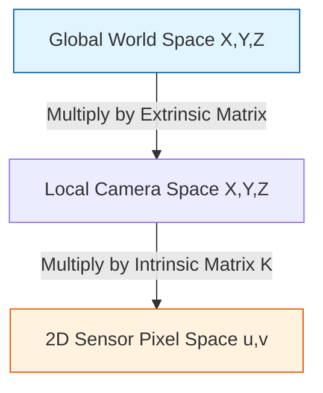

# 1.3 Projection Matrices and Coordinate Transformations

## The Core Concept
How does the computer mathematically turn a 3D real-world object into a 2D photograph? It uses a continuous chain of matrix multiplications called **The Projection Equation**.

Because graphics and reconstruction involve bouncing between different "spaces" (World Space, Camera Space, Image Space), we utilize **Coordinate Transformations**.

---

## 1. Homogeneous Coordinates

Before we can multiply projection matrices, we must introduce a mathematical trick used everywhere in 3D Computer Vision: **Homogeneous Coordinates**.

Normal Euclidean 3D space uses vectors like $(X, Y, Z)$. 
However, standard $3 \times 3$ matrices cannot perform **translation** (moving an object across space without rotating it) using only multiplication. 

To solve this, we add a dummy variable, usually $1$, turning our 3D point into a 4D vector: $(X, Y, Z, 1)$. 
This allows us to seamlessly pack both Rotation and Translation into a single $4 \times 4$ matrix. To retrieve the physical 3D coordinate from a homogeneous coordinate $(X, Y, Z, W)$, you simply divide everything by $W$: $(X/W, Y/W, Z/W)$.

---

## 2. The Complete Camera Projection Equation

The journey of a point from the physical world to a pixel on a screen moves through three coordinate systems:

### The Mathematical Formulation

Let $w_{point}$ be a homogeneous 3D point in the real world: $[X, Y, Z, 1]^T$.
Let $x_{pixel}$ be the 2D coordinate on the photograph (in homogeneous notation): $[u, v, w]^T$.

The master equation commanding the universe of 3D vision is:

$$ x_{pixel} = K [R | t] w_{point} $$

### Step-By-Step Breakdown

1. **World to Camera (The Extrinsic Step):**
   $$P_{camera} = [R | t] \cdot P_{world}$$
   The algorithm multiplies the $4 \times 4$ Extrinsic matrix by the world coordinate. This rotates and translates the universe so that the camera perfectly straddles the $(0,0,0)$ origin, staring straight down the Z-axis.

2. **Camera to Image (The Intrinsic Step):**
   $$P_{homogenous\_pixel} = K \cdot P_{camera}$$
   The algorithm takes that local coordinate and multiplies it by the $3 \times 3$ Intrinsic Matrix $K$. This applies the focal length scaling and shifts calculations by the optical center.
   
3. **Perspective Divide (Homogeneous to Euclidean):**
   The output of Step 2 is $[u \cdot Z, v \cdot Z, Z]^T$. 
   Because this is a homogeneous coordinate, the algorithm must divide everything by the last element ($Z$).
   This results in the final exact integer pixel coordinates: $(u, v)$ where the light hits the digital sensor.

---

## The Inverse Projection (2D to 3D)
In your 2D → 3D Reconstruction project, you perform the Exact Opposite operation. You start with a Depth Map (a 2D image) and want to create a 3D Point Cloud.

To go backward, you must invert the matrices:
1. Lookup the pixel $(u, v)$ and read its Depth $Z$.
2. Invert the Intrinsic matrix ($K^{-1}$) to shoot the pixel back out into a 3D ray in Local Camera Space. Multiply by $Z$ to stop the ray exactly at the solid object.
3. Invert the Extrinsic matrix (which turns it from a *World-to-Camera* matrix into a *Camera-to-World* matrix) to place the point out into the global mapped room alongside the data from all the other cameras.

*(See also: [[1.2 Intrinsic and Extrinsic Parameters]])*

### Implementation Status 
* **Requires Training?** **No**. 
* **Solo Developer Feasibility:** **Implementable from scratch**. Inverse projection is a routine operation utilizing functions like `numpy.linalg.inv()`. It is frequently implemented manually when bridging custom Python arrays with Open3D structures.
