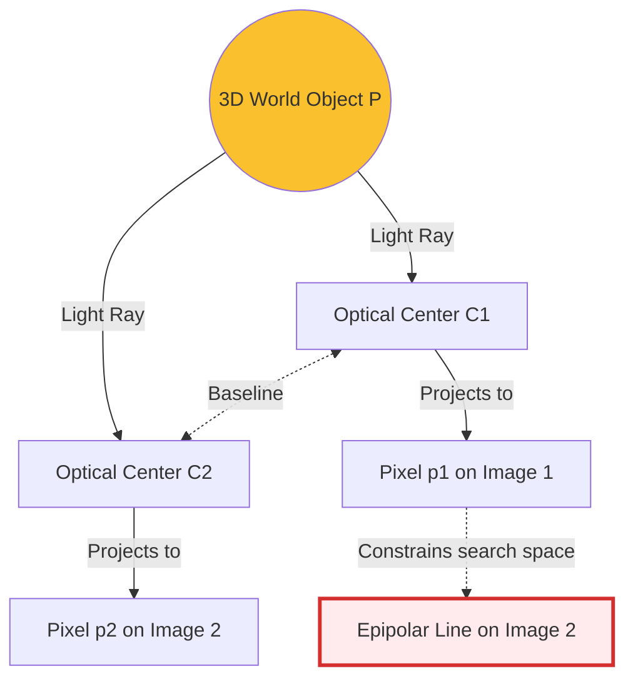

# 1.4 Epipolar and Multi-View Geometry

## The Core Concept
If you want to reconstruct 3D space, a single photograph is useless due to **perspective scaling** (a building far away looks identical to a toy up close). To deduce true 3D structure, you must take pictures of the same object from different angles and triangulate the intersecting rays of light.

**Multi-View Geometry** is the mathematical study of the geometric rules governing multiple cameras viewing the same 3D scene. The most fundamental rule inside this field is **Epipolar Geometry**.

---

## What is Epipolar Geometry?
Epipolar geometry describes the intrinsic geometric relationship between two cameras. It is the absolute backbone of [[2.1 Feature Detection and Matching]] and Structure from Motion.

It answers the question: *If I identify a specific pixel (like a door handle) in Camera 1, where exactly am I allowed to search for that same door handle in Camera 2?*

### The Geometric Setup
Imagine a 3D point $P$ out in the real world. Two cameras ($C_1$ and $C_2$) take a photo of it.

* **Baseline:** The straight physical line drawn between lens $C_1$ and lens $C_2$.
* **Epipoles ($e_1, e_2$):** If camera 1 looks directly into the lens of camera 2, the point on the image sensor where camera 2 appears is the epipole. 
* **The Epipolar Plane:** The three points in space ($C_1$, $C_2$, and the object $P$) perfectly define a flat 2D triangle. This triangle exists on an infinitely thin, flat plane called the Epipolar Plane.

### The Epipolar Constraint (The Golden Rule)
Because light travels in straight lines, the projection of point $P$ onto Camera 1 creates a ray extending out from $C_1$, through $P$, out to infinity. 

When Camera 2 looks at that infinitely long 3D ray of light, it appears as a straight 2D line spanning across Camera 2's image sensor. This is the **Epipolar Line**.

**The Mathematical Law:** The matching pixel $p_2$ in Image 2 **MUST absolutely lie upon the Epipolar Line** defined by $p_1$.

If an AI or algorithm finds a pixel in Image 2 that looks visually identical to $p_1$, but that pixel is not physically located on the Epipolar Line, it is mathematically impossible for it to be the same 3D object in reality. It is a false match.

---

## The Mathematical Formulation (The Essential Matrix)

How does the computer mathematically calculate this line? It uses the **Essential Matrix ($E$)**.
The Essential Matrix captures the rotation and translation (the Extrinsics) between the two cameras. 

The Epipolar constraint is elegantly captured in a single equation:
$$ p_2^T \cdot E \cdot p_1 = 0 $$

### Explanation of Variables
* $p_1$: The normalized 2D homogeneous pixel coordinate in Image 1.
* $p_2$: The potential matching normalized 2D pixel coordinate in Image 2.
* $E$: The $3 \times 3$ Essential Matrix containing the relative camera orientation.
* $= 0$: This represents a dot product of zero, meaning the geometry intersects perfectly and the vectors are orthogonal within the plane.

### Intuition and Power
This equation is brilliant. In computer vision, we *start* by finding matching points (like corners) between two images. We know $p_1$ and $p_2$. The only unknown is $E$. 

If we find 8 good matching points, we can solve a system of linear equations to calculate $E$ (often using the "Eight-Point Algorithm"). By decomposing $E$, the computer instantly knows the exact distance and angle between the two cameras *without ever actually knowing where the 3D objects are yet*. 

This is how Structure from Motion operates.

### Implementation Status 🛠️
* **Requires Training?** **No**. 
* **Solo Developer Feasibility:** **Uses Pre-Built Algorithms**. Manually coding the Eight-Point Algorithm safely amidst real-world sensor noise is incredibly difficult. Industrial solvers like OpenCV `findEssentialMat` and COLMAP heavily wrap this math in robust RANSAC outlier-rejection loops, which should always be used rather than calculating it from scratch.
