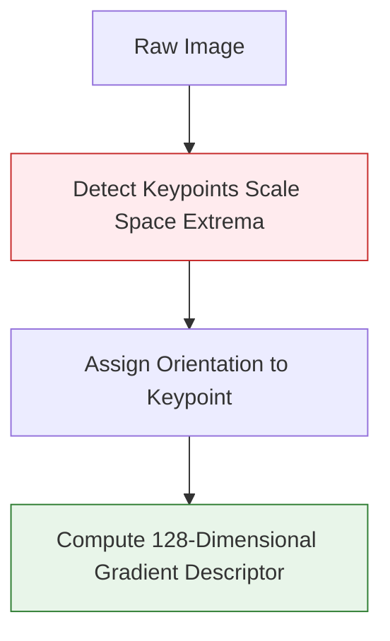

# 2.1 Feature Detection and Matching

## The Core Concept
Structure from Motion (SfM) is the computational backbone of 3D reconstruction. Before the computer can figure out where the cameras were when the photos were taken, it first needs to find specific, identifiable reference points in the images themselves.

**Feature Detection and Matching** is the process of scanning an image to find "features"—points of high contrast or unique geometric structure—and mathematically describing them so they can be recognized across multiple different photographs, even if the lighting changed or the camera moved.

---

## 1. Feature Detection

The algorithm scans the pixel grid to find "blobs" or "corners". A blank white wall has zero features because every $5 \times 5$ patch of pixels looks identical. A brick wall has thousands of features at every mortar intersection.

### The Algorithm Mechanics
The most famous classical algorithm for this is **SIFT** (Scale-Invariant Feature Transform, Lowe 2004). 

The defining characteristic of SIFT is that it can identify the exact same feature even if:
* The object has been physically scaled (camera moved closer).
* The image has been rotated physically.
* The lighting has changed slightly.

Instead of just saving the $(x,y)$ pixel coordinate, SIFT calculates a **Descriptor**—a mathematical vector (usually 128 dimensions long) analyzing the gradients (the direction the colors are changing) around that specific pixel.

---

## 2. Feature Matching

Once features are mathematically described as vectors, the system compares the descriptors across all images in your dataset.

### The Mathematics

Let vector $A$ represent a SIFT descriptor from Image 1.
Let vector $B$ represent all possible SIFT descriptors from Image 2.

The algorithm calculates the **Euclidean Distance** between vector $A$ and every vector in $B$. The feature in Image 2 that has the smallest Euclidean distance is theoretically the closest mathematical "match" to the corner in Image 1.

### 2.2 RANSAC and Outlier Rejection

Not all matches found by this nearest-neighbor search are correct. A brick wall might have hundreds of identical-looking corners that easily trick the matching algorithm. 

To filter out these false positives, the system aggressively enforces the rules laid out in [[1.4 Epipolar and Multi-View Geometry]].

To do this, the system relies almost exclusively on an algorithm called **RANSAC (Random Sample Consensus)**.
RANSAC is a brute-force statistical method:
1.  It randomly picks 8 matched pairs.
2.  It uses those 8 pairs to calculate an Epipolar constraint (a hypothetical Essential Matrix).
3.  It sweeps through all 10,000 matches and asks: "If this Essential Matrix is correct, how many of you other points agree with it and lie perfectly on the Epipolar Line?"
4.  It throws that score away, randomly picks 8 *different* matches, and tries again.
5.  It repeats this thousands of times per second. 
6.  Eventually, it stumbles upon the mathematical Essential Matrix that 90% of the points agree upon.
7.  The remaining 10% of points that do not line up with the consensus are discarded forever as **Outliers**.

---

## Practical Engineering Considerations

Feature matching is computationally incredibly expensive. Matching 100 images requires comparing 5000 unique image pairs. Matching 1000 images requires comparing 500,000 pairs ($O(N^2)$ complexity), which can take days on a supercomputer.

If processing video (See: [[4.4 Factors Affecting Reconstruction Quality]]), an engineer can cheat by only matching consecutive frames rather than matching the first frame with the last.

### Implementation Status 
* **Requires Training?** **No.** (For classical SIFT/SURF/ORB).
* **Solo Developer Feasibility:** **Uses Pre-Built Algorithms.** Do not write SIFT or RANSAC loops entirely from scratch. You will spend months debugging mathematical edge cases. Both OpenCV and full SfM suites (like COLMAP) have hyper-optimized, multi-threaded C++/CUDA implementations of SIFT and RANSAC that process millions of points in seconds. You should call them as black-box solvers.
* **Modern Neural Alternative:** **SuperPoint / SuperGlue.** Modern pipelines are now substituting classical SIFT with Convolutional Neural Networks (CNNs) trained to output resilient feature descriptors. These perform substantially better in low-light environments but are wildly heavier computationally and **Require Heavy GPU Training** on millions of photos.
