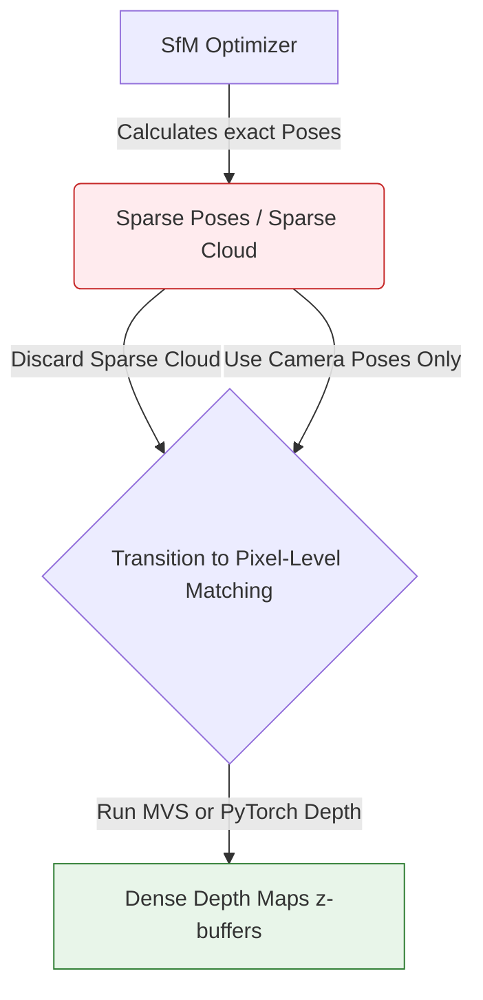

# 2.3 Classical Point Cloud Generation

## The Core Concept
At the end of the Structure from Motion (SfM) pipeline, optimizing the camera poses across thousands of matched 2D image coordinates natively produces a sparse set of 3D physical coordinates as a byproduct. 

By running **Triangulation** across the heavily optimized geometric network, the system generates the first physical, viewable output of the pipeline: **The Sparse Point Cloud**.

---

## 1. Triangulation Mechanics

Triangulation sits alongside Epipolar Geometry as a fundamental truth.

Once you know the absolute perfect Extrinsic matrices ($[R|t]$) of Camera 1 and Camera 2 via Bundle Adjustment, and you know the exact intrinsic focal lengths ($K$), you can shoot two infinitely long light rays starting from the optical centers into physical 3D space, passing exactly through the validated 2D pixel matches on the image sensors.

In a mathematically perfect universe, those two 3D rays of light would perfectly intersect at the exact $(X, Y, Z)$ spatial coordinate of the real-world object.

### The Problem with Real Reality
In physical reality, because of sub-pixel noise, image compression, and lens jitter, **rays generated from two cameras almost never perfectly mathematically intersect.** They pass within micrometers of each other, crossing like two swords slightly offset in the dark.

### The DLT Mathematical Solution 

Because they miss each other, classical engines use algorithms like **Direct Linear Transformation (DLT)**. 
Instead of looking for a perfect intersection, DLT sets up a linear algebra matrix equation that finds the 3D homogeneous point $(X, Y, Z, W)$ that corresponds to the **shortest orthogonal distance** exactly midway between the two mathematically diverging rays.

1.  Ray 1 shoots from Camera 1.
2.  Ray 2 shoots from Camera 2.
3.  DLT calculates the shortest bridging line segment crossing the air between the two skew paths.
4.  The midpoint of that tiny bridge is permanently registered as the $(X, Y, Z)$ coordinate.

---

## 2. Sparse vs. Dense Clouds

The Structure from Motion phase (such as raw COLMAP) generally produces a **Sparse Point Cloud**. 

**Why is it called Sparse?**
Because SfM only executed the heavy math on specific, highly unique contrast points identified by algorithms like SIFT (corners, signs, hard edges). 
The resulting 3D cloud will look like a ghost framework. The edge of a table will have points. The giant flat wooden top of the table will be completely physically empty because SIFT could not find unique textures there to track. (See: [[2.1 Feature Detection and Matching]]).

**How it connects to the project:**
A sparse point cloud is completely useless for VR, collision physics, or physical 3D rendering because it has no continuous surface geometry and massive holes in open space. 

To bridge this gap, you must discard the Sparse Cloud entirely and execute the second massive stage of the pipeline to measure *every single pixel*, not just the corners. This transition is called **Multi-View Stereo** or **Dense Depth Estimation**.

### Implementation Status 🛠️
* **Requires Training?** **No.** Pure linear Triangulation math.
* **Solo Developer Feasibility:** **Implementable from scratch using DLT**. An experienced engineer can write a DLT solver for two rays in 30 lines of Python. However, the resulting point clouds will remain severely sparse and geometrically unstable without robust outlier rejection parameters. Most practitioners export the `points3D.txt` raw file from COLMAP and stream it straight into Meshlab or Open3D.
