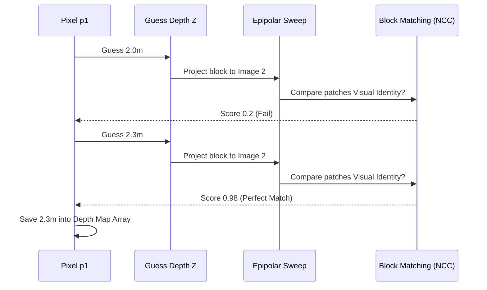

# 3.1 Classical Multi-View Stereo (MVS)

## The Core Concept
Structure from Motion (SfM) gives us the exact camera positions and a Sparse Point Cloud containing only high-contrast corners (See: [[2.3 Classical Point Cloud Generation]]). To build a full 3D model, we must throw the sparse cloud away and mathematically calculate the depth for *every single pixel* in the original photograph.

This phase is called **Multi-View Stereo (MVS)** or **Dense Depth Estimation**. The output is a **Depth Map**: a 2D image where the color/value of the pixel represents the physical millimeter distance from the lens to the solid object.

---

## 1. The Physics of Classical MVS (Photometric Consistency)

Classical MVS relies on a fundamental assumption called **Photometric Consistency**: *If I look at a specific point on an object from two different angles, the pixel patch should look mostly identical in color and texture.*

MVS uses Triangulation, but applies it violently to millions of pixels using block-matching algorithms.

### 1.1 The Epipolar Patch Search

How does the computer figure out the depth of pixel $p_1$ on Image 1?

1.  **The Depth Hypothesis:** The algorithm guesses a depth $Z$ (e.g., "let's assume this pixel is exactly 2.0 meters away").
2.  **The Projection:** It takes that guess, converts it to 3D space, and projects it into a neighboring Target Image 2 utilizing the known Extrinsics and Intrinsics (See: [[1.3 Projection Matrices and Coordinate Transformations]]).
3.  **The Patch Check:** It extracts a tiny square block of pixels (e.g., $11 \times 11$) around the original $p_1$, and extracts the $11 \times 11$ patch around the projected guess in Image 2.
4.  **The Score:** It compares the two patches mathematically using an algorithm like **NCC (Normalized Cross-Correlation)** or **SAD (Sum of Absolute Differences)**. 
    *   If the patches are visually identical, the NCC score is incredibly high ($0.99$).
    *   If the patches look different, the score drops.
5.  **The Epipolar Sweep:** The algorithm sweeps the depth guess $Z$ along the physical Epipolar ray, testing distances from $0.5m$ out to $50m$, calculating millions of NCC scores.
6.  **The Winner:** The depth $Z$ that yields the absolute highest NCC score is mathematically proven to be the intersection of the rays. That specific value is written into the Depth Map.

---

## 2. The Total Breakdown of Classical Math

While MVS is mathematically flawless in a perfect universe, it catastrophically fails in physical reality under several common conditions.

### The "White Wall" Problem (Textureless Regions)
Relying entirely on Photometric Consistency dictates that the algorithm *must* have texture to match.
If an image is a blank white wall, the $11 \times 11$ pixel patch at 1 meter looks *exactly identical* to the $11 \times 11$ pixel patch at 10 meters! The NCC curve is completely flat, the math has no peak, and the depth map simply outputs a massive black hole.

### Specularity and Glass
MVS assumes Photometric Consistency. However, a mirror or a shiny car changes its visual appearance depending on the angle you look at it. 
If Camera 1 sees a bright glare on the car hood, and Camera 2 sees dark red paint, MVS assumes it is looking at two totally different objects. The math fails to find the surface and outputs geometric noise.

### Implementation Status 🛠️
* **Requires Training?** **No.** Pure Epipolar geometric calculus.
* **Solo Developer Feasibility:** **A Nightmare to scale.** You can easily write a 50-line Python block-matching loop. However, to run an NCC sweep on an HD image takes exactly $1920 \times 1080 \times 256$ (depth layers) operations per matched frame. A pure Python loop will take 42 hours to calculate a single depth map. Industrial MVS (like COLMAP's PatchMatch Stereo PMVS) forces this logic onto the raw CUDA cores of a GPU for massive parallel processing.
* **The Modern Solution:** Due to the White Wall and Specularity failures, modern architectures are completely ripping classical MVS out of their pipelines, replacing it with Neural Foundation Models (See: [[3.2 Neural Depth Estimation and Foundation Models]]).
