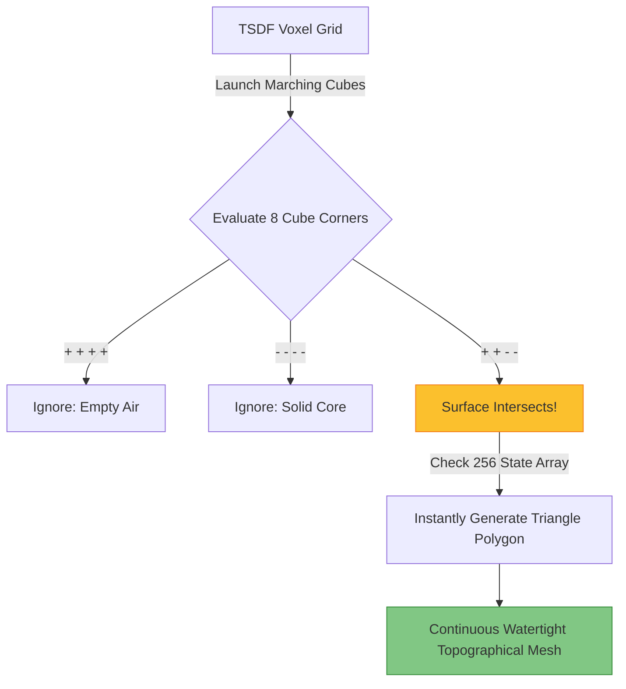

# 4.3 Mesh Generation and Topology

## The Core Concept
Whether you utilized Volumetric averages (See: [[4.1 Depth Map Fusion and TSDF]]) or Implicit Point Functions (See: [[4.2 Floating Scale Surface Reconstruction (FSSR)]]), the mathematical output of the fusion phase is not yet a 3D model. 

The output is simply a massive continuous math equation existing in memory, where values smoothly transition from Positive (outside the object) to Negative (inside the object). The boundary where the value equals exactly $0.000$ represents the absolute true physical surface of the object.

To generate a visual 3D model that can be rendered in a game engine or 3D printer, we must extract **Topology**—a connected web of Vertices, Edges, and Faces (Triangles)—along that mathematical boundary. 

The undisputed king of this process is the **Marching Cubes Algorithm** (Lorensen and Cline, 1987).

---

## 1. How Marching Cubes Works

The algorithm is a brute-force geometric sweep through space.

1.  **The Sweep:** The algorithm conceptually takes a tiny $2 \times 2 \times 2$ "cube" and marches it through every single voxel in the TSDF grid. 
2.  **Corner Evaluation:** It looks at the 8 mathematical corners of the current cube. It checks if the numerical value is Positive $(+)$ or Negative $(-)$.
    *   If all 8 corners are Positive, the cube is floating in empty air. Move on.
    *   If all 8 corners are Negative, the cube is buried deep inside solid rock. Move on.
3.  **The Zero-Crossing Intersection:** If some corners are Positive and some are Negative, it means the exact physical surface of the object is actively slicing directly through the middle of this specific cube.
4.  **Lookup Table Triangulation:** Because a cube has 8 corners, there are exactly $2^8 = 256$ possible ways the surface can slice through it. The algorithm uses a hardcoded Lookup Table (LUT) to instantly blast $1$ to $5$ triangles inside the cube corresponding exactly to the zero-crossing gradients.

---

## 2. Mesh Post-Processing (Topology Cleaning)

Marching Cubes is mathematically perfect, but the actual TSDF numbers it was given from the cameras are noisy. Therefore, the resulting mesh initially looks jagged or overly complex.

An engineer must implement three final topological cleanup steps:

1.  **Density / Bounding Box Trimming:**
    If the algorithm generated topological geometry 20 meters up in the sky because of a rogue, noisy depth map reflection, the script physically deletes any vertices disconnected from the main model cluster, or any triangles outside a tightly defined Region of Interest bounding box.
2.  **Decimation (Quadric Error Metrics):**
    Marching Cubes generates millions of triangles, many on completely flat surfaces (like a wall), which destroys rendering performance. Decimation algorithms mathematically collapse edges to drastically reduce the polygon count (e.g., $5M$ down to $50k$) without changing the visual outline or sharp edges.
3.  **Laplacian Smoothing (Optional):**
    If the mesh looks "furry" or rough like sandpaper, passing a Laplacian filter averages the positions of vertices slightly toward the center of their neighbors, acting like digital sandpaper to smooth the topological curves. (Warning: Over-smoothing destroys sharp architectural edges like tables, turning them into soft blobs).

### Implementation Status 
* **Requires Training?** **No.** Pure computational geometry logic dating back to the 1980s.
* **Solo Developer Feasibility:** **Implementable from Scratch.** Writing a raw Python Marching Cubes script is an excellent weekend learning exercise and completely viable using NumPy masks. However, for billion-voxel grids, it is heavily advised to just call `.extract_triangle_mesh()` on the Open3D TSDF class, which routes to a highly-vectorized C++ core.
