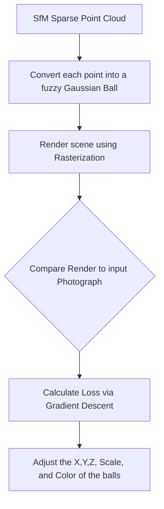

# 5.2 3D Gaussian Splatting

## The Core Concept
While Neural Radiance Fields (See: [[5.1 Neural Radiance Fields (NeRF)]]) produce stunning photorealistic scenes by modeling continuous math equations, their computational requirements are absurd. You cannot render NeRFs at 60 FPS in a video game because invoking a Deep Neural Network 200 million times per frame is physically impossible for current hardware.

In 2023, **3D Gaussian Splatting (Kerbl et al.)** revolutionized the industry. It combined the stunning photorealism of NeRFs with the blinding rendering speed of traditional triangular rasterization.

It achieved this by abandoning the massive Neural Network entirely. It does not use Deep Learning. It uses Explicit Geometry (Gaussians).

---

## 1. What is a 3D Gaussian?

Instead of triangles (which are hard, rigid, 2D planes), Splatting describes 3D space using **3D Gaussians (Ellipsoids)**. 
Think of a single Gaussian like an incredibly soft, fuzzy cotton ball or a cloud sitting in space.

Every single point in the 3D model is a Gaussian carrying several parameters:
*   **Mean $(\mu)$:** The strict $(X,Y,Z)$ coordinate of the center of the cotton ball.
*   **Covariance $(\Sigma)$:** A matrix defining the rotation and scaling. Is it a round ball? Is it stretched into a long flat pancake? Is it a thin needle?
*   **Opacity $(\alpha)$:** How solid or transparent the cotton ball is.
*   **Spherical Harmonics $(SH)$:** A mathematical physics equation storing color. Instead of a single RGB, SH allows the ball to display different colors depending on what angle you view it from (maintaining the Mirror/Specularity superpower of NeRF).

---

## 2. The Algorithm Mechanics (Optimization, not Prediction)

Unlike Deep Learning MVS (See: [[3.4 Deep Learning Multi-View Stereo (MVSNet)]]), which uses a pre-trained Deep Neural Network to *predict* the building structure from features, Gaussian Splatting uses **Stochastic Gradient Descent (SGD)**—the exact same mathematical "engine" used to train neural networks—to *find* the parameters of the Gaussians. 

It does not "generalize" how buildings look. It perfectly "memorizes" and creates a digital replica of your specific scene by optimizing geometry to fit the pixels of your input photographs.

1.  **Initialize:** It imports the Sparse Point Cloud from COLMAP or another SfM solver. It places a tiny fuzzy Gaussian at every single spatial point.
2.  **Splatting (Rasterization):** To render an image, it projects all the fuzzy 3D balls rapidly onto a 2D screen using a brilliant, custom CUDA rasterizer. They "splat" onto the screen like paintballs. Because it uses rasterization (like video games), it runs at **150 Frames Per Second** natively.
3.  **The Optimization Step:** It generates a picture, mathematically compares that picture to the physical Training Photograph, and uses gradient descent calculus to calculate the error.
4.  **Densification:** If a Gaussian is too huge and causing blurry spots, the algorithm automatically splits it into two smaller balls. If a Gaussian is completely transparent, the algorithm deletes it to save memory. 
5.  It does this 30,000 times until the splatted image matches the photograph perfectly.

---

## 3. Advantages and Limitations
*   **Speed:** It renders in genuine real-time natively, instantly beating NeRFs.
*   **Editing:** Because it is Explicit Geometry (they are physical points in space tracking $X,Y,Z$), a developer can literally select 100 Gaussians and delete them to "cut" an object out of the scene. You cannot cut an object out of a NeRF math equation.
*   **Size Problem:** Because every scene generates millions of Gaussians, and each holds 60 parameters, the file sizes are explosive. A single scanned room can easily be $1$-$2$ Gigabytes of disk space, whereas a NeRF model might be $20$ Megabytes.

### Implementation Status 
* **Requires Training?** **No Neural Networks.** It requires *Optimization* via Gradient Descent. Like NeRF, it must be optimized per-scene.
* **Solo Developer Feasibility:** **Accessible via Repositories.** The custom CUDA rasterization kernels are incredibly complex to write from scratch, but running the official Inria codebase is trivial. The execution takes about 10 minutes on a modern 24GB VRAM GPU.
