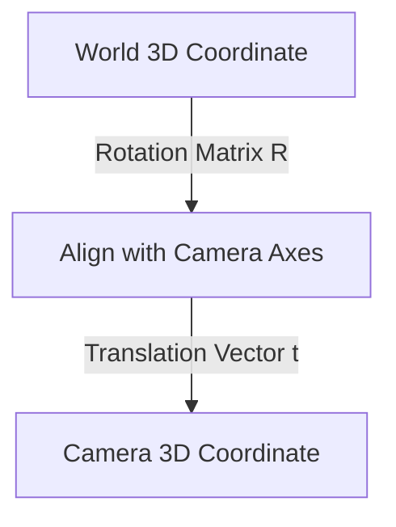

### 1. Camera Models and Coordinate Systems.md

# 1. Camera Models and Coordinate Systems

To understand how a 3D reconstruction pipeline works, we must first understand the physics and mathematics of how a camera captures the world. 

When you process images in your pipeline, the neural network and mathematical algorithms do not see "photos"; they see light rays that have been mathematically projected from a 3D space onto a 2D plane. 

## The Pinhole Camera Model
The simplest mathematical model of a camera is the **Pinhole Camera Model**. Light from a 3D point passes through a single point (the optical center or camera center) and hits the image plane. 

To reverse-engineer 3D space from 2D images, we must separate the camera's properties into two categories: **Extrinsic** and **Intrinsic** parameters.

### 1. Extrinsic Parameters (The Camera's Pose)
Extrinsics define *where* the camera is in the physical world and *where* it is looking. It describes the transformation from the **World Coordinate System** to the **Camera Coordinate System**.

This is formally known as a **6 Degrees of Freedom (6DoF)** pose, represented by a $4 \times 4$ matrix $[R|t]$:
*   **Rotation Matrix (R):** A $3 \times 3$ matrix representing Pitch, Yaw, and Roll. It defines the orientation of the camera.
*   **Translation Vector (t):** A $3 \times 1$ vector representing the exact $(X, Y, Z)$ position of the camera's optical center in the world.

### 2. Intrinsic Parameters (The Camera's Lens)
Once the 3D point is positioned relative to the camera center, how does it physically hit the sensor? This is defined by the Intrinsic Matrix ($K$), a $3 \times 3$ matrix mapping 3D Camera Coordinates to 2D Pixel Coordinates.

$$
K = \begin{bmatrix} f_x & 0 & c_x \\ 0 & f_y & c_y \\ 0 & 0 & 1 \end{bmatrix}
$$

*   $f_x, f_y$: The **Focal Length** in terms of pixels.
*   $c_x, c_y$: The **Principal Point** (usually the exact pixel center of the image).

### The Ultimate Projection Equation
The entire bridge taking a 3D World Point ($P_{world}$) and finding exactly which pixel ($p$) it lands on is:

$$p = K \cdot [R | t] \cdot P_{world}$$
