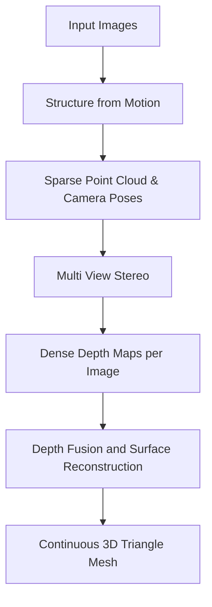

### 1. The MVE Pipeline Overview.md
```markdown
# 1. The MVE Pipeline Overview

The paper *"MVE – A Multi-View Reconstruction Environment"* (Fuhrmann et al., 2014) outlines an end-to-end passive scanning pipeline. Unlike active scanning (LiDAR, structured light, Kinect) which emits radiation to measure distance, passive scanning relies entirely on ambient light and algorithmic feature matching to deduce 3D geometry from 2D images.

## The Three Core Pillars of Reconstruction
To go from unstructured photos to a continuous 3D mesh, the pipeline must sequentially solve three distinct mathematical problems:



### 1. Structure from Motion 
SfM is the foundation. Without knowing *exactly* where the camera was when it took the photo, all subsequent 3D math fails. SfM reconstructs both the **Extrinsic parameters** (Position $T$ and Rotation $R$ of the camera in 3D space) and the **Intrinsic parameters** (Focal length $f$ and radial distortion of the lens).

### 2. Multi View Stereo 
Once the camera positions are locked, MVS attempts to find the dense 3D coordinate for *every single pixel* in the image. The output is a "Depth Map," where each pixel value represents the physical distance from the camera center to the object.

### 3. Surface Reconstruction 
Depth maps are noisy, overlapping, and contain redundant data at different resolutions (scales). Surface reconstruction (like FSSR or TSDF Fusion) takes these raw, messy measurements, filters out the mathematical "noise," and wraps a perfectly continuous mathematical surface (a mesh) around them.
```