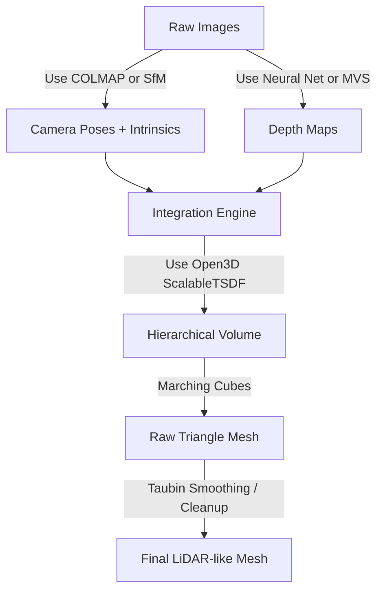

### 4. Bridging Theory to Code.md
```markdown
# 4. Bridging Theory to Code

If your goal is to build a modular Python architecture that honors the research, here is the exact software architecture you should adopt.



## The "Blobby" Problem Explained
When you attempted to build this previously, the result was a "blob." Theory tells us exactly why this happened:
1.  **Grid Resolution:** Your numpy grid was forced to be low-resolution (e.g., $128^3$) to fit in RAM. A $128^3$ grid over a whole room creates voxels that are 5-10 cm wide. This physically limits your mesh to looking like Minecraft blocks.
2.  **Camera Drift:** If the extrinsics (camera poses) are even 1% misaligned, the projected depth maps will intersect each other rather than laying flat on top of one another. The TSDF math tries to average them, resulting in a thick, blurry, blobby crust instead of a sharp wall.
3.  **Missing Normals:** If you use Poisson reconstruction (a point-based method) without strictly orienting the normal vectors toward the camera origin, the mathematical solver flips inside out, creating bizarre bubbles in space.

**Solution:** You must use sparse data structures (like Open3D's voxel hashing) to achieve sub-centimeter voxel sizes, and you must ensure your camera trajectory is mathematically perfect (via a solver like COLMAP or a robust incremental SfM) before attempting fusion.
```