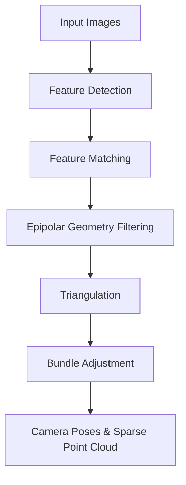

### 1. The SfM Pipeline Overview.md
```markdown
# 1. The SfM Pipeline Overview

Structure from Motion (SfM) is the foundational mathematical step of your entire pipeline. Before we can fuse depth maps or use neural networks, we must determine the exact $4 \times 4$ Extrinsic matrices for every frame in your video. 

SfM is a purely deterministic, geometric algorithm. It does not use Machine Learning; it relies entirely on physical light constraints.

## Pipeline Architecture



1.  **Feature Detection (SIFT):** The algorithm searches the image for "Keypoints" (corners, sharp edges, distinct blobs) that will remain visually identical even if the camera moves, rotates, or changes exposure.
2.  **Feature Matching:** Keypoints in Image A are compared against Keypoints in Image B. If their mathematical descriptions (descriptors) are highly similar, they are paired.
3.  **Essential Matrix Estimation:** Uses the matched pairs to calculate the relative distance and rotation between the two cameras.
4.  **Triangulation:** Ray-traces the camera coordinates to find where the points actually exist in 3D space.
5.  **Bundle Adjustment:** The final, massive mathematical optimization that perfects everything.

> ** The Scale Ambiguity Problem:** 
> SfM has one major flaw: It cannot determine absolute scale. It can perfectly reconstruct the shape of a house, but it does not know if the house is 10 meters tall or 10 millimeters tall. You must either provide a known camera focal length or a reference object to lock the scale.
```