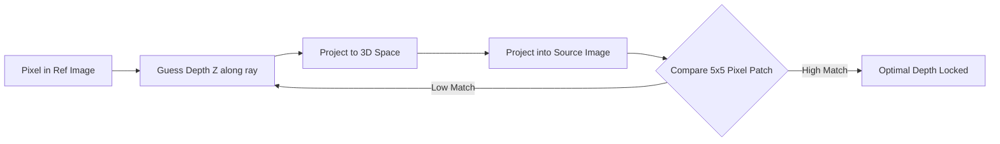

### 1. The Classical MVS Approach.md
```markdown
# 1. The Classical MVS Approach

While SfM gives us Camera Poses and a *Sparse* point cloud (only the SIFT corners), Multi-View Stereo (MVS) attempts to find a 3D coordinate for *every single pixel* in the image. The output is a **Dense Depth Map**.

## Photometric Consistency
Classical MVS works similarly to human eyes (stereopsis). 



1.  Take a pixel in the Reference Image.
2.  Guess its depth $Z$. 
3.  Project this hypothesis into a neighboring Source Image.
4.  Compare a $5 \times 5$ patch of colors around both pixels using **Normalized Cross-Correlation (NCC)**.
5.  Sweep through all possible depths along the epipolar ray. The depth that results in the highest NCC score is stored as the final depth for that pixel.

**The Flaw:** Classical MVS completely fails on textureless surfaces (white walls, clear glass). If the $5 \times 5$ patch is purely white, the NCC score is identical everywhere along the ray. The geometry collapses.
```