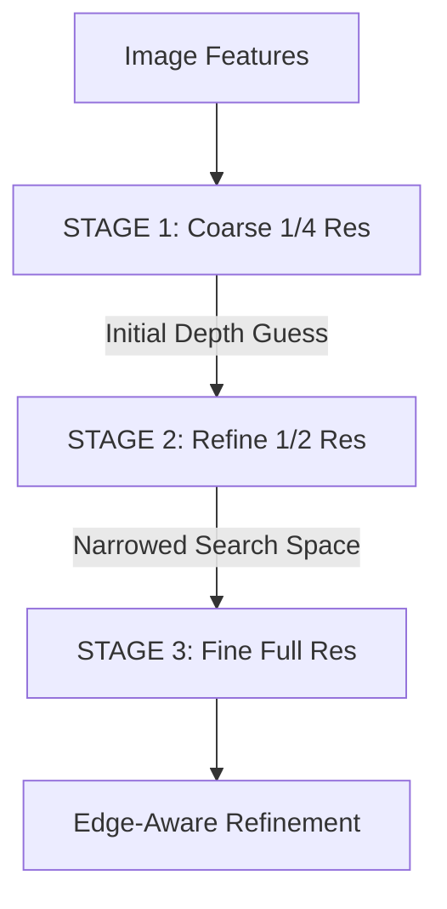

### 1. High Level Cascade Design.md
```markdown
# 1. High Level Cascade Design

Standard Neural MVS models attempt to build one massive 3D Cost Volume at full resolution. This instantly overflows standard 14GB GPUs (like the Colab T4). 

**CasMVSNet (Cascade-Attention MVSNet)** solves this memory bottleneck by mimicking a "Coarse-to-Fine" human visual search. 



*   **Stage 1:** Scans the *entire* possible depth range using $D=64$ sweeping planes, but at $1/4$ resolution. The output is a blurry but globally accurate depth map.
*   **Stage 2:** Scans at $1/2$ resolution, using $D=32$ planes, but *only* searches a tiny band of depth directly around the guess from Stage 1. 
*   **Stage 3:** Scans at Full Resolution, using only $D=16$ planes, searching a microscopic band of depth around the Stage 2 guess. 

By shrinking the Search Range as the Resolution increases, the network never allocates a massive 3D tensor, executing state-of-the-art reconstruction using only ~6.2M parameters.
```