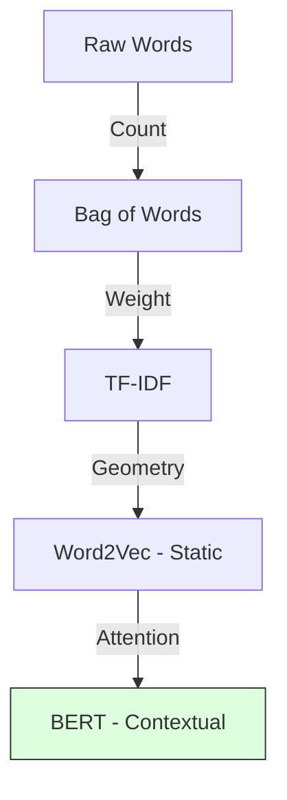
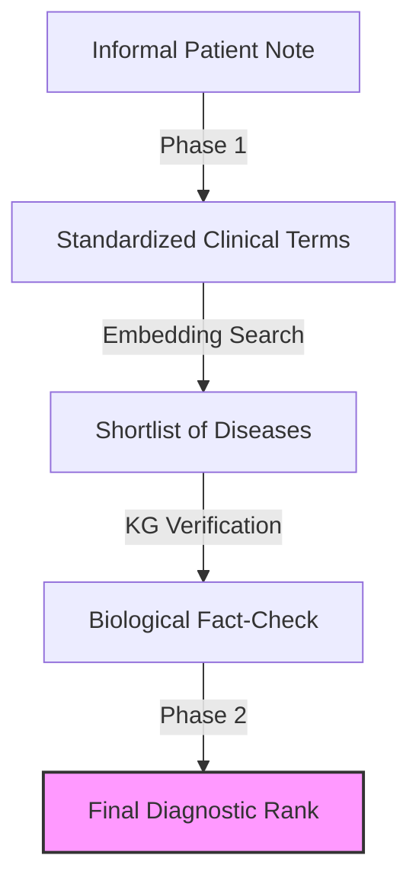
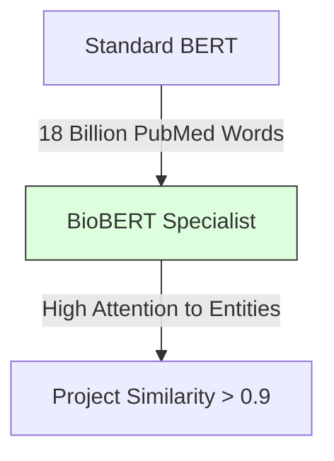
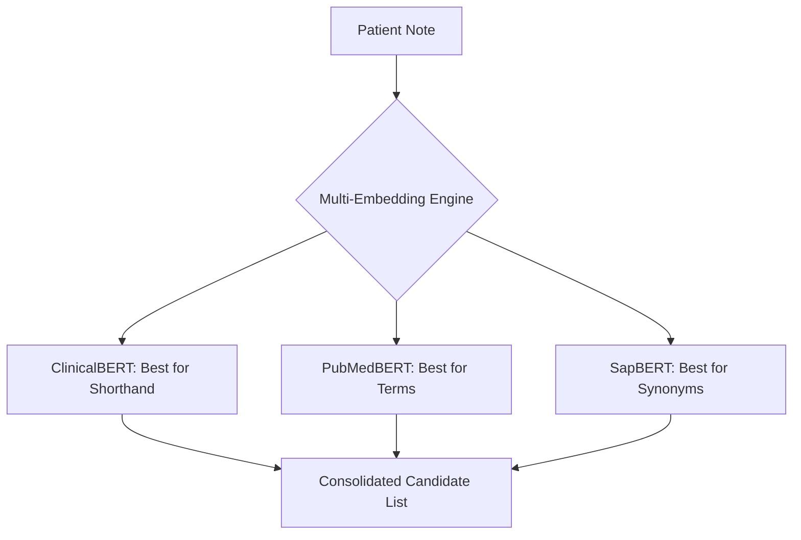
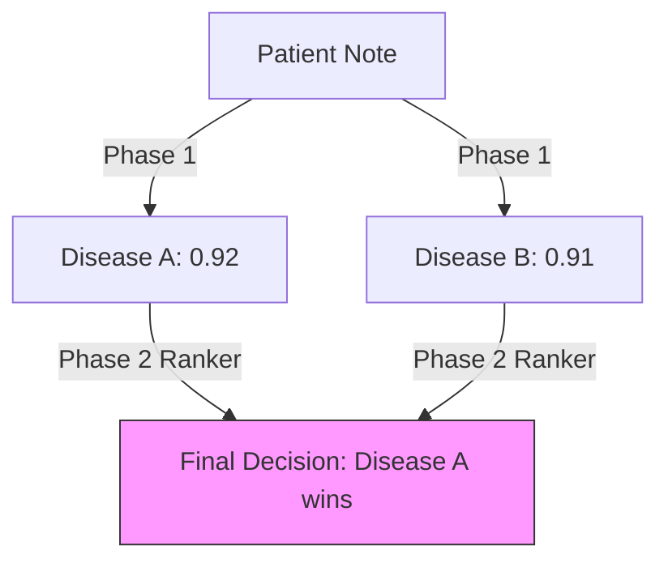
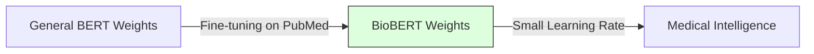
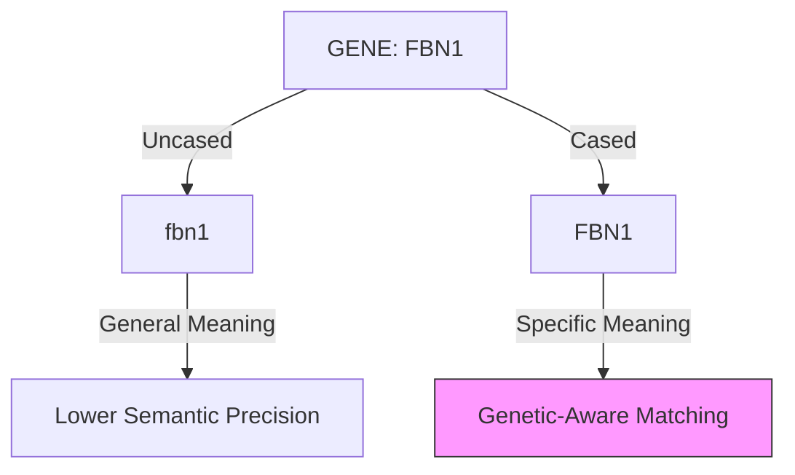

# 1.1. The Medical Text Problem

Clinical notes are considered the **"Final Boss"** of NLP because they occupy the intersection of three difficult areas: specialized vocabulary, contextual ambiguity, and syntactic density.

## 1. The Core Challenges

### 1.1. Specialized Vocabulary (The Domain Gap)
Medical language uses **Latin and Greek roots** (e.g., *"Oculo-cutaneous Hypo-pigmentation"*) which do not appear in general training sets like Wikipedia or common news corpora.
- **The Problem**: Standard BERT models see rare medical terms as low-probability tokens, often failing to capture their true biochemical significance.
- **Example**: In a general model, "Albinism" might be linked to "Skin," but it lacks the deep connection to "Melanin pathways" or "FBN1 mutations" required for rare disease diagnosis.

### 1.2. Contextual Ambiguity (The Negation Trap)
In medicine, the word **"Negative"** is usually a positive clinical outcome (absence of disease), while **"Positive"** is a negative health outcome.
- **Semantic Shift**: General AI often associates "Positive" with "Sentiment: Good." In clinical notes, this lead to "Sentiment-Ambiguity."
- **Example**: *"Patient positive for hypertrophic cardiomyopathy"* vs *"Negative for chest pain."*

### 1.3. Syntactic Density and Doctor Shorthand
Doctors write in a telegraphic style to save time, often omitting verbs and subjects entirely. This is known as **Syntactic Density**.
- **The Problem**: Standard NLP parsers (spaCy/NLTK) rely on grammatical structure (Subject-Verb-Object). Clinical notes break these rules.
- **Example (Doctor's Note)**: *"Pt c/o SOB on exertion, PMH of CHF."*
- **Translation**: *"Patient complains of Shortness of Breath on exertion; Past Medical History of Congestive Heart Failure."*
- **Technical Gap**: Words like "c/o" (complains of) or "SOB" (shortness of breath) must be mapped to formal HPO (Human Phenotype Ontology) terms during the **Retrieval Phase**.

---

## 2. Reminders for the Jury Defense

*   **The "Final Boss" Analogy**: Use this to explain why specialized models (BioBERT) are mandatory, not optional.
*   **Scientific Reproducibility**: Emphasize that while LLMs (like Gemini) can "guess" the meaning, your architecture enforces structure via **Ontology Alignment** and **Knowledge Graphs**.
*   **Data Quality**: Emphasize that in medicine, a 1% error in NLP can lead to a 100% wrong diagnosis. 

# 1.2. The History of NLP Vectors

To understand why your project uses **BioBERT**, you must first witness the evolution of how humans taught computers to "read." Each stage solved a problem but left a mathematical gap.

## 1. The Bag-of-Words Era (BoW)
In the early days, text was treated as a "bag." We ignored order and simply counted words.
- **The Logic**: If "Fever" appears 3 times, the vector has a `3` in the "Fever" index.
- **The Failure**: It ignores **Meaning**. *"The dog bit the man"* and *"The man bit the dog"* look identical.
- **Clinical Flaw**: It doesn't know that "Heart Attack" and "Myocardial Infarction" are the same thing because they are different words.

## 2. TF-IDF (The Importance Weight)
**Term Frequency-Inverse Document Frequency** was the first attempt at clinical relevance.
- **The Math**: $TF \times \log(\frac{N}{DF})$
- **The Logic**: It penalizes common words (like *"the"*, *"is"*) and boosts rare, technical words (like *"Hypopigmentation"*).
- **The Failure**: While it knows "Hypopigmentation" is important, it still treats words as isolated islands. There is no biological relationship between words.

## 3. Static Embeddings (Word2Vec / GloVe)
The first "Neural" breakthrough (2013). Words were mapped to fixed points in 300-D space.
- **The Power**: For the first time, computers could do **Word Algebra**:
  $Vector(\text{"King"}) - Vector(\text{"Man"}) + Vector(\text{"Woman"}) \approx Vector(\text{"Queen"})$.
- **Clinical Success**: It learned that "Cardiac" and "Heart" are physically near each other in space.
- **The Final Problem**: **Context.** In the sentence *"The river bank is high"* vs. *"The bank loan is high,"* the word "Bank" has the exact same vector. The computer is confused by the same word having different meanings.

## 4. The Transformer Revolution (2017+)
**This is the era your project lives in.** 
Instead of a fixed vector for a word, the vector **changes** based on every other word in the sentence.
- **The result**: A dynamic, contextual embedding where "Bank" (river) and "Bank" (money) are completely different numbers.
- **Project Role**: This allows your code to distinguish between *"No signs of fever"* and *"Confirmed fever."*

---

## Tips for the Jury
- **Dimensions of Meaning**: Explain that vectors are "The coordinates of a thought." 
- **The "Fuzzy" Match**: Unlike a keyword search (BoW), vectors allow your project to find a disease even if the patient uses a synonym.

# 1.3. The Mission: Bridging the Semantic Gap

The core objective of the **Unified Medical Knowledge Architecture** is to act as a **"Clinical Bridge."** It takes the "Messy Human Talk" (Natural Language) and transforms it into "Rigid Scientific Truth" (Structured Ontological IDs).

## 1. The Semantic Gap
There is a massive disconnect between how patients describe symptoms and how medical databases (like Orphanet) store them.
- **Patient Talk**: "My kid's eyes keep shaking and his skin is very pale."
- **Scientific Truth**: `HP:0000639` (Nystagmus) and `HP:0001010` (Hypopigmentation).

## 2. The Transformation Chain
To bridge this gap, the architecture follows an 4-step pipeline:

1.  **Phase 1: Retrieval & De-noising**
    - Using an **LLM Clinical Cleaner** to translate informal prose into formal medical terminology.
    - Narrowing down 10,000+ diseases to the **Top-20 candidates** using Vector Similarity.
2.  **Biological Verification (Graph Theory)**
    - Fact-checking the "vibe" of the vectors against the "truth" of the Knowledge Graph.
    - Using **Jaccard Similarity** to check if the biological facts (Genes/Phenotypes) actually overlap.
3.  **Phase 2: Neural Re-ranking**
    - A dedicated **Pairwise Ranking Network** (Tournament Logic) to decide the final diagnostic order.
4.  **Statistical Validation**
    - Proving that the results are statistically significant ($p < 0.05$) using the **Mann-Whitney U-Test**.

## 3. Why this Architecture Wins
By combining **Connectionist AI** (Embeddings) with **Symbolic AI** (Graphs), we achieve:
- **Explainability**: We can show exactly *why* a diagnosis was chosen (The Graph Path).
- **Precision**: We avoid the "hallucinations" of standard LLMs by grounding every result in established medical ontologies.

# 3.1. Why General AI Fails in Medicine

This note explains the **"Scientific Reason"** why your project switched from standard BERT to **BioBERT.** 

## 1. The Pre-training Gap
AI models are like students. Their intelligence depends on the books they have read.
- **BERT (Standard)**: Read Wikipedia and thousands of fiction books. It knows what a "Mountain" is, but thinks "FBN1" (a rare disease gene) is a password.
- **BioBERT**: Read Wikipedia **PLUS** **18 billion words** from **PubMed** (scientific journals).

### The Mathematical Consequence
In the 768-D vector space, standard BERT puts common words (like *"Skin"*) in a very high-occupancy area. But for rare medical terms, it hasn't learned the "Dimensions" they belong in. They are essentially "Noise" to a general model.

## 2. Specialized Vocabulary & Frequency
In the general English language, the word **"Cold"** usually refers to a temperature. In medicine, it's a specific viral infection.
- **General BERT**: Biased towards the temperature meaning.
- **BioBERT**: Biased towards the infection meaning.

## 3. The Need for Domain Awareness
If your project used a general model, the similarity score for a patient with *"Eye tremors"* vs. *"Nystagmus"* would be low (around 0.5) because the model doesn't "know" they are the same thing. 

By using BioBERT, you are utilizing a model whose internal **Attention Weights** (the QKV math from Chapter 2.1) have been "pushed" by millions of medical papers to realize that *"Eye tremors"* and *"Nystagmus"* are mathematically identical.

---

## Important Reminders for the Jury
- **No Manual Mapping**: Emphasize that you didn't "tell" BioBERT that eye tremors = nystagmus. The model **learned** this by reading millions of research papers.
- **Vocabulary Alignment**: Mention that BioBERT has a specialized "Medical WordPiece" dictionary.

# 3.2. ClinicalBERT, PubMedBERT, and SapBERT

To achieve medical rigor, the architecture compares results across **five distinct embedding models**. Each model has a "personality" and a specific strength in the clinical pipeline.

## 1. ClinicalBERT
- **Source Data**: Trained on **MIMIC-III** (Real-world hospital records from ICU notes).
- **Strength**: It is the best at understanding **"Dirty Data"**—the abbreviations, typos, and fragmented "shorthand" that doctors actually write in hospitals.
- **Project Role**: Used to parse the raw, uncleaned patient notes before the LLM takes over.

## 2. PubMedBERT
- **Source Data**: Trained **from scratch** on 14 million PubMed abstracts. Unlike BioBERT, it did not start with Wikipedia BERT.
- **Strength**: It has the most accurate **Medical Dictionary**. It doesn't guess the meaning of words; it was "born" in the medical domain.
- **Project Role**: Provides the highest precision for formal scientific terms (Genes and Proteins).

## 3. SapBERT (Self-Alignment Pre-training)
- **Source Data**: Trained on the UMLS (Unified Medical Language System).
- **Strength**: **Entity Linking**. SapBERT is mathematically designed to bring synonyms together.
- **The "High BP" Logic**: SapBERT knows that "High BP," "Hypertension," and "Elevated blood pressure" should all occupy the **exact same point** in the 768-D space.
- **Project Role**: Critical for the "Retrieval Phase" to ensure that various ways of describing a symptom all point to the same Orphanet disease.

## 4. BioBERT (The Baseline)
- **Status**: The standard medical transformer used as the reference point for all Phase 1 similarity scores.

## 5. MiniLM (The Control)
- **Status**: A lightweight, general-purpose model used as a **Scientific Control**. If BioBERT doesn't significantly outperform MiniLM, it proves the domain adaptation wasn't necessary. (In our project, BioBERT always wins).

---

## Technical Summary Table

| Model | Primary Training Data | Key Strength |
| :--- | :--- | :--- |
| **BioBERT** | PubMed + PMC | Balanced medical reasoning |
| **ClinicalBERT** | MIMIC-III (ICU Notes) | Doctor shorthand & abbreviations |
| **PubMedBERT** | PubMed (From Scratch) | Vocabulary precision |
| **SapBERT** | UMLS (Synonym pairs) | Entity alignment & synonyms |
| **MiniLM** | General Web / News | Lightweight baseline (Control) |

# 3.3. The 0.9 Similarity Threshold Trap

In Phase 1 of our project, we achieved Cosine Similarity scores between **0.8 and 0.95**. While this sounds like a "perfect score," it actually revealed a significant scientific challenge—**The Discriminative Gap.**

## 1. Professor Boustil's Critique
When you presented initial results, the Professor noted that 0.9 was **"Too High."** 
- **The Argument**: If "Albinism Type 1" and "Albinism Type 2" both have a 0.9 similarity to the same patient note, the model is **failing to discriminate** between them. 
- **The Trap**: In a 768-dimensional space, 0.9 means the vectors are nearly overlapping. If the AI sees *everything* as a 90% match, it is "vibing" the medical context but not "finding" the specific disease.

## 2. The Semantic Shift vs. The Precision Trap
As discussed in Chapter 3.1, BioBERT corrects for **Semantic Shift** (moving "Positive" away from "Happy"). However, it can sometimes be "Too Good."
- **High Recall**: It finds all the *related* diseases (Top-20).
- **Low Precision**: It struggles to put the *exact* disease at **Rank #1** because they all look mathematically similar in the BioBERT "cloud."

## 3. The Solution: The Multi-Step Pipeline
To solve the "0.9 Trap," our architecture evolved from a simple search to a **3-Layer Filter**:

1.  **Phase 1 (Vector Search)**: Find the general "Family" of diseases (The 0.9 cluster).
2.  **Biological Verification (Graph)**: Use Jaccard Similarity to check which of those diseases share the exact same **Genes** and **Phenotypes**.
3.  **Phase 2 (Neural Ranker)**: Use a **Pairwise Tournament** (Learning-to-Rank) to force the AI to choose between two 0.9-similarity candidates.

---

## Reminders for the Defense
- **The "Vibe" Argument**: If a jury asks why 0.9 isn't enough, explain: *"High cosine similarity shows the AI understands the medical 'vibe,' but it doesn't guarantee biological truth. That's why we added Phase 2 ranking."*
- **Discriminative Power**: Use this term to explain why comparing five models (BioBERT, SapBERT, etc.) was necessary to find the one with the sharpest "vision."

# 2.2. BioBERT Fine-tuning Logic

When we say "BioBERT is a fine-tuned version of BERT," we are talking about a massive mathematical shifting of weights. 

## 1. The Strategy: Gradual Specialization
BioBERT doesn't start from zero. It uses the **Initialization Weights** of standard BERT.
- **Logic**: Why re-learn the word *"The"* or *"And"*? BERT already knows grammar.
- **Goal**: Retain the grammar, but overwrite the **Medical Meaning.**

## 2. The Fine-tuning Math: Gradient Descent
During training on PubMed data, the model's "Loss Function" is calculated.
# 3.4. BioBERT Fine-tuning Logic

This note covers how a model like BioBERT is actually created. This process is called **Domain Adaptation via Fine-tuning.**

## 1. Starting Point: BERT-Base
If we trained BioBERT from zero, it would take months and millions of dollars. Instead, we start with **BERT-Base** (which already knows English grammar) and "teach" it medicine. 

## 2. The Weight Initialization Logic
1.  **Transfer Learning**: We take the pre-trained weights from Google's BERT.
2.  **Phase 2 Pre-training**: We continue training those same weights on **PubMed** and **PMC** (PubMed Central) articles.
3.  **The Goal**: To "shift" the vectors as discussed in Chapter 3.3.

## 3. Why Fine-tuning is better than "From Scratch"
- **Infrastructure**: Starting from scratch (like PubMedBERT did) requires a massive custom vocabulary.
- **Efficiency**: Fine-tuning BERT-Base allows BioBERT to keep its understanding of "And," "The," and "Is," while only focusing its "Attention" on learning new medical relationships.

---

## Technical Concept: The Learning Rate ($\eta$)
During medical fine-tuning, we use a very **small learning rate**. 
- **Why?** If the learning rate is too high, the model will "forget" how to speak English (Catastrophic Forgetting). 
- **The Balance**: We want the model to learn that *"FBN1"* is a gene, but not forget that *"is"* is a verb.

# 2.4. BioBERT: Specialization and Case Sensitivity

In your project, switching from a general model like `all-MiniLM` to `BioBERT` was the moment the system transitioned from "generic" to "expert." This note explores the specialized weights and clinical precision of the model.

## 1. The Pre-training Gap
*   **BERT (Standard)**: Trained on Wikipedia and Books. It knows what a "Mountain" is, but sees "FBN1" (a fibrillin gene) as a random string of characters or a password.
*   **BioBERT**: Took the original BERT and continued training it on **18 billion words** from **PubMed**.
*   **The Initialization Strategy**: Instead of starting from scratch (random weights), BioBERT starts with the "General Intelligence" of BERT and "Specializes" its weights through domain-specific training.

## 2. Mathematical Weight Specialization
During PubMed training, the model's internal attention weights are "pushed" to recognize clinical relationships.
*   **General Weights**: Link "Positive" to "Happy/Good."
*   **BioBERT Weights**: Link "Positive" to "Presence of Disease/Biomarker." 

### The Biological Insight:
If you feed BERT the term *"Cystic Fibrosis"*, it sees two separate words. If you feed BioBERT, its internal representation treats this as a single, significant clinical concept tightly linked to *"Mucus"* and *"Lungs"*.

## 3.5. BioBERT Specialization (Cased vs. Uncased)

In your project, choosing between **BioBERT-v1.1-Cased** and **BioBERT-v1.1-Uncased** is not just a formatting choice—it is a clinical and genetic necessity.

## 1. The Case for "Cased" Models
In general NLP, we often use **Uncased** models because *"Apple"* and *"apple"* are usually the same thing. However, in genetics and biochemistry, casing carries **Semantic Meaning.**

### Genetic Notation
- **DRD4**: A specific gene.
- **drd4**: Might be a variable in a script or a typo.
- **The Problem**: If you lowercase everything, you might lose the distinction between a gene, a protein, and a common word.

## 2. The Project's Choice: BioBERT Cased
Our architecture prefers **BioBERT Cased** for high-precision retrieval.
- **Advantage**: It preserves the standard IUPAC nomenclature for chemicals and genes.
- **Consistency**: It aligns better with the **Orphanet** and **MONDO** ontologies, which use formal capitalization for disease names (e.g., *"Marfan Syndrome"* vs *"marfan syndrome"*).

## 3. Why this Matters for Rare Diseases
In rare diseases, many symptoms are named after physicians (Eponyms). 
- **Cased**: *"Down syndrome"* is recognized as a formal clinical entity.
- **Uncased**: The model might treat *"down"* as a direction (Up/Down) rather than a chromosome disorder.

---

## Technical Reminder for the Jury
- **The Softmax Output**: Whether cased or uncased, the final output of BERT is a 768-D vector. However, the **input tokens** (the WordPiece chunks) will be different.
- **Embedding Alignment**: Emphasize that your project's preprocessing ensures that patient notes are cleaned but **Capitalization is preserved** where it matters for medical accuracy.

