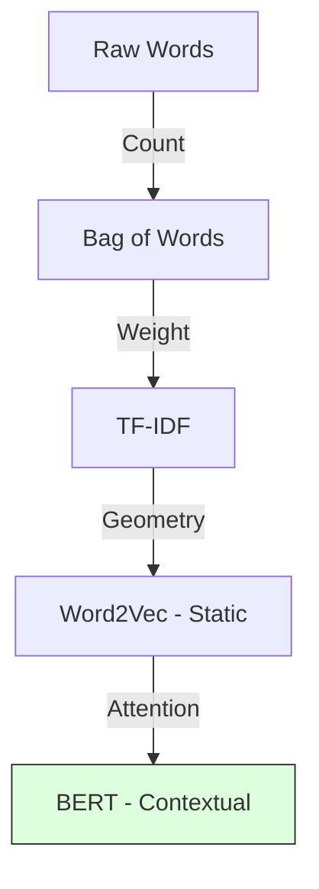
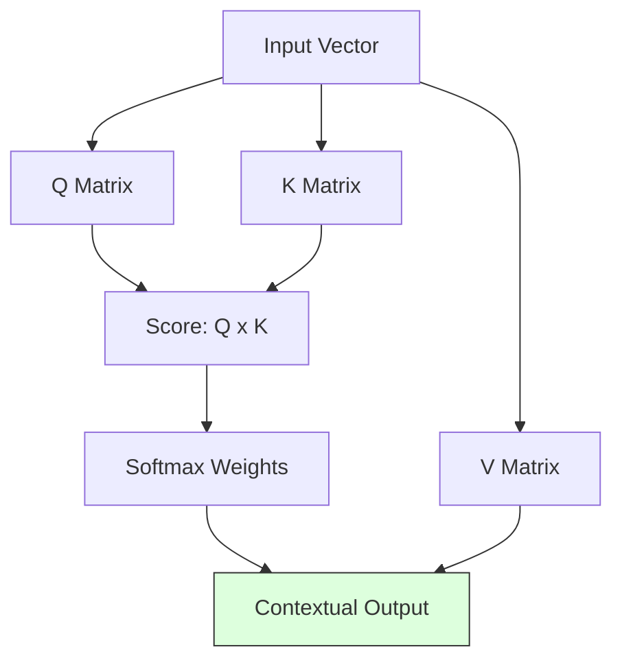

# 1.2. The History of NLP Vectors

To understand why your project uses **BioBERT**, you must first witness the evolution of how humans taught computers to "read." Each stage solved a problem but left a mathematical gap.

## 1. The Bag-of-Words Era (BoW)
In the early days, text was treated as a "bag." We ignored order and simply counted words.
- **The Logic**: If "Fever" appears 3 times, the vector has a `3` in the "Fever" index.
- **The Failure**: It ignores **Meaning**. *"The dog bit the man"* and *"The man bit the dog"* look identical.
- **Clinical Flaw**: It doesn't know that "Heart Attack" and "Myocardial Infarction" are the same thing because they are different words.

## 2. TF-IDF (The Importance Weight)
**Term Frequency-Inverse Document Frequency** was the first attempt at clinical relevance.
- **The Math**: $TF \times \log(\frac{N}{DF})$
- **The Logic**: It penalizes common words (like *"the"*, *"is"*) and boosts rare, technical words (like *"Hypopigmentation"*).
- **The Failure**: While it knows "Hypopigmentation" is important, it still treats words as isolated islands. There is no biological relationship between words.

## 3. Static Embeddings (Word2Vec / GloVe)
The first "Neural" breakthrough (2013). Words were mapped to fixed points in 300-D space.
- **The Power**: For the first time, computers could do **Word Algebra**:
  $Vector(\text{"King"}) - Vector(\text{"Man"}) + Vector(\text{"Woman"}) \approx Vector(\text{"Queen"})$.
- **Clinical Success**: It learned that "Cardiac" and "Heart" are physically near each other in space.
- **The Final Problem**: **Context.** In the sentence *"The river bank is high"* vs. *"The bank loan is high,"* the word "Bank" has the exact same vector. The computer is confused by the same word having different meanings.

## 4. The Transformer Revolution (2017+)
**This is the era your project lives in.** 
Instead of a fixed vector for a word, the vector **changes** based on every other word in the sentence.
- **The result**: A dynamic, contextual embedding where "Bank" (river) and "Bank" (money) are completely different numbers.
- **Project Role**: This allows your code to distinguish between *"No signs of fever"* and *"Confirmed fever."*

---

## Tips for the Jury
- **Dimensions of Meaning**: Explain that vectors are "The coordinates of a thought." 
- **The "Fuzzy" Match**: Unlike a keyword search (BoW), vectors allow your project to find a disease even if the patient uses a synonym.

# 2.1. Self-Attention and the QKV Math

The **Transformer** is the engine inside BERT. Its greatest superpower is **Self-Attention**. This note explains the mathematics behind how the model "focuses" on relevant clinical facts.

## 1. The Core Logic: Query, Key, and Value (QKV)
Imagine you are a word in a sentence (e.g., *"Albinism"*). To understand your meaning, you "look" at every other word and ask: *"How relevant are you to me?"*

The math works like this:
1.  **Query (Q)**: "What am I looking for in this sentence?" (e.g., "I am looking for symptoms or genes").
2.  **Key (K)**: "What information do I offer to other words?" (e.g., "I am a clinical noun").
3.  **Value (V)**: "What is my actual content?"

### The Scaled Dot-Product Attention Formula
$$ \text{Attention}(Q, K, V) = \text{softmax}\left(\frac{QK^T}{\sqrt{d_k}}\right)V $$

*   **$QK^T$**: The computer multiplies your Query by everyone else's Key. If they "match" (high alignment), the score is high.
*   **$\sqrt{d_k}$**: A scaling factor to keep the numbers stable.
*   **Softmax**: This turns the scores into percentages (e.g., 85% focus on *"hypopigmentation"*, 5% focus on *"and"*).
*   **V (Value)**: Finally, the model takes the Value of the important words and builds your new contextual vector.

---

## 2. Why this is Critical for Rare Diseases
In rare disease diagnostics, clinical notes are often "chatty" and full of irrelevant noise.
- **The "Fluff"**: *"The patient arrived at 9 AM, accompanied by his mother. He seemed tired but cooperative..."*
- **The "Signal"**: *"...exhibiting **FBN1** mutation markers."*

The Attention mechanism allows the model to assign a **high weight** to the gene "FBN1" even if it is buried in 500 words of noise. It effectively "ignores" the mother's arrival and focuses entirely on the diagnostic marker.

## 3. Multi-Head Attention (The Parallel Brain)
BERT doesn't just look at the sentence once. It has **12 or 16 "Heads"** working in parallel.
*   **Head 1**: Might focus on **Grammar** (Who is the subject?).
*   **Head 2**: Might focus on **Medical Entities** (Which words are symptoms?).
*   **Head 3**: Might focus on **Negation** (Does the sentence say "No" or "Not"?).

### The Syntactic Trap: Why Attention is necessary
In a clinical note, the word *"No"* is extremely important. 
- **Sentence A**: *"The patient **has** cancer."*
- **Sentence B**: *"The patient **does not have** cancer."*
These sentences share 5 out of 6 words (85% overlap). 
- **BERT's Solution**: Because BERT looks at the entire sentence at once, its "Negation Heads" pay 100% attention to the relationship between *"No"* and *"Cancer"*, flipping the meaning of the resulting 768-D vector.

---

## Reminders for the Defense
- **Parallelism**: Unlike older models (RNNs/LSTMs) that read words one-by-one, Transformers read the **entire sentence at once**.
- **Contextual Embeddings**: This is why the word "Cell" in a biology note has a different vector than "Cell" in a prison note.

