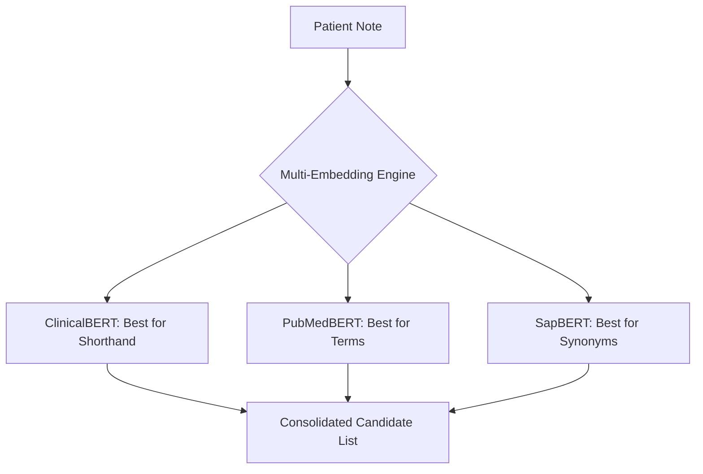

# 3.2. ClinicalBERT, PubMedBERT, and SapBERT

To achieve medical rigor, the architecture compares results across **five distinct embedding models**. Each model has a "personality" and a specific strength in the clinical pipeline.

## 1. ClinicalBERT
- **Source Data**: Trained on **MIMIC-III** (Real-world hospital records from ICU notes).
- **Strength**: It is the best at understanding **"Dirty Data"**—the abbreviations, typos, and fragmented "shorthand" that doctors actually write in hospitals.
- **Project Role**: Used to parse the raw, uncleaned patient notes before the LLM takes over.

## 2. PubMedBERT
- **Source Data**: Trained **from scratch** on 14 million PubMed abstracts. Unlike BioBERT, it did not start with Wikipedia BERT.
- **Strength**: It has the most accurate **Medical Dictionary**. It doesn't guess the meaning of words; it was "born" in the medical domain.
- **Project Role**: Provides the highest precision for formal scientific terms (Genes and Proteins).

## 3. SapBERT (Self-Alignment Pre-training)
- **Source Data**: Trained on the UMLS (Unified Medical Language System).
- **Strength**: **Entity Linking**. SapBERT is mathematically designed to bring synonyms together.
- **The "High BP" Logic**: SapBERT knows that "High BP," "Hypertension," and "Elevated blood pressure" should all occupy the **exact same point** in the 768-D space.
- **Project Role**: Critical for the "Retrieval Phase" to ensure that various ways of describing a symptom all point to the same Orphanet disease.

## 4. BioBERT (The Baseline)
- **Status**: The standard medical transformer used as the reference point for all Phase 1 similarity scores.

## 5. MiniLM (The Control)
- **Status**: A lightweight, general-purpose model used as a **Scientific Control**. If BioBERT doesn't significantly outperform MiniLM, it proves the domain adaptation wasn't necessary. (In our project, BioBERT always wins).

---

## Technical Summary Table

| Model | Primary Training Data | Key Strength |
| :--- | :--- | :--- |
| **BioBERT** | PubMed + PMC | Balanced medical reasoning |
| **ClinicalBERT** | MIMIC-III (ICU Notes) | Doctor shorthand & abbreviations |
| **PubMedBERT** | PubMed (From Scratch) | Vocabulary precision |
| **SapBERT** | UMLS (Synonym pairs) | Entity alignment & synonyms |
| **MiniLM** | General Web / News | Lightweight baseline (Control) |

