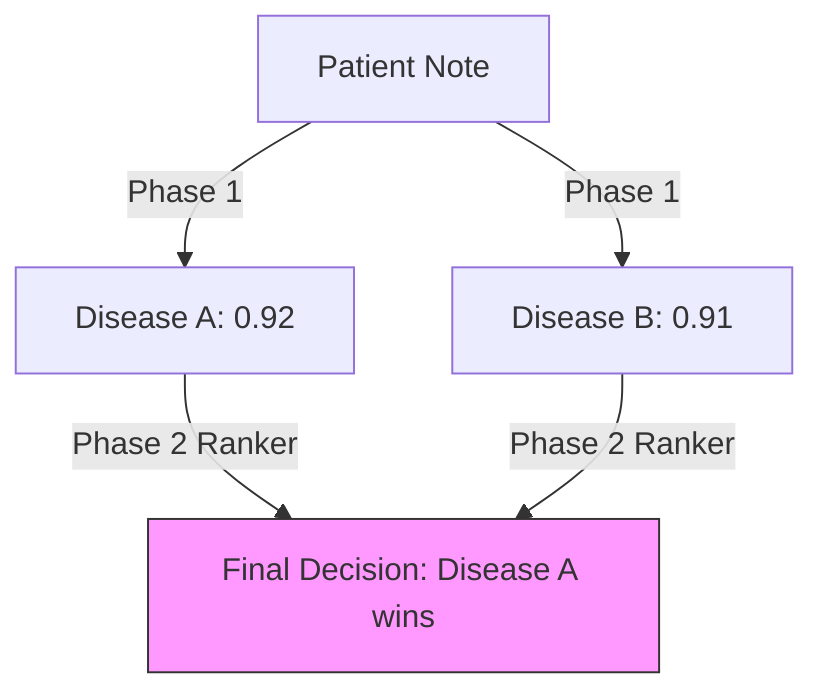

# 3.3. The 0.9 Similarity Threshold Trap

In Phase 1 of our project, we achieved Cosine Similarity scores between **0.8 and 0.95**. While this sounds like a "perfect score," it actually revealed a significant scientific challenge—**The Discriminative Gap.**

## 1. Professor Boustil's Critique
When you presented initial results, the Professor noted that 0.9 was **"Too High."** 
- **The Argument**: If "Albinism Type 1" and "Albinism Type 2" both have a 0.9 similarity to the same patient note, the model is **failing to discriminate** between them. 
- **The Trap**: In a 768-dimensional space, 0.9 means the vectors are nearly overlapping. If the AI sees *everything* as a 90% match, it is "vibing" the medical context but not "finding" the specific disease.

## 2. The Semantic Shift vs. The Precision Trap
As discussed in Chapter 3.1, BioBERT corrects for **Semantic Shift** (moving "Positive" away from "Happy"). However, it can sometimes be "Too Good."
- **High Recall**: It finds all the *related* diseases (Top-20).
- **Low Precision**: It struggles to put the *exact* disease at **Rank #1** because they all look mathematically similar in the BioBERT "cloud."

## 3. The Solution: The Multi-Step Pipeline
To solve the "0.9 Trap," our architecture evolved from a simple search to a **3-Layer Filter**:

1.  **Phase 1 (Vector Search)**: Find the general "Family" of diseases (The 0.9 cluster).
2.  **Biological Verification (Graph)**: Use Jaccard Similarity to check which of those diseases share the exact same **Genes** and **Phenotypes**.
3.  **Phase 2 (Neural Ranker)**: Use a **Pairwise Tournament** (Learning-to-Rank) to force the AI to choose between two 0.9-similarity candidates.

---

## Reminders for the Defense
- **The "Vibe" Argument**: If a jury asks why 0.9 isn't enough, explain: *"High cosine similarity shows the AI understands the medical 'vibe,' but it doesn't guarantee biological truth. That's why we added Phase 2 ranking."*
- **Discriminative Power**: Use this term to explain why comparing five models (BioBERT, SapBERT, etc.) was necessary to find the one with the sharpest "vision."

# 3.3. The 0.9 Similarity Threshold Trap

In Phase 1 of our project, we achieved Cosine Similarity scores between **0.8 and 0.95**. While this sounds like a "perfect score," it actually revealed a significant scientific challenge—**The Discriminative Gap.**

## 1. Professor Boustil's Critique
When you presented initial results, the Professor noted that 0.9 was **"Too High."** 
- **The Argument**: If "Albinism Type 1" and "Albinism Type 2" both have a 0.9 similarity to the same patient note, the model is **failing to discriminate** between them. 
- **The Trap**: In a 768-dimensional space, 0.9 means the vectors are nearly overlapping. If the AI sees *everything* as a 90% match, it is "vibing" the medical context but not "finding" the specific disease.

## 2. The Semantic Shift vs. The Precision Trap
As discussed in Chapter 3.1, BioBERT corrects for **Semantic Shift** (moving "Positive" away from "Happy"). However, it can sometimes be "Too Good."
- **High Recall**: It finds all the *related* diseases (Top-20).
- **Low Precision**: It struggles to put the *exact* disease at **Rank #1** because they all look mathematically similar in the BioBERT "cloud."

## 3. The Solution: The Multi-Step Pipeline
To solve the "0.9 Trap," our architecture evolved from a simple search to a **3-Layer Filter**:

1.  **Phase 1 (Vector Search)**: Find the general "Family" of diseases (The 0.9 cluster).
2.  **Biological Verification (Graph)**: Use Jaccard Similarity to check which of those diseases share the exact same **Genes** and **Phenotypes**.
3.  **Phase 2 (Neural Ranker)**: Use a **Pairwise Tournament** (Learning-to-Rank) to force the AI to choose between two 0.9-similarity candidates.

---

## Reminders for the Defense
- **The "Vibe" Argument**: If a jury asks why 0.9 isn't enough, explain: *"High cosine similarity shows the AI understands the medical 'vibe,' but it doesn't guarantee biological truth. That's why we added Phase 2 ranking."*
- **Discriminative Power**: Use this term to explain why comparing five models (BioBERT, SapBERT, etc.) was necessary to find the one with the sharpest "vision."

