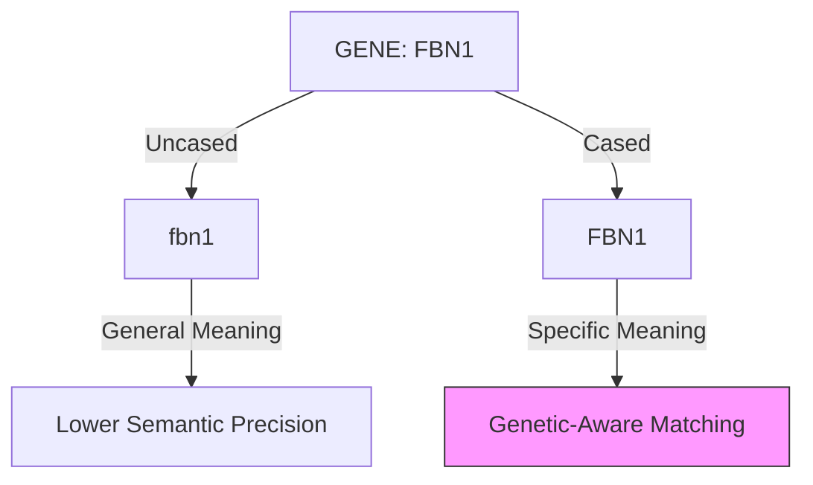

# 2.4. BioBERT: Specialization and Case Sensitivity

In your project, switching from a general model like `all-MiniLM` to `BioBERT` was the moment the system transitioned from "generic" to "expert." This note explores the specialized weights and clinical precision of the model.

## 1. The Pre-training Gap
*   **BERT (Standard)**: Trained on Wikipedia and Books. It knows what a "Mountain" is, but sees "FBN1" (a fibrillin gene) as a random string of characters or a password.
*   **BioBERT**: Took the original BERT and continued training it on **18 billion words** from **PubMed**.
*   **The Initialization Strategy**: Instead of starting from scratch (random weights), BioBERT starts with the "General Intelligence" of BERT and "Specializes" its weights through domain-specific training.

## 2. Mathematical Weight Specialization
During PubMed training, the model's internal attention weights are "pushed" to recognize clinical relationships.
*   **General Weights**: Link "Positive" to "Happy/Good."
*   **BioBERT Weights**: Link "Positive" to "Presence of Disease/Biomarker." 

### The Biological Insight:
If you feed BERT the term *"Cystic Fibrosis"*, it sees two separate words. If you feed BioBERT, its internal representation treats this as a single, significant clinical concept tightly linked to *"Mucus"* and *"Lungs"*.

## 3.5. BioBERT Specialization (Cased vs. Uncased)

In your project, choosing between **BioBERT-v1.1-Cased** and **BioBERT-v1.1-Uncased** is not just a formatting choice—it is a clinical and genetic necessity.

## 1. The Case for "Cased" Models
In general NLP, we often use **Uncased** models because *"Apple"* and *"apple"* are usually the same thing. However, in genetics and biochemistry, casing carries **Semantic Meaning.**

### Genetic Notation
- **DRD4**: A specific gene.
- **drd4**: Might be a variable in a script or a typo.
- **The Problem**: If you lowercase everything, you might lose the distinction between a gene, a protein, and a common word.

## 2. The Project's Choice: BioBERT Cased
Our architecture prefers **BioBERT Cased** for high-precision retrieval.
- **Advantage**: It preserves the standard IUPAC nomenclature for chemicals and genes.
- **Consistency**: It aligns better with the **Orphanet** and **MONDO** ontologies, which use formal capitalization for disease names (e.g., *"Marfan Syndrome"* vs *"marfan syndrome"*).

## 3. Why this Matters for Rare Diseases
In rare diseases, many symptoms are named after physicians (Eponyms). 
- **Cased**: *"Down syndrome"* is recognized as a formal clinical entity.
- **Uncased**: The model might treat *"down"* as a direction (Up/Down) rather than a chromosome disorder.

---

## Technical Reminder for the Jury
- **The Softmax Output**: Whether cased or uncased, the final output of BERT is a 768-D vector. However, the **input tokens** (the WordPiece chunks) will be different.
- **Embedding Alignment**: Emphasize that your project's preprocessing ensures that patient notes are cleaned but **Capitalization is preserved** where it matters for medical accuracy.

