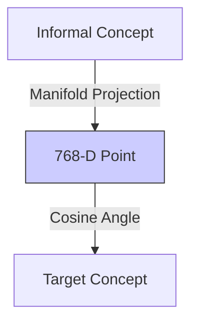

# 3.1. 768-D Geometry and Manifolds

In your project, the `model.encode(text)` function transforms a sentence into a point in a **768-dimensional space.** This note explains why we need so many dimensions and how the computer "sees" them.

## 1. Visualizing the Unvisualizable
- **2D/3D Space**: Points are defined by $(x, y)$ or $(x, y, z)$. We can draw these.
- **768-D Space**: Imagine a world with 768 independent directions. Every thought, medical term, and symptom has a specific set of 768 coordinates.

### The Semantic Point
When you turn the term *"Cystic Fibrosis"* into a vector, it becomes a single dot in this 768-D void. 
- **The Dimension Logic**: Each axis represents an abstract, learned feature. 
  - Axis 1 might be "Anatomical Location."
  - Axis 200 might be "Pathological Severity."
  - Axis 768 might be "Genetic Complexity."

### The Dimension Factor (Abstract Features)
Students often wonder what these 768 numbers actually represent. They are **Abstract Features** learned by the AI. You cannot read them directly, but:
- **Dimension 1**: Might track "Clinical Severity."
- **Dimension 50**: Might track "Genetic Complexity."
- **Dimension 400**: Might track "Anatomical Location."
The AI doesn't see "words"; it sees a coordinate point that balances 768 different biological and linguistic "vibes."

## 2. The Manifold Hypothesis (The "Paper" Analogy)
Why do we need 768 dimensions for language? Because human speech is chaotic. The **Manifold Hypothesis** suggests that high-dimensional data actually lies on a lower-dimensional "shape" (a manifold) hidden inside the noise.

### The Logic:
1.  Imagine a flat **2D piece of paper** (This is the underlying medical truth).
2.  Now, **crumple** that paper into a tight ball (This is the messy, natural language humans use).
3.  The paper is still 2D, but it is now taking up **3D space.**
4.  **BERT's Job**: The model's neural network "unrumples" the 768-D space to find that underlying medical truth where *"Stomach pain"* and *"Abdominal discomfort"* sit safely on the same flat piece of paper.

## 3. Clustering in the Void
In this massive space, the AI organizes knowledge into "Clouds":
- The "Symptom Cloud"
- The "Gene Cloud"
- The "Disease Cloud"

Your project's success depends on the fact that **BioBERT** has learned to cluster the "Patient Note" point very close to the "Orphanet Definition" point.

---

## Tips for Presentation
- **Dimensionality Curse**: Mention that high dimensions are usually bad for computers (slow), but for BERT, they are necessary to capture the extreme "Nuance" of human medicine.
- **Dense vs Sparse**: Tell the jury: *"We use DENSE vectors (768 numbers) because every dimension contributes a tiny piece of the clinical puzzle."*

