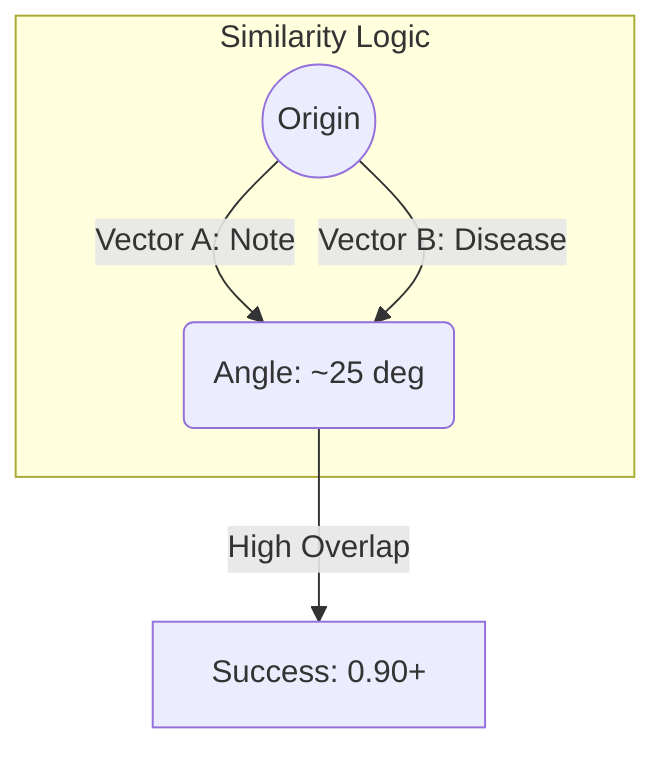

# 3.2. Rigorous Cosine Similarity Derivation

Cosine Similarity is the mathematical heart of your system. It is the formula that tells you: *"How much does this patient look like someone with Albinism?"*

## 1. The Fundamental Formula
$$ \text{Cosine Similarity} = \cos(\theta) = \frac{\mathbf{A} \cdot \mathbf{B}}{\|\mathbf{A}\| \|\mathbf{B}\|} $$

## 2. Mathematical Breakdown (Step-by-Step)

### Step 1: The Dot Product ($\mathbf{A} \cdot \mathbf{B}$)
This measures the **Alignment** of the two vectors. We multiply each coordinate and add them up.
$$ \mathbf{A} \cdot \mathbf{B} = \sum_{i=1}^{n} A_i B_i = (A_1 B_1) + (A_2 B_2) + \dots + (A_{768} B_{768}) $$
- **Logic**: If both vectors have high values in the "Medical" dimensions, the result is a massive positive number.

### Step 2: Vector Magnitude (The Length $\|\mathbf{A}\|$)
This is the straight-line distance from the origin $(0,0,0...)$ to the point in the void.
$$ \|\mathbf{A}\| = \sqrt{\sum_{i=1}^{n} A_i^2} = \sqrt{A_1^2 + A_2^2 + \dots + A_{768}^2} $$

### Step 3: Normalization (The Division)
By dividing the dot product by the product of the lengths, we "Normalize" the result. This ensures the output is always between **-1.0 and 1.0.**

---

## 3. Why Angle matters more than Distance (Euclidean)

Imagine Object A is a **500-word essay** on Albinism. Object B is a **1-sentence definition** of Albinism. 
- **Euclidean Distance**: Because the essay has so many words, its vector is physically "Longer." The distance between the two points will be **huge**. The computer will think they are unrelated.
- **Cosine Similarity**: Both are talking about the same thing, so they both point in the **same direction.** The angle $\theta$ is zero. The score is **1.0.**
- **Project Role**: This allows your code to correctly match a long clinical note to a short disease description.

## Reminders for your Presentation
- **Length Invariance**: This is the official term for why Cosine is good for text. Use it!
- **Cosine(0) = 1**: Remind the jury that in this math, 1 is the best possible score (identical), and 0 means "Perpendicular" (Completely unrelated).

