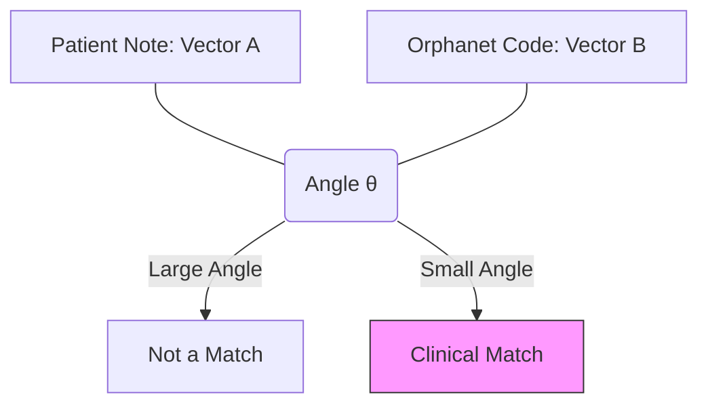

# 4.3. Length Invariance and Euclidean Pitfalls

In your project, we chose **Cosine Similarity** over the standard **Euclidean Distance** ($L2$ Norm). This note explains the rigorous mathematical reason for this choice.

## 1. The Euclidean Problem (Distance Bias)
Euclidean distance measures the **straight-line distance** between two points in the 768-D space.
- **The Issue**: In clinical notes, document length varies wildly.
  - **Patient Note**: 200 words (Large vector).
  - **Orphanet Definition**: 20 words (Small vector).
- Even if they are talking about the exact same disease, the Euclidean distance between them will be **large** simply because the vectors have different magnitudes (lengths).

## 2. Cosine Similarity: The Angular Perspective
Cosine Similarity measures the **Angle ($\theta$)** between two vectors, regardless of how long they are.
- **The Logic**: It ignores the "Length" (how much the doctor wrote) and only looks at the **"Direction"** (what the doctor said).
- **Result**: A 200-word note and a 20-word scientific definition will align perfectly (Similarity $\approx 1.0$) as long as they point toward the same clinical concepts.

## 3. Mathematical Comparison

| Feature | Euclidean Distance | Cosine Similarity |
| :--- | :--- | :--- |
| **Focus** | Magnitude + Direction | **Direction only** |
| **Document Length** | Very sensitive (Bad) | **Invariant (Good)** |
| **Use Case** | Physical distance / K-Means | **Semantic comparison** |

## 4. The Manifold Hypothesis
The **Manifold Hypothesis** suggests that high-dimensional medical data lies on a "hidden shape" within those 768 axes. 
- By using Cosine Similarity, we are effectively "projecting" all patient notes onto a **Unit Sphere**. This projection removes the noise of document length and allows us to see the pure biological alignment.

---

## Reminders for the Jury
- **Length Invariance**: This is your keyword. Use it to explain why your model handles both short summaries and long clinical reports with the same accuracy.
- **Dot Product**: Remind them that Cosine Similarity is essentially a **Normalized Dot Product**.

