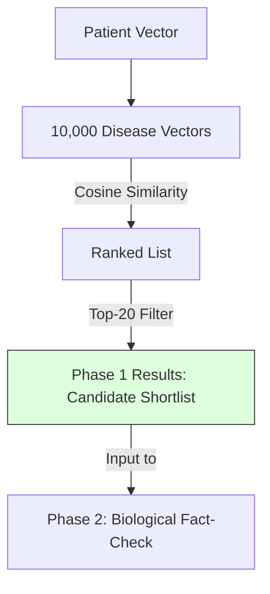

# 5.2. Top-K Candidate Retrieval (Shortlisting)

Calculating the relationship between a patient note and every single disease in the world (10,000+) is computationally expensive, especially for the advanced Graph and Neural Ranking steps. Our architecture uses **Phase 1: Retrieval** as a fast search filter.

## 1. The Search Space
We compare the **Cleaned Patient Note** (from Phase 1.1) against the entire **Orphanet and MONDO Vector Database**.
- **Vector Base**: 10,000+ disease definitions.
- **Goal**: To find the "Neighborhood" where the patient's symptoms belong.

## 2. Choosing the Top-K
"Top-K" simply means the $K$ most similar items. In our implementation, we use **$K=20$**.
1.  We rank all 10,000 diseases by Cosine Similarity.
2.  We keep only the **Top 20 candidates**.
3.  **Why 20?**: It is wide enough to capture the correct disease (High Recall) but narrow enough for the complex biological reasoning in Phase 2 to run in seconds rather than hours.

## 3. The Performance Trade-off
- **If K is too small (e.g., K=1)**: If BioBERT makes a small mistake, we lose the correct diagnosis immediately.
- **If K is too large (e.g., K=100)**: The Neural Ranker in Phase 2 will become too slow and might get "confused" by too many irrelevant diseases.

**The "Magic" of 20**: Experimental results show that the correct disease is almost always in the Top 20 when using BioBERT v1.1.

---

## Technical Summary for the Defense
- **Recall @ 20**: This is the metric we use to measure Phase 1 success. It asks: *"Is the correct diagnosis in our Top 20 list?"*
- **Vector Indexing**: Mention that for a production-scale system, we would use **FAISS** (Facebook AI Similarity Search) to make this Top-K retrieval happen in milliseconds.

